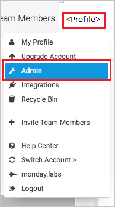
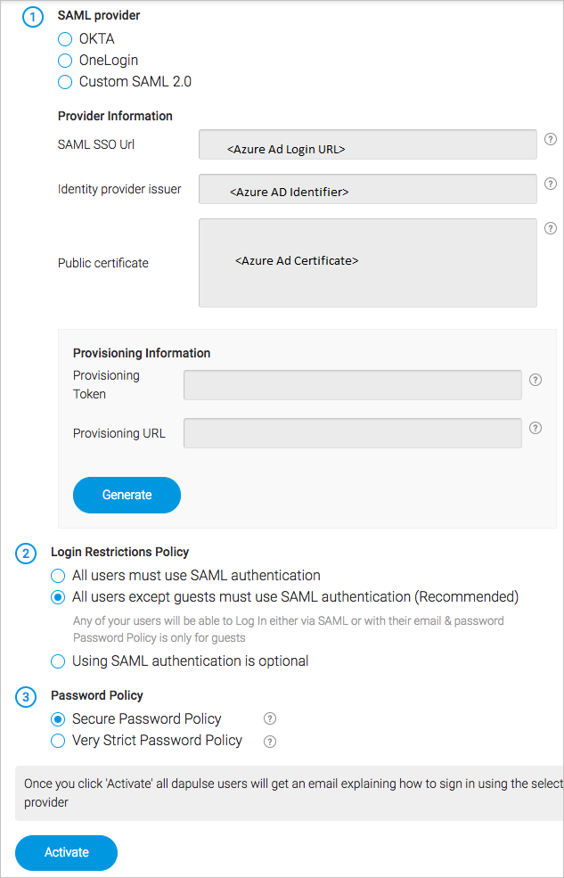

# Tutorial: Azure Active Directory single sign-on (SSO) integration with monday.com

In this tutorial, you'll learn how to integrate monday.com with Azure Active Directory (Azure AD). When you integrate monday.com with Azure AD, you can:

* Control in Azure AD who has access to monday.com.
* Enable your users to be automatically signed-in to monday.com with their Azure AD accounts.
* Manage your accounts in one central location - the Azure portal.

To learn more about SaaS app integration with Azure AD, see [What is application access and single sign-on with Azure Active Directory](../manage-apps/what-is-single-sign-on.md).

## Prerequisites

To get started, you need the following items:

* An Azure AD subscription. If you don't have a subscription, you can get a [free account](https://azure.microsoft.com/free/).
* monday.com single sign-on (SSO) enabled subscription.

## Scenario description

In this tutorial, you configure and test Azure AD SSO in a test environment.

* monday.com supports **SP and IDP** initiated SSO
* monday.com supports **Just In Time** user provisioning

## Adding monday.com from the gallery

To configure the integration of monday.com into Azure AD, you need to add monday.com from the gallery to your list of managed SaaS apps.

1. Sign in to the [Azure portal](https://portal.azure.com) using either a work or school account, or a personal Microsoft account.
1. On the left navigation pane, select the **Azure Active Directory** service.
1. Navigate to **Enterprise Applications** and then select **All Applications**.
1. To add new application, select **New application**.
1. In the **Add from the gallery** section, type **monday.com** in the search box.
1. Select **monday.com** from results panel and then add the app. Wait a few seconds while the app is added to your tenant.

## Configure and test Azure AD single sign-on for monday.com

Configure and test Azure AD SSO with monday.com using a test user called **B.Simon**. For SSO to work, you need to establish a link relationship between an Azure AD user and the related user in monday.com.

To configure and test Azure AD SSO with monday.com, complete the following building blocks:

1. **[Configure Azure AD SSO](#configure-azure-ad-sso)** - to enable your users to use this feature.
    1. **[Create an Azure AD test user](#create-an-azure-ad-test-user)** - to test Azure AD single sign-on with B.Simon.
    1. **[Assign the Azure AD test user](#assign-the-azure-ad-test-user)** - to enable B.Simon to use Azure AD single sign-on.
1. **[Configure monday.com SSO](#configure-mondaycom-sso)** - to configure the single sign-on settings on application side.
    1. **[Create monday.com test user](#create-mondaycom-test-user)** - to have a counterpart of B.Simon in monday.com that is linked to the Azure AD representation of user.
1. **[Test SSO](#test-sso)** - to verify whether the configuration works.

## Configure Azure AD SSO

Follow these steps to enable Azure AD SSO in the Azure portal.

1. In the [Azure portal](https://portal.azure.com/), on the **monday.com** application integration page, find the **Manage** section and select **single sign-on**.
1. On the **Select a single sign-on method** page, select **SAML**.
1. On the **Set up single sign-on with SAML** page, click the edit/pen icon for **Basic SAML Configuration** to edit the settings.

   

1. On the **Basic SAML Configuration** section, if you have **Service Provider metadata file** and wish to configure in **IDP** initiated mode, perform the following steps:

    a. Click **Upload metadata file**.

    

    b. Click on **folder logo** to select the metadata file and click **Upload**.

    

    c. After the metadata file is successfully uploaded, the **Identifier** and **Reply URL** values get auto populated in Basic SAML Configuration section.

    

    > [!Note]
    > If the **Identifier** and **Reply URL** values do not get populated automatically, then fill in the values manually. The **Identifier** and the **Reply URL** are the same and value is in the following pattern: `https://<your-domain>.monday.com/saml/saml_callback`

1. Click **Set additional URLs** and perform the following step if you wish to configure the application in **SP** initiated mode:

    

    In the **Sign-on URL** text box, type a URL using the following pattern:
    `https://<YOUR_DOMAIN>.monday.com`

    > [!NOTE]
    > These values are not real. Update these values with the actual Identifier, Reply URL and Sign-On URL. Contact [monday.com Client support team](https://monday.com/contact-us/) to get these values. You can also refer to the patterns shown in the **Basic SAML Configuration** section in the Azure portal.

1. monday.com application expects the SAML assertions in a specific format, which requires you to add custom attribute mappings to your SAML token attributes configuration. The following screenshot shows the list of default attributes.

    

1. In addition to above, monday.com application expects few more attributes to be passed back in SAML response which are shown below. These attributes are also pre populated but you can review them as per your requirements.

    | Name | Source Attribute |
    |--|--|
    | Email | user.mail |
    | FirstName | user.givenname |
    | LastName | user.surname |

1. On the **Set up single sign-on with SAML** page, in the **SAML Signing Certificate** section,  find **Certificate (Base64)** and select **Download** to download the certificate and save it on your computer.

    

1. On the **Set up monday.com** section, copy the appropriate URL(s) based on your requirement.

    

### Create an Azure AD test user

In this section, you'll create a test user in the Azure portal called B.Simon.

1. From the left pane in the Azure portal, select **Azure Active Directory**, select **Users**, and then select **All users**.
1. Select **New user** at the top of the screen.
1. In the **User** properties, follow these steps:
   1. In the **Name** field, enter `B.Simon`.
   1. In the **User name** field, enter the username@companydomain.extension. For example, `B.Simon@contoso.com`.
   1. Select the **Show password** check box, and then write down the value that's displayed in the **Password** box.
   1. Click **Create**.

### Assign the Azure AD test user

In this section, you'll enable B.Simon to use Azure single sign-on by granting access to monday.com.

1. In the Azure portal, select **Enterprise Applications**, and then select **All applications**.
1. In the applications list, select **monday.com**.
1. In the app's overview page, find the **Manage** section and select **Users and groups**.

   

1. Select **Add user**, then select **Users and groups** in the **Add Assignment** dialog.

    

1. In the **Users and groups** dialog, select **B.Simon** from the Users list, then click the **Select** button at the bottom of the screen.
1. If you're expecting any role value in the SAML assertion, in the **Select Role** dialog, select the appropriate role for the user from the list and then click the **Select** button at the bottom of the screen.
1. In the **Add Assignment** dialog, click the **Assign** button.

## Configure monday.com SSO

1. To automate the configuration within monday.com, you need to install **My Apps Secure Sign-in browser extension** by clicking **Install the extension**.

    

1. After adding extension to the browser, click on **Setup monday.com** which will direct you to the monday.com application. From there, provide the admin credentials to sign into monday.com. The browser extension will automatically configure the application for you and automate steps 3-6.

    

1. If you want to setup monday.com manually, open a new web browser window and sign in to monday.com as an administrator and perform the following steps:

1. Go to the **Profile** on the top right corner of page and click on **Admin**.

    

1. Select **Security** and make sure to click on **Open** next to SAML.

    

1. Fill in the details below from your IDP.

    

    > [!NOTE]
    > For more details refer [this](https://support.monday.com/hc/articles/360000460605-SAML-Single-Sign-on?abcb=34642) article

### Create monday.com test user

In this section, a user called B.Simon is created in monday.com. monday.com supports just-in-time provisioning, which is enabled by default. There is no action item for you in this section. If a user doesn't already exist in monday.com, a new one is created when you attempt to access monday.com.

## Test SSO

In this section, you test your Azure AD single sign-on configuration using the Access Panel.

When you click the monday.com tile in the Access Panel, you should be automatically signed in to the monday.com for which you set up SSO. For more information about the Access Panel, see [Introduction to the Access Panel](../user-help/my-apps-portal-end-user-access.md).

## Additional resources

- [List of Tutorials on How to Integrate SaaS Apps with Azure Active Directory](./tutorial-list.md)

- [What is application access and single sign-on with Azure Active Directory?](../manage-apps/what-is-single-sign-on.md)

- [What is conditional access in Azure Active Directory?](../conditional-access/overview.md)

- [Try monday.com with Azure AD](https://aad.portal.azure.com/)