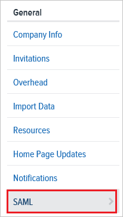
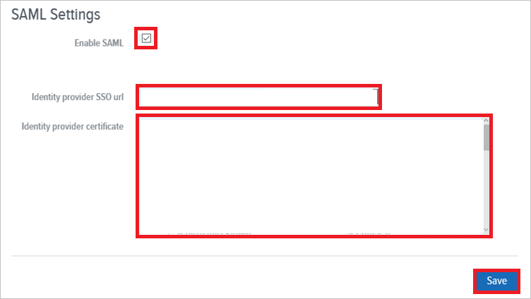
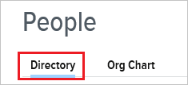

# Tutorial: Azure Active Directory integration with Namely

In this tutorial, you'll learn how to integrate Namely with Azure Active Directory (Azure AD). When you integrate Namely with Azure AD, you can:

* Control in Azure AD who has access to Namely.
* Enable your users to be automatically signed-in to Namely with their Azure AD accounts.
* Manage your accounts in one central location - the Azure portal.

## Prerequisites

To get started, you need the following items:

* An Azure AD subscription. If you don't have a subscription, you can get a [free account](https://azure.microsoft.com/free/).
* Namely single sign-on (SSO) enabled subscription.

## Scenario description

In this tutorial, you configure and test Azure AD single sign-on in a test environment.

* Namely supports **SP** initiated SSO.

## Add Namely from the gallery

To configure the integration of Namely into Azure AD, you need to add Namely from the gallery to your list of managed SaaS apps.

1. Sign in to the Azure portal using either a work or school account, or a personal Microsoft account.
1. On the left navigation pane, select the **Azure Active Directory** service.
1. Navigate to **Enterprise Applications** and then select **All Applications**.
1. To add new application, select **New application**.
1. In the **Add from the gallery** section, type **Namely** in the search box.
1. Select **Namely** from results panel and then add the app. Wait a few seconds while the app is added to your tenant.

## Configure and test Azure AD SSO for Namely

Configure and test Azure AD SSO with Namely using a test user called **B.Simon**. For SSO to work, you need to establish a link relationship between an Azure AD user and the related user in Namely.

To configure and test Azure AD SSO with Namely, perform the following steps:

1. **[Configure Azure AD SSO](#configure-azure-ad-sso)** - to enable your users to use this feature.
    1. **[Create an Azure AD test user](#create-an-azure-ad-test-user)** - to test Azure AD single sign-on with B.Simon.
    1. **[Assign the Azure AD test user](#assign-the-azure-ad-test-user)** - to enable B.Simon to use Azure AD single sign-on.
1. **[Configure Namely SSO](#configure-namely-sso)** - to configure the single sign-on settings on application side.
    1. **[Create Namely test user](#create-namely-test-user)** - to have a counterpart of B.Simon in Namely that is linked to the Azure AD representation of user.
1. **[Test SSO](#test-sso)** - to verify whether the configuration works.

## Configure Azure AD SSO

Follow these steps to enable Azure AD SSO in the Azure portal.

1. In the Azure portal, on the **Namely** application integration page, find the **Manage** section and select **single sign-on**.
1. On the **Select a single sign-on method** page, select **SAML**.
1. On the **Set up single sign-on with SAML** page, click the pencil icon for **Basic SAML Configuration** to edit the settings.

   

4. On the **Basic SAML Configuration** section, perform the following steps:

	a. In the **Sign on URL** text box, type a URL using the following pattern:
    `https://<subdomain>.namely.com`

    b. In the **Identifier (Entity ID)** text box, type a URL using the following pattern:
    `https://<subdomain>.namely.com/saml/metadata`

	> [!NOTE]
	> These values are not real. Update these values with the actual Sign on URL and Identifier. Contact [Namely Client support team](https://www.namely.com/contact/) to get these values. You can also refer to the patterns shown in the **Basic SAML Configuration** section in the Azure portal.

5. On the **Set up Single Sign-On with SAML** page, in the **SAML Signing Certificate** section, click **Download** to download the **Certificate (Base64)** from the given options as per your requirement and save it on your computer.

	

6. On the **Set up Namely** section, copy the appropriate URL(s) as per your requirement.

	

### Create an Azure AD test user 

In this section, you'll create a test user in the Azure portal called B.Simon.

1. From the left pane in the Azure portal, select **Azure Active Directory**, select **Users**, and then select **All users**.
1. Select **New user** at the top of the screen.
1. In the **User** properties, follow these steps:
   1. In the **Name** field, enter `B.Simon`.  
   1. In the **User name** field, enter the username@companydomain.extension. For example, `B.Simon@contoso.com`.
   1. Select the **Show password** check box, and then write down the value that's displayed in the **Password** box.
   1. Click **Create**.

### Assign the Azure AD test user

In this section, you'll enable B.Simon to use Azure single sign-on by granting access to Namely.

1. In the Azure portal, select **Enterprise Applications**, and then select **All applications**.
1. In the applications list, select **Namely**.
1. In the app's overview page, find the **Manage** section and select **Users and groups**.
1. Select **Add user**, then select **Users and groups** in the **Add Assignment** dialog.
1. In the **Users and groups** dialog, select **B.Simon** from the Users list, then click the **Select** button at the bottom of the screen.
1. If you are expecting a role to be assigned to the users, you can select it from the **Select a role** dropdown. If no role has been set up for this app, you see "Default Access" role selected.
1. In the **Add Assignment** dialog, click the **Assign** button.

## Configure Namely SSO

1. In another browser window, sign on to your Namely company site as an administrator.

2. In the toolbar on the top, click **Company**.
   
     

3. Click the **Settings** tab.
   
     

4. Click **SAML**.
   
     

5. On the **SAML Settings** page, perform the following steps:
   
    
 
    a. Click **Enable SAML**. 

    b. In the **Identity provider SSO url** textbox,  paste the value of **Login URL**, which you have copied from Azure portal.
    
    c. Open your downloaded certificate in Notepad, copy the content, and then paste it into the **Identity provider certificate** textbox.
     
    d. Click **Save**.

### Create Namely test user

The objective of this section is to create a user called Britta Simon in Namely.

**To create a user called Britta Simon in Namely, perform the following steps:**

1. Sign-on to your Namely company site as an administrator.

2. In the toolbar on the top, click **People**.
   
     

3. Click the **Directory** tab.
   
     

4. Click **Add New Person**.

    

5. On the **Add New Person** dialog, perform the following steps:

    a. In the **First name** textbox, type **Britta**.

    b. In the **Last name** textbox, type **Simon**.

    c. In the **Email** textbox, type the **email address** of BrittaSimon.

    d. Click **Save**.

## Test SSO 

In this section, you test your Azure AD single sign-on configuration with following options. 

* Click on **Test this application** in Azure portal. This will redirect to Namely Sign-on URL where you can initiate the login flow. 

* Go to Namely Sign-on URL directly and initiate the login flow from there.

* You can use Microsoft My Apps. When you click the Namely tile in the My Apps, this will redirect to Namely Sign-on URL. For more information about the My Apps, see [Introduction to the My Apps](https://docs.microsoft.com/azure/active-directory/active-directory-saas-access-panel-introduction).

## Next steps

Once you configure Namely you can enforce session control, which protects exfiltration and infiltration of your organization’s sensitive data in real time. Session control extends from Conditional Access. [Learn how to enforce session control with Microsoft Cloud App Security](https://docs.microsoft.com/cloud-app-security/proxy-deployment-any-app).
