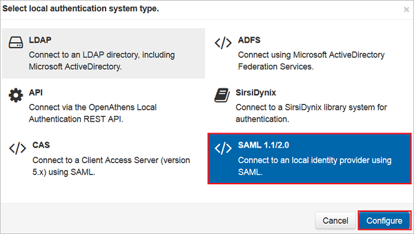
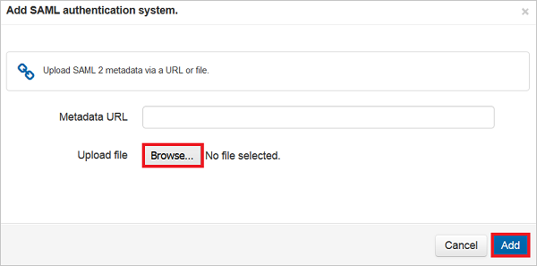
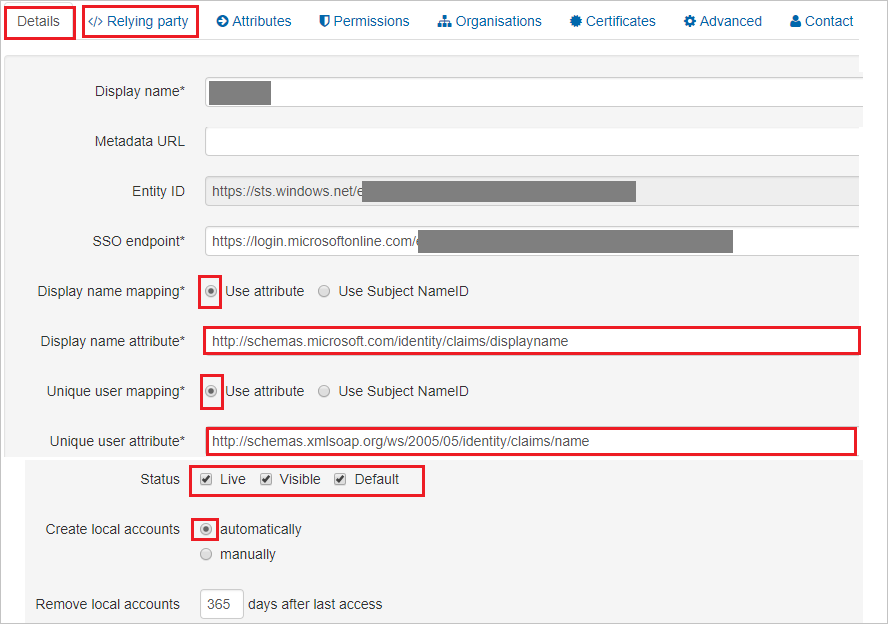

# Tutorial: Azure Active Directory single sign-on (SSO) integration with OpenAthens

In this tutorial, you'll learn how to integrate OpenAthens with Azure Active Directory (Azure AD). When you integrate OpenAthens with Azure AD, you can:

* Control in Azure AD who has access to OpenAthens.
* Enable your users to be automatically signed-in to OpenAthens with their Azure AD accounts.
* Manage your accounts in one central location - the Azure portal.

To learn more about SaaS app integration with Azure AD, see [What is application access and single sign-on with Azure Active Directory](../manage-apps/what-is-single-sign-on.md).

## Prerequisites

To get started, you need the following items:

* An Azure AD subscription. If you don't have a subscription, you can get a [free account](https://azure.microsoft.com/free/).
* OpenAthens single sign-on (SSO) enabled subscription.

## Scenario description

In this tutorial, you configure and test Azure AD SSO in a test environment.

* OpenAthens supports **IDP** initiated SSO
* OpenAthens supports **Just In Time** user provisioning

## Adding OpenAthens from the gallery

To configure the integration of OpenAthens into Azure AD, you need to add OpenAthens from the gallery to your list of managed SaaS apps.

1. Sign in to the [Azure portal](https://portal.azure.com) using either a work or school account, or a personal Microsoft account.
1. On the left navigation pane, select the **Azure Active Directory** service.
1. Navigate to **Enterprise Applications** and then select **All Applications**.
1. To add new application, select **New application**.
1. In the **Add from the gallery** section, type **OpenAthens** in the search box.
1. Select **OpenAthens** from results panel and then add the app. Wait a few seconds while the app is added to your tenant.

## Configure and test Azure AD single sign-on for OpenAthens

Configure and test Azure AD SSO with OpenAthens using a test user called **B.Simon**. For SSO to work, you need to establish a link relationship between an Azure AD user and the related user in OpenAthens.

To configure and test Azure AD SSO with OpenAthens, complete the following building blocks:

1. **[Configure Azure AD SSO](#configure-azure-ad-sso)** - to enable your users to use this feature.
    * **[Create an Azure AD test user](#create-an-azure-ad-test-user)** - to test Azure AD single sign-on with B.Simon.
    * **[Assign the Azure AD test user](#assign-the-azure-ad-test-user)** - to enable B.Simon to use Azure AD single sign-on.
1. **[Configure OpenAthens SSO](#configure-openathens-sso)** - to configure the single sign-on settings on application side.
    * **[Create OpenAthens test user](#create-openathens-test-user)** - to have a counterpart of B.Simon in OpenAthens that is linked to the Azure AD representation of user.
1. **[Test SSO](#test-sso)** - to verify whether the configuration works.

## Configure Azure AD SSO

Follow these steps to enable Azure AD SSO in the Azure portal.

1. In the [Azure portal](https://portal.azure.com/), on the **OpenAthens** application integration page, find the **Manage** section and select **single sign-on**.
1. On the **Select a single sign-on method** page, select **SAML**.
1. On the **Set up single sign-on with SAML** page, click the edit/pen icon for **Basic SAML Configuration** to edit the settings.

   

1. On the **Basic SAML Configuration** section, upload the **Service Provider metadata file**, the steps for which are mentioned later in this tutorial.

	a. Click **Upload metadata file**.

    

	b. Click on **folder logo** to select the metadata file and click **Upload**.

	

	c. Once the metadata file is successfully uploaded, the **Identifier** value get auto populated in **Basic SAML Configuration** section textbox:

    

1. On the **Set up single sign-on with SAML** page, in the **SAML Signing Certificate** section,  find **Federation Metadata XML** and select **Download** to download the certificate and save it on your computer.

	

1. On the **Set up OpenAthens** section, copy the appropriate URL(s) based on your requirement.

	

### Create an Azure AD test user

In this section, you'll create a test user in the Azure portal called B.Simon.

1. From the left pane in the Azure portal, select **Azure Active Directory**, select **Users**, and then select **All users**.
1. Select **New user** at the top of the screen.
1. In the **User** properties, follow these steps:
   1. In the **Name** field, enter `B.Simon`.  
   1. In the **User name** field, enter the username@companydomain.extension. For example, `B.Simon@contoso.com`.
   1. Select the **Show password** check box, and then write down the value that's displayed in the **Password** box.
   1. Click **Create**.

### Assign the Azure AD test user

In this section, you'll enable B.Simon to use Azure single sign-on by granting access to OpenAthens.

1. In the Azure portal, select **Enterprise Applications**, and then select **All applications**.
1. In the applications list, select **OpenAthens**.
1. In the app's overview page, find the **Manage** section and select **Users and groups**.

   

1. Select **Add user**, then select **Users and groups** in the **Add Assignment** dialog.

	

1. In the **Users and groups** dialog, select **B.Simon** from the Users list, then click the **Select** button at the bottom of the screen.
1. If you're expecting any role value in the SAML assertion, in the **Select Role** dialog, select the appropriate role for the user from the list and then click the **Select** button at the bottom of the screen.
1. In the **Add Assignment** dialog, click the **Assign** button.

## Configure OpenAthens SSO

1. In a different web browser window, sign in to your OpenAthens company site as an administrator.

1. Select **Connections** from the list under the **Management** tab.

	

1. Select **SAML 1.1/2.0**, and then select the **Configure** button.

	

1. To add the configuration, select the **Browse** button to upload the metadata .xml file that you downloaded from the Azure portal, and then select **Add**.

	

1. Perform the following steps under the **Details** tab.

	

	a. In **Display name mapping**, select **Use attribute**.

	b. In the **Display name attribute** text box, enter the value `http://schema.microsoft.com/identity/claims/displayname`.

	c. In **Unique user mapping**, select **Use attribute**.

	d. In the **Unique user attribute** text box, enter the value `http://schemas.xmlsoap.org/ws/2005/05/identity/claims/name`.

	e. In **Status**, select all the three check boxes.

	f. In **Create local accounts**, select **automatically**.

	g. Select **Save changes**.

    h. From the **</> Relying Party** tab, copy the **Metadata URL** and open this in the browser to download the **SP metadata XML** file. Upload this SP metadata file on the **Basic SAML Configuration** section in Azure AD.

    

### Create OpenAthens test user

In this section, a user called Britta Simon is created in OpenAthens. OpenAthens supports **just-in-time user provisioning**, which is enabled by default. There is no action item for you in this section. If a user doesn't already exist in OpenAthens, a new one is created after authentication.

## Test SSO

In this section, you test your Azure AD single sign-on configuration using the Access Panel.

When you click the OpenAthens tile in the Access Panel, you should be automatically signed in to the OpenAthens for which you set up SSO. For more information about the Access Panel, see [Introduction to the Access Panel](../user-help/my-apps-portal-end-user-access.md).

## Additional resources

- [ List of Tutorials on How to Integrate SaaS Apps with Azure Active Directory ](./tutorial-list.md)

- [What is application access and single sign-on with Azure Active Directory? ](../manage-apps/what-is-single-sign-on.md)

- [What is conditional access in Azure Active Directory?](../conditional-access/overview.md)

- [Try OpenAthens with Azure AD](https://aad.portal.azure.com/)