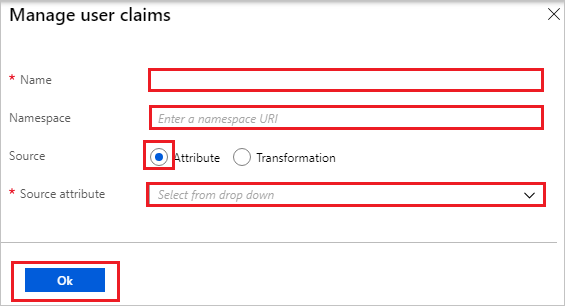
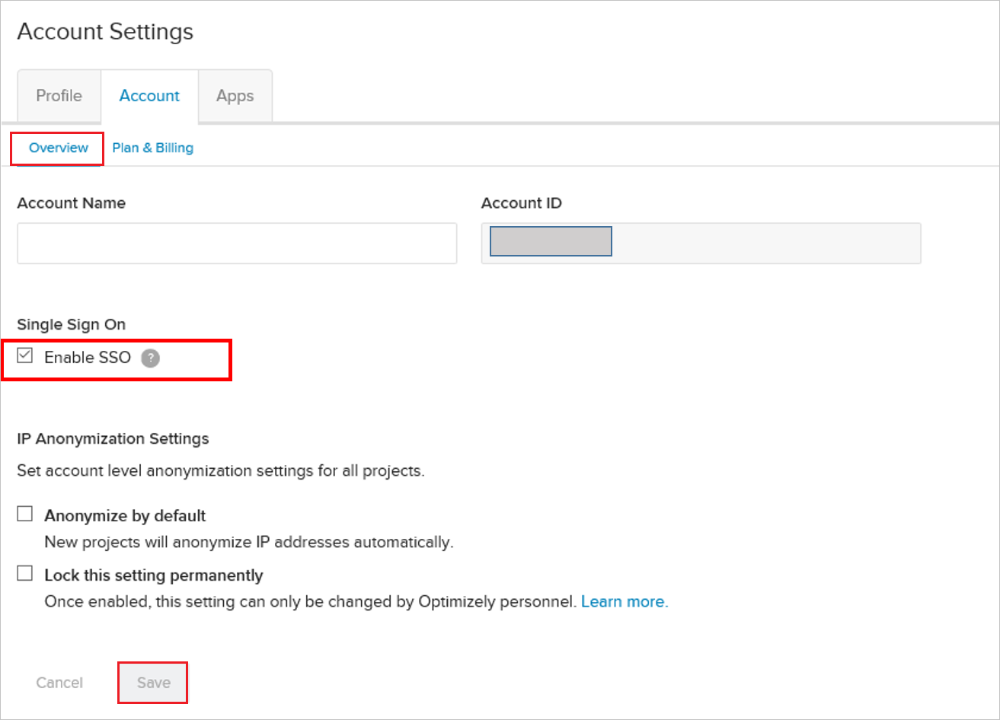
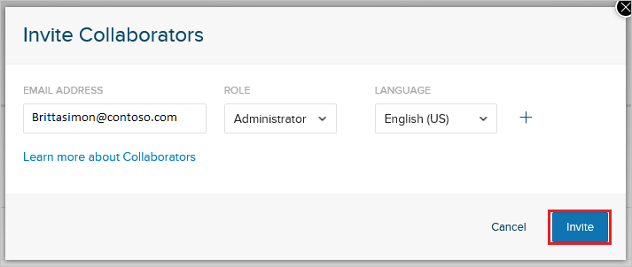

# Tutorial: Azure Active Directory integration with Optimizely

In this tutorial, you learn how to integrate Optimizely with Azure Active Directory (Azure AD).
Integrating Optimizely with Azure AD provides you with the following benefits:

* You can control in Azure AD who has access to Optimizely.
* You can enable your users to be automatically signed-in to Optimizely (Single Sign-On) with their Azure AD accounts.
* You can manage your accounts in one central location - the Azure portal.

If you want to know more details about SaaS app integration with Azure AD, see [What is application access and single sign-on with Azure Active Directory](https://docs.microsoft.com/azure/active-directory/active-directory-appssoaccess-whatis).
If you don't have an Azure subscription, [create a free account](https://azure.microsoft.com/free/) before you begin.

## Prerequisites

To configure Azure AD integration with Optimizely, you need the following items:

* An Azure AD subscription. If you don't have an Azure AD environment, you can get one-month trial [here](https://azure.microsoft.com/pricing/free-trial/)
* Optimizely single sign-on enabled subscription

## Scenario description

In this tutorial, you configure and test Azure AD single sign-on in a test environment.

* Optimizely supports **SP** initiated SSO

## Adding Optimizely from the gallery

To configure the integration of Optimizely into Azure AD, you need to add Optimizely from the gallery to your list of managed SaaS apps.

**To add Optimizely from the gallery, perform the following steps:**

1. In the **[Azure portal](https://portal.azure.com)**, on the left navigation panel, click **Azure Active Directory** icon.

	

2. Navigate to **Enterprise Applications** and then select the **All Applications** option.

	

3. To add new application, click **New application** button on the top of dialog.

	

4. In the search box, type **Optimizely**, select **Optimizely** from result panel then click **Add** button to add the application.

	 

## Configure and test Azure AD single sign-on

In this section, you configure and test Azure AD single sign-on with Optimizely based on a test user called **Britta Simon**.
For single sign-on to work, a link relationship between an Azure AD user and the related user in Optimizely needs to be established.

To configure and test Azure AD single sign-on with Optimizely, you need to complete the following building blocks:

1. **[Configure Azure AD Single Sign-On](#configure-azure-ad-single-sign-on)** - to enable your users to use this feature.
2. **[Configure Optimizely Single Sign-On](#configure-optimizely-single-sign-on)** - to configure the Single Sign-On settings on application side.
3. **[Create an Azure AD test user](#create-an-azure-ad-test-user)** - to test Azure AD single sign-on with Britta Simon.
4. **[Assign the Azure AD test user](#assign-the-azure-ad-test-user)** - to enable Britta Simon to use Azure AD single sign-on.
5. **[Create Optimizely test user](#create-optimizely-test-user)** - to have a counterpart of Britta Simon in Optimizely that is linked to the Azure AD representation of user.
6. **[Test single sign-on](#test-single-sign-on)** - to verify whether the configuration works.

### Configure Azure AD single sign-on

In this section, you enable Azure AD single sign-on in the Azure portal.

To configure Azure AD single sign-on with Optimizely, perform the following steps:

1. In the [Azure portal](https://portal.azure.com/), on the **Optimizely** application integration page, select **Single sign-on**.

    

2. On the **Select a Single sign-on method** dialog, select **SAML/WS-Fed** mode to enable single sign-on.

    

3. On the **Set up Single Sign-On with SAML** page, click **Edit** icon to open **Basic SAML Configuration** dialog.

	

4. On the **Basic SAML Configuration** section, perform the following steps:

    

	a. In the **Sign on URL** text box, type a URL using the following pattern:
    `https://app.optimizely.net/<instance name>`

    b. In the **Identifier (Entity ID)** text box, type a URL using the following pattern:
    `urn:auth0:optimizely:contoso`

	> [!NOTE]
	> These values are not the real. You will update the value with the actual Sign-on URL and Identifier, which is explained later in the tutorial. You can also refer to the patterns shown in the **Basic SAML Configuration** section in the Azure portal.

5. Your Optimizely application expects the SAML assertions in a specific format, which requires you to add custom attribute mappings to your SAML token attributes configuration. The following screenshot shows the list of default attributes. Click **Edit** icon to open **User Attributes** dialog.

	

6. In addition to above, Optimizely application expects few more attributes to be passed back in SAML response. In the **User Claims** section on the **User Attributes** dialog, perform the following steps to add SAML token attribute as shown in the below table:

	| Name | Source Attribute |
	| ---------------| --------------- |
	| email | user.mail |
	
	a. Click **Add new claim** to open the **Manage user claims** dialog.

	

	

	b. In the **Name** textbox, type the attribute name shown for that row.

	c. Leave the **Namespace** blank.

	d. Select Source as **Attribute**.

	e. From the **Source attribute** list, type the attribute value shown for that row.

	f. Click **Ok**

	g. Click **Save**.

4. On the **Set up Single Sign-On with SAML** page, in the **SAML Signing Certificate** section, click **Download** to download the **Certificate (Base64)** from the given options as per your requirement and save it on your computer.

	

6. On the **Set up Optimizely** section, copy the appropriate URL(s) as per your requirement.

	

	a. Login URL

	b. Azure AD Identifier

	c. Logout URL

### Configure Optimizely Single Sign-On

1. To configure single sign-on on **Optimizely** side, contact your Optimizely Account Manager and provide the downloaded **Certificate (Base64)** and appropriate copied URLs.

2. In response to your email, Optimizely provides you with the Sign On URL (SP-initiated SSO) and the Identifier (Service Provider Entity ID) values.

	a. Copy the **SP-initiated SSO URL** provided by Optimizely, and paste into the **Sign On URL** textbox in **Basic SAML Configuration** section on Azure portal.

	b. Copy the **Service Provider Entity ID** provided by Optimizely, and paste into the **Identifier** textbox in **Basic SAML Configuration** section on Azure portal.

3. In a different browser window, sign-on to your Optimizely application.

4. Click you account name in the top right corner and then **Account Settings**.

    

5. In the Account tab, check the box **Enable SSO** under Single Sign On in the **Overview** section.
  
    

6. Click **Save**

### Create an Azure AD test user 

The objective of this section is to create a test user in the Azure portal called Britta Simon.

1. In the Azure portal, in the left pane, select **Azure Active Directory**, select **Users**, and then select **All users**.

    

2. Select **New user** at the top of the screen.

    

3. In the User properties, perform the following steps.

    

    a. In the **Name** field enter **BrittaSimon**.
  
    b. In the **User name** field type **brittasimon@yourcompanydomain.extension**  
    For example, BrittaSimon@contoso.com

    c. Select **Show password** check box, and then write down the value that's displayed in the Password box.

    d. Click **Create**.

### Assign the Azure AD test user

In this section, you enable Britta Simon to use Azure single sign-on by granting access to Optimizely.

1. In the Azure portal, select **Enterprise Applications**, select **All applications**, then select **Optimizely**.

	

2. In the applications list, select **Optimizely**.

	

3. In the menu on the left, select **Users and groups**.

    

4. Click the **Add user** button, then select **Users and groups** in the **Add Assignment** dialog.

    

5. In the **Users and groups** dialog select **Britta Simon** in the Users list, then click the **Select** button at the bottom of the screen.

6. If you are expecting any role value in the SAML assertion then in the **Select Role** dialog select the appropriate role for the user from the list, then click the **Select** button at the bottom of the screen.

7. In the **Add Assignment** dialog click the **Assign** button.

### Create Optimizely test user

In this section, you create a user called Britta Simon in Optimizely.

1. On the home page, select **Collaborators** tab.

2. To add new collaborator to the project, click **New Collaborator**.
   
    

3. Fill in the email address and assign them a role. Click **Invite**.

    

4. They receive an email invite. Using the email address, they have to log in to Optimizely.

### Test single sign-on 

In this section, you test your Azure AD single sign-on configuration using the Access Panel.

When you click the Optimizely tile in the Access Panel, you should be automatically signed in to the Optimizely for which you set up SSO. For more information about the Access Panel, see [Introduction to the Access Panel](https://docs.microsoft.com/azure/active-directory/active-directory-saas-access-panel-introduction).

## Additional Resources

- [List of Tutorials on How to Integrate SaaS Apps with Azure Active Directory](https://docs.microsoft.com/azure/active-directory/active-directory-saas-tutorial-list)

- [What is application access and single sign-on with Azure Active Directory?](https://docs.microsoft.com/azure/active-directory/active-directory-appssoaccess-whatis)

- [What is conditional access in Azure Active Directory?](https://docs.microsoft.com/azure/active-directory/conditional-access/overview)

