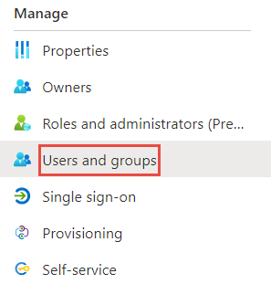
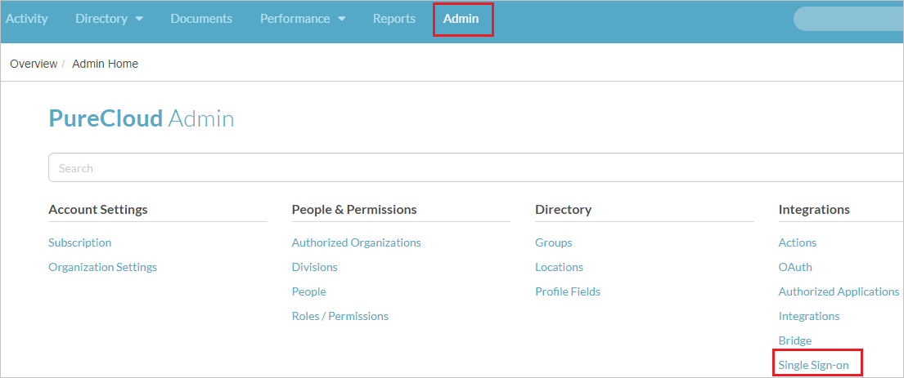
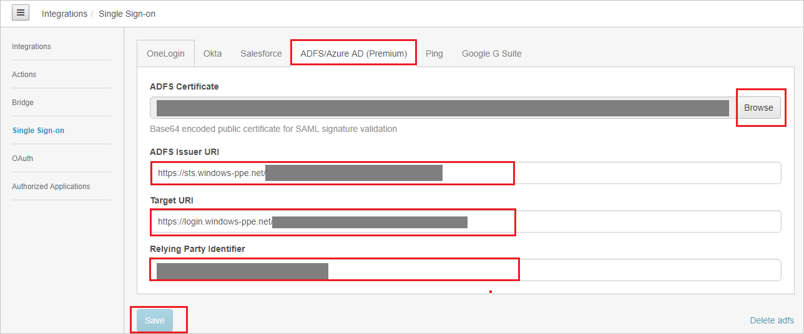
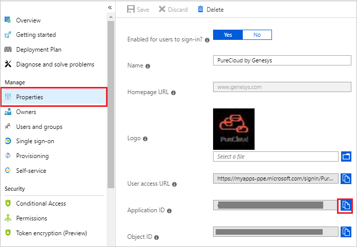

# Tutorial: Azure Active Directory single sign-on (SSO) integration with PureCloud by Genesys

In this tutorial, you'll learn how to integrate PureCloud by Genesys with Azure Active Directory (Azure AD). When you integrate PureCloud by Genesys with Azure AD, you can:

* Control in Azure AD who has access to PureCloud by Genesys.
* Enable your users to be automatically signed-in to PureCloud by Genesys with their Azure AD accounts.
* Manage your accounts in one central location - the Azure portal.

To learn more about SaaS app integration with Azure AD, see [What is application access and single sign-on with Azure Active Directory](https://docs.microsoft.com/azure/active-directory/active-directory-appssoaccess-whatis).

## Prerequisites

To get started, you need the following items:

* An Azure AD subscription. If you don't have a subscription, you can get a [free account](https://azure.microsoft.com/free/).
* PureCloud by Genesys single sign-on (SSO) enabled subscription.

## Scenario description

In this tutorial, you configure and test Azure AD SSO in a test environment.

* PureCloud by Genesys supports **SP and IDP** initiated SSO

> [!NOTE]
> Identifier of this application is a fixed string value so only one instance can be configured in one tenant.

## Adding PureCloud by Genesys from the gallery

To configure the integration of PureCloud by Genesys into Azure AD, you need to add PureCloud by Genesys from the gallery to your list of managed SaaS apps.

1. Sign in to the [Azure portal](https://portal.azure.com) using either a work or school account, or a personal Microsoft account.
1. On the left navigation pane, select the **Azure Active Directory** service.
1. Navigate to **Enterprise Applications** and then select **All Applications**.
1. To add new application, select **New application**.
1. In the **Add from the gallery** section, type **PureCloud by Genesys** in the search box.
1. Select **PureCloud by Genesys** from results panel and then add the app. Wait a few seconds while the app is added to your tenant.

## Configure and test Azure AD single sign-on for PureCloud by Genesys

Configure and test Azure AD SSO with PureCloud by Genesys using a test user called **B.Simon**. For SSO to work, you need to establish a link relationship between an Azure AD user and the related user in PureCloud by Genesys.

To configure and test Azure AD SSO with PureCloud by Genesys, complete the following building blocks:

1. **[Configure Azure AD SSO](#configure-azure-ad-sso)** - to enable your users to use this feature.
    1. **[Create an Azure AD test user](#create-an-azure-ad-test-user)** - to test Azure AD single sign-on with B.Simon.
    1. **[Assign the Azure AD test user](#assign-the-azure-ad-test-user)** - to enable B.Simon to use Azure AD single sign-on.
1. **[Configure PureCloud by Genesys SSO](#configure-purecloud-by-genesys-sso)** - to configure the single sign-on settings on application side.
    1. **[Create PureCloud by Genesys test user](#create-purecloud-by-genesys-test-user)** - to have a counterpart of B.Simon in PureCloud by Genesys that is linked to the Azure AD representation of user.
1. **[Test SSO](#test-sso)** - to verify whether the configuration works.

## Configure Azure AD SSO

Follow these steps to enable Azure AD SSO in the Azure portal.

1. In the [Azure portal](https://portal.azure.com/), on the **PureCloud by Genesys** application integration page, find the **Manage** section and select **single sign-on**.
1. On the **Select a single sign-on method** page, select **SAML**.
1. On the **Set up single sign-on with SAML** page, click the edit/pen icon for **Basic SAML Configuration** to edit the settings.

   

1. On the **Basic SAML Configuration** section, if you wish to configure the application in **IDP** initiated mode, enter the values for the following fields:

    a. In the **Identifier** text box, type a URL as per your region:

	| |
	|--|
	| `https://login.mypurecloud.com/saml` |
	| `https://login.mypurecloud.de/saml` |
	| `https://login.mypurecloud.jp/saml` |
	| `https://login.mypurecloud.ie/saml` |
	| `https://login.mypurecloud.au/saml` |

    b. In the **Reply URL** text box, type a URL as per your region:

	| |
	|--|
    | `https://login.mypurecloud.com/saml` |
	| `https://login.mypurecloud.de/saml` |
	| `https://login.mypurecloud.jp/saml` |
	| `https://login.mypurecloud.ie/saml` |
	| `https://login.mypurecloud.com.au/saml`|

1. Click **Set additional URLs** and perform the following step if you wish to configure the application in **SP** initiated mode:

    In the **Sign-on URL** text box, type a URL as per your region:
	
	| |
	|--|
	| `https://login.mypurecloud.com` |
	| `https://login.mypurecloud.de` |
	| `https://login.mypurecloud.jp` |
	| `https://login.mypurecloud.ie` |
	| `https://login.mypurecloud.com.au` |

1. PureCloud by Genesys application expects the SAML assertions in a specific format, which requires you to add custom attribute mappings to your SAML token attributes configuration. The following screenshot shows the list of default attributes.

	

1. In addition to above, PureCloud by Genesys application expects few more attributes to be passed back in SAML response which are shown below. These attributes are also pre populated but you can review them as per your requirements.

	| Name | Source Attribute|
	| ---------------| --------------- |
	| Email | user.userprinicipalname |
	| OrganizationName | `Your organization name` |

1. On the **Set up single sign-on with SAML** page, in the **SAML Signing Certificate** section,  find **Certificate (Base64)** and select **Download** to download the certificate and save it on your computer.

	

1. On the **Set up PureCloud by Genesys** section, copy the appropriate URL(s) based on your requirement.

	

### Create an Azure AD test user

In this section, you'll create a test user in the Azure portal called B.Simon.

1. From the left pane in the Azure portal, select **Azure Active Directory**, select **Users**, and then select **All users**.
1. Select **New user** at the top of the screen.
1. In the **User** properties, follow these steps:
   1. In the **Name** field, enter `B.Simon`.  
   1. In the **User name** field, enter the username@companydomain.extension. For example, `B.Simon@contoso.com`.
   1. Select the **Show password** check box, and then write down the value that's displayed in the **Password** box.
   1. Click **Create**.

### Assign the Azure AD test user

In this section, you'll enable B.Simon to use Azure single sign-on by granting access to PureCloud by Genesys.

1. In the Azure portal, select **Enterprise Applications**, and then select **All applications**.
1. In the applications list, select **PureCloud by Genesys**.
1. In the app's overview page, find the **Manage** section and select **Users and groups**.

   

1. Select **Add user**, then select **Users and groups** in the **Add Assignment** dialog.

	

1. In the **Users and groups** dialog, select **B.Simon** from the Users list, then click the **Select** button at the bottom of the screen.
1. If you're expecting any role value in the SAML assertion, in the **Select Role** dialog, select the appropriate role for the user from the list and then click the **Select** button at the bottom of the screen.
1. In the **Add Assignment** dialog, click the **Assign** button.

## Configure PureCloud by Genesys SSO

1. In a different web browser window, sign in to PureCloud by Genesys as an Administrator.

1. Click on **Admin** on the top and navigate to **Single Sign-on** under **Integrations**.

	

1. Switch to **ADFS/Azure AD(Premium)** tab, and perform the following steps:

	

	a. Click **Browse** to upload the base-64 encoded certificate that you have downloaded from the Azure portal, into the **ADFS Certificate**.

	b. In the **ADFS Issuer URI** textbox, paste the value of **Azure AD Identifier** which you have copied from the Azure portal.

	c. In the **Target URI** textbox, paste the value of **Login URL** which you have copied from the Azure portal.

	d. For **Relying Party Identifier** value, you need to go to the Azure portal, on the **PureCloud by Genesys** application integration page, click on **Properties** tab and copy the **Application ID** value. Paste it in the **Relying Party Identifier** textbox. 

	

	e. Click **Save**

### Create PureCloud by Genesys test user

To enable Azure AD users to sign in to PureCloud by Genesys, they must be provisioned into PureCloud by Genesys. In PureCloud by Genesys, provisioning is a manual task.

**To provision a user account, perform the following steps:**

1. Log in to PureCloud by Genesys as an Administrator.

1. Click on **Admin** on the top and navigate to **People** under **People & Permissions**.

	

1. On the People page, click on **Add Person**.

	

1. On the **Add People to the Organization** pop-up, perform the following steps:

	

	a. In **Full Name** text box, enter the name of user like **B.simon**.

	b. In **Email** text box, enter the email of user like **b.simon\@contoso.com**.

	c. Click **Create**.

## Test SSO

In this section, you test your Azure AD single sign-on configuration using the Access Panel.

When you click the PureCloud by Genesys tile in the Access Panel, you should be automatically signed in to the PureCloud by Genesys for which you set up SSO. For more information about the Access Panel, see [Introduction to the Access Panel](https://docs.microsoft.com/azure/active-directory/active-directory-saas-access-panel-introduction).

## Additional resources

- [ List of Tutorials on How to Integrate SaaS Apps with Azure Active Directory ](https://docs.microsoft.com/azure/active-directory/active-directory-saas-tutorial-list)

- [What is application access and single sign-on with Azure Active Directory? ](https://docs.microsoft.com/azure/active-directory/active-directory-appssoaccess-whatis)

- [What is conditional access in Azure Active Directory?](https://docs.microsoft.com/azure/active-directory/conditional-access/overview)

- [Try PureCloud by Genesys with Azure AD](https://aad.portal.azure.com/)