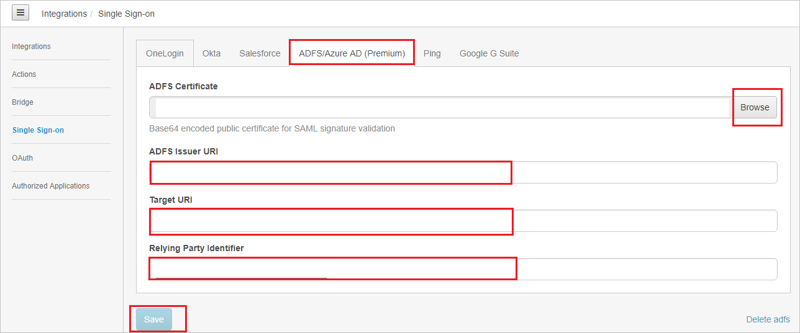
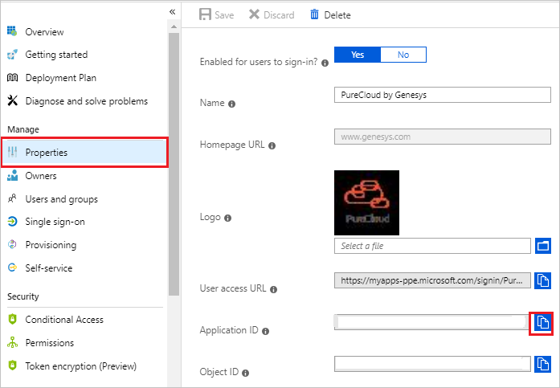
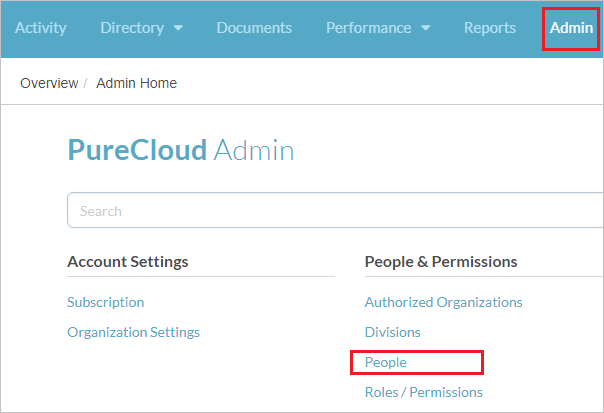
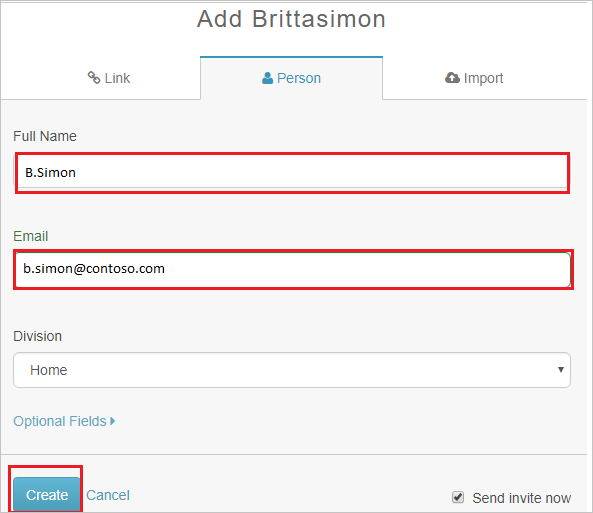

# Tutorial: Azure Active Directory single sign-on (SSO) integration with PureCloud by Genesys

In this tutorial, you'll learn how to integrate PureCloud by Genesys with Azure Active Directory (Azure AD). When you integrate PureCloud by Genesys with Azure AD, you can:

* Control in Azure AD who has access to PureCloud by Genesys.
* Enable your users to be automatically signed-in to PureCloud by Genesys with their Azure AD accounts.
* Manage your accounts in one central location - the Azure portal.

## Prerequisites

To get started, you need the following items:

* An Azure AD subscription. If you don't have one, you can get a [free account](https://azure.microsoft.com/free/).
* A PureCloud by Genesys single sign-on (SSO)–enabled subscription.

## Scenario description

In this tutorial, you configure and test Azure AD SSO in a test environment.

* PureCloud by Genesys supports **SP and IDP**–initiated SSO.

> [!NOTE]
> Identifier of this application is a fixed string value so only one instance can be configured in one tenant.

## Add PureCloud by Genesys from the gallery

To configure integration of PureCloud by Genesys into Azure AD, you must add PureCloud by Genesys from the gallery to your list of managed SaaS apps. To do this, follow these steps:

1. Sign in to the Azure portal by using a work or school account or by using a personal Microsoft account.
1. On the left navigation pane, select the **Azure Active Directory** service.
1. Go to **Enterprise Applications** and then select **All Applications**.
1. To add new application, select **New application**.
1. In the **Add from the gallery** section, type **PureCloud by Genesys** in the search box.
1. Select **PureCloud by Genesys** from the results panel and then add the app. Wait a few seconds while the app is added to your tenant.

## Configure and test Azure AD SSO for PureCloud by Genesys

Configure and test Azure AD SSO with PureCloud by Genesys using a test user named **B.Simon**. For SSO to work, you must establish a link relationship between an Azure AD user and the related user in PureCloud by Genesys.

To configure and test Azure AD SSO with PureCloud by Genesys, perform the following steps:

1. **[Configure Azure AD SSO](#configure-azure-ad-sso)** to enable your users to use this feature.
    1. **[Create an Azure AD test user](#create-an-azure-ad-test-user)** to test Azure AD single sign-on with B.Simon.
    1. **[Assign the Azure AD test user](#assign-the-azure-ad-test-user)** to enable B.Simon to use Azure AD single sign-on.
1. **[Configure PureCloud by Genesys SSO](#configure-purecloud-by-genesys-sso)** to configure the single sign-on settings on application side.
    1. **[Create PureCloud by Genesys test user](#create-purecloud-by-genesys-test-user)** to have a counterpart of B.Simon in PureCloud by Genesys that's linked to the Azure AD representation of user.
1. **[Test SSO](#test-sso)** to verify whether the configuration works.

## Configure Azure AD SSO

To enable Azure AD SSO in the Azure portal, follow these steps:

1. In the Azure portal, on the **PureCloud by Genesys** application integration page, find the **Manage** section and select **single sign-on**.
1. On the **Select a Single Sign-On method** page, select **SAML**.
1. On the **Set up Single Sign-On with SAML** page, select the pencil icon for **Basic SAML Configuration** to edit the settings.

   

1. In the **Basic SAML Configuration** section, if you want to configure the application in **IDP**-initiated mode, enter the values for the following fields:

    a. In the **Identifier** box, enter the URLs that corresponds to your region:

    ```http
    https://login.mypurecloud.com/saml
    https://login.mypurecloud.de/saml
    https://login.mypurecloud.jp/saml
    https://login.mypurecloud.ie/saml
    https://login.mypurecloud.au/saml
    ```

    b. In the **Reply URL** box, enter the URLs that corresponds to your region:

    ```http
    https://login.mypurecloud.com/saml
    https://login.mypurecloud.de/saml
    https://login.mypurecloud.jp/saml
    https://login.mypurecloud.ie/saml
    https://login.mypurecloud.com.au/saml
    ```

1. Select **Set additional URLs** and take the following step if you want to configure the application in **SP** initiated mode:

    In the **Sign-on URL** box, enter the URLs that corresponds to your region:
	
    ```http
    https://login.mypurecloud.com
    https://login.mypurecloud.de
    https://login.mypurecloud.jp
    https://login.mypurecloud.ie
    https://login.mypurecloud.com.au
    ```

1. PureCloud by Genesys application expects the SAML assertions in a specific format, which requires you to add custom attribute mappings to your SAML token attributes configuration. The following screenshot shows the list of default attributes:

	

1. Additionally, PureCloud by Genesys application expects a few more attributes to be passed back in the SAML response, as shown in the following table. These attributes are also pre-populated, but you can review them as needed.

	| Name | Source attribute|
	| ---------------| --------------- |
	| Email | user.userprincipalname |
	| OrganizationName | `Your organization name` |

1. On the **Set up Single Sign-On with SAML** page, in the **SAML Signing Certificate** section,  find **Certificate (Base64)** and select **Download** to download the certificate and save it on your computer.

	

1. In the **Set up PureCloud by Genesys** section, copy the appropriate URL (or URLs), based on your requirements.

	

### Create an Azure AD test user

In this section, you'll create a test user named B.Simon in the Azure portal:

1. In the left pane of the Azure portal, select **Azure Active Directory**, select **Users**, and then select **All users**.
1. Select **New user** at the top of the screen.
1. In the **User** properties, follow these steps:
   1. In the **Name** field, enter `B.Simon`.  
   1. In the **User name** field, enter the user name in the following format: username@companydomain.extension. For example: `B.Simon@contoso.com`.
   1. Select the **Show password** check box, and then make note of the value that's displayed in the **Password** box.
   1. Select **Create**.

### Assign the Azure AD test user

In this section, you'll enable B.Simon to use Azure single sign-on by granting access to PureCloud by Genesys.

1. In the Azure portal, select **Enterprise Applications**, and then select **All applications**.
1. In the applications list, select **PureCloud by Genesys**.
1. In the app's overview page, find the **Manage** section and select **Users and groups**.
1. Select **Add user**, then select **Users and groups** in the **Add Assignment** dialog.
1. In the **Users and groups** dialog, select **B.Simon** from the Users list, then click the **Select** button at the bottom of the screen.
1. If you are expecting a role to be assigned to the users, you can select it from the **Select a role** dropdown. If no role has been set up for this app, you see "Default Access" role selected.
1. In the **Add Assignment** dialog, click the **Assign** button.

## Configure PureCloud by Genesys SSO

1. In a different web browser window, sign in to PureCloud by Genesys as an administrator.

1. Select **Admin** at the top and then go to **Single Sign-on** under **Integrations**.

	

1. Switch to the **ADFS/Azure AD(Premium)** tab, and then follow these steps:

	

	a. Select **Browse** to upload the base-64 encoded certificate that you downloaded from the Azure portal into the **ADFS Certificate**.

	b. In the **ADFS Issuer URI** box, paste the value of **Azure AD Identifier** that you copied from the Azure portal.

	c. In the **Target URI** box, paste the value of **Login URL** that you copied from the Azure portal.

	d. For the **Relying Party Identifier** value, go to the Azure portal, and then on the **PureCloud by Genesys** application integration page, select the **Properties** tab and copy the **Application ID** value. Paste it into the **Relying Party Identifier** box.

	

	e. Select **Save**.

### Create PureCloud by Genesys test user

To enable Azure AD users to sign in to PureCloud by Genesys, they must be provisioned into PureCloud by Genesys. In PureCloud by Genesys, provisioning is a manual task.

**To provision a user account, follow these steps:**

1. Log in to PureCloud by Genesys as an administrator.

1. Select **Admin** at the top and go to **People** under **People & Permissions**.

	

1. On the **People** page, select **Add Person**.

	

1. In the **Add People to the Organization** dialog box, follow these steps:

	

	a. In the **Full Name** box, enter the name of a user. For example: **B.simon**.

	b. In the **Email** box, enter the email of the user. For example: **b.simon\@contoso.com**.

	c. Select **Create**.

## Test SSO

In this section, you test your Azure AD single sign-on configuration with following options. 

#### SP initiated:

* Click on **Test this application** in Azure portal. This will redirect to PureCloud by Genesys Sign on URL where you can initiate the login flow.  

* Go to PureCloud by Genesys Sign-on URL directly and initiate the login flow from there.

#### IDP initiated:

* Click on **Test this application** in Azure portal and you should be automatically signed in to the PureCloud by Genesys for which you set up the SSO. 

You can also use Microsoft My Apps to test the application in any mode. When you click the PureCloud by Genesys tile in the My Apps, if configured in SP mode you would be redirected to the application sign on page for initiating the login flow and if configured in IDP mode, you should be automatically signed in to the PureCloud by Genesys for which you set up the SSO. For more information about the My Apps, see [Introduction to the My Apps](../user-help/my-apps-portal-end-user-access.md).

## Next steps

Once you configure PureCloud by Genesys you can enforce session control, which protects exfiltration and infiltration of your organization’s sensitive data in real time. Session control extends from Conditional Access. [Learn how to enforce session control with Microsoft Cloud App Security](/cloud-app-security/proxy-deployment-any-app).