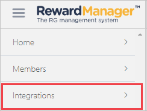
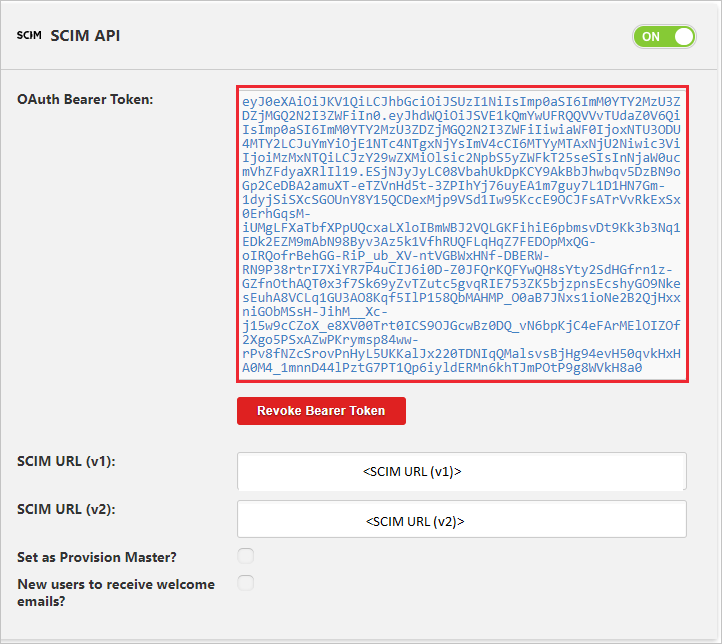
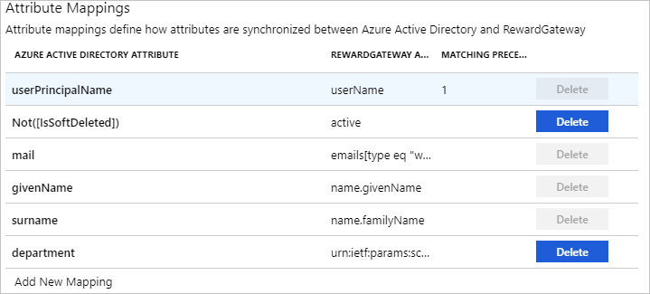

# Tutorial: Configure Reward Gateway for automatic user provisioning

The objective of this tutorial is to demonstrate the steps to be performed in Reward Gateway and Azure Active Directory (Azure AD) to configure Azure AD to automatically provision and de-provision users and/or groups to Reward Gateway.

> [!NOTE]
> This tutorial describes a connector built on top of the Azure AD User Provisioning Service. For important details on what this service does, how it works, and frequently asked questions, see [Automate user provisioning and deprovisioning to SaaS applications with Azure Active Directory](https://docs.microsoft.com/azure/active-directory/manage-apps/user-provisioning).
>
> This connector is currently in public preview. For more information on the general Microsoft Azure terms of use for Preview features, see [Supplemental Terms of Use for Microsoft Azure Previews](https://azure.microsoft.com/support/legal/preview-supplemental-terms/).

## Prerequisites

The scenario outlined in this tutorial assumes that you already have the following prerequisites:

* An Azure AD tenant.
* A [Reward Gateway tenant](https://www.rewardgateway.com/).
* A user account in Reward Gateway with Admin permissions.

## Assigning users to Reward Gateway 

Azure Active Directory uses a concept called *assignments* to determine which users should receive access to selected apps. In the context of automatic user provisioning, only the users and/or groups that have been assigned to an application in Azure AD are synchronized.

Before configuring and enabling automatic user provisioning, you should decide which users and/or groups in Azure AD need access to Reward Gateway. Once decided, you can assign these users and/or groups to Reward Gateway by following the instructions in [Assign a user or group to an enterprise app](../manage-apps/assign-user-or-group-access-portal.md).

## Important tips for assigning users to Reward Gateway 

* It is recommended that a single Azure AD user is assigned to Reward Gateway  to test the automatic user provisioning configuration. Additional users and/or groups may be assigned later.

* When assigning a user to Reward Gateway, you must select any valid application-specific role (if available) in the assignment dialog. Users with the **Default Access** role are excluded from provisioning.

## Setup Reward Gateway  for provisioning
Before configuring Reward Gateway for automatic user provisioning with Azure AD, you will need to enable SCIM provisioning on Reward Gateway.

1. Sign in to your [Reward Gateway Admin Console](https://rewardgateway.photoshelter.com/login/). Click **Integrations**.

	

2.	Select **My Integration**.

	

3.	Copy the values of **SCIM URL (v2)** and **OAuth Bearer Token**. These values will be entered in the Tenant URL and Secret Token field in the Provisioning tab of your Reward Gateway application in the Azure portal.

	

## Add Reward Gateway from the gallery

To configure Reward Gateway for automatic user provisioning with Azure AD, you need to add Reward Gateway from the Azure AD application gallery to your list of managed SaaS applications.

**To add Reward Gateway from the Azure AD application gallery, perform the following steps:**

1. In the **[Azure portal](https://portal.azure.com)**, in the left navigation panel, select **Azure Active Directory**.

	

2. Go to **Enterprise applications**, and then select **All applications**.

	

3. To add a new application, select the **New application** button at the top of the pane.

	

4. In the search box, enter **Reward Gateway**, select **Reward Gateway** in the results panel, and then click the **Add** button to add the application.

	

## Configuring automatic user provisioning to Reward Gateway  

This section guides you through the steps to configure the Azure AD provisioning service to create, update, and disable users and/or groups in Reward Gateway based on user and/or group assignments in Azure AD.

> [!TIP]
> You may also choose to enable SAML-based single sign-on for Reward Gateway, following the instructions provided in the [Reward Gateway  Single sign-on tutorial](reward-gateway-tutorial.md). Single sign-on can be configured independently of automatic user provisioning, though these two features compliment each other.

### To configure automatic user provisioning for Reward Gateway in Azure AD:

1. Sign in to the [Azure portal](https://portal.azure.com). Select **Enterprise Applications**, then select **All applications**.

	

2. In the applications list, select **Reward Gateway**.

	

3. Select the **Provisioning** tab.

	

4. Set the **Provisioning Mode** to **Automatic**.

	

5. Under the **Admin Credentials** section, input the **SCIM URL (v2)** and **OAuth Bearer Token** values retrieved earlier in **Tenant URL** and **Secret Token** respectively. Click **Test Connection** to ensure Azure AD can connect to reward gateway. If the connection fails, ensure your reward gateway account has Admin permissions and try again.

	

6. In the **Notification Email** field, enter the email address of a person or group who should receive the provisioning error notifications and check the checkbox - **Send an email notification when a failure occurs**.

	

7. Click **Save**.

8. Under the **Mappings** section, select **Synchronize Azure Active Directory Users to Reward Gateway**.

	

9. Review the user attributes that are synchronized from Azure AD to Reward Gateway in the **Attribute-Mapping** section. The attributes selected as **Matching** properties are used to match the user accounts in Reward Gateway for update operations. Select the **Save** button to commit any changes.

	

10. To configure scoping filters, refer to the following instructions provided in the [Scoping filter tutorial](../app-provisioning/define-conditional-rules-for-provisioning-user-accounts.md).

11. To enable the Azure AD provisioning service for Reward Gateway, change the **Provisioning Status** to **On** in the **Settings** section.

	

12. Define the users and/or groups that you would like to provision to Reward Gateway by choosing the desired values in **Scope** in the **Settings** section.

	

13. When you are ready to provision, click **Save**.

	

This operation starts the initial synchronization of all users and/or groups defined in **Scope** in the **Settings** section. The initial sync takes longer to perform than subsequent syncs, which occur approximately every 40 minutes as long as the Azure AD provisioning service is running. You can use the **Synchronization Details** section to monitor progress and follow links to provisioning activity report, which describes all actions performed by the Azure AD provisioning service on Reward Gateway.

For more information on how to read the Azure AD provisioning logs, see [Reporting on automatic user account provisioning](../app-provisioning/check-status-user-account-provisioning.md).

## Connector limitations

Reward Gateway does not support group provisioning currently.

## Additional resources

* [Managing user account provisioning for Enterprise Apps](../app-provisioning/configure-automatic-user-provisioning-portal.md)
* [What is application access and single sign-on with Azure Active Directory?](../manage-apps/what-is-single-sign-on.md)

## Next steps

[Learn how to review logs and get reports on provisioning activity](../app-provisioning/check-status-user-account-provisioning.md)
