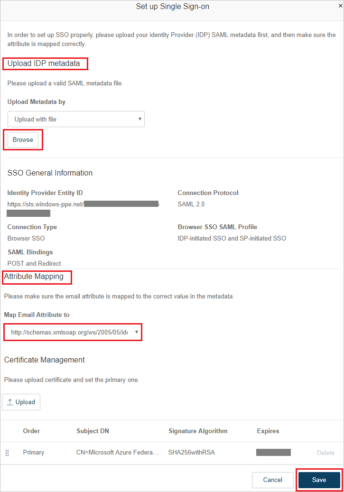
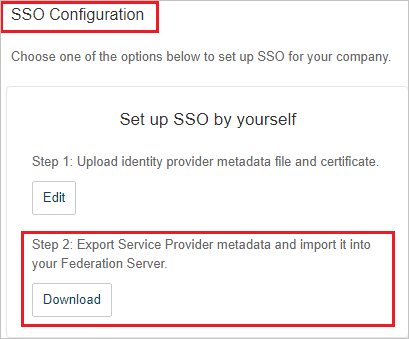
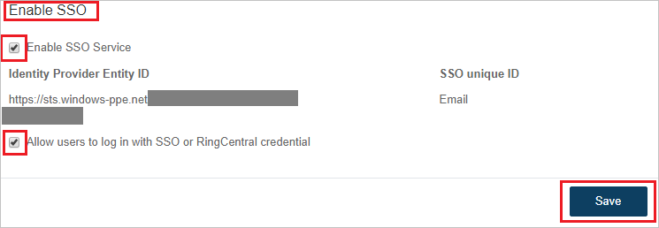

# Tutorial: Integrate RingCentral with Azure Active Directory

In this tutorial, you'll learn how to integrate RingCentral with Azure Active Directory (Azure AD). When you integrate RingCentral with Azure AD, you can:

* Control in Azure AD who has access to RingCentral.
* Enable your users to be automatically signed-in to RingCentral with their Azure AD accounts.
* Manage your accounts in one central location - the Azure portal.

To learn more about SaaS app integration with Azure AD, see [What is application access and single sign-on with Azure Active Directory](https://docs.microsoft.com/azure/active-directory/active-directory-appssoaccess-whatis).

## Prerequisites

To get started, you need the following items:

* An Azure AD subscription. If you don't have a subscription, you can get a [free account](https://azure.microsoft.com/free/).
* RingCentral single sign-on (SSO) enabled subscription.

## Scenario description

In this tutorial, you configure and test Azure AD SSO in a test environment.

* RingCentral supports **IDP** initiated SSO

## Adding RingCentral from the gallery

To configure the integration of RingCentral into Azure AD, you need to add RingCentral from the gallery to your list of managed SaaS apps.

1. Sign in to the [Azure portal](https://portal.azure.com) using either a work or school account, or a personal Microsoft account.
1. On the left navigation pane, select the **Azure Active Directory** service.
1. Navigate to **Enterprise Applications** and then select **All Applications**.
1. To add new application, select **New application**.
1. In the **Add from the gallery** section, type **RingCentral** in the search box.
1. Select **RingCentral** from results panel and then add the app. Wait a few seconds while the app is added to your tenant.

## Configure and test Azure AD single sign-on

Configure and test Azure AD SSO with RingCentral using a test user called **Britta Simon**. For SSO to work, you need to establish a link relationship between an Azure AD user and the related user in RingCentral.

To configure and test Azure AD SSO with RingCentral, complete the following building blocks:

1. **[Configure Azure AD SSO](#configure-azure-ad-sso)** - to enable your users to use this feature.
    * **[Create an Azure AD test user](#create-an-azure-ad-test-user)** - to test Azure AD single sign-on with B.Simon.
    * **[Assign the Azure AD test user](#assign-the-azure-ad-test-user)** - to enable B.Simon to use Azure AD single sign-on.
1. **[Configure RingCentral SSO](#configure-ringcentral-sso)** - to configure the single sign-on settings on application side.
    * **[Create RingCentral test user](#create-ringcentral-test-user)** - to have a counterpart of B.Simon in RingCentral that is linked to the Azure AD representation of user.
1. **[Test SSO](#test-sso)** - to verify whether the configuration works.

### Configure Azure AD SSO

Follow these steps to enable Azure AD SSO in the Azure portal.

1. In the [Azure portal](https://portal.azure.com/), on the **RingCentral** application integration page, find the **Manage** section and select **Single sign-on**.
1. On the **Select a Single sign-on method** page, select **SAML**.
1. On the **Set up Single Sign-On with SAML** page, click the edit/pen icon for **Basic SAML Configuration** to edit the settings.

   

1. On the **Basic SAML Configuration** section, if you have **Service Provider metadata file**, perform the following steps:

	1. Click **Upload metadata file**.
	1. Click on **folder logo** to select the metadata file and click **Upload**.
	1. After the metadata file is successfully uploaded, the **Identifier** and **Reply URL** values get auto populated in **Basic SAML Configuration** section.

	> [!Note]
	> You get the **Service Provider metadata file** on the RingCentral SSO Configuration page which is explained later in the tutorial.

1. If you don't have **Service Provider metadata file**, enter the values for the following fields:

	a. In the **Identifier** textbox, type a URL:

	| |
	|--|
	|  `https://sso.ringcentral.com` |
	| `https://ssoeuro.ringcentral.com` |

	b. In the **Reply URL** textbox, type a URL:

	| |
	|--|
	| `https://sso.ringcentral.com/sp/ACS.saml2` |
	| `https://ssoeuro.ringcentral.com/sp/ACS.saml2` |

1. On the **Set up Single Sign-On with SAML** page, In the **SAML Signing Certificate** section, click copy button to copy **App Federation Metadata Url** and save it on your computer.

	

### Create an Azure AD test user

In this section, you'll create a test user in the Azure portal called Britta Simon.

1. From the left pane in the Azure portal, select **Azure Active Directory**, select **Users**, and then select **All users**.
1. Select **New user** at the top of the screen.
1. In the **User** properties, follow these steps:
   1. In the **Name** field, enter `Britta Simon`.  
   1. In the **User name** field, enter the username@companydomain.extension. For example, `BrittaSimon@contoso.com`.
   1. Select the **Show password** check box, and then write down the value that's displayed in the **Password** box.
   1. Click **Create**.

### Assign the Azure AD test user

In this section, you'll enable Britta Simon to use Azure single sign-on by granting access to RingCentral.

1. In the Azure portal, select **Enterprise Applications**, and then select **All applications**.
1. In the applications list, select **RingCentral**.
1. In the app's overview page, find the **Manage** section and select **Users and groups**.

   

1. Select **Add user**, then select **Users and groups** in the **Add Assignment** dialog.

	

1. In the **Users and groups** dialog, select **Britta Simon** from the Users list, then click the **Select** button at the bottom of the screen.
1. If you're expecting any role value in the SAML assertion, in the **Select Role** dialog, select the appropriate role for the user from the list and then click the **Select** button at the bottom of the screen.
1. In the **Add Assignment** dialog, click the **Assign** button.

## Configure RingCentral SSO

1. To automate the configuration within RingCentral, you need to install **My Apps Secure Sign-in browser extension** by clicking **Install the extension**.

	

1. After adding extension to the browser, click on **Set up RingCentral** will direct you to the RingCentral application. From there, provide the admin credentials to sign into RingCentral. The browser extension will automatically configure the application for you and automate steps 3-7.

	

1. If you want to setup RingCentral manually, open a new web browser window and sign into your RingCentral company site as an administrator and perform the following steps:

1. On the top, click on **Tools**.

	

1. Navigate to **Single Sign-on**.

	

1. On the **Single Sign-on** page, under **SSO Configuration** section, from **Step 1** click **Edit** and perform the following steps:

	

1. On the **Set up Single Sign-on** page, perform the following steps:

	

	a. Click **Browse** to upload the metadata file which you have downloaded from Azure portal.

	b. After uploading metadata the values get auto-populated in **SSO General Information** section.

	c. Under **Attribute Mapping** section, select **Map Email Attribute to** as `http://schemas.xmlsoap.org/ws/2005/05/identity/claims/emailaddress`

	d. Click **Save**.

	e. From **Step 2** click **Download** to download the **Service Provider metadata file** and upload it in **Basic SAML Configuration** section to auto-populate the **Identifier** and **Reply URL** values in Azure portal.

	 

	f. On the same page, navigate to **Enable SSO** section and perform the following steps:

	

	* Select **Enable SSO Service**.

	* Select **Allow users to log in with SSO or RingCentral credential**.

	* Click **Save**.

### Create RingCentral test user

In this section, you create a user called Britta Simon in RingCentral. Work with [RingCentral Client support team](https://success.ringcentral.com/RCContactSupp) to add the users in the RingCentral platform. Users must be created and activated before you use single sign-on.

### Test SSO

When you select the RingCentral tile in the Access Panel, you should be automatically signed in to the RingCentral for which you set up SSO. For more information about the Access Panel, see [Introduction to the Access Panel](https://docs.microsoft.com/azure/active-directory/active-directory-saas-access-panel-introduction).

## Additional Resources

- [List of Tutorials on How to Integrate SaaS Apps with Azure Active Directory](https://docs.microsoft.com/azure/active-directory/active-directory-saas-tutorial-list)

- [What is application access and single sign-on with Azure Active Directory?](https://docs.microsoft.com/azure/active-directory/active-directory-appssoaccess-whatis)

- [What is Conditional Access in Azure Active Directory?](https://docs.microsoft.com/azure/active-directory/conditional-access/overview)

- [Try RingCentral with Azure AD](https://aad.portal.azure.com/)