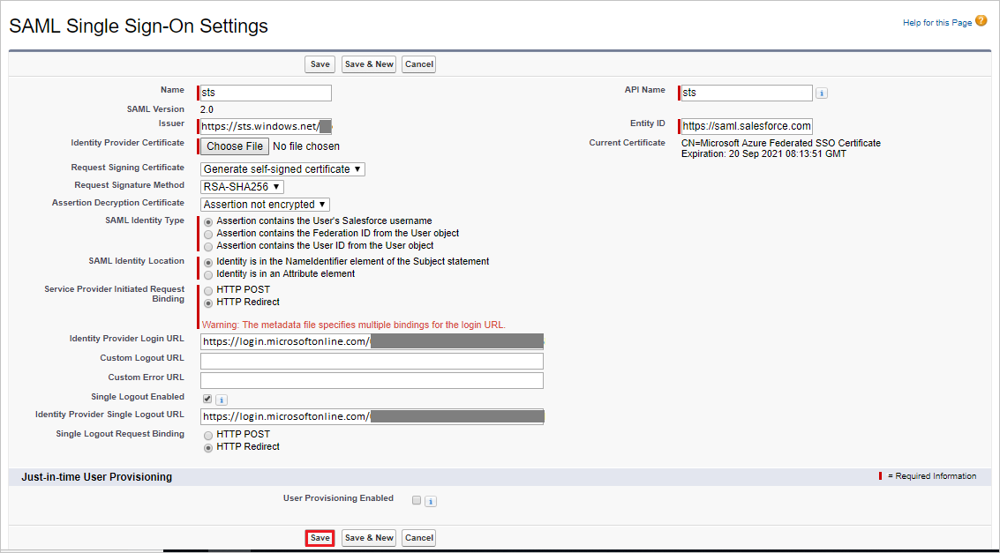
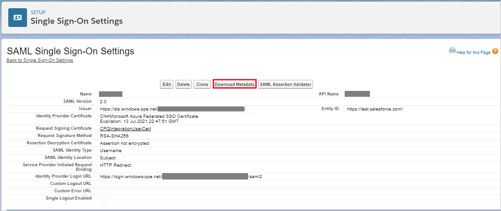
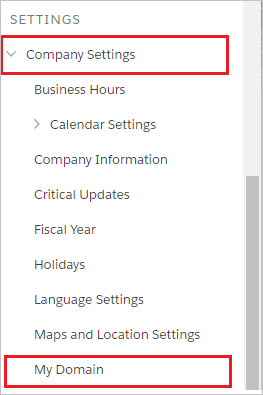
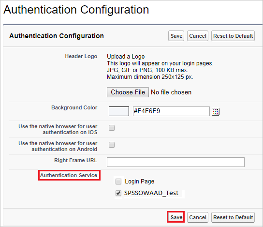

# Tutorial: Azure Active Directory single sign-on (SSO) integration with Salesforce Sandbox

In this tutorial, you'll learn how to integrate Salesforce Sandbox with Azure Active Directory (Azure AD). When you integrate Salesforce Sandbox with Azure AD, you can:

* Control in Azure AD who has access to Salesforce Sandbox.
* Enable your users to be automatically signed-in to Salesforce Sandbox with their Azure AD accounts.
* Manage your accounts in one central location - the Azure portal.

To learn more about SaaS app integration with Azure AD, see [What is application access and single sign-on with Azure Active Directory](../manage-apps/what-is-single-sign-on.md).

## Prerequisites

To get started, you need the following items:

* An Azure AD subscription. If you don't have a subscription, you can get a [free account](https://azure.microsoft.com/free/).
* Salesforce Sandbox single sign-on (SSO) enabled subscription.

## Scenario description

In this tutorial, you configure and test Azure AD single sign-on in a test environment.

* Salesforce Sandbox supports **SP and IDP** initiated SSO
* Salesforce Sandbox supports **Just In Time** user provisioning
* Salesforce Sandbox supports [**Automated** user provisioning](salesforce-sandbox-provisioning-tutorial.md)
* Once you configure the Salesforce Sandbox you can enforce session controls, which protect exfiltration and infiltration of your organization’s sensitive data in real-time. Session controls extend from Conditional Access. [Learn how to enforce session control with Microsoft Cloud App Security](/cloud-app-security/proxy-deployment-aad)

## Adding Salesforce Sandbox from the gallery

To configure the integration of Salesforce Sandbox into Azure AD, you need to add Salesforce Sandbox from the gallery to your list of managed SaaS apps.

1. Sign in to the [Azure portal](https://portal.azure.com) using either a work or school account, or a personal Microsoft account.
1. On the left navigation pane, select the **Azure Active Directory** service.
1. Navigate to **Enterprise Applications** and then select **All Applications**.
1. To add new application, select **New application**.
1. In the **Add from the gallery** section, type **Salesforce Sandbox** in the search box.
1. Select **Salesforce Sandbox** from results panel and then add the app. Wait a few seconds while the app is added to your tenant.

## Configure and test Azure AD single sign-on for Salesforce Sandbox

Configure and test Azure AD SSO with Salesforce Sandbox using a test user called **B.Simon**. For SSO to work, you need to establish a link relationship between an Azure AD user and the related user in Salesforce Sandbox.

To configure and test Azure AD SSO with Salesforce Sandbox, complete the following building blocks:

1. **[Configure Azure AD SSO](#configure-azure-ad-sso)** - to enable your users to use this feature.
    * **[Create an Azure AD test user](#create-an-azure-ad-test-user)** - to test Azure AD single sign-on with B.Simon.
    * **[Assign the Azure AD test user](#assign-the-azure-ad-test-user)** - to enable B.Simon to use Azure AD single sign-on.
1. **[Configure Salesforce Sandbox SSO](#configure-salesforce-sandbox-sso)** - to configure the single sign-on settings on application side.
    * **[Create Salesforce Sandbox test user](#create-salesforce-sandbox-test-user)** - to have a counterpart of B.Simon in Salesforce Sandbox that is linked to the Azure AD representation of user.
1. **[Test SSO](#test-sso)** - to verify whether the configuration works.

## Configure Azure AD SSO

Follow these steps to enable Azure AD SSO in the Azure portal.

1. In the [Azure portal](https://portal.azure.com/), on the **Salesforce Sandbox** application integration page, find the **Manage** section and select **single sign-on**.
1. On the **Select a single sign-on method** page, select **SAML**.
1. On the **Set up single sign-on with SAML** page, click the edit/pen icon for **Basic SAML Configuration** to edit the settings.

   

4. On the **Basic SAML Configuration** section, if you have **Service Provider metadata file** and wish to configure in **IDP** initiated mode perform the following steps:

	a. Click **Upload metadata file**.

    

	b. Click on **folder logo** to select the metadata file and click **Upload**.

	

	> [!NOTE]
    > You will get the service provider metadata file from the Salesforce Sandbox admin portal which is explained later in the tutorial.

	c. After the metadata file is successfully uploaded, the **Reply URL** value will get auto populated in **Reply URL** textbox.

	

	> [!Note]
	> If the **Reply URL** value do not get auto polulated, then fill in the value manually according to your requirement.

5. On the **Set up Single Sign-On with SAML** page, in the **SAML Signing Certificate** section, click **Download** to download the **Metadata XML** from the given options as per your requirement and save it on your computer.

	

6. On the **Set up Salesforce Sandbox** section, copy the appropriate URL(s) as per your requirement.

	

	a. Login URL

	b. Azure AD Identifier

	c. Logout URL

### Create an Azure AD test user

In this section, you'll create a test user in the Azure portal called B.Simon.

1. From the left pane in the Azure portal, select **Azure Active Directory**, select **Users**, and then select **All users**.
1. Select **New user** at the top of the screen.
1. In the **User** properties, follow these steps:
   1. In the **Name** field, enter `B.Simon`.  
   1. In the **User name** field, enter the username@companydomain.extension. For example, `B.Simon@contoso.com`.
   1. Select the **Show password** check box, and then write down the value that's displayed in the **Password** box.
   1. Click **Create**.

### Assign the Azure AD test user

In this section, you'll enable B.Simon to use Azure single sign-on by granting access to Salesforce Sandbox.

1. In the Azure portal, select **Enterprise Applications**, and then select **All applications**.
1. In the applications list, select **Salesforce Sandbox**.
1. In the app's overview page, find the **Manage** section and select **Users and groups**.

   

1. Select **Add user**, then select **Users and groups** in the **Add Assignment** dialog.

	

1. In the **Users and groups** dialog, select **B.Simon** from the Users list, then click the **Select** button at the bottom of the screen.
1. If you're expecting any role value in the SAML assertion, in the **Select Role** dialog, select the appropriate role for the user from the list and then click the **Select** button at the bottom of the screen.
1. In the **Add Assignment** dialog, click the **Assign** button.

## Configure Salesforce Sandbox SSO

1. Open a new tab in your browser and sign in to your Salesforce Sandbox administrator account.

2. Click on the **Setup** under **settings icon** on the top right corner of the page.

    

3. Scroll down to the **SETTINGS** in the left navigation pane, click **Identity** to expand the related section. Then click **Single Sign-On Settings**.

    

4. On the **Single Sign-On Settings** page, click the **Edit** button.

    

5. Select **SAML Enabled**, and then click **Save**.

	

6. To configure your SAML single sign-on settings, click **New from Metadata File**.

	

7. Click **Choose File** to upload the metadata XML file which you have downloaded from the Azure portal and click **Create**.

    

8. On the **SAML Single Sign-On Settings** page, fields populate automatically and click save.

    

9. On the **Single Sign-On Settings** page, click the **Download Metadata** button to download the service provider metadata file. Use this file in the **Basic SAML Configuration** section in the Azure portal for configuring the necessary URLs as explained above.

    

10. If you wish to configure the application in **SP** initiated mode, following are the prerequisites for that:

    a. You should have a verified domain.

    b. You need to configure and enable your domain on Salesforce Sandbox, steps for this are explained later in this tutorial.

    c. In the Azure portal, on the **Basic SAML Configuration** section, click **Set additional URLs** and perform the following step:
  
    

    In the **Sign-on URL** textbox, type the value using the following pattern: `https://<instancename>--Sandbox.<entityid>.my.salesforce.com`

    > [!NOTE]
    > This value should be copied from the Salesforce Sandbox portal once you have enabled the domain.

11. On the **SAML Signing Certificate** section, click **Federation Metadata XML** and then save the xml file on your computer.

	

12. Open a new tab in your browser and sign in to your Salesforce Sandbox administrator account.

13. Click on the **Setup** under **settings icon** on the top right corner of the page.

    

14. Scroll down to the **SETTINGS** in the left navigation pane, click **Identity** to expand the related section. Then click **Single Sign-On Settings**.

    

15. On the **Single Sign-On Settings** page, click the **Edit** button.

    

16. Select **SAML Enabled**, and then click **Save**.

	

17. To configure your SAML single sign-on settings, click **New from Metadata File**.

	

18. Click **Choose File** to upload the metadata XML file and click **Create**.

    

19. On the **SAML Single Sign-On Settings** page, fields populate automatically, type the name of the configuration (for example: *SPSSOWAAD_Test*), in the **Name** textbox and click save.

    

20. To enable your domain on Salesforce Sandbox, perform the following steps:

    > [!NOTE]
    > Before enabling the domain you need to create the same on Salesforce Sandbox. For more information, see [Defining Your Domain Name](https://help.salesforce.com/HTViewHelpDoc?id=domain_name_define.htm&language=en_US). Once the domain is created, please make sure that it's configured correctly.

21. On the left navigation pane in Salesforce Sandbox, click **Company Settings** to expand the related section, and then click **My Domain**.

    

22. In the **Authentication Configuration** section, click **Edit**.

    

23. In the **Authentication Configuration** section, as **Authentication Service**, select the name of the SAML Single Sign-On Setting which you have set during SSO configuration in Salesforce Sandbox and click **Save**.

    

### Create Salesforce Sandbox test user

In this section, a user called Britta Simon is created in Salesforce Sandbox. Salesforce Sandbox supports just-in-time provisioning, which is enabled by default. There is no action item for you in this section. If a user doesn't already exist in Salesforce Sandbox, a new one is created when you attempt to access Salesforce Sandbox. Salesforce Sandbox also supports automatic user provisioning, you can find more details [here](salesforce-sandbox-provisioning-tutorial.md) on how to configure automatic user provisioning.

## Test SSO 

In this section, you test your Azure AD single sign-on configuration using the Access Panel.

When you click the Salesforce Sandbox tile in the Access Panel, you should be automatically signed in to the Salesforce Sandbox for which you set up SSO. For more information about the Access Panel, see [Introduction to the Access Panel](../user-help/my-apps-portal-end-user-access.md).

## Additional resources

- [ List of Tutorials on How to Integrate SaaS Apps with Azure Active Directory ](./tutorial-list.md)

- [What is application access and single sign-on with Azure Active Directory? ](../manage-apps/what-is-single-sign-on.md)

- [What is conditional access in Azure Active Directory?](../conditional-access/overview.md)

- [Try Salesforce Sandbox with Azure AD](https://aad.portal.azure.com/)

- [What is session control in Microsoft Cloud App Security?](/cloud-app-security/protect-salesforce)

- [Configure User Provisioning](salesforce-sandbox-provisioning-tutorial.md)

- [How to protect Salesforce Sandbox with advanced visibility and controls](/cloud-app-security/proxy-intro-aad)