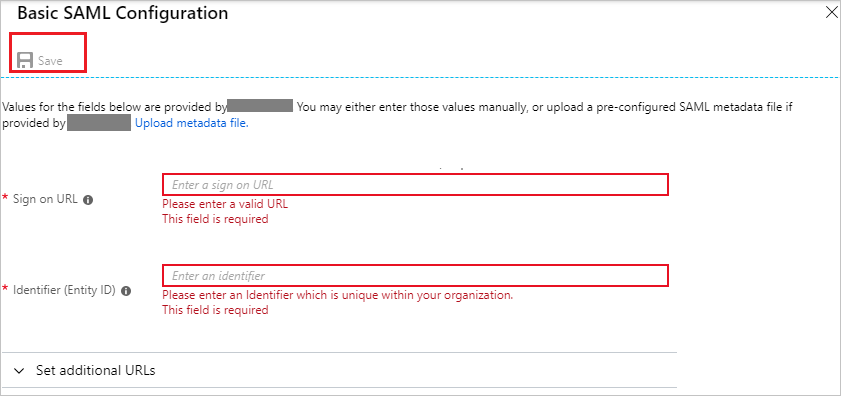
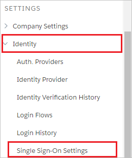
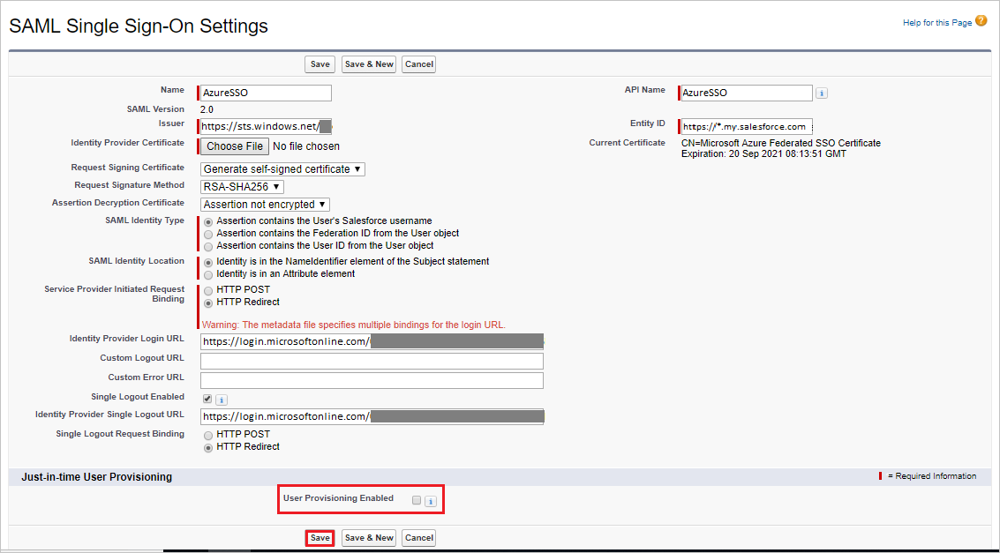
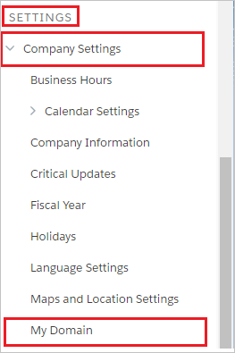
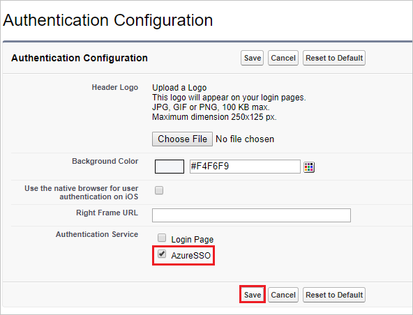

# Tutorial: Azure Active Directory integration with Salesforce

In this tutorial, you learn how to integrate Salesforce with Azure Active Directory (Azure AD).
Integrating Salesforce with Azure AD provides you with the following benefits:

* You can control in Azure AD who has access to Salesforce.
* You can enable your users to be automatically signed-in to Salesforce (Single Sign-On) with their Azure AD accounts.
* You can manage your accounts in one central location - the Azure portal.

If you want to know more details about SaaS app integration with Azure AD, see [What is application access and single sign-on with Azure Active Directory](https://docs.microsoft.com/azure/active-directory/active-directory-appssoaccess-whatis).
If you don't have an Azure subscription, [create a free account](https://azure.microsoft.com/free/) before you begin.

## Prerequisites

To configure Azure AD integration with Salesforce, you need the following items:

* An Azure AD subscription. If you don't have an Azure AD environment, you can get one-month trial [here](https://azure.microsoft.com/pricing/free-trial/)
* Salesforce single sign-on enabled subscription

## Scenario description

In this tutorial, you configure and test Azure AD single sign-on in a test environment.

* Salesforce supports **SP** initiated SSO

* Salesforce supports **Just In Time** user provisioning

* Salesforce supports [**Automated** user provisioning](salesforce-provisioning-tutorial.md)

## Adding Salesforce from the gallery

To configure the integration of Salesforce into Azure AD, you need to add Salesforce from the gallery to your list of managed SaaS apps.

**To add Salesforce from the gallery, perform the following steps:**

1. In the **[Azure portal](https://portal.azure.com)**, on the left navigation panel, click the **Azure Active Directory** icon.

	

2. Navigate to **Enterprise Applications** and then select the **All Applications** option.

	

3. To add a new application, click the **New application** button at the top of the dialog.

	

4. In the search box, type **Salesforce**, select **Salesforce** from the result panel then click the **Add** button to add the application.

	

## Configure and test Azure AD single sign-on

In this section, you configure and test Azure AD single sign-on with Salesforce based on a test user called **Britta Simon**.
For single sign-on to work, a link relationship between an Azure AD user and the related user in Salesforce needs to be established.

To configure and test Azure AD single sign-on with Salesforce, you need to complete the following building blocks:

1. **[Configure Azure AD Single Sign-On](#configure-azure-ad-single-sign-on)** - to enable your users to use this feature.
2. **[Configure Salesforce Single Sign-On](#configure-salesforce-single-sign-on)** - to configure the Single Sign-On settings on application side.
3. **[Create an Azure AD test user](#create-an-azure-ad-test-user)** - to test Azure AD single sign-on with Britta Simon.
4. **[Assign the Azure AD test user](#assign-the-azure-ad-test-user)** - to enable Britta Simon to use Azure AD single sign-on.
5. **[Create Salesforce test user](#create-salesforce-test-user)** - to have a counterpart of Britta Simon in Salesforce that is linked to the Azure AD representation of user.
6. **[Test single sign-on](#test-single-sign-on)** - to verify whether the configuration works.

### Configure Azure AD single sign-on

In this section, you enable Azure AD single sign-on in the Azure portal.

To configure Azure AD single sign-on with Salesforce, perform the following steps:

1. In the [Azure portal](https://portal.azure.com/), on the **Salesforce** application integration page, select **Single sign-on**.

    

2. On the **Select a Single sign-on method** dialog, select **SAML/WS-Fed** mode to enable single sign-on.

    

3. On the **Set up Single Sign-On with SAML** page, click the **Edit** icon to open the **Basic SAML Configuration** dialog.

	

4. On the **Basic SAML Configuration** section, perform the following steps:

    

	a. In the **Sign-on URL** textbox, type the value using the following pattern:

    Enterprise account: `https://<subdomain>.my.salesforce.com`

    Developer account: `https://<subdomain>-dev-ed.my.salesforce.com`

    b. In the **Identifier** textbox, type the value using the following pattern:

    Enterprise account: `https://<subdomain>.my.salesforce.com`

    Developer account: `https://<subdomain>-dev-ed.my.salesforce.com`

    > [!NOTE]
	> These values are not real. Update these values with the actual Sign-on URL and Identifier. Contact [Salesforce Client support team](https://help.salesforce.com/support) to get these values.

5. On the **Set up Single Sign-On with SAML** page, in the **SAML Signing Certificate** section, click **Download** to download the **Federation Metadata XML** from the given options as per your requirement and save it on your computer.

	

6. On the **Set up Salesforce** section, copy the appropriate URL(s) as per your requirement.

	

	a. Login URL

	b. Azure AD Identifier

	c. Logout URL

### Configure Salesforce Single Sign-On

1. Open a new tab in your browser and sign in to your Salesforce administrator account.

2. Click on the **Setup** under **settings icon** on the top right corner of the page.

	

3. Scroll down to the **SETTINGS** in the navigation pane, click **Identity** to expand the related section. Then click **Single Sign-On Settings**.

    

4. On the **Single Sign-On Settings** page, click the **Edit** button.

    

    > [!NOTE]
    > If you are unable to enable Single Sign-On settings for your Salesforce account, you may need to contact [Salesforce Client support team](https://help.salesforce.com/support).

5. Select **SAML Enabled**, and then click **Save**.

      

6. To configure your SAML single sign-on settings, click **New from Metadata File**.

    

7. Click **Choose File** to upload the metadata XML file which you have downloaded from the Azure portal and click **Create**.

    

8. On the **SAML Single Sign-On Settings** page, fields populate automatically and click save.

    

9. On the left navigation pane in Salesforce, click **Company Settings** to expand the related section, and then click **My Domain**.

    

10. Scroll down to the **Authentication Configuration** section, and click the **Edit** button.

    

11. In the **Authentication Configuration** section, Check the **AzureSSO** as **Authentication Service** of your SAML SSO configuration, and then click **Save**.

    

    > [!NOTE]
    > If more than one authentication service is selected, users are prompted to select which authentication service they like to sign in with while initiating single sign-on to your Salesforce environment. If you don’t want it to happen, then you should **leave all other authentication services unchecked**.

### Create an Azure AD test user

The objective of this section is to create a test user in the Azure portal called Britta Simon.

1. In the Azure portal, in the left pane, select **Azure Active Directory**, select **Users**, and then select **All users**.

    

2. Select **New user** at the top of the screen.

    

3. In the User properties, perform the following steps.

    

    a. In the **Name** field enter **BrittaSimon**.
  
    b. In the **User name** field type `brittasimon\@yourcompanydomain.extension`. For example, BrittaSimon@contoso.com.

    c. Select **Show password** check box, and then write down the value that's displayed in the Password box.

    d. Click **Create**.

### Assign the Azure AD test user

In this section, you enable Britta Simon to use Azure single sign-on by granting access to Salesforce.

1. In the Azure portal, select **Enterprise Applications**, select **All applications**, then select **Salesforce**.

	

2. In the applications list, select **Salesforce**.

	

3. In the menu on the left, select **Users and groups**.

    

4. Click the **Add user** button, then select **Users and groups** in the **Add Assignment** dialog.

    

5. In the **Users and groups** dialog select **Britta Simon** in the Users list, then click the **Select** button at the bottom of the screen.

6. If you are expecting any role value in the SAML assertion then in the **Select Role** dialog select the appropriate role for the user from the list, then click the **Select** button at the bottom of the screen.

7. In the **Add Assignment** dialog click the **Assign** button.

### Create Salesforce test user

In this section, a user called Britta Simon is created in Salesforce. Salesforce supports just-in-time provisioning, which is enabled by default. There is no action item for you in this section. If a user doesn't already exist in Salesforce, a new one is created when you attempt to access Salesforce. Salesforce also supports automatic user provisioning, you can find more details [here](salesforce-provisioning-tutorial.md) on how to configure automatic user provisioning.

### Test single sign-on

In this section, you test your Azure AD single sign-on configuration using the Access Panel.

When you click the Salesforce tile in the Access Panel, you should be automatically signed in to the Salesforce for which you set up SSO. For more information about the Access Panel, see [Introduction to the Access Panel](https://docs.microsoft.com/azure/active-directory/active-directory-saas-access-panel-introduction).

## Additional resources

- [List of Tutorials on How to Integrate SaaS Apps with Azure Active Directory](https://docs.microsoft.com/azure/active-directory/active-directory-saas-tutorial-list)

- [What is application access and single sign-on with Azure Active Directory?](https://docs.microsoft.com/azure/active-directory/active-directory-appssoaccess-whatis)

- [What is Conditional Access in Azure Active Directory?](https://docs.microsoft.com/azure/active-directory/conditional-access/overview)

- [Configure User Provisioning](salesforce-provisioning-tutorial.md)
