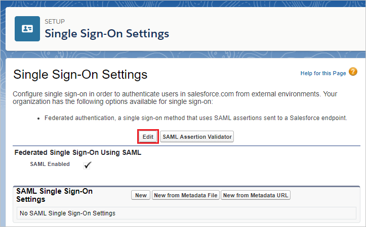
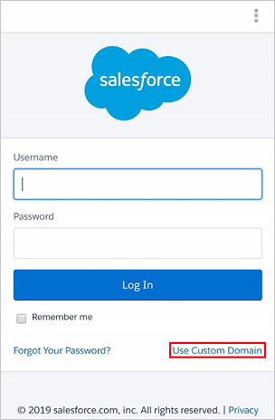
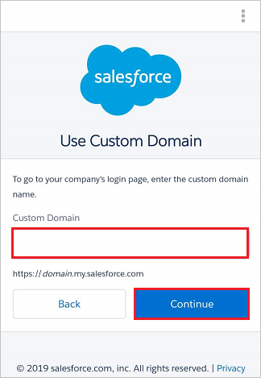
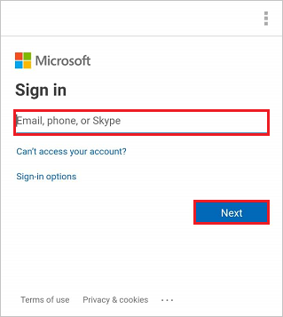
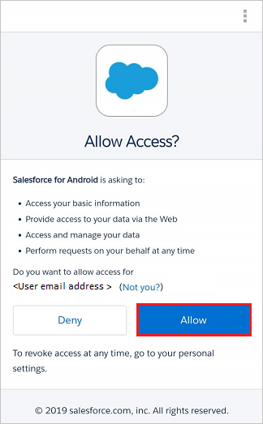
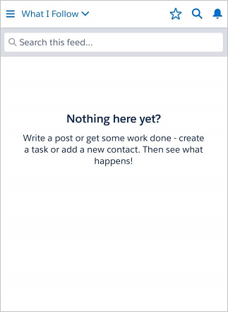
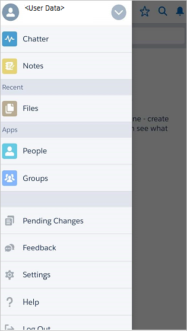

# Tutorial: Azure Active Directory single sign-on (SSO) integration with Salesforce

In this tutorial, you'll learn how to integrate Salesforce with Azure Active Directory (Azure AD). When you integrate Salesforce with Azure AD, you can:

* Control in Azure AD who has access to Salesforce.
* Enable your users to be automatically signed-in to Salesforce with their Azure AD accounts.
* Manage your accounts in one central location - the Azure portal.

To learn more about SaaS app integration with Azure AD, see [What is application access and single sign-on with Azure Active Directory](https://docs.microsoft.com/azure/active-directory/active-directory-appssoaccess-whatis).

## Prerequisites

To get started, you need the following items:

* An Azure AD subscription. If you don't have a subscription, you can get a [free account](https://azure.microsoft.com/free/).
* Salesforce single sign-on (SSO) enabled subscription.

## Scenario description

In this tutorial, you configure and test Azure AD SSO in a test environment.

* Salesforce supports **SP** initiated SSO

* Salesforce supports [**Automated** user provisioning and deprovisioning](salesforce-provisioning-tutorial.md) (recommended)

* Salesforce supports **Just In Time** user provisioning

* Salesforce Mobile application can now be configured with Azure AD for enabling SSO. In this tutorial, you configure and test Azure AD SSO in a test environment.
* Once you configure Salesforce you can enforce Session Control, which protect exfiltration and infiltration of your organization’s sensitive data in real-time. Session Control extend from Conditional Access. [Learn how to enforce session control with Microsoft Cloud App Security](https://docs.microsoft.com/cloud-app-security/proxy-deployment-aad)

## Adding Salesforce from the gallery

To configure the integration of Salesforce into Azure AD, you need to add Salesforce from the gallery to your list of managed SaaS apps.

1. Sign in to the [Azure portal](https://portal.azure.com) using either a work or school account, or a personal Microsoft account.
1. On the left navigation pane, select the **Azure Active Directory** service.
1. Navigate to **Enterprise Applications** and then select **All Applications**.
1. To add new application, select **New application**.
1. In the **Add from the gallery** section, type **Salesforce** in the search box.
1. Select **Salesforce** from results panel and then add the app. Wait a few seconds while the app is added to your tenant.

## Configure and test Azure AD single sign-on for Salesforce

Configure and test Azure AD SSO with Salesforce using a test user called **B.Simon**. For SSO to work, you need to establish a link relationship between an Azure AD user and the related user in Salesforce.

To configure and test Azure AD SSO with Salesforce, complete the following building blocks:

1. **[Configure Azure AD SSO](#configure-azure-ad-sso)** - to enable your users to use this feature.
    * **[Create an Azure AD test user](#create-an-azure-ad-test-user)** - to test Azure AD single sign-on with B.Simon.
    * **[Assign the Azure AD test user](#assign-the-azure-ad-test-user)** - to enable B.Simon to use Azure AD single sign-on.
1. **[Configure Salesforce SSO](#configure-salesforce-sso)** - to configure the single sign-on settings on application side.
    * **[Create Salesforce test user](#create-salesforce-test-user)** - to have a counterpart of B.Simon in Salesforce that is linked to the Azure AD representation of user.
1. **[Test SSO](#test-sso)** - to verify whether the configuration works.

## Configure Azure AD SSO

Follow these steps to enable Azure AD SSO in the Azure portal.

1. In the [Azure portal](https://portal.azure.com/), on the **Salesforce** application integration page, find the **Manage** section and select **single sign-on**.
1. On the **Select a single sign-on method** page, select **SAML**.
1. On the **Set up single sign-on with SAML** page, click the edit/pen icon for **Basic SAML Configuration** to edit the settings.

   

1. On the **Basic SAML Configuration** section, enter the values for the following fields:

	a. In the **Sign-on URL** textbox, type the value using the following pattern:

    Enterprise account: `https://<subdomain>.my.salesforce.com`

    Developer account: `https://<subdomain>-dev-ed.my.salesforce.com`
    
    b. In the **Reply URL** textbox, type the value using the following pattern:

    Enterprise account: `https://<subdomain>.my.salesforce.com`

    Developer account: `https://<subdomain>-dev-ed.my.salesforce.com`

    c. In the **Identifier** textbox, type the value using the following pattern:

    Enterprise account: `https://<subdomain>.my.salesforce.com`

    Developer account: `https://<subdomain>-dev-ed.my.salesforce.com`

    > [!NOTE]
	> These values are not real. Update these values with the actual Sign-on URL and Identifier. Contact [Salesforce Client support team](https://help.salesforce.com/support) to get these values.

1. On the **Set up single sign-on with SAML** page, in the **SAML Signing Certificate** section,  find **Federation Metadata XML** and select **Download** to download the certificate and save it on your computer.

	

1. On the **Set up Salesforce** section, copy the appropriate URL(s) based on your requirement.

	

### Create an Azure AD test user

In this section, you'll create a test user in the Azure portal called B.Simon.

1. From the left pane in the Azure portal, select **Azure Active Directory**, select **Users**, and then select **All users**.
1. Select **New user** at the top of the screen.
1. In the **User** properties, follow these steps:
   1. In the **Name** field, enter `B.Simon`.  
   1. In the **User name** field, enter the username@companydomain.extension. For example, `B.Simon@contoso.com`.
   1. Select the **Show password** check box, and then write down the value that's displayed in the **Password** box.
   1. Click **Create**.

### Assign the Azure AD test user

In this section, you'll enable B.Simon to use Azure single sign-on by granting access to Salesforce.

1. In the Azure portal, select **Enterprise Applications**, and then select **All applications**.
1. In the applications list, select **Salesforce**.
1. In the app's overview page, find the **Manage** section and select **Users and groups**.

   

1. Select **Add user**, then select **Users and groups** in the **Add Assignment** dialog.

	

1. In the **Users and groups** dialog, select **B.Simon** from the Users list, then click the **Select** button at the bottom of the screen.
1. If you're expecting any role value in the SAML assertion, in the **Select Role** dialog, select the appropriate role for the user from the list and then click the **Select** button at the bottom of the screen.
1. In the **Add Assignment** dialog, click the **Assign** button.

## Configure Salesforce SSO

1. To automate the configuration within Salesforce, you need to install **My Apps Secure Sign-in browser extension** by clicking **Install the extension**.

	

1. After adding extension to the browser, click on **Set up Salesforce** will direct you to the Salesforce Single Sign-On application. From there, provide the admin credentials to sign into Salesforce Single Sign-On. The browser extension will automatically configure the application for you and automate steps 3-13.

	

1. If you want to setup Salesforce manually, open a new web browser window and sign into your Salesforce company site as an administrator and perform the following steps:

1. Click on the **Setup** under **settings icon** on the top right corner of the page.

	

1. Scroll down to the **SETTINGS** in the navigation pane, click **Identity** to expand the related section. Then click **Single Sign-On Settings**.

    

1. On the **Single Sign-On Settings** page, click the **Edit** button.

    

    > [!NOTE]
    > If you are unable to enable Single Sign-On settings for your Salesforce account, you may need to contact [Salesforce Client support team](https://help.salesforce.com/support).

1. Select **SAML Enabled**, and then click **Save**.

    

1. To configure your SAML single sign-on settings, click **New from Metadata File**.

    

1. Click **Choose File** to upload the metadata XML file which you have downloaded from the Azure portal and click **Create**.

    

1. On the **SAML Single Sign-On Settings** page, fields populate automatically, select the **User Provisioning Enabled** and then click **Save**.

    

1. On the left navigation pane in Salesforce, click **Company Settings** to expand the related section, and then click **My Domain**.

    

1. Scroll down to the **Authentication Configuration** section, and click the **Edit** button.

    

1. In the **Authentication Configuration** section, Check the **AzureSSO** as **Authentication Service** of your SAML SSO configuration, and then click **Save**.

    

    > [!NOTE]
    > If more than one authentication service is selected, users are prompted to select which authentication service they like to sign in with while initiating single sign-on to your Salesforce environment. If you don’t want it to happen, then you should **leave all other authentication services unchecked**.

### Create Salesforce test user

In this section, a user called B.Simon is created in Salesforce. Salesforce supports just-in-time provisioning, which is enabled by default. There is no action item for you in this section. If a user doesn't already exist in Salesforce, a new one is created when you attempt to access Salesforce. Salesforce also supports automatic user provisioning, you can find more details [here](salesforce-provisioning-tutorial.md) on how to configure automatic user provisioning.

## Test SSO

In this section, you test your Azure AD single sign-on configuration using the Access Panel.

When you click the Salesforce tile in the Access Panel, you should be automatically signed in to the Salesforce for which you set up SSO. For more information about the Access Panel, see [Introduction to the Access Panel](https://docs.microsoft.com/azure/active-directory/active-directory-saas-access-panel-introduction).

## Test SSO for Salesforce (Mobile)

1. Open Salesforce mobile application. On the sign in page, click on **Use Custom Domain**.

    

1. In the **Custom Domain** textbox, enter your registered custom domain name and click **Continue**.

    

1. Enter your Azure AD credentials to sign in into the Salesforce application and click **Next**.

    

1. On the **Allow Access** page as shown below, click **Allow** to give access to the Salesforce application.

    

1. Finally after successful sign in, the application homepage will be displayed.

    
    

## Additional resources

- [List of Tutorials on How to Integrate SaaS Apps with Azure Active Directory](https://docs.microsoft.com/azure/active-directory/active-directory-saas-tutorial-list)

- [What is application access and single sign-on with Azure Active Directory?](https://docs.microsoft.com/azure/active-directory/active-directory-appssoaccess-whatis)

- [What is Conditional Access in Azure Active Directory?](https://docs.microsoft.com/azure/active-directory/conditional-access/overview)

- [Configure User Provisioning](salesforce-provisioning-tutorial.md)

- [Try Salesforce with Azure AD](https://aad.portal.azure.com)

- [What is session control in Microsoft Cloud App Security?](https://docs.microsoft.com/cloud-app-security/proxy-intro-aad)

- [How to protect Salesforce with advanced visibility and controls](https://docs.microsoft.com/cloud-app-security/protect-salesforce)
