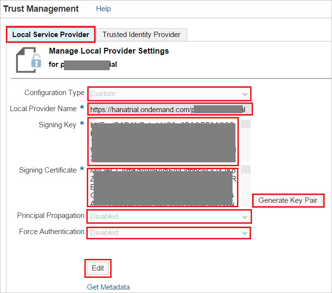
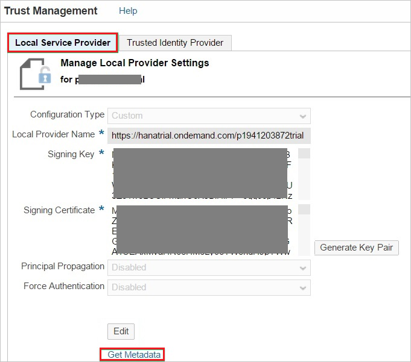
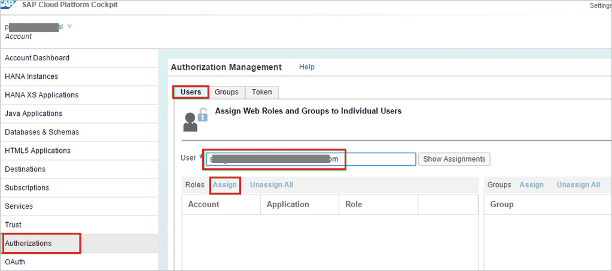

# Tutorial: Azure Active Directory integration with SAP Cloud Platform

In this tutorial, you'll learn how to integrate SAP Cloud Platform with Azure Active Directory (Azure AD). When you integrate SAP Cloud Platform with Azure AD, you can:

* Control in Azure AD who has access to SAP Cloud Platform.
* Enable your users to be automatically signed-in to SAP Cloud Platform with their Azure AD accounts.
* Manage your accounts in one central location - the Azure portal.

## Prerequisites

To configure Azure AD integration with SAP Cloud Platform, you need the following items:

* An Azure AD subscription. If you don't have an Azure AD environment, you can get one-month trial [here](https://azure.microsoft.com/pricing/free-trial/)
* SAP Cloud Platform single sign-on enabled subscription

After completing this tutorial, the Azure AD users you have assigned to SAP Cloud Platform will be able to single sign into the application using the [Introduction to the Access Panel](../user-help/my-apps-portal-end-user-access.md).

>[!IMPORTANT]
>You need to deploy your own application or subscribe to an application on your SAP Cloud Platform account to test single sign on. In this tutorial, an application is deployed in the account.
> 

## Scenario description

In this tutorial, you configure and test Azure AD single sign-on in a test environment.

* SAP Cloud Platform supports **SP** initiated SSO

## Adding SAP Cloud Platform from the gallery

To configure the integration of SAP Cloud Platform into Azure AD, you need to add SAP Cloud Platform from the gallery to your list of managed SaaS apps.

1. Sign in to the Azure portal using either a work or school account, or a personal Microsoft account.
1. On the left navigation pane, select the **Azure Active Directory** service.
1. Navigate to **Enterprise Applications** and then select **All Applications**.
1. To add new application, select **New application**.
1. In the **Add from the gallery** section, type **SAP Cloud Platform** in the search box.
1. Select **SAP Cloud Platform** from results panel and then add the app. Wait a few seconds while the app is added to your tenant.

## Configure and test Azure AD SSO for SAP Cloud Platform

Configure and test Azure AD SSO with SAP Cloud Platform using a test user called **B.Simon**. For SSO to work, you need to establish a link relationship between an Azure AD user and the related user in SAP Cloud Platform.

To configure and test Azure AD SSO with SAP Cloud Platform, perform the following steps:

1. **[Configure Azure AD SSO](#configure-azure-ad-sso)** - to enable your users to use this feature.
    1. **[Create an Azure AD test user](#create-an-azure-ad-test-user)** - to test Azure AD single sign-on with Britta Simon.
    1. **[Assign the Azure AD test user](#assign-the-azure-ad-test-user)** - to enable Britta Simon to use Azure AD single sign-on.
2. **[Configure SAP Cloud Platform SSO](#configure-sap-cloud-platform-sso)** - to configure the Single Sign-On settings on application side.
    1. **[Create SAP Cloud Platform test user](#create-sap-cloud-platform-test-user)** - to have a counterpart of Britta Simon in SAP Cloud Platform that is linked to the Azure AD representation of user.
1. **[Test SSO](#test-sso)** - to verify whether the configuration works.

### Configure Azure AD SSO

Follow these steps to enable Azure AD SSO in the Azure portal.

1. In the Azure portal, on the **SAP Cloud Platform** application integration page, find the **Manage** section and select **single sign-on**.
1. On the **Select a single sign-on method** page, select **SAML**.
1. On the **Set up single sign-on with SAML** page, click the pencil icon for **Basic SAML Configuration** to edit the settings.

   

1. On the **Basic SAML Configuration** section, enter the values for the following fields:

    

    a. In the **Sign On URL** textbox, type the URL used by your users to sign into your **SAP Cloud Platform** application. This is the account-specific URL of a protected resource in your SAP Cloud Platform application. The URL is based on the following pattern: `https://<applicationName><accountName>.<landscape host>.ondemand.com/<path_to_protected_resource>`
      
    >[!NOTE]
    >This is the URL in your SAP Cloud Platform application that requires the user to authenticate.
    > 

    - `https://<subdomain>.hanatrial.ondemand.com/<instancename>`
    - `https://<subdomain>.hana.ondemand.com/<instancename>`

	b. In the **Identifier** textbox you will provide your SAP Cloud Platform's type a URL using one of the following patterns: 

    - `https://hanatrial.ondemand.com/<instancename>`
    - `https://hana.ondemand.com/<instancename>`
    - `https://us1.hana.ondemand.com/<instancename>`
    - `https://ap1.hana.ondemand.com/<instancename>`

	c. In the **Reply URL** textbox, type a URL using the following pattern:

    - `https://<subdomain>.hanatrial.ondemand.com/<instancename>`
    - `https://<subdomain>.hana.ondemand.com/<instancename>`
    - `https://<subdomain>.us1.hana.ondemand.com/<instancename>`
    - `https://<subdomain>.dispatcher.us1.hana.ondemand.com/<instancename>`
    - `https://<subdomain>.ap1.hana.ondemand.com/<instancename>`
    - `https://<subdomain>.dispatcher.ap1.hana.ondemand.com/<instancename>`
    - `https://<subdomain>.dispatcher.hana.ondemand.com/<instancename>`

	> [!NOTE] 
	> These values are not real. Update these values with the actual Sign-On URL, Identifier, and Reply URL. Contact [SAP Cloud Platform Client support team](https://help.sap.com/viewer/65de2977205c403bbc107264b8eccf4b/Cloud/5dd739823b824b539eee47b7860a00be.html) to get Sign-On URL and Identifier. Reply URL you can get from trust management section which is explained later in the tutorial.
	> 
4. On the **Set up Single Sign-On with SAML** page, in the **SAML Signing Certificate** section, click **Download** to download the **Federation Metadata XML** from the given options as per your requirement and save it on your computer.

	

### Create an Azure AD test user

In this section, you'll create a test user in the Azure portal called B.Simon.

1. From the left pane in the Azure portal, select **Azure Active Directory**, select **Users**, and then select **All users**.
1. Select **New user** at the top of the screen.
1. In the **User** properties, follow these steps:
   1. In the **Name** field, enter `B.Simon`.  
   1. In the **User name** field, enter the username@companydomain.extension. For example, `B.Simon@contoso.com`.
   1. Select the **Show password** check box, and then write down the value that's displayed in the **Password** box.
   1. Click **Create**.

### Assign the Azure AD test user

In this section, you'll enable B.Simon to use Azure single sign-on by granting access to SAP Cloud Platform.

1. In the Azure portal, select **Enterprise Applications**, and then select **All applications**.
1. In the applications list, select **SAP Cloud Platform**.
1. In the app's overview page, find the **Manage** section and select **Users and groups**.
1. Select **Add user**, then select **Users and groups** in the **Add Assignment** dialog.
1. In the **Users and groups** dialog, select **B.Simon** from the Users list, then click the **Select** button at the bottom of the screen.
1. If you are expecting a role to be assigned to the users, you can select it from the **Select a role** dropdown. If no role has been set up for this app, you see "Default Access" role selected.
1. In the **Add Assignment** dialog, click the **Assign** button.

## Configure SAP Cloud Platform SSO

1. In a different web browser window, sign on to the SAP Cloud Platform Cockpit at `https://account.<landscape host>.ondemand.com/cockpit`(for example: https://account.hanatrial.ondemand.com/cockpit).

2. Click the **Trust** tab.
   
    

3. In the Trust Management section, under **Local Service Provider**, perform the following steps:

    
   
    a. Click **Edit**.

    b. As **Configuration Type**, select **Custom**.

    c. As **Local Provider Name**, leave the default value. Copy this value and paste it into the **Identifier** field in the Azure AD configuration for SAP Cloud Platform.

    d. To generate a **Signing Key** and a **Signing Certificate** key pair, click **Generate Key Pair**.

    e. As **Principal Propagation**, select **Disabled**.

    f. As **Force Authentication**, select **Disabled**.

    g. Click **Save**.

4. After saving the **Local Service Provider** settings, perform the following to obtain the Reply URL:
   
    

    a. Download the SAP Cloud Platform metadata file by clicking **Get Metadata**.

    b. Open the downloaded SAP Cloud Platform metadata XML file, and then locate the **ns3:AssertionConsumerService** tag.
 
    c. Copy the value of the **Location** attribute, and then paste it into the **Reply URL** field in the Azure AD configuration for SAP Cloud Platform.

5. Click the **Trusted Identity Provider** tab, and then click **Add Trusted Identity Provider**.
   
    
   
    >[!NOTE]
    >To manage the list of trusted identity providers, you need to have chosen the Custom configuration type in the Local Service Provider section. For Default configuration type, you have a non-editable and implicit trust to the SAP ID Service. For None, you don't have any trust settings.
    > 
    > 

6. Click the **General** tab, and then click **Browse** to upload the downloaded metadata file.
    
    
    
    >[!NOTE]
    >After uploading the metadata file, the values for **Single Sign-on URL**, **Single Logout URL**, and **Signing Certificate** are populated automatically.
    > 
     
7. Click the **Attributes** tab.

8. On the **Attributes** tab, perform the following step:
    
     

    a. Click **Add Assertion-Based Attribute**, and then add the following assertion-based attributes:
       
    | Assertion Attribute | Principal Attribute |
    | --- | --- |
    | `http://schemas.xmlsoap.org/ws/2005/05/identity/claims/givenname` |firstname |
    | `http://schemas.xmlsoap.org/ws/2005/05/identity/claims/surname` |lastname |
    | `http://schemas.xmlsoap.org/ws/2005/05/identity/claims/emailaddress` |email |
   
     >[!NOTE]
     >The configuration of the Attributes depends on how the application(s) on SCP are developed, that is, which attribute(s) they expect in the SAML response and under which name (Principal Attribute) they access this attribute in the code.
     > 
    
    b. The **Default Attribute** in the screenshot is just for illustration purposes. It is not required to make the scenario work.  
 
    c. The names and values for **Principal Attribute** shown in the screenshot depend on how the application is developed. It is possible that your application requires different mappings.

### Assertion-based groups

As an optional step, you can configure assertion-based groups for your Azure Active Directory Identity Provider.

Using groups on SAP Cloud Platform allows you to dynamically assign one or more users to one or more roles in your SAP Cloud Platform applications, determined by values of attributes in the SAML 2.0 assertion. 

For example, if the assertion contains the attribute "*contract=temporary*", you may want all affected users to be added to the group "*TEMPORARY*". The group "*TEMPORARY*" may contain one or more roles from one or more applications deployed in your SAP Cloud Platform account.
 
Use assertion-based groups when you want to simultaneously assign many users to one or more roles of applications in your SAP Cloud Platform account. If you want to assign only a single or small number of users to specific roles, we recommend assigning them directly in the “**Authorizations**” tab of the SAP Cloud Platform cockpit.

### Create SAP Cloud Platform test user

In order to enable Azure AD users to log in to SAP Cloud Platform, you must assign roles in the SAP Cloud Platform to them.

**To assign a role to a user, perform the following steps:**

1. Log in to your **SAP Cloud Platform** cockpit.

2. Perform the following:
   
    
   
    a. Click **Authorization**.

    b. Click the **Users** tab.

    c. In the **User** textbox, type the user’s email address.

    d. Click **Assign** to assign the user to a role.

    e. Click **Save**.

## Test SSO 

In this section, you test your Azure AD single sign-on configuration with following options. 

* Click on **Test this application** in Azure portal. This will redirect to SAP Cloud Platform Sign-on URL where you can initiate the login flow. 

* Go to SAP Cloud Platform Sign-on URL directly and initiate the login flow from there.

* You can use Microsoft My Apps. When you click the SAP Cloud Platform tile in the My Apps, you should be automatically signed in to the SAP Cloud Platform for which you set up the SSO. For more information about the My Apps, see [Introduction to the My Apps](../user-help/my-apps-portal-end-user-access.md).

## Next steps

Once you configure SAP Cloud Platform you can enforce session control, which protects exfiltration and infiltration of your organization’s sensitive data in real time. Session control extends from Conditional Access. [Learn how to enforce session control with Microsoft Cloud App Security](/cloud-app-security/proxy-deployment-any-app).