# Tutorial: Azure Active Directory Single sign-on (SSO) integration with SAP NetWeaver

In this tutorial, you'll learn how to integrate SAP NetWeaver with Azure Active Directory (Azure AD). When you integrate SAP NetWeaver with Azure AD, you can:

* Control in Azure AD who has access to SAP NetWeaver.
* Enable your users to be automatically signed-in to SAP NetWeaver with their Azure AD accounts.
* Manage your accounts in one central location - the Azure portal.

## Prerequisites

To get started, you need the following items:

* An Azure AD subscription. If you don't have a subscription, you can get a [free account](https://azure.microsoft.com/free/).
* SAP NetWeaver single sign-on (SSO) enabled subscription.
* SAP NetWeaver V7.20 required atleast

## Scenario description

* SAP NetWeaver supports both **SAML** (**SP initiated SSO**) and **OAuth**. In this tutorial, you configure and test Azure AD SSO in a test environment. 

> [!NOTE]
> Identifier of this application is a fixed string value so only one instance can be configured in one tenant.

> [!NOTE]
> Configure the application either in SAML or in OAuth as per your organizational requirement. 

## Adding SAP NetWeaver from the gallery

To configure the integration of SAP NetWeaver into Azure AD, you need to add SAP NetWeaver from the gallery to your list of managed SaaS apps.

1. Sign in to the Azure portal using either a work or school account, or a personal Microsoft account.
1. On the left navigation pane, select the **Azure Active Directory** service.
1. Navigate to **Enterprise Applications** and then select **All Applications**.
1. To add new application, select **New application**.
1. In the **Add from the gallery** section, type **SAP NetWeaver** in the search box.
1. Select **SAP NetWeaver** from results panel and then add the app. Wait a few seconds while the app is added to your tenant.

## Configure and test Azure AD SSO for SAP NetWeaver

Configure and test Azure AD SSO with SAP NetWeaver using a test user called **B.Simon**. For SSO to work, you need to establish a link relationship between an Azure AD user and the related user in SAP NetWeaver.

To configure and test Azure AD SSO with SAP NetWeaver, perform the following steps:

1. **[Configure Azure AD SSO](#configure-azure-ad-sso)** to enable your users to use this feature.
	1. **[Create an Azure AD test user](#create-an-azure-ad-test-user)** to test Azure AD single sign-on with B.Simon.
	1. **[Assign the Azure AD test user](#assign-the-azure-ad-test-user)** to enable B.Simon to use Azure AD single sign-on.
1. **[Configure SAP NetWeaver using SAML](#configure-sap-netweaver-using-saml)** to configure the SSO settings on application side.
	1. **[Create SAP NetWeaver test user](#create-sap-netweaver-test-user)** to have a counterpart of B.Simon in SAP NetWeaver that is linked to the Azure AD representation of user.
1. **[Test SSO](#test-sso)** to verify whether the configuration works.
1. **[Configure SAP NetWeaver for OAuth​](#configure-sap-netweaver-for-oauth)** to configure the OAuth settings on application side.

## Configure Azure AD SSO

In this section, you enable Azure AD single sign-on in the Azure portal.

To configure Azure AD single sign-on with SAP NetWeaver, perform the following steps:

1. Open a new web browser window and sign into your SAP NetWeaver company site as an administrator

1. Make sure that **http** and **https** services are active and appropriate ports are assigned in **SMICM** T-Code.

1. Sign on to business client of SAP System (T01), where SSO is required and activate HTTP Security session Management.

	a. Go to Transaction code **SICF_SESSIONS**. It displays all relevant profile parameters with current values. They look like below:-
    ```
	login/create_sso2_ticket = 2
	login/accept_sso2_ticket = 1
	login/ticketcache_entries_max = 1000
	login/ticketcache_off = 0  login/ticket_only_by_https = 0 
	icf/set_HTTPonly_flag_on_cookies = 3
	icf/user_recheck = 0  http/security_session_timeout = 1800
	http/security_context_cache_size = 2500
	rdisp/plugin_auto_logout = 1800
	rdisp/autothtime = 60
    ```
	>[!NOTE]
	> Adjust above parameters as per your organization requirements, Above parameters are given here as indication only.

	b. If necessary adjust parameters, in the instance/default profile of SAP system and restart SAP system.

	c. Double-click on relevant client to enable HTTP security session.

	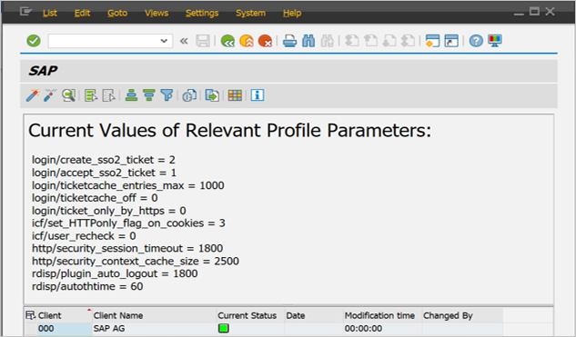

	d. Activate below SICF services:
    ```
	/sap/public/bc/sec/saml2
	/sap/public/bc/sec/cdc_ext_service
	/sap/bc/webdynpro/sap/saml2
	/sap/bc/webdynpro/sap/sec_diag_tool (This is only to enable / disable trace)
    ```
1. Go to Transaction code **SAML2** in business client of SAP system [T01/122]. It will open a user interface in a browser. In this example, we assumed 122 as SAP business client.

	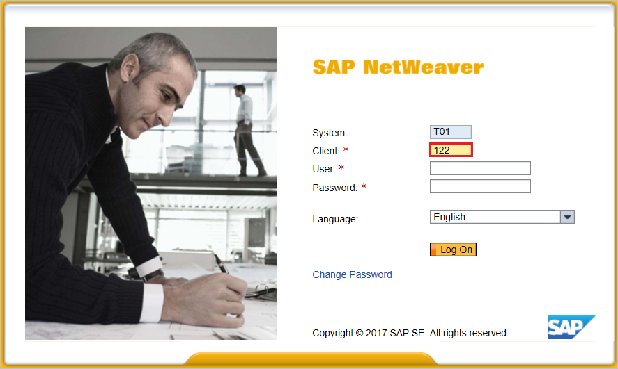

1. Provide your username and password to enter in user interface and click **Edit**.

	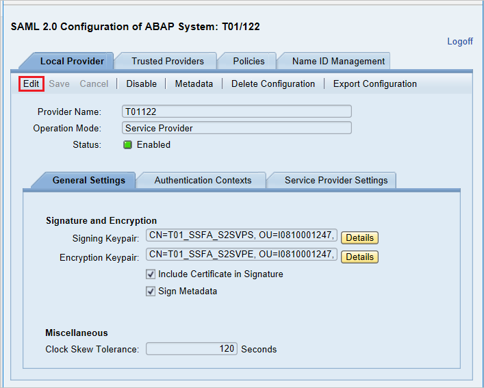

1. Replace **Provider Name** from T01122 to `http://T01122` and click on **Save**.

	> [!NOTE]
	> By default provider name come as `<sid><client>` format but Azure AD expects name in the format of `<protocol>://<name>`, recommending to maintain provider name as `https://<sid><client>` to allow multiple SAP NetWeaver ABAP engines to configure in Azure AD.

	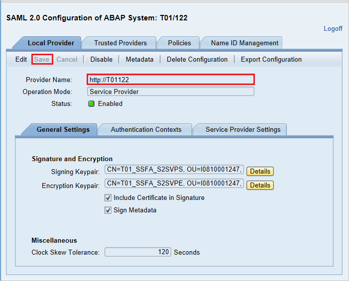

1. **Generating Service Provider Metadata**:- Once we are done with configuring the **Local Provider** and **Trusted Providers** settings on SAML 2.0 User Interface, the next step would be to generate the service provider’s metadata file (which would contain all the settings, authentication contexts and other configurations in SAP). Once this file is generated we need to upload this in Azure AD.

	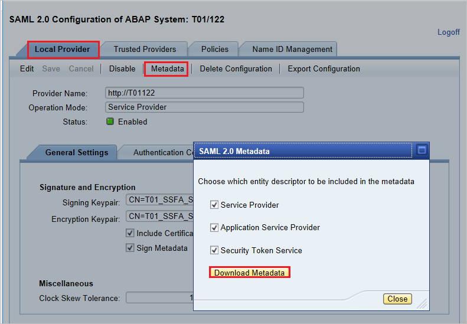

	a. Go to **Local Provider tab**.

	b. Click on **Metadata**.

	c. Save the generated **Metadata XML file** on your computer and upload it in **Basic SAML Configuration** section to autopopulate the **Identifier** and **Reply URL** values in Azure portal.

Follow these steps to enable Azure AD SSO in the Azure portal.

1. In the Azure portal, on the **SAP NetWeaver** application integration page, find the **Manage** section and select **Single sign-on**.
1. On the **Select a Single sign-on method** page, select **SAML**.
1. On the **Set up Single Sign-On with SAML** page, click the edit/pen icon for **Basic SAML Configuration** to edit the settings.

   

1. On the **Basic SAML Configuration** section, if you wish to configure the application in **IDP** initiated mode, perform the following step:

    a. Click **Upload metadata file** to upload the **Service Provider metadata file**, which you have obtained earlier.

	b. Click on **folder logo** to select the metadata file and click **Upload**.

	c. After the metadata file is successfully uploaded, the **Identifier** and **Reply URL** values get auto populated in **Basic SAML Configuration** section textbox as shown below:

	d. In the **Sign-on URL** text box, type a URL using the following pattern:
    `https://<your company instance of SAP NetWeaver>`

	> [!NOTE]
	> We have seen few customers reporting an error of incorrect Reply URL configured for their instance. If you receive any such error, you can use following PowerShell script as a work around to set the correct Reply URL for your instance.:
    > ```
    > Set-AzureADServicePrincipal -ObjectId $ServicePrincipalObjectId -ReplyUrls "<Your Correct Reply URL(s)>"
    > ``` 
	> ServicePrincipal Object ID is to be set by yourself first or you can pass that also here.

1. SAP NetWeaver application expects the SAML assertions in a specific format, which requires you to add custom attribute mappings to your SAML token attributes configuration. The following screenshot shows the list of default attributes. Click **Edit** icon to open User Attributes dialog.

	

1. In the **User Claims** section on the **User Attributes** dialog, configure SAML token attribute as shown in the image above and perform the following steps:

	a. Click **Edit icon** to open the **Manage user claims** dialog.

	

	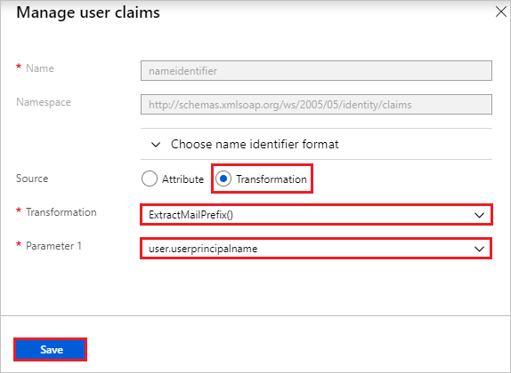

	b. From the **Transformation** list, select **ExtractMailPrefix()**.

	c. From the **Parameter 1** list, select **user.userprincipalname**.

	d. Click **Save**.

1. On the **Set up Single Sign-On with SAML** page, in the **SAML Signing Certificate** section, find **Federation Metadata XML** and select **Download** to download the certificate and save it on your computer.

   

1. On the **Set up SAP NetWeaver** section, copy the appropriate URL(s) based on your requirement.

   

### Create an Azure AD test user

In this section, you'll create a test user in the Azure portal called B.Simon.

1. From the left pane in the Azure portal, select **Azure Active Directory**, select **Users**, and then select **All users**.
1. Select **New user** at the top of the screen.
1. In the **User** properties, follow these steps:
   	1. In the **Name** field, enter `B.Simon`.  
   	1. In the **User name** field, enter the username@companydomain.extension. For example, `B.Simon@contoso.com`.
   	1. Select the **Show password** check box, and then write down the value that's displayed in the **Password** box.
   	1. Click **Create**.

### Assign the Azure AD test user

In this section, you'll enable B.Simon to use Azure single sign-on by granting access to SAP NetWeaver.

1. In the Azure portal, select **Enterprise Applications**, and then select **All applications**.
1. In the applications list, select **SAP NetWeaver**.
1. In the app's overview page, find the **Manage** section and select **Users and groups**.
1. Select **Add user**, then select **Users and groups** in the **Add Assignment** dialog.
1. In the **Users and groups** dialog, select **B.Simon** from the Users list, then click the **Select** button at the bottom of the screen.
1. If you're expecting any role value in the SAML assertion, in the **Select Role** dialog, select the appropriate role for the user from the list and then click the **Select** button at the bottom of the screen.
1. In the **Add Assignment** dialog, click the **Assign** button.

## Configure SAP NetWeaver using SAML

1. Sign in to SAP system and go to transaction code SAML2. It opens new browser window with SAML configuration screen.

2. For configuring End points for trusted Identity provider (Azure AD) go to **Trusted Providers** tab.

	

3. Press **Add** and select **Upload Metadata File** from the context menu.

	

4. Upload metadata file, which you have downloaded from the Azure portal.

	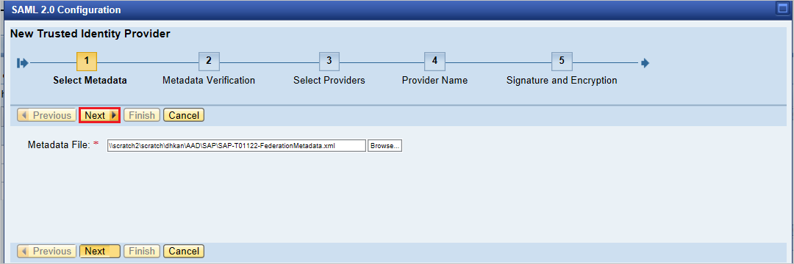

5. In the next screen type the Alias name. For example, aadsts and press **Next** to continue.

	

6. Make sure that your **Digest Algorithm** should be **SHA-256** and don’t require any changes and press **Next**.

	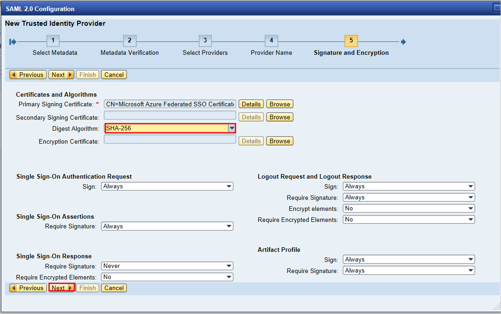

7. On **Single Sign-On Endpoints**, use **HTTP POST** and click **Next** to continue.

	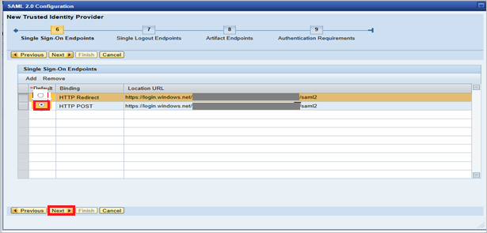

8. On **Single Logout Endpoints** select **HTTPRedirect** and click **Next** to continue.

	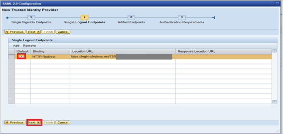

9. On **Artifact Endpoints**, press **Next** to continue.

	

10. On **Authentication Requirements**, click **Finish**.

	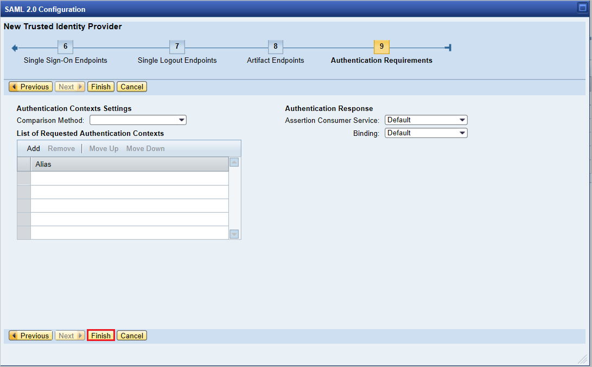

11. Go to tab **Trusted Provider** > **Identity Federation** (from bottom of the screen). Click **Edit**.

	

12. Click **Add** under the **Identity Federation** tab (bottom window).

	

13. From the pop-up window, select **Unspecified** from the **Supported NameID formats** and click OK.

	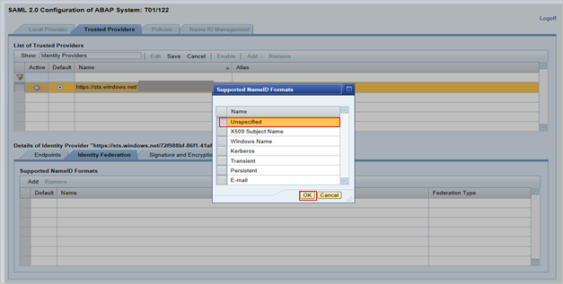

14. Note that **user ID Source** and **user ID mapping mode** values determine the link between SAP user and Azure AD claim.  

	#### Scenario: SAP User to Azure AD user mapping.

	a. NameID details screenshot from SAP.

	

	b. Screenshot mentioning Required claims from Azure AD.

	

	#### Scenario: Select SAP user ID based on configured email address in SU01. In this case email ID should be configured in su01 for each user who requires SSO.

	a.  NameID details screenshot from SAP.

	

	b. screenshot mentioning Required claims from Azure AD.

	

15. Click **Save** and then click **Enable** to enable identity provider.

	

16. Click **OK** once prompted.

	

	### Create SAP NetWeaver test user

	In this section, you create a user called B.simon in SAP NetWeaver. Please work your in house SAP expert team or work with your organization SAP partner to add the users in the SAP NetWeaver platform.

## Test SSO

1. Once the identity provider Azure AD was activated, try accessing below URL to check SSO (there will no prompt for username & password)

	`https://<sapurl>/sap/bc/bsp/sap/it00/default.htm`

	(or) use the URL below

    `https://<sapurl>/sap/bc/bsp/sap/it00/default.htm`

	> [!NOTE]
	> Replace sapurl with actual SAP hostname.

2. The above URL should take you to below mentioned screen. If you are able to reach up to the below page, Azure AD SSO setup is successfully done.

	

3. If username & password prompt occurs, please diagnose the issue by enable the trace using below URL

	`https://<sapurl>/sap/bc/webdynpro/sap/sec_diag_tool?sap-client=122&sap-language=EN#`

## Configure SAP NetWeaver for OAuth

1. SAP Documented process is available at the location: [NetWeaver Gateway Service Enabling and OAuth 2.0 Scope Creation](https://wiki.scn.sap.com/wiki/display/Security/NetWeaver+Gateway+Service+Enabling+and+OAuth+2.0+Scope+Creation)

2. Go to SPRO and find **Activate and Maintain services**.

	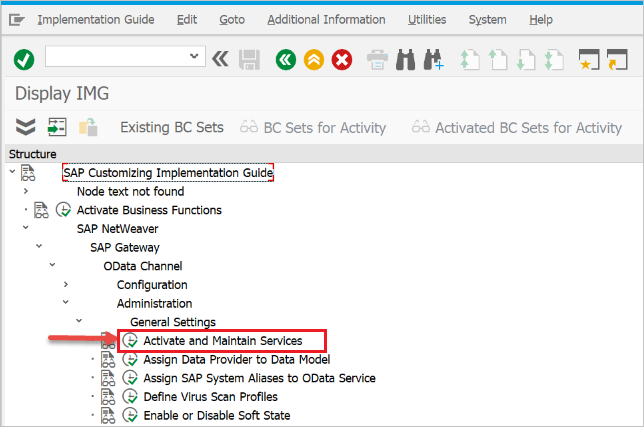

3. In this example we want to connect the OData service: `DAAG_MNGGRP` with OAuth to Azure AD SSO. Use the technical service name search for the service `DAAG_MNGGRP` and activate if not yet active, already (look for `green` status under ICF nodes tab). Ensure if system alias (the connected backend system, where the service actually running) is correct.

	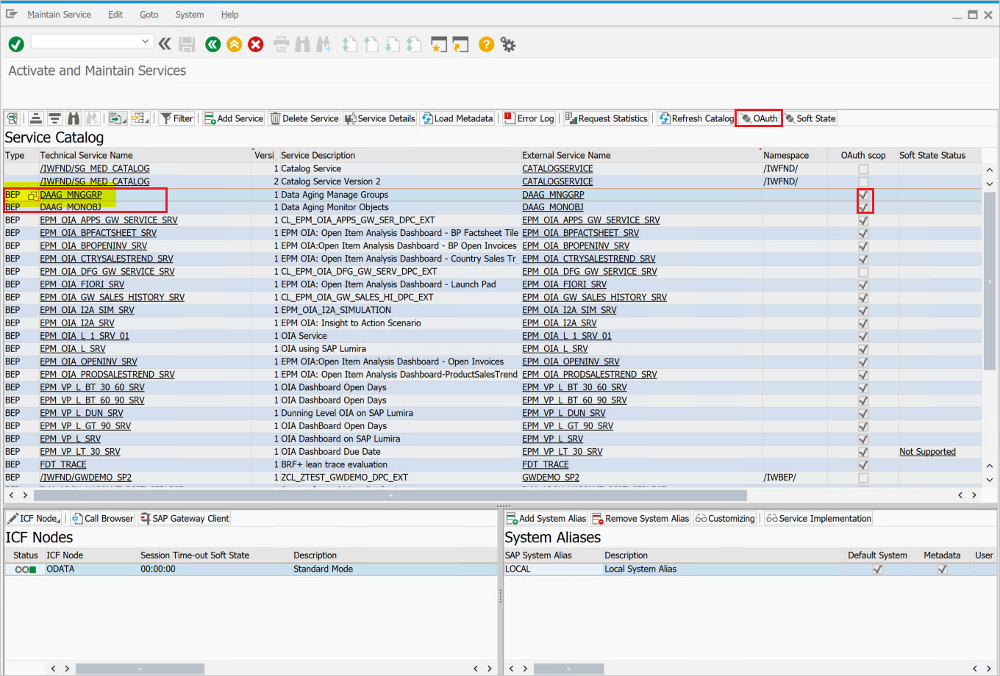

	* Then click pushbutton **OAuth** on the top button bar and assign `scope` (keep default name as offered).

4. For our example the scope is `DAAG_MNGGRP_001`, it is generated from the service name by automatically adding a number. Report `/IWFND/R_OAUTH_SCOPES` can be used to change name of scope or create manually.

	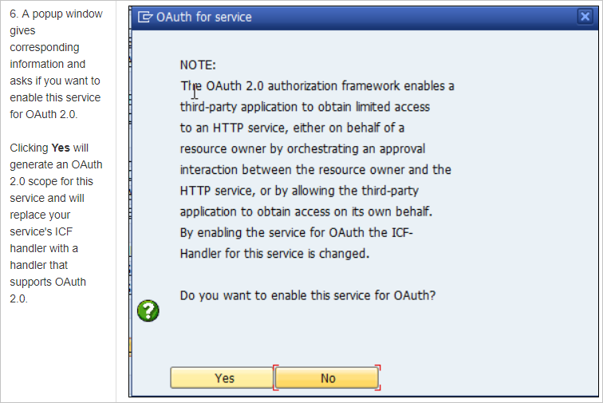

	> [!NOTE]
	> Message `soft state status is not supported` – can be ignored, as no problem. For more details, refer [here](https://help.sap.com/doc/saphelp_nw74/7.4.16/1e/c60c33be784846aad62716b4a1df39/content.htm?no_cache=true)

### Create a service user for the OAuth 2.0 Client

1. OAuth2 uses a `service ID` to get the access token for the end-user on its behalf. Important restriction by OAuth design: the `OAuth 2.0 Client ID` must be identical with the `username` the OAuth 2.0 client uses for login when requesting an Access Token. Therefore, for our example, we are going to register an OAuth 2.0 client with name CLIENT1, and as a prerequisite a user with the same name (CLIENT1) must exist in the SAP system and that user we will configure to be used by the referred application. 

2. When registering an OAuth Client we use the `SAML Bearer Grant type`.

	>[!NOTE]
	>For more details, refer OAuth 2.0 Client Registration for the SAML Bearer Grant Type [here](https://wiki.scn.sap.com/wiki/display/Security/OAuth+2.0+Client+Registration+for+the+SAML+Bearer+Grant+Type)

3. tcod: SU01 / create user CLIENT1 as `System type` and assign password, save it as need to provide the credential to the API programmer, who should burn it with the username to the calling code. No profile or role should be assigned.

### Register the new OAuth 2.0 Client ID with the creation wizard

1. To register a new **OAuth 2.0 client** start transaction **SOAUTH2**. The transaction will display an overview about the OAuth 2.0 clients that were already registered. Choose **Create** to start the wizard for the new OAuth client named as CLIENT1in this example.

2. Go to T-Code: **SOAUTH2** and Provide the description then click **next**.

	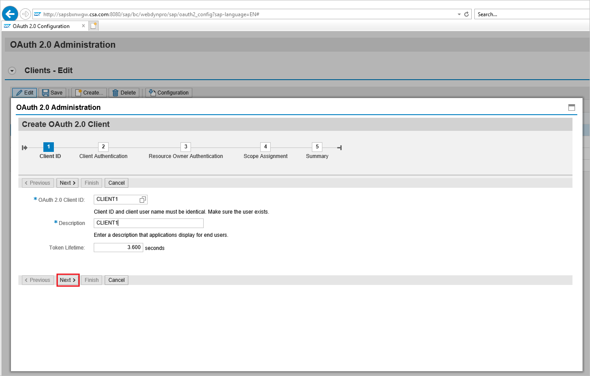

	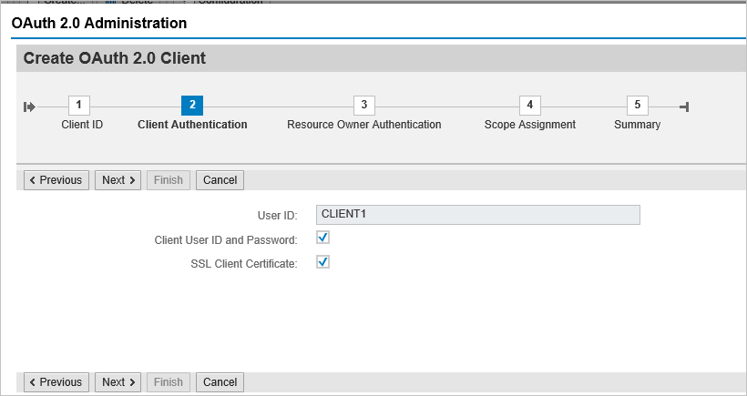

3. Select the already added **SAML2 IdP – Azure AD** from the dropdown list and save.

	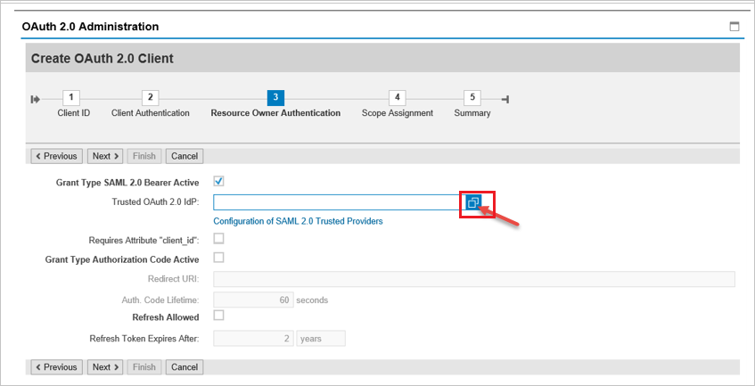

	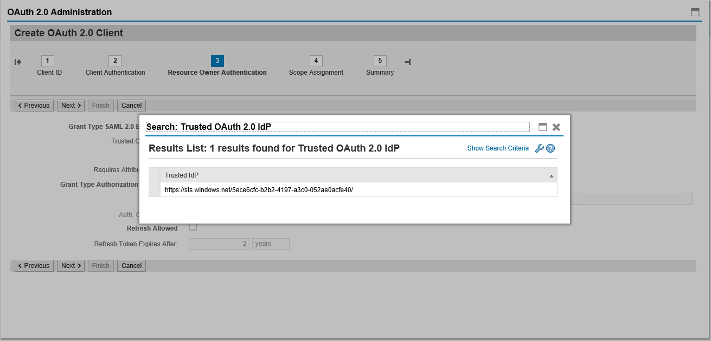

	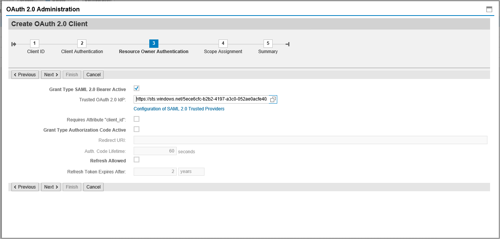

4. Click on **Add** under scope assignment to add the previously created scope: `DAAG_MNGGRP_001`

	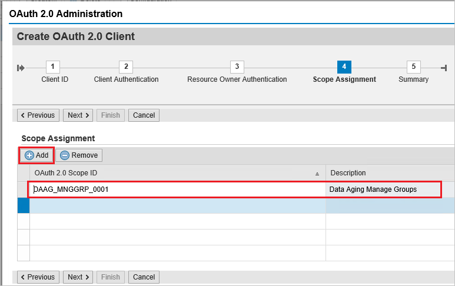

	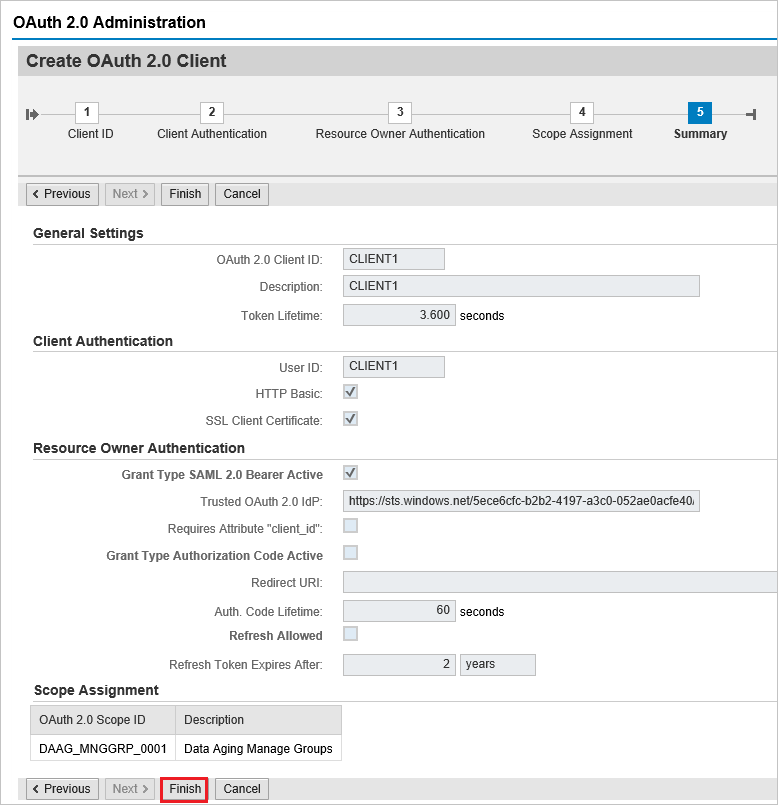

5. Click **finish**.

## Next Steps

Once you configure Azure AD SAP NetWeaver you can enforce Session Control, which protects exfiltration and infiltration of your organization’s sensitive data in real time. Session Control extends from Conditional Access. [Learn how to enforce session control with Microsoft Cloud App Security](https://docs.microsoft.com/cloud-app-security/proxy-deployment-aad)