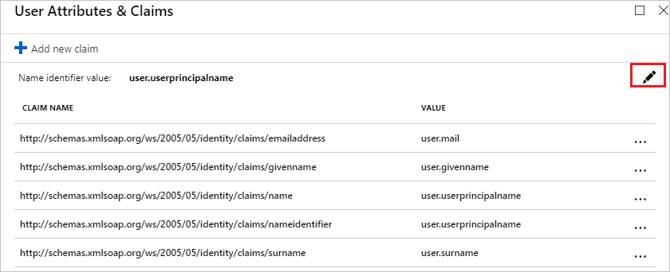
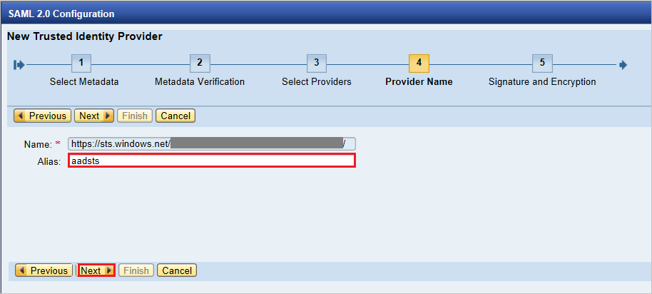
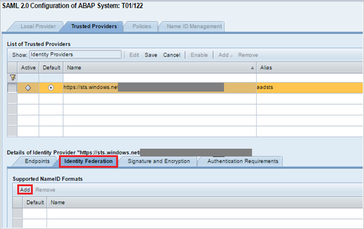
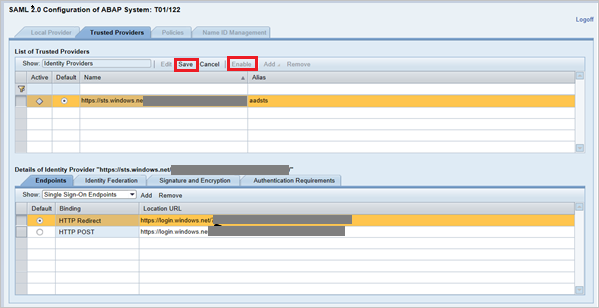
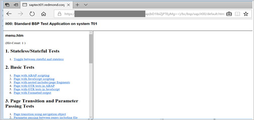

# Tutorial: Azure Active Directory integration with SAP NetWeaver

In this tutorial, you learn how to integrate SAP NetWeaver with Azure Active Directory (Azure AD).
Integrating SAP NetWeaver with Azure AD provides you with the following benefits:

* You can control in Azure AD who has access to SAP NetWeaver.
* You can enable your users to be automatically signed-in to SAP NetWeaver (Single Sign-On) with their Azure AD accounts.
* You can manage your accounts in one central location - the Azure portal.

If you want to know more details about SaaS app integration with Azure AD, see [What is application access and single sign-on with Azure Active Directory](https://docs.microsoft.com/azure/active-directory/active-directory-appssoaccess-whatis).
If you don't have an Azure subscription, [create a free account](https://azure.microsoft.com/free/) before you begin.

## Prerequisites

To configure Azure AD integration with SAP NetWeaver, you need the following items:

* An Azure AD subscription. If you don't have an Azure AD environment, you can get one-month trial [here](https://azure.microsoft.com/pricing/free-trial/)
* SAP NetWeaver single sign-on enabled subscription
* SAP NetWeaver V7.20 required atleast

## Scenario description

In this tutorial, you configure and test Azure AD single sign-on in a test environment.

* SAP NetWeaver supports **SP** initiated SSO

## Adding SAP NetWeaver from the gallery

To configure the integration of SAP NetWeaver into Azure AD, you need to add SAP NetWeaver from the gallery to your list of managed SaaS apps.

**To add SAP NetWeaver from the gallery, perform the following steps:**

1. In the **[Azure portal](https://portal.azure.com)**, on the left navigation panel, click **Azure Active Directory** icon.

	

2. Navigate to **Enterprise Applications** and then select the **All Applications** option.

	

3. To add new application, click **New application** button on the top of dialog.

	

4. In the search box, type **SAP NetWeaver**, select **SAP NetWeaver** from result panel then click **Add** button to add the application.

	 

## Configure and test Azure AD single sign-on

In this section, you configure and test Azure AD single sign-on with SAP NetWeaver based on a test user called **Britta Simon**.
For single sign-on to work, a link relationship between an Azure AD user and the related user in SAP NetWeaver needs to be established.

To configure and test Azure AD single sign-on with SAP NetWeaver, you need to complete the following building blocks:

1. **[Configure Azure AD Single Sign-On](#configure-azure-ad-single-sign-on)** - to enable your users to use this feature.
2. **[Configure SAP NetWeaver Single Sign-On](#configure-sap-netweaver-single-sign-on)** - to configure the Single Sign-On settings on application side.
3. **[Create an Azure AD test user](#create-an-azure-ad-test-user)** - to test Azure AD single sign-on with Britta Simon.
4. **[Assign the Azure AD test user](#assign-the-azure-ad-test-user)** - to enable Britta Simon to use Azure AD single sign-on.
5. **[Create SAP NetWeaver test user](#create-sap-netweaver-test-user)** - to have a counterpart of Britta Simon in SAP NetWeaver that is linked to the Azure AD representation of user.
6. **[Test single sign-on](#test-single-sign-on)** - to verify whether the configuration works.

### Configure Azure AD single sign-on

In this section, you enable Azure AD single sign-on in the Azure portal.

To configure Azure AD single sign-on with SAP NetWeaver, perform the following steps:

1. Open a new web browser window and log into your SAP NetWeaver company site as an administrator

2. Make sure that **http** and **https** services are active and appropriate ports are assigned in **SMICM** T-Code.

3. Log on to business client of SAP System (T01), where SSO is required and activate HTTP Security session Management.

	a. Go to Transaction code **SICF_SESSIONS**. It displays all relevant profile parameters with current values. They look like below:-
    ```
	login/create_sso2_ticket = 2
	login/accept_sso2_ticket = 1
	login/ticketcache_entries_max = 1000
	login/ticketcache_off = 0  login/ticket_only_by_https = 0 
	icf/set_HTTPonly_flag_on_cookies = 3
	icf/user_recheck = 0  http/security_session_timeout = 1800
	http/security_context_cache_size = 2500
	rdisp/plugin_auto_logout = 1800
	rdisp/autothtime = 60
    ```
	>[!NOTE]
	> Adjust above parameters as per your organization requirements, Above parameters are given here as indication only.

	b. If required adjust parameters, in the instance/default profile of SAP system and restart SAP system.

	c. Double click on relevant client to enable HTTP security session.

	

	d. Activate below SICF services:
    ```
	/sap/public/bc/sec/saml2
	/sap/public/bc/sec/cdc_ext_service
	/sap/bc/webdynpro/sap/saml2
	/sap/bc/webdynpro/sap/sec_diag_tool (This is only to enable / disable trace)
    ```
4. Go to Transaction code **SAML2** in business client of SAP system [T01/122]. It will open a user interface in a browser. In this example, we assumed 122 as SAP business client.

	

5. Provide your username and password to enter in user interface and click **Edit**.

	

6. Replace **Provider Name** from T01122 to `http://T01122` and click on **Save**.

	> [!NOTE]
	> By default provider name come as `<sid><client>` format but Azure AD expects name in the format of `<protocol>://<name>`, recommending to maintain provider name as `https://<sid><client>` to allow multiple SAP NetWeaver ABAP engines to configure in Azure AD.

	

7. **Generating Service Provider Metadata**:- Once we are done with configuring the **Local Provider** and **Trusted Providers** settings on SAML 2.0 User Interface, the next step would be to generate the service provider’s metadata file (which would contain all the settings, authentication contexts and other configurations in SAP). Once this file is generated we need to upload this in Azure AD.

	

	a. Go to **Local Provider tab**.

	b. Click on **Metadata**.

	c. Save the generated **Metadata XML file** on your computer and upload it in **Basic SAML Configuration** section to auto-populate the **Identifier** and **Reply URL** values in Azure portal.

8. In the [Azure portal](https://portal.azure.com/), on the **SAP NetWeaver** application integration page, select **Single sign-on**.

    

9. On the **Select a Single sign-on method** dialog, select **SAML/WS-Fed** mode to enable single sign-on.

    

10. On the **Set up Single Sign-On with SAML** page, click **Edit** icon to open **Basic SAML Configuration** dialog.

	

11. On the **Basic SAML Configuration** section, perform the following steps:

	a. Click **Upload metadata file** to upload the **Service Provider metadata file** which you have obtained earlier.

    

	b. Click on **folder logo** to select the metadata file and click **Upload**.

	

	c. After the metadata file is successfully uploaded, the **Identifier** and **Reply URL** values get auto populated in **Basic SAML Configuration** section textbox as shown below:

	

	d. In the **Sign-on URL** text box, type a URL using the following pattern:
    `https://<your company instance of SAP NetWeaver>`

	> [!NOTE]
	> We have seen few customers reporting an error of incorrect Reply URL configured for their instance. If you receive any such error, you can use following PowerShell script as a work around to set the correct Reply URL for your instance.:
    > ```
    > Set-AzureADServicePrincipal -ObjectId $ServicePrincipalObjectId -ReplyUrls "<Your Correct Reply URL(s)>"
    > ``` 
	> ServicePrincipal Object ID is to be set by yourself first or you can pass that also here.

12. SAP NetWeaver application expects the SAML assertions in a specific format. Configure the following claims for this application. You can manage the values of these attributes from the **User Attributes** section on application integration page. On the **Set up Single Sign-On with SAML** page, click **Edit** button to open **User Attributes** dialog.

	

13. In the **User Claims** section on the **User Attributes** dialog, configure SAML token attribute as shown in the image above and perform the following steps:

	a. Click **Edit icon** to open the **Manage user claims** dialog.

	

	

	b. From the **Transformation** list, select **ExtractMailPrefix()**.

	c. From the **Parameter 1** list, select **user.userprinicipalname**.

	d. Click **Save**.

14. On the **Set up Single Sign-On with SAML** page, in the **SAML Signing Certificate** section, click **Download** to download the **Federation Metadata XML** from the given options as per your requirement and save it on your computer.

	

15. On the **Set up SAP NetWeaver** section, copy the appropriate URL(s) as per your requirement.

	

	a. Login URL

	b. Azure Ad Identifier

	c. Logout URL

### Configure SAP NetWeaver Single Sign-On

1. Logon to SAP system and go to transaction code SAML2. It opens new browser window with SAML configuration screen.

2. For configuring End points for trusted Identity provider (Azure AD) go to **Trusted Providers** tab.

	

3. Press **Add** and select **Upload Metadata File** from the context menu.

	

4. Upload metadata file, which you have downloaded from the Azure portal.

	

5. In the next screen type the Alias name. For example aadsts and press **Next** to continue.

	

6. Make sure that your **Digest Algorithm** should be **SHA-256** and don’t require any changes and press **Next**.

	

7. On **Single Sign-On Endpoints**, use **HTTP POST** and click **Next** to continue.

	

8. On **Single Logout Endpoints** select **HTTPRedirect** and click **Next** to continue.

	

9. On **Artifact Endpoints**, press **Next** to continue.

	

10. On **Authentication Requirements**, click **Finish**.

	

11. Go to tab **Trusted Provider** > **Identity Federation** (from bottom of the screen). Click **Edit**.

	

12. Click **Add** under the **Identity Federation** tab (bottom window).

	

13. From the pop-up window select **Unspecified** from the **Supported NameID formats** and click OK.

	

14. Note that **user ID Source** and **user id mapping mode** values determine the link between SAP user and Azure AD claim.  

	#### Scenario: SAP User to Azure AD user mapping.

	a. NameID details screenshot from SAP.

	

	b. Screenshot mentioning Required claims from Azure AD.

	

	#### Scenario: Select SAP user id based on configured email address in SU01. In this case email id should be configured in su01 for each user who requires SSO.

	a.  NameID details screenshot from SAP.

	

	b. screenshot mentioning Required claims from Azure AD.

	

15. Click **Save** and then click **Enable** to enable identity provider.

	

16. Click **OK** once prompted.

	

### Create an Azure AD test user

The objective of this section is to create a test user in the Azure portal called Britta Simon.

1. In the Azure portal, in the left pane, select **Azure Active Directory**, select **Users**, and then select **All users**.

    

2. Select **New user** at the top of the screen.

    

3. In the User properties, perform the following steps.

    

    a. In the **Name** field enter **BrittaSimon**.
  
    b. In the **User name** field type **brittasimon\@yourcompanydomain.extension**  
    For example, BrittaSimon@contoso.com

    c. Select **Show password** check box, and then write down the value that's displayed in the Password box.

    d. Click **Create**.

### Assign the Azure AD test user

In this section, you enable Britta Simon to use Azure single sign-on by granting access to SAP NetWeaver.

1. In the Azure portal, select **Enterprise Applications**, select **All applications**, then select **SAP NetWeaver**.

	

2. In the applications list, select **SAP NetWeaver**.

	

3. In the menu on the left, select **Users and groups**.

    

4. Click the **Add user** button, then select **Users and groups** in the **Add Assignment** dialog.

    

5. In the **Users and groups** dialog select **Britta Simon** in the Users list, then click the **Select** button at the bottom of the screen.

6. If you are expecting any role value in the SAML assertion then in the **Select Role** dialog select the appropriate role for the user from the list, then click the **Select** button at the bottom of the screen.

7. In the **Add Assignment** dialog click the **Assign** button.

### Create SAP NetWeaver test user

In this section, you create a user called Britta Simon in SAP NetWeaver. Please work your in house SAP expert team or work with your organization SAP partner to add the users in the SAP NetWeaver platform.

### Test single sign-on 

1. Once the identity provider Azure AD was activated, try accessing below URL to check SSO (there will no prompt for username & password)

	`https://<sapurl>/sap/bc/bsp/sap/it00/default.htm`

	(or) use the URL below

    `https://<sapurl>/sap/bc/bsp/sap/it00/default.htm`

	> [!NOTE]
	> Replace sapurl with actual SAP hostname.

2. The above URL should take you to below mentioned screen. If you are able to reach up to the below page, Azure AD SSO setup is successfully done.

	

3. If username & password prompt occurs, please diagnose the issue by enable the trace using below URL

	`https://<sapurl>/sap/bc/webdynpro/sap/sec_diag_tool?sap-client=122&sap-language=EN#`

## Additional Resources

- [List of Tutorials on How to Integrate SaaS Apps with Azure Active Directory](https://docs.microsoft.com/azure/active-directory/active-directory-saas-tutorial-list)

- [What is application access and single sign-on with Azure Active Directory?](https://docs.microsoft.com/azure/active-directory/active-directory-appssoaccess-whatis)

- [What is conditional access in Azure Active Directory?](https://docs.microsoft.com/azure/active-directory/conditional-access/overview)
