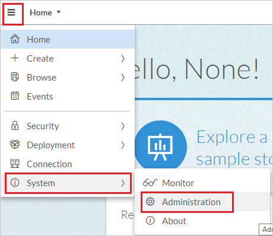
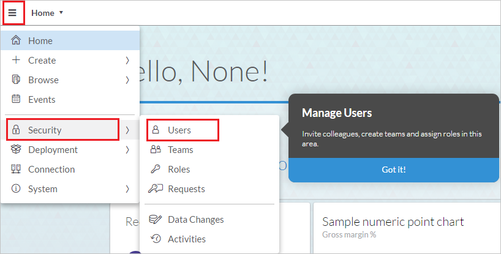

# Tutorial: Integrate SAP Analytics Cloud with Azure Active Directory

In this tutorial, you'll learn how to integrate SAP Analytics Cloud with Azure Active Directory (Azure AD). When you integrate SAP Analytics Cloud with Azure AD, you can:

* Control in Azure AD who has access to SAP Analytics Cloud.
* Enable your users to be automatically signed-in to SAP Analytics Cloud with their Azure AD accounts.
* Manage your accounts in one central location - the Azure portal.

To learn more about SaaS app integration with Azure AD, see [What is application access and single sign-on with Azure Active Directory](https://docs.microsoft.com/azure/active-directory/active-directory-appssoaccess-whatis).

## Prerequisites

To get started, you need the following items:

* An Azure AD subscription. If you don't have a subscription, you can get a [free account](https://azure.microsoft.com/free/).
* SAP Analytics Cloud single sign-on (SSO) enabled subscription.

## Scenario description

In this tutorial, you configure and test Azure AD SSO in a test environment.

* SAP Analytics Cloud supports **SP** initiated SSO

## Adding SAP Analytics Cloud from the gallery

To configure the integration of SAP Analytics Cloud into Azure AD, you need to add SAP Analytics Cloud from the gallery to your list of managed SaaS apps.

1. Sign in to the [Azure portal](https://portal.azure.com) using either a work or school account, or a personal Microsoft account.
1. On the left navigation pane, select the **Azure Active Directory** service.
1. Navigate to **Enterprise Applications** and then select **All Applications**.
1. To add new application, select **New application**.
1. In the **Add from the gallery** section, type **SAP Analytics Cloud** in the search box.
1. Select **SAP Analytics Cloud** from results panel and then add the app. Wait a few seconds while the app is added to your tenant.

## Configure and test Azure AD single sign-on

Configure and test Azure AD SSO with SAP Analytics Cloud using a test user called **B.Simon**. For SSO to work, you need to establish a link relationship between an Azure AD user and the related user in SAP Analytics Cloud.

To configure and test Azure AD SSO with SAP Analytics Cloud, complete the following building blocks:

1. **[Configure Azure AD SSO](#configure-azure-ad-sso)** - to enable your users to use this feature.
2. **[Configure SAP Analytics Cloud SSO](#configure-sap-analytics-cloud-sso)** - to configure the Single Sign-On settings on application side.
3. **[Create an Azure AD test user](#create-an-azure-ad-test-user)** - to test Azure AD single sign-on with B.Simon.
4. **[Assign the Azure AD test user](#assign-the-azure-ad-test-user)** - to enable B.Simon to use Azure AD single sign-on.
5. **[Create SAP Analytics Cloud test user](#create-sap-analytics-cloud-test-user)** - to have a counterpart of B.Simon in SAP Analytics Cloud that is linked to the Azure AD representation of user.
6. **[Test SSO](#test-sso)** - to verify whether the configuration works.

### Configure Azure AD SSO

Follow these steps to enable Azure AD SSO in the Azure portal.

1. In the [Azure portal](https://portal.azure.com/), on the **SAP Analytics Cloud** application integration page, find the **Manage** section and select **Single sign-on**.
1. On the **Select a Single sign-on method** page, select **SAML**.
1. On the **Set up Single Sign-On with SAML** page, click the edit/pen icon for **Basic SAML Configuration** to edit the settings.

   

1. On the **Basic SAML Configuration** section, enter the values for the following fields:

    a. In the **Sign on URL** text box, type a URL using the following pattern:

    - `https://<sub-domain>.sapanalytics.cloud/`
    - `https://<sub-domain>.sapbusinessobjects.cloud/`

    b. In the **Identifier (Entity ID)** text box, type a URL using the following pattern:

    - `<sub-domain>.sapbusinessobjects.cloud`
    - `<sub-domain>.sapanalytics.cloud`

	> [!NOTE] 
	> The values in these URLs are for demonstration only. Update the values with the actual sign-on URL and identifier URL. To get the sign-on URL, contact the [SAP Analytics Cloud Client support team](https://help.sap.com/viewer/product/SAP_BusinessObjects_Cloud/release/). You can get the identifier URL by downloading the SAP Analytics Cloud metadata from the admin console. This is explained later in the tutorial.

4. On the **Set up Single Sign-On with SAML** page, in the **SAML Signing Certificate** section,  find **Federation Metadata XML** and select **Download** to download the certificate and save it on your computer.

	

6. On the **Set up SAP Analytics Cloud** section, copy the appropriate URL(s) based on your requirement.

	

### Configure SAP Analytics Cloud SSO

1. In a different web browser window, sign in to your SAP Analytics Cloud company site as an administrator.

2. Select **Menu** > **System** > **Administration**.
    
	

3. On the **Security** tab, select the **Edit** (pen) icon.
    
	  

4. For **Authentication Method**, select **SAML Single Sign-On (SSO)**.

	  

5. To download the service provider metadata (Step 1), select **Download**. In the metadata file, find and copy the **entityID** value. In the Azure portal, on the **Basic SAML Configuration** dialog, paste the value in the **Identifier** box.

	  

6. To upload the service provider metadata (Step 2) in the file that you downloaded from the Azure portal, under **Upload Identity Provider metadata**, select **Upload**.  

	

7. In the **User Attribute** list, select the user attribute (Step 3) that you want to use for your implementation. This user attribute maps to the identity provider. To enter a custom attribute on the user's page, use the **Custom SAML Mapping** option. Or, you can select either **Email** or **USER ID** as the user attribute. In our example, we selected **Email** because we mapped the user identifier claim with the **userprincipalname** attribute in the **User Attributes & Claims** section in the Azure portal. This provides a unique user email, which is sent to the SAP Analytics Cloud application in every successful SAML response.

	

8. To verify the account with the identity provider (Step 4), in the **Login Credential (Email)** box, enter the user's email address. Then, select **Verify Account**. The system adds sign-in credentials to the user account.

    

9. Select the **Save** icon.

	

### Create an Azure AD test user

In this section, you'll create a test user in the Azure portal called B.Simon.

1. From the left pane in the Azure portal, select **Azure Active Directory**, select **Users**, and then select **All users**.
1. Select **New user** at the top of the screen.
1. In the **User** properties, follow these steps:
   1. In the **Name** field, enter `B.Simon`.  
   1. In the **User name** field, enter the username@companydomain.extension. For example, `B.Simon@contoso.com`.
   1. Select the **Show password** check box, and then write down the value that's displayed in the **Password** box.
   1. Click **Create**.

### Assign the Azure AD test user

In this section, you'll enable B.Simon to use Azure single sign-on by granting access to SAP Analytics Cloud.

1. In the Azure portal, select **Enterprise Applications**, and then select **All applications**.
1. In the applications list, select **SAP Analytics Cloud**.
1. In the app's overview page, find the **Manage** section and select **Users and groups**.

   

1. Select **Add user**, then select **Users and groups** in the **Add Assignment** dialog.

	

1. In the **Users and groups** dialog, select **B.Simon** from the Users list, then click the **Select** button at the bottom of the screen.
1. If you're expecting any role value in the SAML assertion, in the **Select Role** dialog, select the appropriate role for the user from the list and then click the **Select** button at the bottom of the screen.
1. In the **Add Assignment** dialog, click the **Assign** button.

### Create SAP Analytics Cloud test user

Azure AD users must be provisioned in SAP Analytics Cloud before they can sign in to SAP Analytics Cloud. In SAP Analytics Cloud, provisioning is a manual task.

To provision a user account:

1. Sign in to your SAP Analytics Cloud company site as an administrator.

2. Select **Menu** > **Security** > **Users**.

    

3. On the **Users** page, to add new user details, select **+**. 

	

	Then, complete the following steps:

	a. In the **USER ID** box, enter the user ID of the user, like **B**.

	b. In the **FIRST NAME** box, enter the first name of the user, like **B**.

	c. In the **LAST NAME** box, enter the last name of the user, like **Simon**.

	d. In the **DISPLAY NAME** box, enter the full name of the user, like **B.Simon**.

	e. In the **E-MAIL** box, enter the email address of the user, like `b.simon@contoso.com`.

	f. On the **Select Roles** page, select the appropriate role for the user, and then select **OK**.

	  

	g. Select the **Save** icon.

### Test SSO 

In this section, you test your Azure AD single sign-on configuration using the Access Panel.

When you click the SAP Analytics Cloud tile in the Access Panel, you should be automatically signed in to the SAP Analytics Cloud for which you set up SSO. For more information about the Access Panel, see [Introduction to the Access Panel](https://docs.microsoft.com/azure/active-directory/active-directory-saas-access-panel-introduction).

## Additional Resources

- [List of Tutorials on How to Integrate SaaS Apps with Azure Active Directory](https://docs.microsoft.com/azure/active-directory/active-directory-saas-tutorial-list)

- [What is application access and single sign-on with Azure Active Directory?](https://docs.microsoft.com/azure/active-directory/active-directory-appssoaccess-whatis)

- [What is conditional access in Azure Active Directory?](https://docs.microsoft.com/azure/active-directory/conditional-access/overview)

