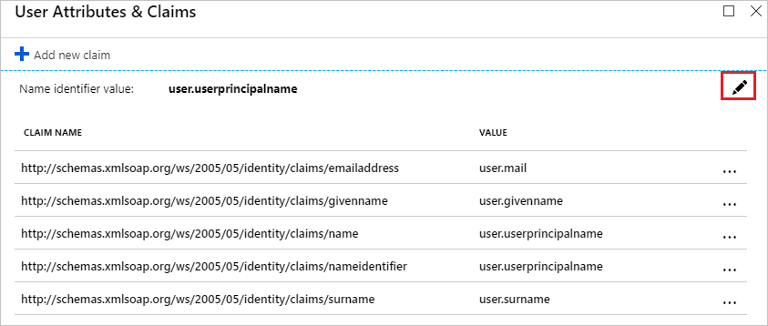
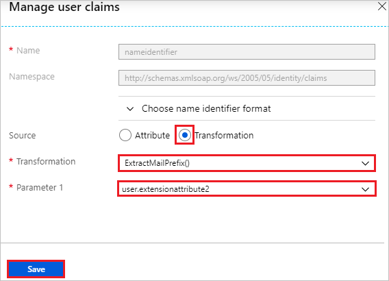

# Tutorial: Azure Active Directory integration with SAP Business ByDesign

In this tutorial, you learn how to integrate SAP Business ByDesign with Azure Active Directory (Azure AD).
Integrating SAP Business ByDesign with Azure AD provides you with the following benefits:

* You can control in Azure AD who has access to SAP Business ByDesign.
* You can enable your users to be automatically signed-in to SAP Business ByDesign (Single Sign-On) with their Azure AD accounts.
* You can manage your accounts in one central location - the Azure portal.

If you want to know more details about SaaS app integration with Azure AD, see [What is application access and single sign-on with Azure Active Directory](https://docs.microsoft.com/azure/active-directory/active-directory-appssoaccess-whatis).
If you don't have an Azure subscription, [create a free account](https://azure.microsoft.com/free/) before you begin.

## Prerequisites

To configure Azure AD integration with SAP Business ByDesign, you need the following items:

* An Azure AD subscription. If you don't have an Azure AD environment, you can get a [free account](https://azure.microsoft.com/free/)
* SAP Business ByDesign single sign-on enabled subscription

## Scenario description

In this tutorial, you configure and test Azure AD single sign-on in a test environment.

* SAP Business ByDesign supports **SP** initiated SSO

## Adding SAP Business ByDesign from the gallery

To configure the integration of SAP Business ByDesign into Azure AD, you need to add SAP Business ByDesign from the gallery to your list of managed SaaS apps.

**To add SAP Business ByDesign from the gallery, perform the following steps:**

1. In the **[Azure portal](https://portal.azure.com)**, on the left navigation panel, click **Azure Active Directory** icon.

	

2. Navigate to **Enterprise Applications** and then select the **All Applications** option.

	

3. To add new application, click **New application** button on the top of dialog.

	

4. In the search box, type **SAP Business ByDesign**, select **SAP Business ByDesign** from result panel then click **Add** button to add the application.

	

## Configure and test Azure AD single sign-on

In this section, you configure and test Azure AD single sign-on with SAP Business ByDesign based on a test user called **Britta Simon**.
For single sign-on to work, a link relationship between an Azure AD user and the related user in SAP Business ByDesign needs to be established.

To configure and test Azure AD single sign-on with SAP Business ByDesign, you need to complete the following building blocks:

1. **[Configure Azure AD Single Sign-On](#configure-azure-ad-single-sign-on)** - to enable your users to use this feature.
2. **[Configure SAP Business ByDesign Single Sign-On](#configure-sap-business-bydesign-single-sign-on)** - to configure the Single Sign-On settings on application side.
3. **[Create an Azure AD test user](#create-an-azure-ad-test-user)** - to test Azure AD single sign-on with Britta Simon.
4. **[Assign the Azure AD test user](#assign-the-azure-ad-test-user)** - to enable Britta Simon to use Azure AD single sign-on.
5. **[Create SAP Business ByDesign test user](#create-sap-business-bydesign-test-user)** - to have a counterpart of Britta Simon in SAP Business ByDesign that is linked to the Azure AD representation of user.
6. **[Test single sign-on](#test-single-sign-on)** - to verify whether the configuration works.

### Configure Azure AD single sign-on

In this section, you enable Azure AD single sign-on in the Azure portal.

To configure Azure AD single sign-on with SAP Business ByDesign, perform the following steps:

1. In the [Azure portal](https://portal.azure.com/), on the **SAP Business ByDesign** application integration page, select **Single sign-on**.

    

2. On the **Select a Single sign-on method** dialog, select **SAML/WS-Fed** mode to enable single sign-on.

    

3. On the **Set up Single Sign-On with SAML** page, click **Edit** icon to open **Basic SAML Configuration** dialog.

	

4. On the **Basic SAML Configuration** section, perform the following steps:

    

	a. In the **Sign on URL** text box, type a URL using the following pattern:
    `https://<servername>.sapbydesign.com`

    b. In the **Identifier (Entity ID)** text box, type a URL using the following pattern:
    `https://<servername>.sapbydesign.com`

	> [!NOTE]
	> These values are not real. Update these values with the actual Sign on URL and Identifier. Contact [SAP Business ByDesign Client support team](https://www.sap.com/products/cloud-analytics.support.html) to get these values. You can also refer to the patterns shown in the **Basic SAML Configuration** section in the Azure portal.

5. SAP Business ByDesign application expects the SAML assertions in a specific format. Configure the following claims for this application. You can manage the values of these attributes from the **User Attributes** section on application integration page. On the **Set up Single Sign-On with SAML** page, click **Edit** button to open **User Attributes** dialog.

	

6. Click on the **Edit** icon to edit the **Name identifier value**.

	

7. On the **Manage user claims** section, perform the following steps:
	

	a. Select **Transformation** as a **Source**.

	b. In the **Transformation** dropdown list, select **ExtractMailPrefix()**.

	c. In the **Parameter 1** dropdown list, select the user attribute you want to use for your implementation. For example, if you want to use the EmployeeID as unique user identifier and you have stored the attribute value in the ExtensionAttribute2, then select user.extensionattribute2.

	d. Click **Save**.

8. On the **Set up Single Sign-On with SAML** page, in the **SAML Signing Certificate** section, click **Download** to download the **Federation Metadata XML** from the given options as per your requirement and save it on your computer.

	

9. On the **Set up SAP Business ByDesign** section, copy the appropriate URL(s) as per your requirement.

	

	a. Login URL

	b. Azure AD Identifier

	c. Logout URL

### Configure SAP Business ByDesign Single Sign-On

1. Sign on to your SAP Business ByDesign portal with administrator rights.

2. Navigate to **Application and User Management Common Task** and click the **Identity Provider** tab.

3. Click **New Identity Provider** and select the metadata XML file that you have downloaded from the Azure portal. By importing the metadata, the system automatically uploads the required signature certificate and encryption certificate.

	

4. To include the **Assertion Consumer Service URL** into the SAML request, select **Include Assertion Consumer Service URL**.

5. Click **Activate Single Sign-On**.

6. Save your changes.

7. Click the **My System** tab.

    

8. In the **Azure AD Sign On URL** textbox, paste **Login URL** value, which you have copied from the Azure portal.

    

9. Specify whether the employee can manually choose between logging on with user ID and password or SSO by selecting **Manual Identity Provider Selection**.

10. In the **SSO URL** section, specify the URL that should be used by the employee to signon to the system.
    In the URL Sent to Employee dropdown list, you can choose between the following options:

    **Non-SSO URL**

    The system sends only the normal system URL to the employee. The employee cannot signon using SSO, and must use password or certificate instead.

    **SSO URL**

    The system sends only the SSO URL to the employee. The employee can signon using SSO. Authentication request is redirected through the IdP.

    **Automatic Selection**

    If SSO is not active, the system sends the normal system URL to the employee. If SSO is active, the system checks whether the employee has a password. If a password is available, both SSO URL and Non-SSO URL are sent to the employee. However, if the employee has no password, only the SSO URL is sent to the employee.

11. Save your changes.

### Create an Azure AD test user

The objective of this section is to create a test user in the Azure portal called Britta Simon.

1. In the Azure portal, in the left pane, select **Azure Active Directory**, select **Users**, and then select **All users**.

    

2. Select **New user** at the top of the screen.

    

3. In the User properties, perform the following steps.

    

    a. In the **Name** field enter **BrittaSimon**.
  
    b. In the **User name** field type `brittasimon@yourcompanydomain.extension`. For example, BrittaSimon@contoso.com

    c. Select **Show password** check box, and then write down the value that's displayed in the Password box.

    d. Click **Create**.

### Assign the Azure AD test user

In this section, you enable Britta Simon to use Azure single sign-on by granting access to SAP Business ByDesign.

1. In the Azure portal, select **Enterprise Applications**, select **All applications**, then select **SAP Business ByDesign**.

	

2. In the applications list, select **SAP Business ByDesign**.

	

3. In the menu on the left, select **Users and groups**.

    

4. Click the **Add user** button, then select **Users and groups** in the **Add Assignment** dialog.

    

5. In the **Users and groups** dialog select **Britta Simon** in the Users list, then click the **Select** button at the bottom of the screen.

6. If you are expecting any role value in the SAML assertion then in the **Select Role** dialog select the appropriate role for the user from the list, then click the **Select** button at the bottom of the screen.

7. In the **Add Assignment** dialog click the **Assign** button.

### Create SAP Business ByDesign test user

In this section, you create a user called Britta Simon in SAP Business ByDesign. Please work with [SAP Business ByDesign Client support team](https://www.sap.com/products/cloud-analytics.support.html) to add the users in the SAP Business ByDesign platform. 

> [!NOTE]
> Please make sure that NameID value should match with the username field in the SAP Business ByDesign platform.

### Test single sign-on

In this section, you test your Azure AD single sign-on configuration using the Access Panel.

When you click the SAP Business ByDesign tile in the Access Panel, you should be automatically signed in to the SAP Business ByDesign for which you set up SSO. For more information about the Access Panel, see [Introduction to the Access Panel](https://docs.microsoft.com/azure/active-directory/active-directory-saas-access-panel-introduction).

## Additional Resources

- [List of Tutorials on How to Integrate SaaS Apps with Azure Active Directory](https://docs.microsoft.com/azure/active-directory/active-directory-saas-tutorial-list)

- [What is application access and single sign-on with Azure Active Directory?](https://docs.microsoft.com/azure/active-directory/active-directory-appssoaccess-whatis)

- [What is conditional access in Azure Active Directory?](https://docs.microsoft.com/azure/active-directory/conditional-access/overview)
