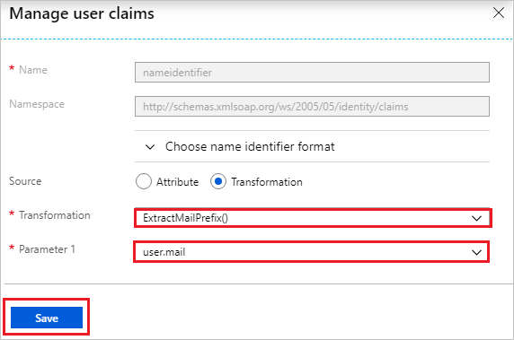
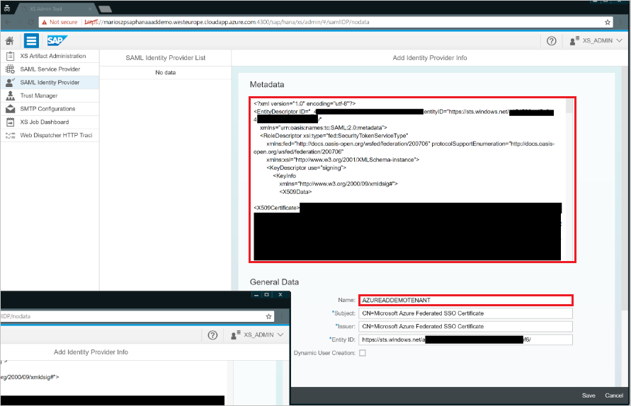
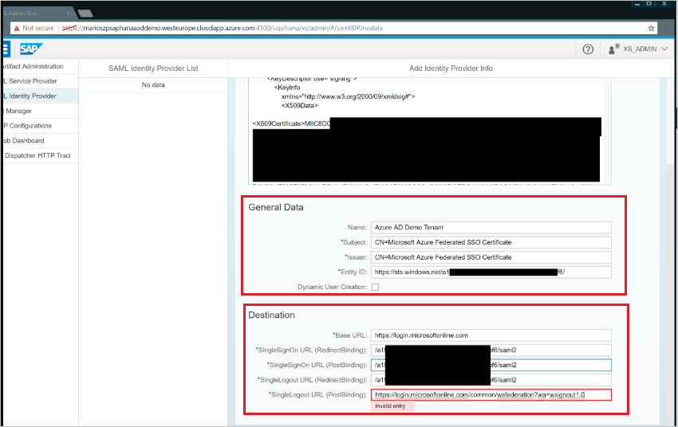
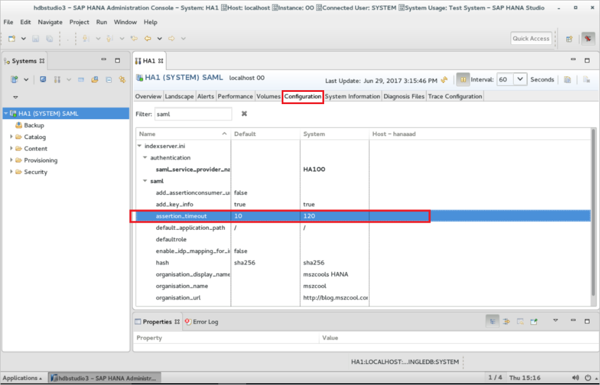

# Tutorial: Azure Active Directory integration with SAP HANA

In this tutorial, you learn how to integrate SAP HANA with Azure Active Directory (Azure AD).
Integrating SAP HANA with Azure AD provides you with the following benefits:

* You can control in Azure AD who has access to SAP HANA.
* You can enable your users to be automatically signed-in to SAP HANA (Single Sign-On) with their Azure AD accounts.
* You can manage your accounts in one central location - the Azure portal.

If you want to know more details about SaaS app integration with Azure AD, see [What is application access and single sign-on with Azure Active Directory](../manage-apps/what-is-single-sign-on.md).
If you don't have an Azure subscription, [create a free account](https://azure.microsoft.com/free/) before you begin.

## Prerequisites

To configure Azure AD integration with SAP HANA, you need the following items:

- An Azure AD subscription
- A SAP HANA subscription that's single sign-on (SSO) enabled
- A HANA instance that's running on any public IaaS, on-premises, Azure VM, or SAP large instances in Azure
- The XSA Administration web interface, as well as HANA Studio installed on the HANA instance

> [!NOTE]
> We do not recommend using a production environment of SAP HANA to test the steps in this tutorial. Test the integration first in the development or staging environment of the application, and then use the production environment.

To test the steps in this tutorial, follow these recommendations:

* An Azure AD subscription. If you don't have an Azure AD environment, you can get one-month trial [here](https://azure.microsoft.com/pricing/free-trial/)
* SAP HANA single sign-on enabled subscription

## Scenario description

In this tutorial, you configure and test Azure AD single sign-on in a test environment.

* SAP HANA supports **IDP** initiated SSO
* SAP HANA supports **just-in-time** user provisioning

## Adding SAP HANA from the gallery

To configure the integration of SAP HANA into Azure AD, you need to add SAP HANA from the gallery to your list of managed SaaS apps.

**To add SAP HANA from the gallery, perform the following steps:**

1. In the **[Azure portal](https://portal.azure.com)**, on the left navigation panel, click **Azure Active Directory** icon.

	

2. Navigate to **Enterprise Applications** and then select the **All Applications** option.

	

3. To add new application, click **New application** button on the top of dialog.

	

4. In the search box, type **SAP HANA**, select **SAP HANA** from result panel then click **Add** button to add the application.

	 

## Configure and test Azure AD single sign-on

In this section, you configure and test Azure AD single sign-on with SAP HANA based on a test user called **Britta Simon**.
For single sign-on to work, a link relationship between an Azure AD user and the related user in SAP HANA needs to be established.

To configure and test Azure AD single sign-on with SAP HANA, you need to complete the following building blocks:

1. **[Configure Azure AD Single Sign-On](#configure-azure-ad-single-sign-on)** - to enable your users to use this feature.
2. **[Configure SAP HANA Single Sign-On](#configure-sap-hana-single-sign-on)** - to configure the Single Sign-On settings on application side.
3. **[Create an Azure AD test user](#create-an-azure-ad-test-user)** - to test Azure AD single sign-on with Britta Simon.
4. **[Assign the Azure AD test user](#assign-the-azure-ad-test-user)** - to enable Britta Simon to use Azure AD single sign-on.
5. **[Create SAP HANA test user](#create-sap-hana-test-user)** - to have a counterpart of Britta Simon in SAP HANA that is linked to the Azure AD representation of user.
6. **[Test single sign-on](#test-single-sign-on)** - to verify whether the configuration works.

### Configure Azure AD single sign-on

In this section, you enable Azure AD single sign-on in the Azure portal.

To configure Azure AD single sign-on with SAP HANA, perform the following steps:

1. In the [Azure portal](https://portal.azure.com/), on the **SAP HANA** application integration page, select **Single sign-on**.

    

2. On the **Select a Single sign-on method** dialog, select **SAML/WS-Fed** mode to enable single sign-on.

    

3. On the **Set up Single Sign-On with SAML** page, click **Edit** icon to open **Basic SAML Configuration** dialog.

	

4. On the **Set up Single Sign-On with SAML** page, perform the following steps:

    

    a. In the **Identifier** text box, type the following:
    `HA100`

    b. In the **Reply URL** text box, type a URL using the following pattern:
    `https://<Customer-SAP-instance-url>/sap/hana/xs/saml/login.xscfunc`

	> [!NOTE]
	> These values are not real. Update these values with the actual Identifier and Reply URL. Contact [SAP HANA Client support team](https://cloudplatform.sap.com/contact.html) to get these values. You can also refer to the patterns shown in the **Basic SAML Configuration** section in the Azure portal.

5. SAP HANA application expects the SAML assertions in a specific format. Configure the following claims for this application. You can manage the values of these attributes from the **User Attributes** section on application integration page. On the **Set up Single Sign-On with SAML** page, click **Edit** button to open **User Attributes** dialog.

	

6. In the **User attributes** section on the **User Attributes & Claims** dialog, perform the following steps:
 
	a. Click **Edit icon** to open the **Manage user claims** dialog.

	

	

	b. From the **Transformation** list, select **ExtractMailPrefix()**.

	c. From the **Parameter 1** list, select **user.mail**.

	d. Click **Save**.

7. On the **Set up Single Sign-On with SAML** page, in the **SAML Signing Certificate** section, click **Download** to download the **Federation Metadata XML** from the given options as per your requirement and save it on your computer.

	

### Configure SAP HANA Single Sign-On

1. To configure single sign-on on the SAP HANA side, sign in to your **HANA XSA Web Console**  by going to the respective HTTPS endpoint.

	> [!NOTE]
	> In the default configuration, the URL redirects the request to a sign-in screen, which requires the credentials of an authenticated SAP HANA database user. The user who signs in must have permissions to perform SAML administration tasks.

2. In the XSA Web Interface, go to **SAML Identity Provider**. From there, select the **+** button on the bottom of the screen to display the **Add Identity Provider Info** pane. Then take the following steps:

	

	a. In the **Add Identity Provider Info** pane, paste the contents of the Metadata XML (which you downloaded from the Azure portal) into the **Metadata** box.

	

	b. If the contents of the XML document are valid, the parsing process extracts the information that's required for the **Subject, Entity ID, and Issuer** fields in the **General data** screen area. It also extracts the information that's necessary for the URL fields in the **Destination** screen area, for example, the **Base URL and SingleSignOn URL (*)** fields.

	

	c. In the **Name** box of the **General Data** screen area, enter a name for the new SAML SSO identity provider.

	> [!NOTE]
	> The name of the SAML IDP is mandatory and must be unique. It appears in the list of available SAML IDPs that is displayed when you select SAML as the authentication method for SAP HANA XS applications to use. For example, you can do this in the **Authentication** screen area of the XS Artifact Administration tool.

3. Select **Save** to save the details of the SAML identity provider and to add the new SAML IDP to the list of known SAML IDPs.

	

4. In HANA Studio, within the system properties of the **Configuration** tab,  filter the settings by **saml**. Then adjust the **assertion_timeout** from **10 sec** to **120 sec**.

	

### Create an Azure AD test user 

The objective of this section is to create a test user in the Azure portal called Britta Simon.

1. In the Azure portal, in the left pane, select **Azure Active Directory**, select **Users**, and then select **All users**.

    

2. Select **New user** at the top of the screen.

    

3. In the User properties, perform the following steps.

    

    a. In the **Name** field enter **BrittaSimon**.
  
    b. In the **User name** field type **brittasimon\@yourcompanydomain.extension**  
    For example, BrittaSimon@contoso.com

    c. Select **Show password** check box, and then write down the value that's displayed in the Password box.

    d. Click **Create**.

### Assign the Azure AD test user

In this section, you enable Britta Simon to use Azure single sign-on by granting access to SAP HANA.

1. In the Azure portal, select **Enterprise Applications**, select **All applications**, then select **SAP HANA**.

	

2. In the applications list, type and select **SAP HANA**.

	

3. In the menu on the left, select **Users and groups**.

    

4. Click the **Add user** button, then select **Users and groups** in the **Add Assignment** dialog.

    

5. In the **Users and groups** dialog select **Britta Simon** in the Users list, then click the **Select** button at the bottom of the screen.

6. If you are expecting any role value in the SAML assertion then in the **Select Role** dialog select the appropriate role for the user from the list, then click the **Select** button at the bottom of the screen.

7. In the **Add Assignment** dialog click the **Assign** button.

### Create SAP HANA test user

To enable Azure AD users to sign in to SAP HANA, you must provision them in SAP HANA.
SAP HANA supports **just-in-time provisioning**, which is by enabled by default.

If you need to create a user manually, take the following steps:

>[!NOTE]
>You can change the external authentication that the user uses. They can authenticate with an external system such as Kerberos. For detailed information about external identities, contact your [domain administrator](https://cloudplatform.sap.com/contact.html).

1. Open the [SAP HANA Studio](https://help.sap.com/viewer/a2a49126a5c546a9864aae22c05c3d0e/2.0.01/en-us) as an administrator, and then enable the DB-User for SAML SSO.

	

2. Select the invisible check box to the left of **SAML**, and then select the **Configure** link.

3. Select **Add** to add the SAML IDP.  Select the appropriate SAML IDP, and then select **OK**.

4. Add the **External Identity** (in this case, BrittaSimon) or choose **Any**. Then select **OK**.

   > [!Note]
   > If  the **Any** check box is not selected, then the user name in HANA needs to exactly match the name of the user in the UPN before the domain suffix. (For example, BrittaSimon@contoso.com becomes BrittaSimon in HANA.)

5. For testing purposes, assign all **XS** roles to the user.

	

 	> [!TIP]
  	> You should give permissions that are appropriate for your use cases only.

6. Save the user.

### Test single sign-on 

In this section, you test your Azure AD single sign-on configuration using the Access Panel.

When you click the SAP HANA tile in the Access Panel, you should be automatically signed in to the SAP HANA for which you set up SSO. For more information about the Access Panel, see [Introduction to the Access Panel](../user-help/my-apps-portal-end-user-access.md).

## Additional Resources

- [List of Tutorials on How to Integrate SaaS Apps with Azure Active Directory](./tutorial-list.md)

- [What is application access and single sign-on with Azure Active Directory?](../manage-apps/what-is-single-sign-on.md)

- [What is Conditional Access in Azure Active Directory?](../conditional-access/overview.md)