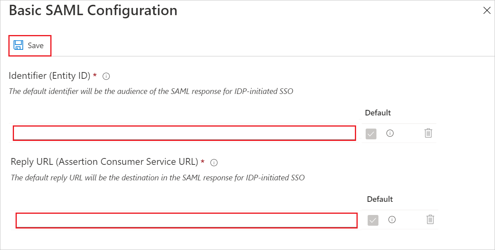
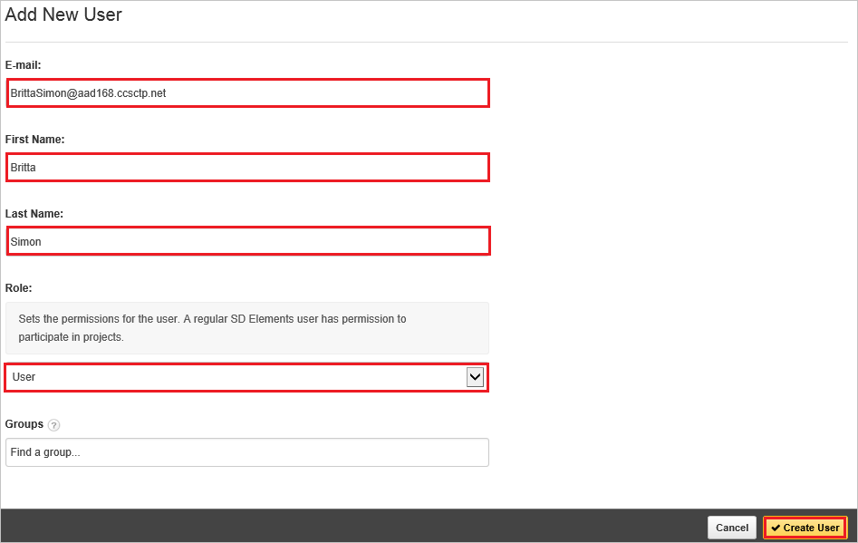

# Tutorial: Azure Active Directory integration with SD Elements

In this tutorial, you learn how to integrate SD Elements with Azure Active Directory (Azure AD).
Integrating SD Elements with Azure AD provides you with the following benefits:

* You can control in Azure AD who has access to SD Elements.
* You can enable your users to be automatically signed-in to SD Elements (Single Sign-On) with their Azure AD accounts.
* You can manage your accounts in one central location - the Azure portal.

If you want to know more details about SaaS app integration with Azure AD, see [What is application access and single sign-on with Azure Active Directory](https://docs.microsoft.com/azure/active-directory/active-directory-appssoaccess-whatis).
If you don't have an Azure subscription, [create a free account](https://azure.microsoft.com/free/) before you begin.

## Prerequisites

To configure Azure AD integration with SD Elements, you need the following items:

* An Azure AD subscription. If you don't have an Azure AD environment, you can get one-month trial [here](https://azure.microsoft.com/pricing/free-trial/)
* SD Elements single sign-on enabled subscription

## Scenario description

In this tutorial, you configure and test Azure AD single sign-on in a test environment.

* SD Elements supports **IDP** initiated SSO

## Adding SD Elements from the gallery

To configure the integration of SD Elements into Azure AD, you need to add SD Elements from the gallery to your list of managed SaaS apps.

**To add SD Elements from the gallery, perform the following steps:**

1. In the **[Azure portal](https://portal.azure.com)**, on the left navigation panel, click **Azure Active Directory** icon.

	

2. Navigate to **Enterprise Applications** and then select the **All Applications** option.

	

3. To add new application, click **New application** button on the top of dialog.

	

4. In the search box, type **SD Elements**, select **SD Elements** from result panel then click **Add** button to add the application.

	

## Configure and test Azure AD single sign-on

In this section, you configure and test Azure AD single sign-on with SD Elements based on a test user called **Britta Simon**.
For single sign-on to work, a link relationship between an Azure AD user and the related user in SD Elements needs to be established.

To configure and test Azure AD single sign-on with SD Elements, you need to complete the following building blocks:

1. **[Configure Azure AD Single Sign-On](#configure-azure-ad-single-sign-on)** - to enable your users to use this feature.
2. **[Configure SD Elements Single Sign-On](#configure-sd-elements-single-sign-on)** - to configure the Single Sign-On settings on application side.
3. **[Create an Azure AD test user](#create-an-azure-ad-test-user)** - to test Azure AD single sign-on with Britta Simon.
4. **[Assign the Azure AD test user](#assign-the-azure-ad-test-user)** - to enable Britta Simon to use Azure AD single sign-on.
5. **[Create SD Elements test user](#create-sd-elements-test-user)** - to have a counterpart of Britta Simon in SD Elements that is linked to the Azure AD representation of user.
6. **[Test single sign-on](#test-single-sign-on)** - to verify whether the configuration works.

### Configure Azure AD single sign-on

In this section, you enable Azure AD single sign-on in the Azure portal.

To configure Azure AD single sign-on with SD Elements, perform the following steps:

1. In the [Azure portal](https://portal.azure.com/), on the **SD Elements** application integration page, select **Single sign-on**.

    

2. On the **Select a Single sign-on method** dialog, select **SAML/WS-Fed** mode to enable single sign-on.

    

3. On the **Set up Single Sign-On with SAML** page, click **Edit** icon to open **Basic SAML Configuration** dialog.

	

4. On the **Set up Single Sign-On with SAML** page, perform the following steps:

    

    a. In the **Identifier** text box, type a URL using the following pattern:
    `https://<tenantname>.sdelements.com/sso/saml2/metadata`

    b. In the **Reply URL** text box, type a URL using the following pattern:
    `https://<tenantname>.sdelements.com/sso/saml2/acs/`

	> [!NOTE]
	> These values are not real. Update these values with the actual Identifier and Reply URL. Contact [SD Elements Client support team](mailto:support@sdelements.com) to get these values. You can also refer to the patterns shown in the **Basic SAML Configuration** section in the Azure portal.

5. Your SD Elements application expects the SAML assertions in a specific format, which requires you to add custom attribute mappings to your SAML token attributes configuration. The following screenshot shows the list of default attributes. Click **Edit** icon to open **User Attributes** dialog.

	

6. In the **User Claims** section on the **User Attributes** dialog, edit the claims by using **Edit icon** or add the claims by using **Add new claim** to configure SAML token attribute as shown in the image above and perform the following steps:

	| Name |  Source Attribute|
    | --- | --- |
	| email |user.mail |
	| firstname |user.givenname |
	| lastname |user.surname |

	a. Click **Add new claim** to open the **Manage user claims** dialog.

	

	

	b. In the **Name** textbox, type the attribute name shown for that row.

	c. Leave the **Namespace** blank.

	d. Select Source as **Attribute**.

	e. From the **Source attribute** list, type the attribute value shown for that row.

	f. Click **Ok**

	g. Click **Save**.

7. On the **Set up Single Sign-On with SAML** page, in the **SAML Signing Certificate** section, click **Download** to download the **Certificate (Base64)** from the given options as per your requirement and save it on your computer.

	

8. On the **Set up SD Elements** section, copy the appropriate URL(s) as per your requirement.

	

	a. Login URL

	b. Azure AD Identifier

	c. Logout URL

### Configure SD Elements Single Sign-On

1. To get single sign-on enabled, contact your [SD Elements support team](mailto:support@sdelements.com) and provide them with the downloaded certificate file.

1. In a different browser window, sign-on to your SD Elements tenant as an administrator.

1. In the menu on the top, click **System**, and then **Single Sign-on**.

    

1. On the **Single Sign-On Settings** dialog, perform the following steps:

    

    a. As **SSO Type**, select **SAML**.

    b. In the **Identity Provider Entity ID** textbox, paste the value of **Azure AD Identifier**, which you have copied from Azure portal.

    c. In the **Identity Provider Single Sign-On Service** textbox, paste the value of **Login URL**, which you have copied from Azure portal.

    d. Click **Save**.

### Create an Azure AD test user

The objective of this section is to create a test user in the Azure portal called Britta Simon.

1. In the Azure portal, in the left pane, select **Azure Active Directory**, select **Users**, and then select **All users**.

    

2. Select **New user** at the top of the screen.

    

3. In the User properties, perform the following steps.

    

    a. In the **Name** field enter **BrittaSimon**.
  
    b. In the **User name** field type **brittasimon@yourcompanydomain.extension**  
    For example, BrittaSimon@contoso.com

    c. Select **Show password** check box, and then write down the value that's displayed in the Password box.

    d. Click **Create**.

### Assign the Azure AD test user

In this section, you enable Britta Simon to use Azure single sign-on by granting access to SD Elements.

1. In the Azure portal, select **Enterprise Applications**, select **All applications**, then select **SD Elements**.

	

2. In the applications list, select **SD Elements**.

	

3. In the menu on the left, select **Users and groups**.

    

4. Click the **Add user** button, then select **Users and groups** in the **Add Assignment** dialog.

    

5. In the **Users and groups** dialog select **Britta Simon** in the Users list, then click the **Select** button at the bottom of the screen.

6. If you are expecting any role value in the SAML assertion then in the **Select Role** dialog select the appropriate role for the user from the list, then click the **Select** button at the bottom of the screen.

7. In the **Add Assignment** dialog click the **Assign** button.

### Create SD Elements test user

The objective of this section is to create a user called Britta Simon in SD Elements. In the case of SD Elements, creating SD Elements users is a manual task.

**To create Britta Simon in SD Elements, perform the following steps:**

1. In a web browser window, sign-on to your SD Elements company site as an administrator.

1. In the menu on the top, click **User Management**, and then **Users**.

     

1. Click **Add New User**.

    

1. On the **Add New User** dialog, perform the following steps:

     

    a. In the **E-mail** textbox, enter the email of user like **brittasimon@contoso.com**.

    b. In the **First Name** textbox, enter the first name of user like **Britta**.

    c. In the **Last Name** textbox, enter the last name of user like **Simon**.

    d. As **Role**, select **User**.

    e. Click **Create User**.

### Test single sign-on

In this section, you test your Azure AD single sign-on configuration using the Access Panel.

When you click the SD Elements tile in the Access Panel, you should be automatically signed in to the SD Elements for which you set up SSO. For more information about the Access Panel, see [Introduction to the Access Panel](https://docs.microsoft.com/azure/active-directory/active-directory-saas-access-panel-introduction).

## Additional Resources

- [List of Tutorials on How to Integrate SaaS Apps with Azure Active Directory](https://docs.microsoft.com/azure/active-directory/active-directory-saas-tutorial-list)

- [What is application access and single sign-on with Azure Active Directory?](https://docs.microsoft.com/azure/active-directory/active-directory-appssoaccess-whatis)

- [What is Conditional Access in Azure Active Directory?](https://docs.microsoft.com/azure/active-directory/conditional-access/overview)