# Tutorial: Azure Active Directory single sign-on (SSO) integration with SharePoint on-premises

In this tutorial, you'll learn how to integrate SharePoint on-premises with Azure Active Directory (Azure AD). When you integrate SharePoint on-premises with Azure AD, you can:

* Control in Azure AD who has access to SharePoint on-premises.
* Enable your users to be automatically signed-in to SharePoint on-premises with their Azure AD accounts.
* Manage your accounts in one central location - the Azure portal.

To learn more about SaaS app integration with Azure AD, see [What is application access and single sign-on with Azure Active Directory](https://docs.microsoft.com/azure/active-directory/manage-apps/what-is-single-sign-on).

## Prerequisites

To get started, you need the following items:

* An Azure AD subscription. If you don't have a subscription, you can get a [free account](https://azure.microsoft.com/free/).
* SharePoint on-premises single sign-on (SSO) enabled subscription.

## Scenario description

In this tutorial, you configure and test Azure AD SSO in a test environment.

* SharePoint on-premises supports **SP** initiated SSO
* Once you configure SharePoint on-premises you can enforce session controls, which protect exfiltration and infiltration of your organization’s sensitive data in real-time. Session control extend from Conditional Access. [Learn how to enforce session control with Microsoft Cloud App Security](https://docs.microsoft.com/cloud-app-security/proxy-deployment-any-app).
* Please refer this [Link](https://docs.microsoft.com/archive/blogs/kaevans/sharepoint-2013-user-profile-sync-for-claims-users) to learn how to sync User Profiles from SharePoint On-Premise to Azure AD

## Adding SharePoint on-premises from the gallery

To configure the integration of SharePoint on-premises into Azure AD, you need to add SharePoint on-premises from the gallery to your list of managed SaaS apps.

1. Sign in to the [Azure portal](https://portal.azure.com) using either a work or school account, or a personal Microsoft account.
1. On the left navigation pane, select the **Azure Active Directory** service.

    > [!NOTE]
    > If the element should not be available, it can also be opened through the fixed **All services** link at the top of the left navigation panel. In the following overview, the **Azure Active Directory** link is located in the **Identity** section or it can be searched for by using the filter text box.

1. Navigate to **Enterprise Applications** and then select **All Applications**.
1. To add new application, select **New application**.
1. In the **Add from the gallery** section, type **SharePoint on-premises** in the search box.
1. Select **SharePoint on-premises** from results panel and then add the app. Wait a few seconds while the app is added to your tenant.

## Configure and test Azure AD single sign-on for SharePoint on-premises

Configure and test Azure AD SSO with SharePoint on-premises using a test user called **B.Simon**. For SSO to work, you need to establish a link relationship between an Azure AD user and the related user in SharePoint on-premises.

To configure and test Azure AD SSO with SharePoint on-premises, complete the following building blocks:

1. **[Configure Azure AD Single Sign-On](#configure-azure-ad-single-sign-on)** - to enable your users to use this feature.
2. **[Configure SharePoint on-premises Single Sign-On](#configure-sharepoint-on-premises-single-sign-on)** - to configure the Single Sign-On settings on application side.
3. **[Create an Azure AD test user](#create-an-azure-ad-test-user)** - to test Azure AD single sign-on with Britta Simon.
4. **[Create an Azure AD Security Group in the Azure portal](#create-an-azure-ad-security-group-in-the-azure-portal)** - to enable a new security group in Azure AD for single sign-on.
5. **[Grant access to SharePoint on-premises Security Group](#grant-access-to-sharepoint-on-premises-security-group)** - grant access for particular group to Azure AD.
6. **[Assign the Azure AD Security Group in the Azure portal](#assign-the-azure-ad-security-group-in-the-azure-portal)** - to assign the particular group to Azure AD for authentication.
7. **[Test single sign-on](#test-single-sign-on)** - to verify whether the configuration works.

### Configure Azure AD single sign-on

In this section, you enable Azure AD single sign-on in the Azure portal.

To configure Azure AD single sign-on with SharePoint on-premises, perform the following steps:

1. In the [Azure portal](https://portal.azure.com/), on the **SharePoint on-premises** application integration page, select **Single sign-on**.

    

2. On the **Select a Single sign-on method** dialog, select **SAML/WS-Fed** mode to enable single sign-on.

    

3. On the **Set up Single Sign-On with SAML** page, click **Edit** icon to open **Basic SAML Configuration** dialog.

	

4. On the **Basic SAML Configuration** section, perform the following steps:


    a. In the **Sign-on URL** text box, type a URL using the following pattern:
    `https://<YourSharePointServerURL>/_trust/default.aspx`

    b. In the **Identifier** box, type a URL using the following pattern:
    `urn:sharepoint:federation`

    c. In the **Reply URL** text box, type a URL using the following pattern:
    `https://<YourSharePointServerURL>/_trust/default.aspx`

	> [!NOTE]
	> These values are not real. Update these values with the actual Sign-On URL, Identifier and Reply URL. Contact [SharePoint on-premises Client support team](https://support.office.com/) to get these values. You can also refer to the patterns shown in the **Basic SAML Configuration** section in the Azure portal.

5. On the **Set up Single Sign-On with SAML** page, in the **SAML Signing Certificate** section, click **Download** to download the **Certificate (Base64)** from the given options as per your requirement and save it on your computer.

	

    > [!Note]
	> Please note down the file path to which you have downloaded the certificate file, as you need to use it later in the PowerShell script for configuration.

6. On the **Set up SharePoint on-premises** section, copy the appropriate URL(s) as per your requirement. For **Single Sign-On Service URL**, use a value of the following pattern: `https://login.microsoftonline.com/_my_directory_id_/wsfed`

    > [!Note]
    > _my_directory_id_ is the tenant id of Azure Ad subscription.

	

	a. Login URL

	b. Azure AD Identifier

	c. Logout URL

    > [!NOTE]
	> Sharepoint On-Premises application uses SAML 1.1 token, so Azure AD expects WS Fed request from SharePoint server and after authentication, it issues the SAML 1.1. token.

### Configure SharePoint on-premises Single Sign-On

1. In a different web browser window, sign in to your SharePoint on-premises company site as an administrator.

2. **Configure a new trusted identity provider in SharePoint Server 2016**

	Sign into the SharePoint Server 2016 server and open the SharePoint 2016 Management Shell. Fill in the values of $realm (Identifier value from the SharePoint on-premises Domain and URLs section in the Azure portal), $wsfedurl (Single Sign-On Service URL), and $filepath (file path to which you have downloaded the certificate file) from Azure portal and run the following commands to configure a new trusted identity provider.

	> [!TIP]
	> If you're new to using PowerShell or want to learn more about how PowerShell works, see [SharePoint PowerShell](https://docs.microsoft.com/powershell/sharepoint/overview?view=sharepoint-ps).

	```
	$realm = "<Identifier value from the SharePoint on-premises Domain and URLs section in the Azure portal>"
	$wsfedurl="<SAML single sign-on service URL value which you have copied from the Azure portal>"
	$filepath="<Full path to SAML signing certificate file which you have downloaded from the Azure portal>"
	$cert = New-Object System.Security.Cryptography.X509Certificates.X509Certificate2($filepath)
	New-SPTrustedRootAuthority -Name "AzureAD" -Certificate $cert
	$map = New-SPClaimTypeMapping -IncomingClaimType "http://schemas.xmlsoap.org/ws/2005/05/identity/claims/name" -IncomingClaimTypeDisplayName "name" -LocalClaimType "http://schemas.xmlsoap.org/ws/2005/05/identity/claims/upn"
	$map2 = New-SPClaimTypeMapping -IncomingClaimType "http://schemas.xmlsoap.org/ws/2005/05/identity/claims/givenname" -IncomingClaimTypeDisplayName "GivenName" -SameAsIncoming
	$map3 = New-SPClaimTypeMapping -IncomingClaimType "http://schemas.xmlsoap.org/ws/2005/05/identity/claims/surname" -IncomingClaimTypeDisplayName "SurName" -SameAsIncoming
	$map4 = New-SPClaimTypeMapping -IncomingClaimType "http://schemas.xmlsoap.org/ws/2005/05/identity/claims/emailaddress" -IncomingClaimTypeDisplayName "Email" -SameAsIncoming
	$map5 = New-SPClaimTypeMapping -IncomingClaimType "http://schemas.microsoft.com/ws/2008/06/identity/claims/role" -IncomingClaimTypeDisplayName "Role" -SameAsIncoming
	$ap = New-SPTrustedIdentityTokenIssuer -Name "AzureAD" -Description "SharePoint secured by Azure AD" -realm $realm -ImportTrustCertificate $cert -ClaimsMappings $map,$map2,$map3,$map4,$map5 -SignInUrl $wsfedurl -IdentifierClaim "http://schemas.xmlsoap.org/ws/2005/05/identity/claims/name"
	```

	Next, follow these steps to enable the trusted identity provider for your application:

	a. In Central Administration, navigate to **Manage Web Application** and select the web application that you wish to secure with Azure AD.

	b. In the ribbon, click **Authentication Providers** and choose the zone that you wish to use.

	c. Select **Trusted Identity provider** and select the identify provider you just registered named *AzureAD*.

	d. On the sign-in page URL setting, select **Custom sign in page** and provide the value “/_trust/”.

	e. Click **OK**.

	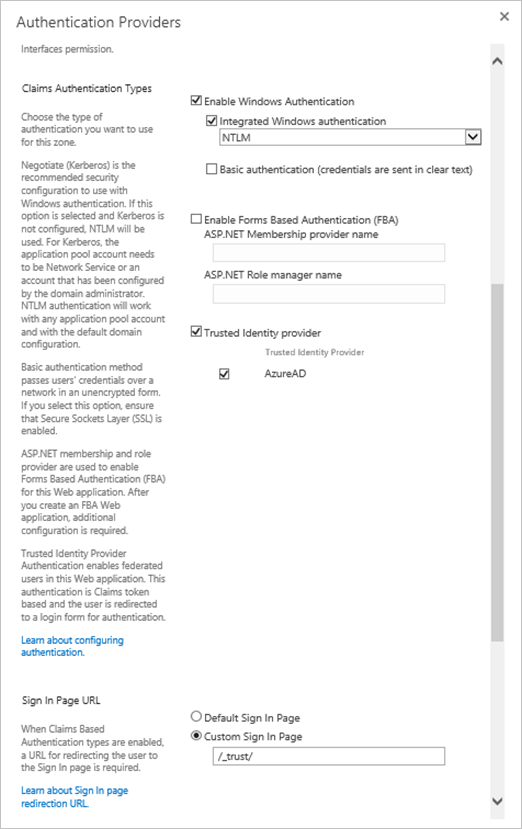

	> [!NOTE]
	> Some of the external users will not able to use this single sign-on integration as their UPN will have mangled value something like `MYEMAIL_outlook.com#ext#@TENANT.onmicrosoft.com`. Soon we will allow customers app config on how to handle the UPN depending on the user type. After that all your guest users should be able to use SSO seamlessly as the organization employees.

### Create an Azure AD test user

The objective of this section is to create a test user in the Azure portal called Britta Simon.

1. In the Azure portal, in the left pane, select **Azure Active Directory**, select **Users**, and then select **All users**.

    

2. Select **New user** at the top of the screen.

    

3. In the User properties, perform the following steps.

    

    a. In the **Name** field enter **BrittaSimon**.
  
    b. In the **User name** field type `brittasimon@yourcompanydomain.extension`  
    For example, BrittaSimon@contoso.com

    c. Select **Show password** check box, and then write down the value that's displayed in the Password box.

    d. Click **Create**.

### Create an Azure AD Security Group in the Azure portal

1. Click on **Azure Active Directory > All Groups**.

	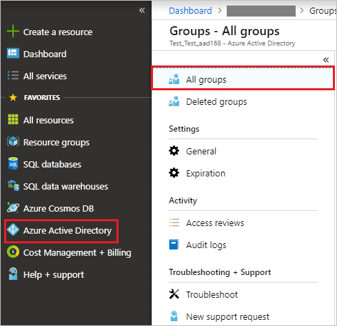

2. Click **New group**:

	

3. Fill in **Group type**, **Group name**, **Group description**, **Membership type**. Click on the arrow to select members, then search for or click on the member you will like to add to the group. Click on **Select** to add the selected members, then click on **Create**.

	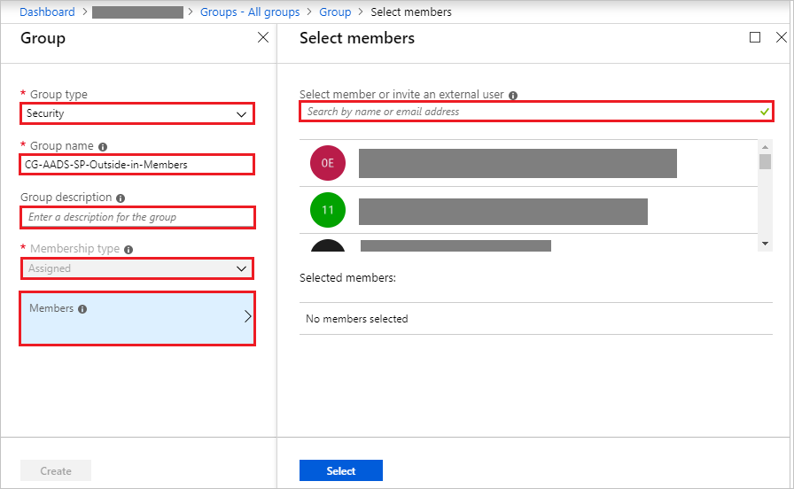

	> [!NOTE]
	> In order to assign Azure Active Directory Security Groups to SharePoint on-premises, it will be necessary to install and configure [AzureCP](https://yvand.github.io/AzureCP/) in the on-premises SharePoint farm OR develop and configure an alternative custom claims provider for SharePoint.  See the more information section at the end of the document for creating your own custom claims provider, if you don’t use AzureCP.

### Grant access to SharePoint on-premises Security Group

**Configure Security Groups and Permissions on the App Registration**

1. In the Azure portal, select **Azure Active Directory**, then select **App registrations**.

	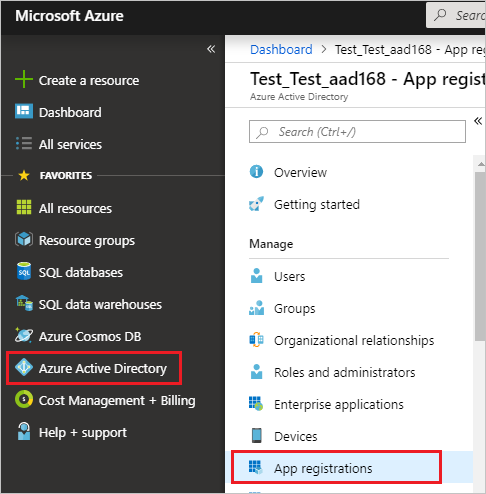

2. In the search box, type and select **SharePoint on-premises**.

	

3. Click on **Manifest**.

	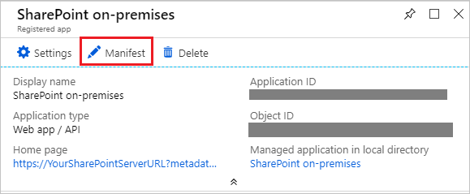

4. Modify `groupMembershipClaims`: `NULL`, To `groupMembershipClaims`: `SecurityGroup`. Then, click on Save

	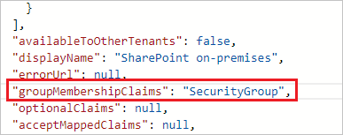

5. Click on **Settings**, then click on **Required permissions**.

	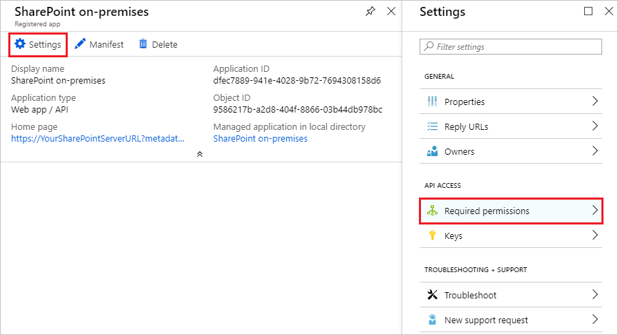

6. Click on **Add** and then **Select an API**.

	

7. Add both **Windows Azure Active Directory** and **Microsoft Graph API**, but it’s only possible to select one at a time.

	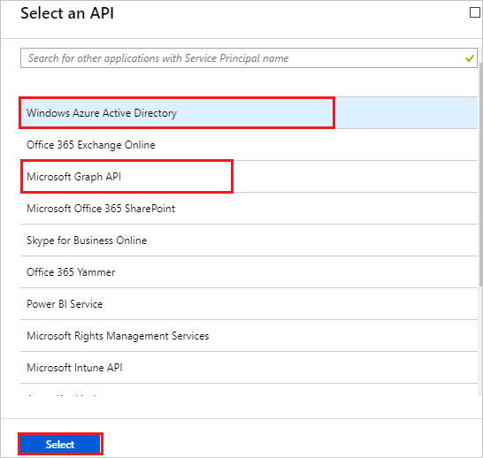

8. Select Windows Azure Active Directory, check Read directory data and click on Select. Go back and add Microsoft Graph and select Read directory data for it, as well.  Click on Select and click on Done.

	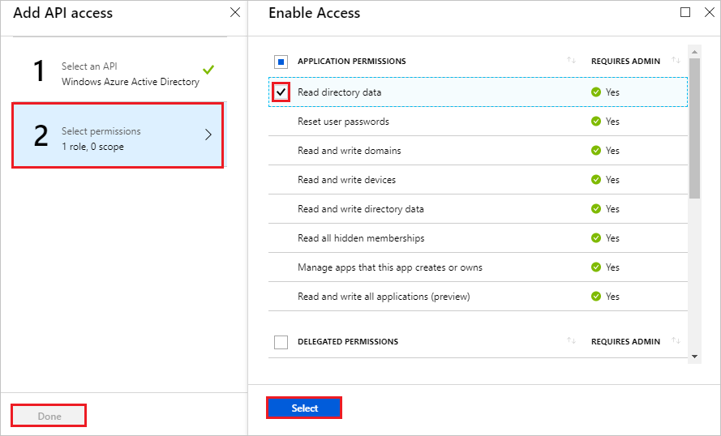

9. Now, under Required Settings, click on **Grant permissions** and then Click Yes to Grant permissions.

	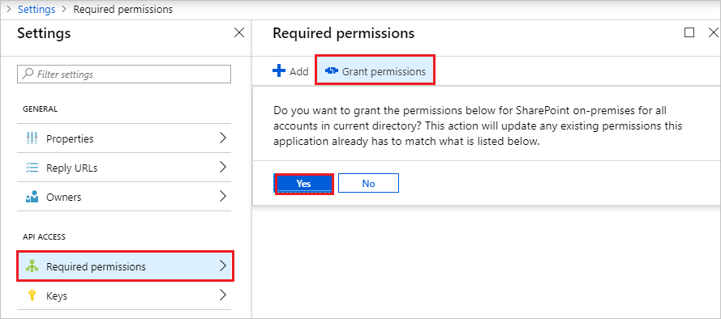

	> [!NOTE]
	> Check under notifications to determine if the permissions were successfully granted.  If they are not, then the AzureCP will not work properly and it won’t be possible to configure SharePoint on-premises with Azure Active Directory Security Groups.

10. Configure the AzureCP on the SharePoint on-premises farm or an alternative custom claims provider solution.  In this example, we are using AzureCP.

	> [!NOTE]
	> Please note that AzureCP is not a Microsoft product or supported by Microsoft Technical Support. Download, install and configure AzureCP on the on-premises SharePoint farm per [https://yvand.github.io/AzureCP/](https://yvand.github.io/AzureCP/) 

11. **Grant access to the Azure Active Directory Security Group in the on-premises SharePoint** :- The groups must be granted access to the application in SharePoint on-premises.  Use the following steps to set the permissions to access the web application.

12. In Central Administration, click on Application Management, Manage web applications, then select the web application to activate the ribbon and click on User Policy.

	

13. Under Policy for Web Application, click on Add Users, then select the zone, click on Next.  Click on the Address Book.

	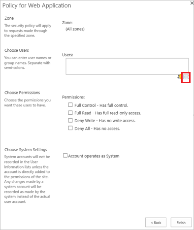

14. Then, search for and add the Azure Active Directory Security Group and click on OK.

	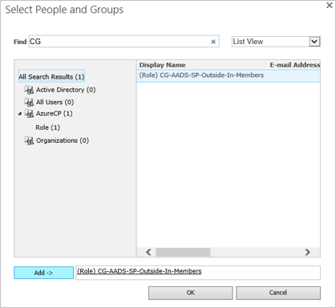

15. Select the Permissions, then click on Finish.

	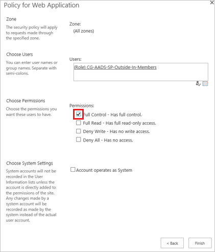

16. See under Policy for Web Application, the Azure Active Directory Group is added.  The group claim shows the Azure Active Directory Security Group Object ID for the User Name.

	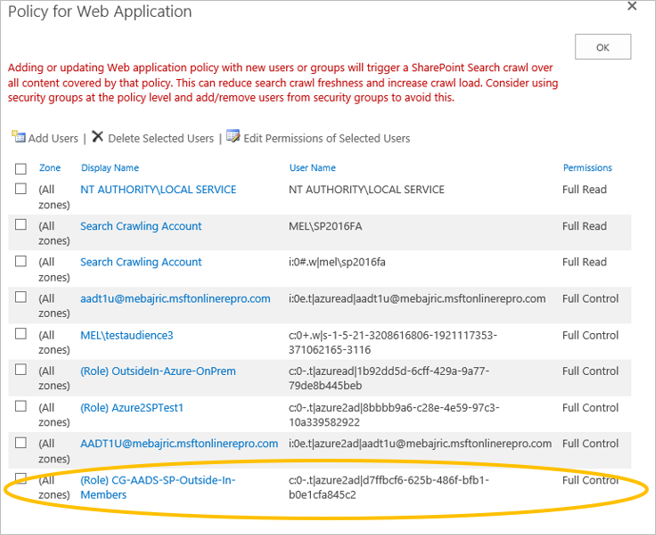

17. Browse to the SharePoint site collection and add the Group there, as well. Click on Site Settings, then click Site permissions and Grant Permissions.  Search for the Group Role claim, assign the permission level and click Share.

	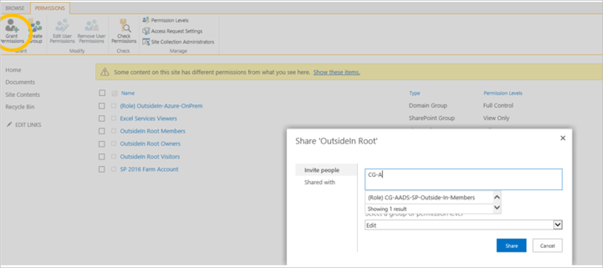

### Configuring one trusted identity provider for multiple web applications

The configuration works for a single web application, but needs additional configuration if you intend to use the same trusted identity provider for multiple web applications. For example, assume we had extended a web application to use the URL `https://portal.contoso.local` and now want to authenticate the users to `https://sales.contoso.local` as well. To do this, we need to update the identity provider to honor the WReply parameter and update the application registration in Azure AD to add a reply URL.

1. In the Azure portal, open the Azure AD directory. Click **App registrations**, then click **View all applications**. Click the application that you created previously (SharePoint SAML Integration).

2. Click **Settings**.

3. In the settings blade, click **Reply URLs**.

4. Add the URL for the additional web application with `/_trust/default.aspx` appended to the URL (such as `https://sales.contoso.local/_trust/default.aspx`) and click **Save**.

5. On the SharePoint server, open the **SharePoint 2016 Management Shell** and execute the following commands, using the name of the trusted identity token issuer that you used previously.

	```
	$t = Get-SPTrustedIdentityTokenIssuer "AzureAD"
	$t.UseWReplyParameter=$true
	$t.Update()
	```

6. In Central Administration, go to the web application and enable the existing trusted identity provider. Remember to also configure the sign-in page URL as a custom sign in page `/_trust/`.

7. In Central Administration, click the web application and choose **User Policy**. Add a user with the appropriate permissions as demonstrated previously in this article.

### Fixing People Picker

Users can now sign into SharePoint 2016 using identities from Azure AD, but there are still opportunities for improvement to the user experience. For instance, searching for a user presents multiple search results in the people picker. There is a search result for each of the 3 claim types that were created in the claim mapping. To choose a user using the people picker, you must type their user name exactly and choose the **name** claim result.

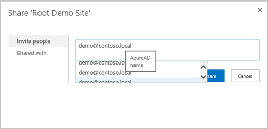

There is no validation on the values you search for, which can lead to misspellings or users accidentally choosing the wrong claim type to assign such as the **SurName** claim. This can prevent users from successfully accessing resources.

To assist with this scenario, there is an open-source solution called [AzureCP](https://yvand.github.io/AzureCP/) that provides a custom claims provider for SharePoint 2016. It will use the Microsoft Graph API to resolve what users enter and perform validation. Learn more at [AzureCP](https://yvand.github.io/AzureCP/).

### Assign the Azure AD Security Group in the Azure portal

1. In the Azure portal, select **Enterprise Applications**, select **All applications**, then select **SharePoint on-premises**.

	

2. In the applications list, type and select **SharePoint on-premises**.

	

3. In the menu on the left, select **Users and groups**.

    

4. Click the **Add user**.

    

5. Search for the Security Group you want to use, then click on the group to add it to the Select members section. Click **Select**, then click **Assign**.

    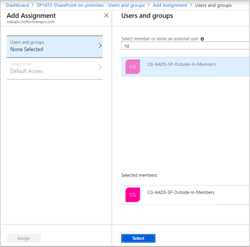

	> [!NOTE]
	> Check the notifications in the menu bar to be notified that the Group was successfully assigned to the Enterprise application in the Azure portal.

### Create SharePoint on-premises test user

In this section, you create a user called Britta Simon in SharePoint on-premises. Work with [SharePoint on-premises support team](https://support.office.com/) to add the users in the SharePoint on-premises platform. Users must be created and activated before you use single sign-on.

### Test single sign-on

In this section, you test your Azure AD single sign-on configuration using the Access Panel.

When you click the SharePoint on-premises tile in the Access Panel, you should be automatically signed in to the SharePoint on-premises for which you set up SSO. For more information about the Access Panel, see [Introduction to the Access Panel](https://docs.microsoft.com/azure/active-directory/active-directory-saas-access-panel-introduction).

## Additional resources

- [List of Tutorials on How to Integrate SaaS Apps with Azure Active Directory](https://docs.microsoft.com/azure/active-directory/active-directory-saas-tutorial-list)

- [What is application access and single sign-on with Azure Active Directory?](https://docs.microsoft.com/azure/active-directory/manage-apps/what-is-single-sign-on)

- [What is Conditional Access in Azure Active Directory?](https://docs.microsoft.com/azure/active-directory/conditional-access/overview)

- [What is session control in Microsoft Cloud App Security?](https://docs.microsoft.com/cloud-app-security/proxy-intro-aad)