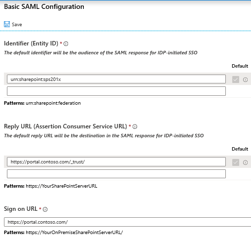
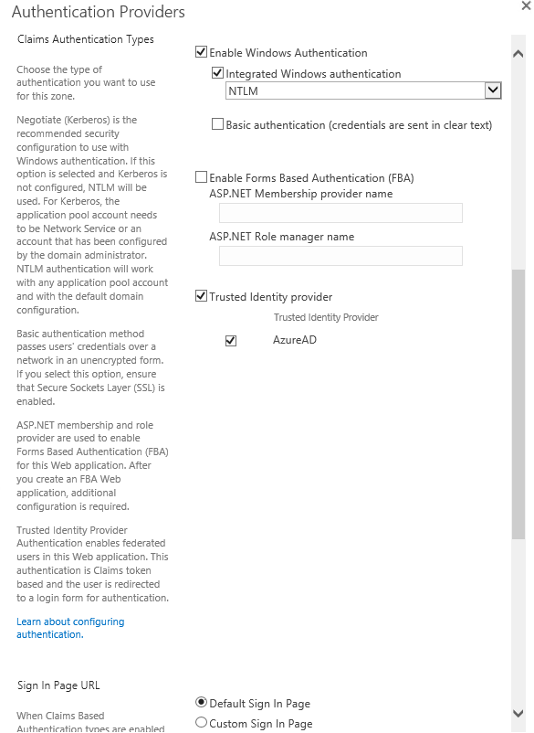
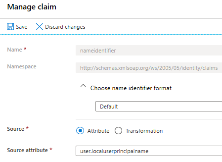
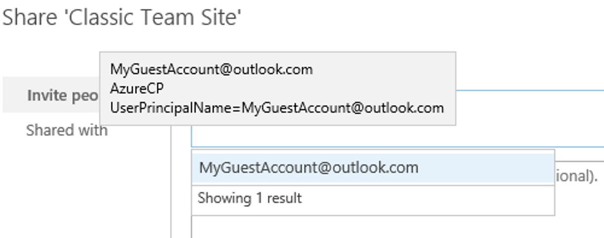

# Tutorial: Azure Active Directory single sign-on integration with SharePoint on-premises

In this tutorial, you learn how to integrate SharePoint on-premises with Azure Active Directory (Azure AD). When you integrate SharePoint on-premises with Azure AD, you can:

* Control who has access to SharePoint on-premises in Azure AD.
* Enable your users to be automatically signed in to SharePoint on-premises with their Azure AD accounts.
* Manage your accounts in the Azure portal.

## Prerequisites

To configure Azure AD integration with SharePoint on-premises, you need these items:

* An Azure AD subscription. If you don't have an Azure AD environment, you can get a [free account](https://azure.microsoft.com/free/).
* A SharePoint 2013 farm or newer.

## Scenario description

In this tutorial, you configure and test Azure AD single sign-on (SSO) in a test environment. Users from Azure AD are able to access your SharePoint on-premises.

## Create enterprise applications in the Azure portal

To configure the integration of SharePoint on-premises into Azure AD, you need to add SharePoint on-premises from the gallery to your list of managed SaaS apps.

To add SharePoint on-premises from the gallery:

1. In the Azure portal, on the leftmost pane, select **Azure Active Directory**.

   > [!NOTE]
   > If the element isn't available, you can also open it through the **All services** link at the top of the leftmost pane. In the following overview, the **Azure Active Directory** link is located in the **Identity** section. You can also search for it by using the filter box.

1. Go to **Enterprise applications**, and then select **All applications**.

1. To add a new application, select **New application** at the top of the dialog box.

1. In the search box, enter **SharePoint on-premises**. Select **SharePoint on-premises** from the result pane.

    <kbd></kbd>

1. Specify a name for your SharePoint on-premises instance, and select **Add** to add the application.

1. In the new enterprise application, select **Properties**, and check the value for **User assignment required?**.

   <kbd></kbd>

   In this scenario, the value is set to **No**.

## Configure and test Azure AD

In this section, you configure Azure AD SSO with SharePoint on-premises. For SSO to work, you establish a link relationship between an Azure AD user and the related user in SharePoint on-premises.

To configure and test Azure AD SSO with SharePoint on-premises, complete these building blocks:

- [Configure Azure AD SSO](#configure-azure-ad-sso) to enable your users to use this feature.
- [Configure SharePoint on-premises](#configure-sharepoint-on-premises) to configure the SSO settings on the application side.
- [Create an Azure AD test user in the Azure portal](#create-an-azure-ad-test-user-in-the-azure-portal) to create a new user in Azure AD for SSO.
- [Create an Azure AD security group in the Azure portal](#create-an-azure-ad-security-group-in-the-azure-portal) to create a new security group in Azure AD for SSO.
- [Grant permissions to an Azure AD account in SharePoint on-premises](#grant-permissions-to-an-azure-ad-account-in-sharepoint-on-premises) to give permissions to an Azure AD user.
- [Grant permissions to an Azure AD group in SharePoint on-premises](#grant-permissions-to-an-azure-ad-group-in-sharepoint-on-premises) to give permissions to an Azure AD group.
- [Grant access to a guest account to SharePoint on-premises in the Azure portal](#grant-access-to-a-guest-account-to-sharepoint-on-premises-in-the-azure-portal) to give permissions to a guest account in Azure AD for SharePoint on-premises.
- [Configure the trusted identity provider for multiple web applications](#configure-the-trusted-identity-provider-for-multiple-web-applications) to use the same trusted identity provider for multiple web applications.

### Configure Azure AD SSO

In this section, you enable Azure AD SSO in the Azure portal.

To configure Azure AD SSO with SharePoint on-premises:

1. In the Azure portal, select **Azure Active Directory** > **Enterprise applications**. Select the previously created enterprise application name, and select **Single sign-on**.

1. In the **Select a Single sign-on method** dialog box, select the **SAML** mode to enable SSO.
 
1. On the **Set up Single Sign-On with SAML** page, select the **Edit** icon to open the **Basic SAML Configuration** dialog box.

1. In the **Basic SAML Configuration** section, follow these steps:

    

    1. In the **Identifier** box, enter a URL by using this pattern:
    `urn:<sharepointFarmName>:<federationName>`.

    1. In the **Reply URL** box, enter a URL by using this pattern:
    `https://<YourSharePointSiteURL>/_trust/`.

    1. In the **Sign on URL** box, enter a URL by using this pattern:
    `https://<YourSharePointSiteURL>/`.
	1. Select **Save**.

	> [!NOTE]
	> These values aren't real. Update these values with the actual sign-on URL, identifier, and reply URL.

1. On the **Set up Single Sign-On with SAML** page, in the **SAML Signing Certificate** section, select **Download** to download the **Certificate (Base64)** from the given options based on your requirements and save it on your computer.

	

1. In the **Set up SharePoint on-premises** section, copy the appropriate URLs based on your requirement:
    
	- **Login URL**
	
	    Copy the login URL and replace **/saml2** at the end with **/wsfed** so that it looks like https://login.microsoftonline.com/2c4f1a9f-be5f-10ee-327d-a95dac567e4f/wsfed. (This URL isn't accurate.)

    - **Azure AD Identifier**
	- **Logout URL**

    > [!NOTE]
    > This URL can't be used as is in SharePoint. You must replace **/saml2** with **/wsfed**. The SharePoint on-premises application uses a SAML 1.1 token, so Azure AD expects a WS Fed request from the SharePoint server. After authentication, it issues the SAML 1.1 token.

### Configure SharePoint on-premises

1. Create a new trusted identity provider in SharePoint Server 2016.

    Sign in to the SharePoint server, and open the SharePoint Management Shell. Fill in the values:
    - **$realm** is the identifier value from the SharePoint on-premises domain and URLs section in the Azure portal.
    - **$wsfedurl** is the SSO service URL.
    - **$filepath** is the file path to which you have downloaded the certificate file from the Azure portal.

    Run the following commands to configure a new trusted identity provider.

    > [!TIP]
    > If you're new to using PowerShell or want to learn more about how PowerShell works, see [SharePoint PowerShell](/powershell/sharepoint/overview).


    ```
    $realm = "urn:sharepoint:sps201x"
    $wsfedurl="https://login.microsoftonline.com/2c4f1a9f-be5f-10ee-327d-a95dac567e4f/wsfed"
    $filepath="C:\temp\SharePoint 2019 OnPrem.cer"
    $cert = New-Object System.Security.Cryptography.X509Certificates.X509Certificate2($filepath)
    New-SPTrustedRootAuthority -Name "AzureAD" -Certificate $cert
    $map1 = New-SPClaimTypeMapping -IncomingClaimType "http://schemas.xmlsoap.org/ws/2005/05/identity/claims/name" -IncomingClaimTypeDisplayName "name" -LocalClaimType "http://schemas.xmlsoap.org/ws/2005/05/identity/claims/upn"
    $map2 = New-SPClaimTypeMapping -IncomingClaimType "http://schemas.microsoft.com/ws/2008/06/identity/claims/role" -IncomingClaimTypeDisplayName "Role" -SameAsIncoming
    $ap = New-SPTrustedIdentityTokenIssuer -Name "AzureAD" -Description "Azure AD SharePoint server 201x" -realm $realm -ImportTrustCertificate $cert -ClaimsMappings $map1,$map2 -SignInUrl $wsfedurl -IdentifierClaim $map1.InputClaimType
	```
1. Enable the trusted identity provider for your application.

	1. In **Central Administration**, go to **Manage Web Application** and select the web application that you want to secure with Azure AD.

	1. On the ribbon, select **Authentication Providers** and choose the zone that you want to use.

	1. Select **Trusted Identity provider**, and select the identify provider you just registered named *AzureAD*.

	1. Select **OK**.

	

### Create an Azure AD test user in the Azure portal

The objective of this section is to create a test user in the Azure portal.

1. In the Azure portal, on the leftmost pane, select **Azure Active Directory**. In the **Manage** pane, select **Users**.

1. Select **All users** > **New user** at the top of the screen.

1. Select **Create User**, and in the user properties, follow these steps. You might be able to create users in your Azure AD by using your tenant suffix or any verified domain. 

    1. In the **Name** box, enter the user name. We used **TestUser**.
  
    1. In the **User name** box, enter `TestUser@yourcompanydomain.extension`. This example shows `TestUser@contoso.com`.

       

    1. Select the **Show password** check box, and then write down the value that appears in the **Password** box.

    1. Select **Create**.

    1. You can now share the site with TestUser@contoso.com and permit this user to access it.

### Create an Azure AD security group in the Azure portal

1. Select **Azure Active Directory** > **Groups**.

1. Select **New group**.

1. Fill in the **Group type**, **Group name**, **Group description**, and **Membership type** boxes. Select the arrows to select members, and then search for or select the members you want to add to the group. Choose **Select** to add the selected members, and then select **Create**.


### Grant permissions to an Azure AD account in SharePoint on-premises

To grant access to an Azure AD user in SharePoint on-premises, share the site collection or add the Azure AD user to one of the site collection's groups. Users can now sign in to SharePoint 201x by using identities from Azure AD, but there are still opportunities for improvement to the user experience. For instance, searching for a user presents multiple search results in the people picker. There's a search result for each of the claims types that are created in the claim mapping. To choose a user by using the people picker, you must enter their user name exactly and choose the **name** claim result.


There's no validation on the values you search for, which can lead to misspellings or users accidentally choosing the wrong claim type. This situation can prevent users from successfully accessing resources.

To fix this scenario with the people picker, an open-source solution called [AzureCP](https://yvand.github.io/AzureCP/) provides a custom claims provider for SharePoint 2013, 2016, and 2019. It uses the Microsoft Graph API to resolve what users enter and perform validation. For more information, see [AzureCP](https://yvand.github.io/AzureCP/).

  > [!NOTE]
  > Without AzureCP, you can add groups by adding the Azure AD group's ID, but this method isn't user friendly and reliable. Here's how it looks:
  > 
  >
  
### Grant permissions to an Azure AD group in SharePoint on-premises

To assign Azure AD security groups to SharePoint on-premises, it's necessary to use a custom claims provider for SharePoint server. This example uses AzureCP.

 > [!NOTE]
 > AzureCP isn't a Microsoft product and isn't supported by Microsoft Support. To download, install, and configure AzureCP on the on-premises SharePoint farm, see the [AzureCP](https://yvand.github.io/AzureCP/) website. 

1. Configure AzureCP on the SharePoint on-premises farm or an alternative custom claims provider solution. To configure AzureCP, see this [AzureCP](https://yvand.github.io/AzureCP/Register-App-In-AAD.html) website.

1. In the Azure portal, select **Azure Active Directory** > **Enterprise applications**. Select the previously created enterprise application name, and select **Single sign-on**.

1. On the **Set up Single Sign-On with SAML** page, edit the **User Attributes & Claims** section.

1. Select **Add a group claim**.

1. Select which groups associated with the user should be returned in the claim. In this case, select **All groups**. In the **Source attribute** section, select **Group ID** and select **Save**.

To grant access to the Azure AD security group in SharePoint on-premises, share the site collection or add the Azure AD security group to one of the site collection's groups.

1. Browse to **SharePoint Site Collection**. Under **Site Settings** for the site collection, select **People and groups**. 

1. Select the SharePoint group, and then select **New** > **Add Users to this Group**. As you type the name of your group, the people picker displays the Azure AD security group.

    

### Grant access to a guest account to SharePoint on-premises in the Azure portal

You can grant access to your SharePoint site to a guest account in a consistent way because the UPN now gets modified. For example, the user `jdoe@outlook.com` is represented as `jdoe_outlook.com#ext#@TENANT.onmicrosoft.com`. To share your site with external users, you need to add some modifications in your **User Attributes & Claims** section in the Azure portal.

1. In the Azure portal, select **Azure Active Directory** > **Enterprise applications**. Select the previously created enterprise application name, and select **Single sign-on**.

1. On the **Set up Single Sign-On with SAML** page, edit the **User Attributes & Claims** section.

1. In the **Required claim** zone, select **Unique User Identifier (Name ID)**.

1. Change the **Source Attribute** property to the value **user.localuserprincipalname**, and select **Save**.

    

1. Using the ribbon, go back to **SAML-based Sign-on**. Now the **User Attributes & Claims** section looks like this: 

    

    > [!NOTE]
    > A surname and given name aren't required in this setup.

1. In the Azure portal, on the leftmost pane, select **Azure Active Directory** and then select **Users**.

1. Select **New Guest User**.

1. Select the **Invite User** option. Fill in the user properties, and select **Invite**.

1. You can now share the site with MyGuestAccount@outlook.com and permit this user to access it.

    

### Configure the trusted identity provider for multiple web applications

The configuration works for a single web application, but additional configuration is needed if you intend to use the same trusted identity provider for multiple web applications. For example, assume you extended a web application to use the URL `https://sales.contoso.com` and you now want to authenticate users to `https://marketing.contoso.com`. To do this, update the identity provider to honor the WReply parameter and update the application registration in Azure AD to add a reply URL.

1. In the Azure portal, select **Azure Active Directory** > **Enterprise applications**. Select the previously created enterprise application name, and select **Single sign-on**.

1. On the **Set up Single Sign-On with SAML** page, edit **Basic SAML Configuration**.

    

1. For **Reply URL (Assertion Consumer Service URL)**, add the URL for the additional web applications and select **Save**.

    

1. On the SharePoint server, open the SharePoint 201x Management Shell and run the following commands. Use the name of the trusted identity token issuer that you used previously.
	```
	$t = Get-SPTrustedIdentityTokenIssuer "AzureAD"
	$t.UseWReplyParameter=$true
	$t.Update()
	```
1. In **Central Administration**, go to the web application and enable the existing trusted identity provider.

You might have other scenarios where you want to give access to your SharePoint on-premises instance for your internal users. For this scenario, you have to deploy Microsoft Azure Active Directory Connect to permit syncing your on-premises users with Azure AD. This setup is discussed in another article.

## Next Steps

Once you configure SharePoint on-premises you can enforce Session Control, which protects exfiltration and infiltration of your organization’s sensitive data in real time. Session Control extends from Conditional Access. [Learn how to enforce session control with Microsoft Cloud App Security](/cloud-app-security/proxy-deployment-aad)
