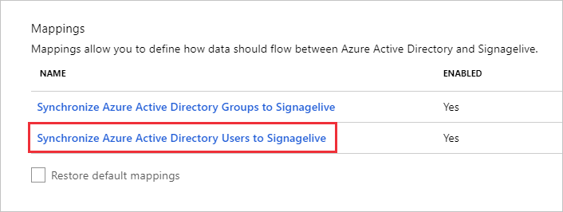
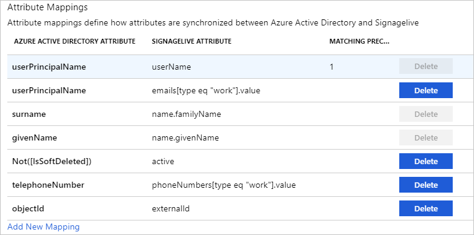
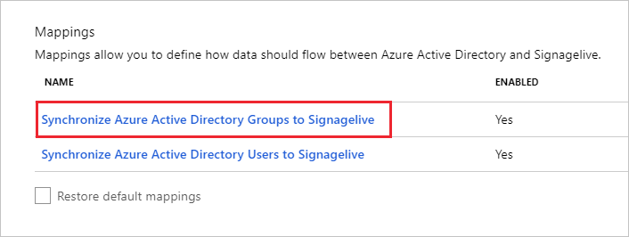

# Tutorial: Configure Signagelive  for automatic user provisioning

The objective of this tutorial is to demonstrate the steps to be performed in Signagelive  and Azure Active Directory (Azure AD) to configure Azure AD to automatically provision and de-provision users and/or groups to Signagelive.

> [!NOTE]
> This tutorial describes a connector built on top of the Azure AD User Provisioning Service. For important details on what this service does, how it works, and frequently asked questions, see [Automate user provisioning and deprovisioning to SaaS applications with Azure Active Directory](../manage-apps/user-provisioning.md).
>
> This connector is currently in Public Preview. For more information on the general Microsoft Azure terms of use for Preview features, see [Supplemental Terms of Use for Microsoft Azure Previews](https://azure.microsoft.com/support/legal/preview-supplemental-terms/).

## Prerequisites

The scenario outlined in this tutorial assumes that you already have the following prerequisites:

* An Azure AD tenant.
* [A Signagelive tenant](https://signagelive.com/pricing/)
* A user account in Signagelive with Admin permissions.

## Assigning users to Signagelive   

Azure Active Directory uses a concept called *assignments* to determine which users should receive access to selected apps. In the context of automatic user provisioning, only the users and/or groups that have been assigned to an application in Azure AD are synchronized.

Before configuring and enabling automatic user provisioning, you should decide which users and/or groups in Azure AD need access to Signagelive. Once decided, you can assign these users and/or groups to Signagelive    by following the instructions here:
* [Assign a user or group to an enterprise app](../manage-apps/assign-user-or-group-access-portal.md)

## Important tips for assigning users to Signagelive   

* It is recommended that a single Azure AD user is assigned to Signagelive    to test the automatic user provisioning configuration. Additional users and/or groups may be assigned later.

* When assigning a user to Signagelive, you must select any valid application-specific role (if available) in the assignment dialog. Users with the **Default Access** role are excluded from provisioning.

## Setup Signagelive  for provisioning

Before configuring Signagelive for automatic user provisioning with Azure AD, you will need to enable SCIM provisioning on Signagelive.

  Reach out to  [Signagelive](mailto:development@signagelive.com) to obtain the secret token needed to configure SCIM provisioning.

## Add Signagelive from the gallery

To configure Signagelive    for automatic user provisioning with Azure AD, you need to add Signagelive from the Azure AD application gallery to your list of managed SaaS applications.

**To add Signagelive from the Azure AD application gallery, perform the following steps:**

1. In the **[Azure portal](https://portal.azure.com)**, in the left navigation panel, select **Azure Active Directory**.

	

2. Go to **Enterprise applications**, and then select **All applications**.

	

3. To add a new application, select the **New application** button at the top of the pane.

	

4. In the search box, enter **Signagelive**, select **Signagelive** in the results panel, and then click the **Add** button to add the application.

	

## Configuring automatic user provisioning to Signagelive    

This section guides you through the steps to configure the Azure AD provisioning service to create, update, and disable users and/or groups in Signagelive based on user and/or group assignments in Azure AD.

> [!TIP]
>  You may also choose to enable SAML-based single sign-on for Signagelive, following the instructions provided in the [Signagelive Single sign-on tutorial](Signagelive-tutorial.md). Single sign-on can be configured independently of automatic user provisioning, though these two features compliment each other.

### To configure automatic user provisioning for Signagelive  in Azure AD:

1. Sign in to the [Azure portal](https://portal.azure.com). Select **Enterprise Applications**, then select **All applications**.

	

2. In the applications list, select **Signagelive**.

	

3. Select the **Provisioning** tab.

	

4. Set the **Provisioning Mode** to **Automatic**.

	

5. Under the Admin Credentials section, input ` https://samlapi.signagelive.com/scim/v2` in **Tenant URL**. In **Secret Token** field, enter the **bearer Token** value provided by the engineering development team. Click **Test Connection** to ensure Azure AD can connect to Signagelive. If the connection fails, ensure your Signagelive account has Admin permissions and try again.
	

6. In the **Notification Email** field, enter the email address of a person or group who should receive the provisioning error notifications and check the checkbox - **Send an email notification when a failure occurs**.

	

7. Click **Save**.

8. Under the **Mappings** section, select **Synchronize Azure Active Directory Users to Signagelive**.

	

9. Review the user attributes that are synchronized from Azure AD to Signagelive in the **Attribute Mapping** section. The attributes selected as **Matching** properties are used to match the user accounts in Signagelive for update operations. Select the **Save** button to commit any changes.

	

10. Under the **Mappings** section, select **Synchronize Azure Active Directory Group to Signagelive**.

	

11. Review the group attributes that are synchronized from Azure AD to Signagelive in the **Attribute Mapping** section. The attributes selected as **Matching** properties are used to match the group accounts in Signagelive for update operations. Select the **Save** button to commit any changes.

	

12. To configure scoping filters, refer to the following instructions provided in the [Scoping filter tutorial](../manage-apps/define-conditional-rules-for-provisioning-user-accounts.md).

13. To enable the Azure AD provisioning service for Signagelive, change the **Provisioning Status** to **On** in the **Settings** section.

	

14. Define the users and/or groups that you would like to provision to Signagelive by choosing the desired values in **Scope** in the **Settings** section.

	

15. When you are ready to provision, click **Save**.

	

This operation starts the initial synchronization of all users and/or groups defined in **Scope** in the **Settings** section. The initial sync takes longer to perform than subsequent syncs. For more information on how long it will take for users and/or groups to provision, see [How long will it take to provision users](../manage-apps/application-provisioning-when-will-provisioning-finish-specific-user.md#how-long-will-it-take-to-provision-users). 

You can use the **Current Status** section to monitor progress and follow links to your provisioning activity report, which describes all actions performed by the Azure AD provisioning service on Signagelive. For more information, see [Check the status of user provisioning](../manage-apps/application-provisioning-when-will-provisioning-finish-specific-user.md). To read the Azure AD provisioning logs, see [Reporting on automatic user account provisioning](../manage-apps/check-status-user-account-provisioning.md).

## Additional resources

* [Managing user account provisioning for Enterprise Apps](../manage-apps/configure-automatic-user-provisioning-portal.md)
* [What is application access and single sign-on with Azure Active Directory?](../manage-apps/what-is-single-sign-on.md)

## Next steps

* [Learn how to review logs and get reports on provisioning activity](../manage-apps/check-status-user-account-provisioning.md)
