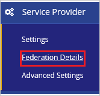
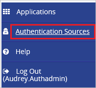
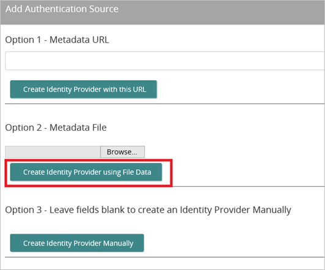
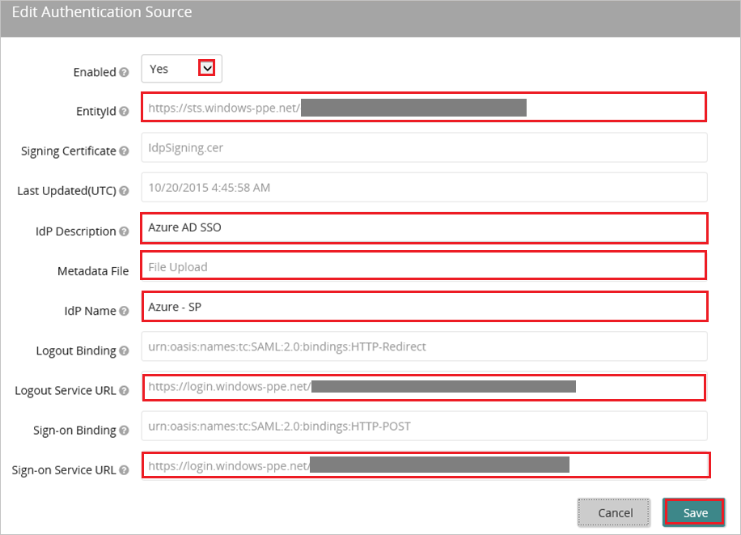

# Tutorial: Azure Active Directory integration with SilkRoad Life Suite

In this tutorial, you learn how to integrate SilkRoad Life Suite with Azure Active Directory (Azure AD).
Integrating SilkRoad Life Suite with Azure AD provides you with the following benefits:

* You can control in Azure AD who has access to SilkRoad Life Suite.
* You can enable your users to be automatically signed-in to SilkRoad Life Suite (Single Sign-On) with their Azure AD accounts.
* You can manage your accounts in one central location - the Azure portal.

If you want to know more details about SaaS app integration with Azure AD, see [What is application access and single sign-on with Azure Active Directory](https://docs.microsoft.com/azure/active-directory/active-directory-appssoaccess-whatis).
If you don't have an Azure subscription, [create a free account](https://azure.microsoft.com/free/) before you begin.

## Prerequisites

To configure Azure AD integration with SilkRoad Life Suite, you need the following items:

* An Azure AD subscription. If you don't have an Azure AD environment, you can get a [free account](https://azure.microsoft.com/free/)
* SilkRoad Life Suite single sign-on enabled subscription

## Scenario description

In this tutorial, you configure and test Azure AD single sign-on in a test environment.

* SilkRoad Life Suite supports **SP** initiated SSO

## Adding SilkRoad Life Suite from the gallery

To configure the integration of SilkRoad Life Suite into Azure AD, you need to add SilkRoad Life Suite from the gallery to your list of managed SaaS apps.

**To add SilkRoad Life Suite from the gallery, perform the following steps:**

1. In the **[Azure portal](https://portal.azure.com)**, on the left navigation panel, click **Azure Active Directory** icon.

	

2. Navigate to **Enterprise Applications** and then select the **All Applications** option.

	

3. To add new application, click **New application** button on the top of dialog.

	

4. In the search box, type **SilkRoad Life Suite**, select **SilkRoad Life Suite** from result panel then click **Add** button to add the application.

	

## Configure and test Azure AD single sign-on

In this section, you configure and test Azure AD single sign-on with SilkRoad Life Suite based on a test user called **Britta Simon**.
For single sign-on to work, a link relationship between an Azure AD user and the related user in SilkRoad Life Suite needs to be established.

To configure and test Azure AD single sign-on with SilkRoad Life Suite, you need to complete the following building blocks:

1. **[Configure Azure AD Single Sign-On](#configure-azure-ad-single-sign-on)** - to enable your users to use this feature.
2. **[Configure SilkRoad Life Suite Single Sign-On](#configure-silkroad-life-suite-single-sign-on)** - to configure the Single Sign-On settings on application side.
3. **[Create an Azure AD test user](#create-an-azure-ad-test-user)** - to test Azure AD single sign-on with Britta Simon.
4. **[Assign the Azure AD test user](#assign-the-azure-ad-test-user)** - to enable Britta Simon to use Azure AD single sign-on.
5. **[Create SilkRoad Life Suite test user](#create-silkroad-life-suite-test-user)** - to have a counterpart of Britta Simon in SilkRoad Life Suite that is linked to the Azure AD representation of user.
6. **[Test single sign-on](#test-single-sign-on)** - to verify whether the configuration works.

### Configure Azure AD single sign-on

In this section, you enable Azure AD single sign-on in the Azure portal.

To configure Azure AD single sign-on with SilkRoad Life Suite, perform the following steps:

1. In the [Azure portal](https://portal.azure.com/), on the **SilkRoad Life Suite** application integration page, select **Single sign-on**.

    

2. On the **Select a Single sign-on method** dialog, select **SAML/WS-Fed** mode to enable single sign-on.

    

3. On the **Set up Single Sign-On with SAML** page, click **Edit** icon to open **Basic SAML Configuration** dialog.

	

4. On the **Basic SAML Configuration** section, if you have **Service Provider metadata file**, perform the following steps:

    > [!NOTE]
    > You will get the **Service Provider metadata file** explained later in this tutorial.

	a. Click **Upload metadata file**.

    

	b. Click on **folder logo** to select the metadata file and click **Upload**.

	

	c. Once the metadata file is successfully uploaded, the **Identifier** and **Reply URL** values get auto populated in Basic SAML Configuration section:

	

	> [!Note]
	> If the **Identifier** and **Reply URL** values are not getting auto polulated, then fill in the values manually according to your requirement.

    d. In the **Sign-on URL** text box, type a URL using the following pattern:
    `https://<subdomain>.silkroad-eng.com/Authentication/`

5. On the **Basic SAML Configuration** section, if you do not have **Service Provider metadata file**, perform the following steps:

    

    a. In the **Sign-on URL** text box, type a URL using the following pattern:
    `https://<subdomain>.silkroad-eng.com/Authentication/`

    b. In the **Identifier** box, type a URL using the following pattern:

	| |
	|--|
	| `https://<subdomain>.silkroad-eng.com/Authentication/SP`|
	| `https://<subdomain>.silkroad.com/Authentication/SP`|

    c. In the **Reply URL** text box, type a URL using the following pattern:

	| |
	|--|
	| `https://<subdomain>.silkroad-eng.com/Authentication/`|
	| `https://<subdomain>.silkroad.com/Authentication/`|

	> [!NOTE]
	> These values are not real. Update these values with the actual Sign-On URL, Identifier and Reply URL. Contact [SilkRoad Life Suite Client support team](https://www.silkroad.com/locations/) to get these values. You can also refer to the patterns shown in the **Basic SAML Configuration** section in the Azure portal.

6. On the **Set up Single Sign-On with SAML** page, in the **SAML Signing Certificate** section, click **Download** to download the **Federation Metadata XML** from the given options as per your requirement and save it on your computer.

	

7. On the **Set up SilkRoad Life Suite** section, copy the appropriate URL(s) as per your requirement.

	

	a. Login URL

	b. Azure AD Identifier

	c. Logout URL

### Configure SilkRoad Life Suite Single Sign-On

1. Sign in to your SilkRoad company site as administrator.

    > [!NOTE]
    > To obtain access to the SilkRoad Life Suite Authentication application for configuring federation with Microsoft Azure AD, please contact SilkRoad Support or your SilkRoad Services representative.

1. Go to **Service Provider**, and then click **Federation Details**.

    

1. Click **Download Federation Metadata**, and then save the metadata file on your computer. Use Downloaded Federation Metadata as a **Service Provider metadata file** in the **Basic SAML Configuration** section in the Azure portal.

    

1. In your **SilkRoad** application, click **Authentication Sources**.

     

1. Click **Add Authentication Source**.

    

1. In the **Add Authentication Source** section, perform the following steps:

    
  
    a. Under **Option 2 - Metadata File**, click **Browse** to upload the downloaded metadata file from Azure portal.
  
    b. Click **Create Identity Provider using File Data**.

1. In the **Authentication Sources** section, click **Edit**.

    

1. On the **Edit Authentication Source** dialog, perform the following steps:

    

    a. As **Enabled**, select **Yes**.

	b. In the **EntityId** textbox, paste the value of **Azure AD Identifier** which you have copied from Azure portal.

    c. In the **IdP Description** textbox, type a description for your configuration (for example: *Azure AD SSO*).

	d. In the **Metadata File** textbox, Upload the **metadata** file which you have downloaded from Azure portal.
  
    e. In the **IdP Name** textbox, type a name that is specific to your configuration (for example: *Azure SP*).
  
	f. In the **Logout Service URL** textbox, paste the value of **Logout URL** which you have copied from Azure portal.

	g. In the **Sign-on service URL** textbox, paste the value of **Login URL** which you have copied from Azure portal.

    h. Click **Save**.

1. Disable all other authentication sources.

    

### Create an Azure AD test user

The objective of this section is to create a test user in the Azure portal called Britta Simon.

1. In the Azure portal, in the left pane, select **Azure Active Directory**, select **Users**, and then select **All users**.

    

2. Select **New user** at the top of the screen.

    

3. In the User properties, perform the following steps.

    

    a. In the **Name** field enter **BrittaSimon**.
  
    b. In the **User name** field type `brittasimon@yourcompanydomain.extension`  
    For example, BrittaSimon@contoso.com

    c. Select **Show password** check box, and then write down the value that's displayed in the Password box.

    d. Click **Create**.

### Assign the Azure AD test user

In this section, you enable Britta Simon to use Azure single sign-on by granting access to SilkRoad Life Suite.

1. In the Azure portal, select **Enterprise Applications**, select **All applications**, then select **SilkRoad Life Suite**.

	

2. In the applications list, select **SilkRoad Life Suite**.

	

3. In the menu on the left, select **Users and groups**.

    

4. Click the **Add user** button, then select **Users and groups** in the **Add Assignment** dialog.

    

5. In the **Users and groups** dialog select **Britta Simon** in the Users list, then click the **Select** button at the bottom of the screen.

6. If you are expecting any role value in the SAML assertion then in the **Select Role** dialog select the appropriate role for the user from the list, then click the **Select** button at the bottom of the screen.

7. In the **Add Assignment** dialog click the **Assign** button.

### Create SilkRoad Life Suite test user

In this section, you create a user called Britta Simon in SilkRoad Life Suite. Work with [SilkRoad Life Suite Client support team](https://www.silkroad.com/locations/) to add the users in the SilkRoad Life Suite platform. Users must be created and activated before you use single sign-on.

### Test single sign-on

In this section, you test your Azure AD single sign-on configuration using the Access Panel.

When you click the SilkRoad Life Suite tile in the Access Panel, you should be automatically signed in to the SilkRoad Life Suite for which you set up SSO. For more information about the Access Panel, see [Introduction to the Access Panel](https://docs.microsoft.com/azure/active-directory/active-directory-saas-access-panel-introduction).

## Additional Resources

- [List of Tutorials on How to Integrate SaaS Apps with Azure Active Directory](https://docs.microsoft.com/azure/active-directory/active-directory-saas-tutorial-list)

- [What is application access and single sign-on with Azure Active Directory?](https://docs.microsoft.com/azure/active-directory/active-directory-appssoaccess-whatis)

- [What is conditional access in Azure Active Directory?](https://docs.microsoft.com/azure/active-directory/conditional-access/overview)
