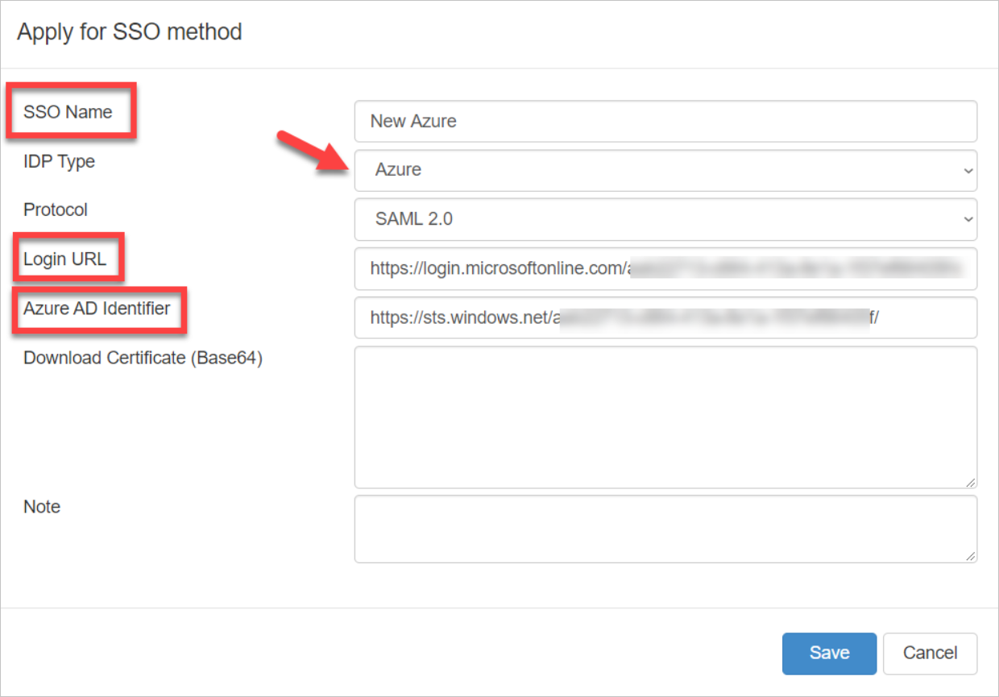
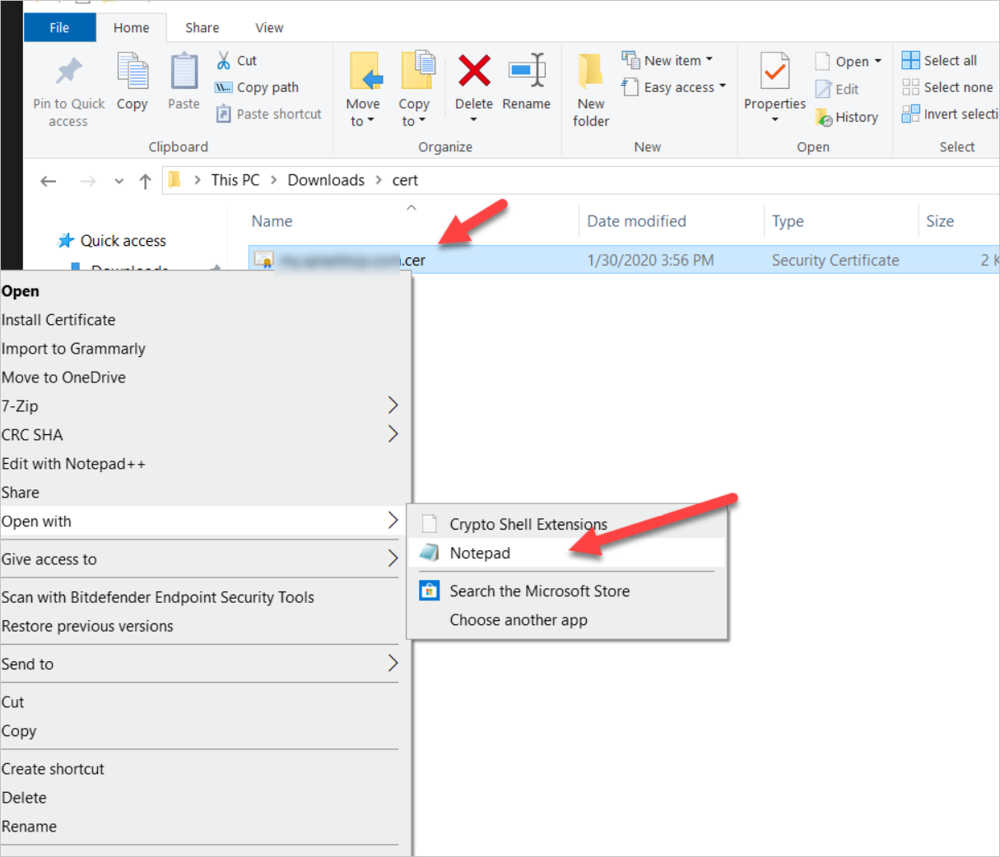
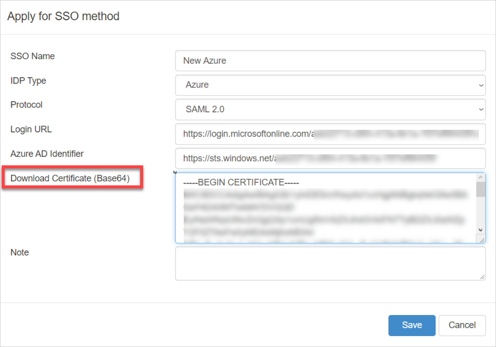
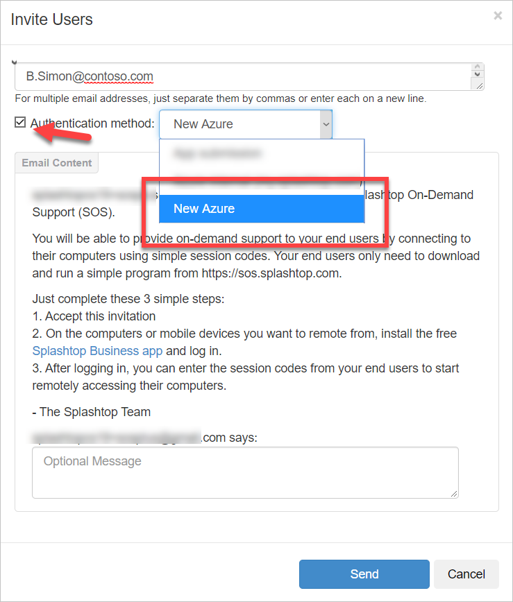

# Tutorial: Azure Active Directory single sign-on (SSO) integration with Splashtop

In this tutorial, you'll learn how to integrate Splashtop with Azure Active Directory (Azure AD). When you integrate Splashtop with Azure AD, you can:

* Control in Azure AD who has access to Splashtop.
* Enable your users to be automatically signed-in to Splashtop with their Azure AD accounts.
* Manage your accounts in one central location - the Azure portal.

To learn more about SaaS app integration with Azure AD, see [What is application access and single sign-on with Azure Active Directory](../manage-apps/what-is-single-sign-on.md).

## Prerequisites

To get started, you need the following items:

* An Azure AD subscription. If you don't have a subscription, you can get a [free account](https://azure.microsoft.com/free/).
* Splashtop single sign-on (SSO) enabled subscription.

## Scenario description

In this tutorial, you configure and test Azure AD SSO in a test environment.

* Splashtop supports **SP** initiated SSO

* Once you configure the Splashtop you can enforce session controls, which protect exfiltration and infiltration of your organization’s sensitive data in real time. Session controls extend from Conditional Access. [Learn how to enforce session control with Microsoft Cloud App Security](/cloud-app-security/proxy-deployment-any-app).

## Adding Splashtop from the gallery

To configure the integration of Splashtop into Azure AD, you need to add Splashtop from the gallery to your list of managed SaaS apps.

1. Sign in to the [Azure portal](https://portal.azure.com) using either a work or school account, or a personal Microsoft account.
1. On the left navigation pane, select the **Azure Active Directory** service.
1. Navigate to **Enterprise Applications** and then select **All Applications**.
1. To add new application, select **New application**.
1. In the **Add from the gallery** section, type **Splashtop** in the search box.
1. Select **Splashtop** from results panel and then add the app. Wait a few seconds while the app is added to your tenant.

## Configure and test Azure AD single sign-on for Splashtop

Configure and test Azure AD SSO with Splashtop using a test user called **B.Simon**. For SSO to work, you need to establish a link relationship between an Azure AD user and the related user in Splashtop.

To configure and test Azure AD SSO with Splashtop, complete the following building blocks:

1. **[Configure Azure AD SSO](#configure-azure-ad-sso)** - to enable your users to use this feature.
    * **[Create an Azure AD test user](#create-an-azure-ad-test-user)** - to test Azure AD single sign-on with B.Simon.
    * **[Assign the Azure AD test user](#assign-the-azure-ad-test-user)** - to enable B.Simon to use Azure AD single sign-on.
1. **[Configure Splashtop SSO](#configure-splashtop-sso)** - to configure the single sign-on settings on application side.
    * **[Create Splashtop test user](#create-splashtop-test-user)** - to have a counterpart of B.Simon in Splashtop that is linked to the Azure AD representation of user.
1. **[Test SSO](#test-sso)** - to verify whether the configuration works.

## Configure Azure AD SSO

Follow these steps to enable Azure AD SSO in the Azure portal.

1. In the [Azure portal](https://portal.azure.com/), on the **Splashtop** application integration page, find the **Manage** section and select **single sign-on**.
1. On the **Select a single sign-on method** page, select **SAML**.
1. On the **Set-up single sign-on with SAML** page, click the edit/pen icon for **Basic SAML Configuration** to edit the settings.

   

1. On the **Basic SAML Configuration** section, enter the values for the following fields:

    In the **Sign-on URL** text box, type the URL:
    `https://my.splashtop.com/login/sso`

1. Splashtop application expects the SAML assertions in a specific format, which requires you to add custom attribute mappings to your SAML token attributes configuration. The following screenshot shows the list of default attributes, whereas **nameidentifier** is mapped with **user.userprincipalname**. TicketManager application expects **nameidentifier** to be mapped with **user.mail**, so you need to edit the attribute mapping by clicking on **Edit** icon and change the attribute mapping.

	

1. On the **Set-up single sign-on with SAML** page, in the **SAML Signing Certificate** section,  find **Certificate (Base64)** and select **Download** to download the certificate and save it on your computer.

	

1. On the **Set-up Splashtop** section, copy the appropriate URL(s) based on your requirement.

	

### Create an Azure AD test user

In this section, you'll create a test user in the Azure portal called B.Simon.

1. From the left pane in the Azure portal, select **Azure Active Directory**, select **Users**, and then select **All users**.
1. Select **New user** at the top of the screen.
1. In the **User** properties, follow these steps:
   1. In the **Name** field, enter `B.Simon`.  
   1. In the **User name** field, enter the username@companydomain.extension. For example, `B.Simon@contoso.com`.
   1. Select the **Show password** check box, and then write down the value that's displayed in the **Password** box.
   1. Click **Create**.

### Assign the Azure AD test user

In this section, you'll enable B.Simon to use Azure single sign-on by granting access to Splashtop.

1. In the Azure portal, select **Enterprise Applications**, and then select **All applications**.
1. In the applications list, select **Splashtop**.
1. In the app's overview page, find the **Manage** section and select **Users and groups**.

   

1. Select **Add user**, then select **Users and groups** in the **Add Assignment** dialog.

	

1. In the **Users and groups** dialog, select **B.Simon** from the Users list, then click the **Select** button at the bottom of the screen.
1. If you're expecting any role value in the SAML assertion, in the **Select Role** dialog, select the appropriate role for the user from the list and then click the **Select** button at the bottom of the screen.
1. In the **Add Assignment** dialog, click the **Assign** button.

## Configure Splashtop SSO

In this section, you will need to apply for a new SSO method from [Splashtop web portal](https://my.splashtop.com/login).
1. In the Splashtop web portal, go to **Account info** / **Team** tab, scroll down to find **Single Sign On** section. Then click **Apply for new SSO method**.

	

1. On the applying window, give an **SSO name**. For example, New Azure, then select **Azure** as the IDP type, and insert **Login URL** and **Azure AD Identifier** copied from Splashtop application on Azure portal.

	

1. For certificate info, right-click on the cert file downloaded from Splashtop application on Azure portal, edit it with Notepad, then copy the contents, paste it in **Download Certificate (Base64)** field.

	
	
	

1. That's it! Click **Save** and Splashtop SSO validation team will contact you for the verification info, then activate the SSO method.

### Create Splashtop test user

1. After SSO method activated, please check the newly created SSO method to enable it in the **Single Sign On** section.

	

1. Invite the test user, for example, `B.Simon@contoso.com` to your Splashtop team with the newly created SSO method.

	

1. You can also change an existing Splashtop account to an SSO account, see [instructions](https://support-splashtopbusiness.splashtop.com/hc/en-us/articles/360038685691-How-to-associate-SSO-method-to-existing-team-admin-member-).

1. That's it! You can use the SSO account to log in Splashtop web portal or Splashtop Business app.

## Test SSO 

In this section, you test your Azure AD single sign-on configuration using the Access Panel.

When you click the Splashtop tile in the Access Panel, you should be automatically signed in to the Splashtop for which you set up SSO. For more information about the Access Panel, see [Introduction to the Access Panel](../user-help/my-apps-portal-end-user-access.md).

## Additional resources

- [ List of Tutorials on How to Integrate SaaS Apps with Azure Active Directory ](./tutorial-list.md)

- [What is application access and single sign-on with Azure Active Directory? ](../manage-apps/what-is-single-sign-on.md)

- [What is conditional access in Azure Active Directory?](../conditional-access/overview.md)

- [Try Splashtop with Azure AD](https://aad.portal.azure.com/)

- [What is session control in Microsoft Cloud App Security?](/cloud-app-security/proxy-intro-aad)

- [How to protect Splashtop with advanced visibility and controls](/cloud-app-security/proxy-intro-aad)