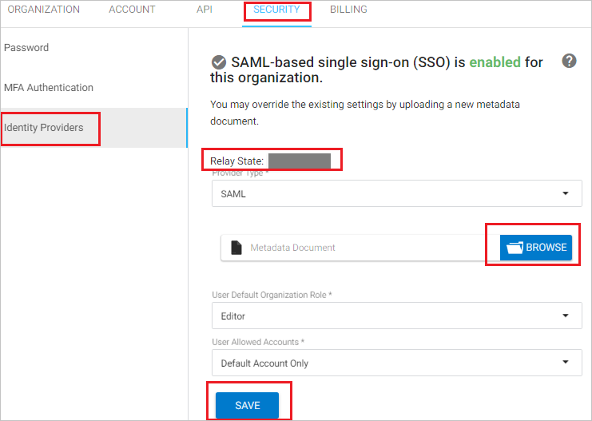
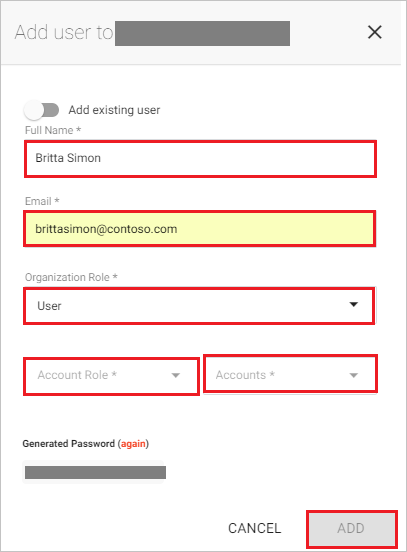

# Tutorial: Azure Active Directory integration with Spotinst

In this tutorial, you learn how to integrate Spotinst with Azure Active Directory (Azure AD).
Integrating Spotinst with Azure AD provides you with the following benefits:

* You can control in Azure AD who has access to Spotinst.
* You can enable your users to be automatically signed-in to Spotinst (Single Sign-On) with their Azure AD accounts.
* You can manage your accounts in one central location - the Azure portal.

If you want to know more details about SaaS app integration with Azure AD, see [What is application access and single sign-on with Azure Active Directory](https://docs.microsoft.com/azure/active-directory/active-directory-appssoaccess-whatis).
If you don't have an Azure subscription, [create a free account](https://azure.microsoft.com/free/) before you begin.

## Prerequisites

To configure Azure AD integration with Spotinst, you need the following items:

* An Azure AD subscription. If you don't have an Azure AD environment, you can get a [free account](https://azure.microsoft.com/free/)
* Spotinst single sign-on enabled subscription

## Scenario description

In this tutorial, you configure and test Azure AD single sign-on in a test environment.

* Spotinst supports **SP and IDP** initiated SSO

## Adding Spotinst from the gallery

To configure the integration of Spotinst into Azure AD, you need to add Spotinst from the gallery to your list of managed SaaS apps.

**To add Spotinst from the gallery, perform the following steps:**

1. In the **[Azure portal](https://portal.azure.com)**, on the left navigation panel, click **Azure Active Directory** icon.

	

2. Navigate to **Enterprise Applications** and then select the **All Applications** option.

	

3. To add new application, click **New application** button on the top of dialog.

	

4. In the search box, type **Spotinst**, select **Spotinst** from result panel then click **Add** button to add the application.

	

## Configure and test Azure AD single sign-on

In this section, you configure and test Azure AD single sign-on with Spotinst based on a test user called **Britta Simon**.
For single sign-on to work, a link relationship between an Azure AD user and the related user in Spotinst needs to be established.

To configure and test Azure AD single sign-on with Spotinst, you need to complete the following building blocks:

1. **[Configure Azure AD Single Sign-On](#configure-azure-ad-single-sign-on)** - to enable your users to use this feature.
2. **[Configure Spotinst Single Sign-On](#configure-spotinst-single-sign-on)** - to configure the Single Sign-On settings on application side.
3. **[Create an Azure AD test user](#create-an-azure-ad-test-user)** - to test Azure AD single sign-on with Britta Simon.
4. **[Assign the Azure AD test user](#assign-the-azure-ad-test-user)** - to enable Britta Simon to use Azure AD single sign-on.
5. **[Create Spotinst test user](#create-spotinst-test-user)** - to have a counterpart of Britta Simon in Spotinst that is linked to the Azure AD representation of user.
6. **[Test single sign-on](#test-single-sign-on)** - to verify whether the configuration works.

### Configure Azure AD single sign-on

In this section, you enable Azure AD single sign-on in the Azure portal.

To configure Azure AD single sign-on with Spotinst, perform the following steps:

1. In the [Azure portal](https://portal.azure.com/), on the **Spotinst** application integration page, select **Single sign-on**.

    

2. On the **Select a Single sign-on method** dialog, select **SAML/WS-Fed** mode to enable single sign-on.

    

3. On the **Set up Single Sign-On with SAML** page, click **Edit** icon to open **Basic SAML Configuration** dialog.

	

4. On the **Basic SAML Configuration** section, if you wish to configure the application in **IDP** initiated mode, perform the following steps:

    

	a. Check **Set additional URLs**.

	b. In the **Relay State** textbox, type a value: `<ID>`

5. Click **Set additional URLs** and perform the following step if you wish to configure the application in **SP** initiated mode:

    

    In the **Sign-on URL** text box, type the URL:
    `https://console.spotinst.com/auth/saml`

	> [!NOTE]
	> The Relay State value is not real. You will update the Relay State value with the actual Relay State value, which is explained later in the tutorial.

6. Spotinst application expects the SAML assertions in a specific format. Configure the following claims for this application. You can manage the values of these attributes from the **User Attributes** section on application integration page. On the **Set up Single Sign-On with SAML** page, click **Edit** button to open **User Attributes** dialog.

	

7. In the **User Claims** section on the **User Attributes** dialog, edit the claims by using **Edit icon** or add the claims by using **Add new claim** to configure SAML token attribute as shown in the image above and perform the following steps: 

	| Name | Source Attribute|
	| -----| --------------- |
	| Email | user.mail |
	| FirstName | user.givenname |
	| LastName | user.surname |

	a. Click **Add new claim** to open the **Manage user claims** dialog.

	

	

	b. In the **Name** textbox, type the attribute name shown for that row.

	c. Leave the **Namespace** blank.

	d. Select Source as **Attribute**.

	e. From the **Source attribute** list, type the attribute value shown for that row.

	f. Click **Ok**

	g. Click **Save**.

8. On the **Set up Single Sign-On with SAML** page, in the **SAML Signing Certificate** section, click **Download** to download the **Federation Metadata XML** from the given options as per your requirement and save it on your computer.

	

9. On the **Set up Spotinst** section, copy the appropriate URL(s) as per your requirement.

	

	a. Login URL

	b. Azure AD Identifier

	c. Logout URL

### Configure Spotinst Single Sign-On

1. In a different web browser window, sign in to Spotinst as a Security Administrator.

2. Click on the **user icon** on the top right side of the screen and click **Settings**.

	

3. Click on the **SECURITY** tab on the top and then select **Identity Providers** and perform the following steps:

	

	a. Copy the **Relay State** value for your instance and paste it in **Relay State** textbox in **Basic SAML Configuration** section on Azure portal.

	b. Click **BROWSE** to upload the metadata xml file that you have downloaded from Azure portal

	c. Click **SAVE**.

### Create an Azure AD test user

The objective of this section is to create a test user in the Azure portal called Britta Simon.

1. In the Azure portal, in the left pane, select **Azure Active Directory**, select **Users**, and then select **All users**.

    

2. Select **New user** at the top of the screen.

    

3. In the User properties, perform the following steps.

    

    a. In the **Name** field enter **BrittaSimon**.
  
    b. In the **User name** field type `brittasimon@yourcompanydomain.extension`. For example, BrittaSimon@contoso.com

    c. Select **Show password** check box, and then write down the value that's displayed in the Password box.

    d. Click **Create**.

### Assign the Azure AD test user

In this section, you enable Britta Simon to use Azure single sign-on by granting access to Spotinst.

1. In the Azure portal, select **Enterprise Applications**, select **All applications**, then select **Spotinst**.

	

2. In the applications list, select **Spotinst**.

	

3. In the menu on the left, select **Users and groups**.

    

4. Click the **Add user** button, then select **Users and groups** in the **Add Assignment** dialog.

    

5. In the **Users and groups** dialog select **Britta Simon** in the Users list, then click the **Select** button at the bottom of the screen.

6. If you are expecting any role value in the SAML assertion then in the **Select Role** dialog select the appropriate role for the user from the list, then click the **Select** button at the bottom of the screen.

7. In the **Add Assignment** dialog click the **Assign** button.

### Create Spotinst test user

The objective of this section is to create a user called Britta Simon in Spotinst.

1. If you have configured the application in the **SP** initiated mode, perform the following steps:

   a. In a different web browser window, sign in to Spotinst as a Security Administrator.

   b. Click on the **user icon** on the top right side of the screen and click **Settings**.

	

	c. Click **Users** and select **ADD USER**.

	

	d. On the add user section, perform the following steps:

	

	* In the **Full Name** textbox, enter the full name of user like **BrittaSimon**.

	* In the **Email** textbox, enter the email address of the user like `brittasimon\@contoso.com`.

	* Select your organization-specific details for the **Organization Role, Account Role, and Accounts**.

2. If you have configured the application in the **IDP** initiated mode, There is no action item for you in this section. Spotinst supports just-in-time provisioning, which is by default enabled. A new user is created during an attempt to access Spotinst if it doesn't exist yet.

### Test single sign-on 

In this section, you test your Azure AD single sign-on configuration using the Access Panel.

When you click the Spotinst tile in the Access Panel, you should be automatically signed in to the Spotinst for which you set up SSO. For more information about the Access Panel, see [Introduction to the Access Panel](https://docs.microsoft.com/azure/active-directory/active-directory-saas-access-panel-introduction).

## Additional Resources

- [List of Tutorials on How to Integrate SaaS Apps with Azure Active Directory](https://docs.microsoft.com/azure/active-directory/active-directory-saas-tutorial-list)

- [What is application access and single sign-on with Azure Active Directory?](https://docs.microsoft.com/azure/active-directory/active-directory-appssoaccess-whatis)

- [What is Conditional Access in Azure Active Directory?](https://docs.microsoft.com/azure/active-directory/conditional-access/overview)

