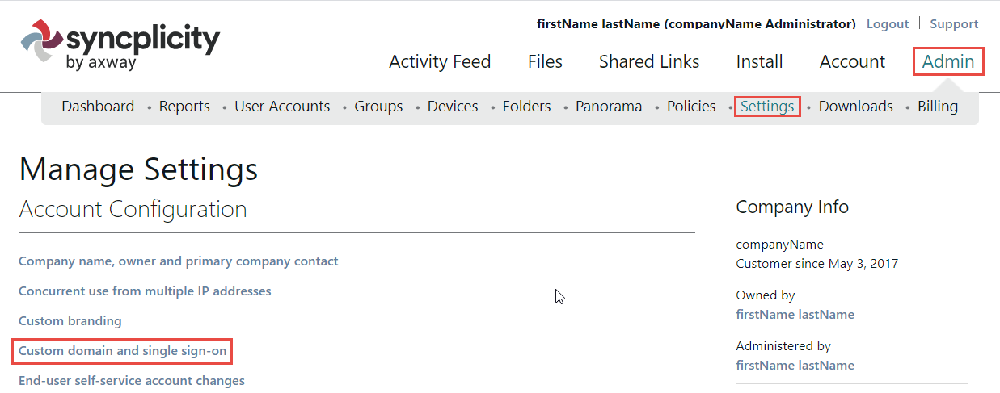
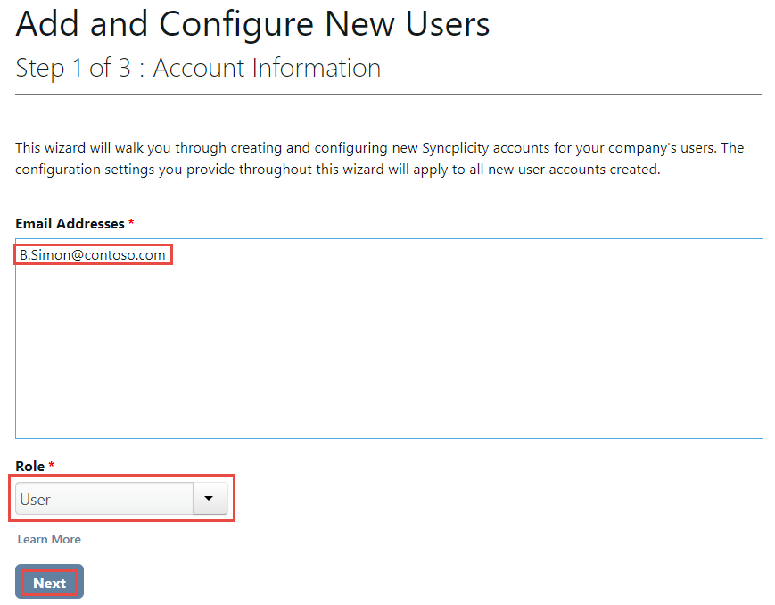
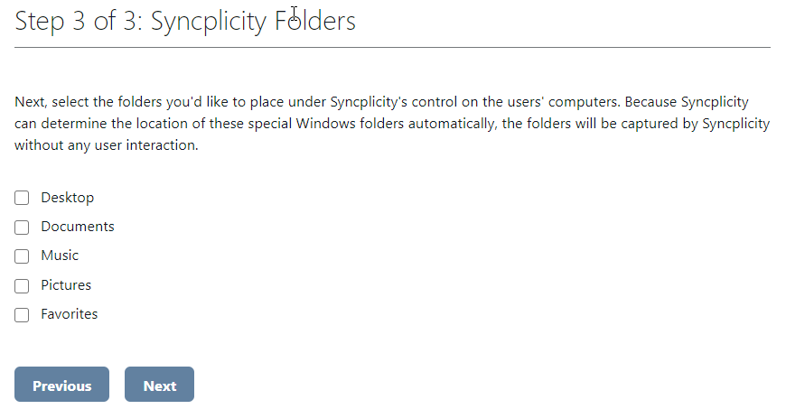

# Tutorial: Azure Active Directory integration with Syncplicity

In this tutorial, you learn how to integrate Syncplicity with Azure Active Directory (Azure AD).
Integrating Syncplicity with Azure AD provides you with the following benefits:

* You can control in Azure AD who has access to Syncplicity.
* You can enable your users to be automatically signed-in to Syncplicity (Single Sign-On) with their Azure AD accounts.
* You can manage your accounts in one central location - the Azure portal.

If you want to know more details about SaaS app integration with Azure AD, see [What is application access and single sign-on with Azure Active Directory](https://docs.microsoft.com/azure/active-directory/active-directory-appssoaccess-whatis).
If you don't have an Azure subscription, [create a free account](https://azure.microsoft.com/free/) before you begin.

## Prerequisites

To configure Azure AD integration with Syncplicity, you need the following items:

* An Azure AD subscription. If you don't have an Azure AD environment, you can get one-month trial [here](https://azure.microsoft.com/pricing/free-trial/)
* Syncplicity single sign-on enabled subscription

## Scenario description

In this tutorial, you configure and test Azure AD single sign-on in a test environment.

* Syncplicity supports **SP** initiated SSO

## Adding Syncplicity from the gallery

To configure the integration of Syncplicity into Azure AD, you need to add Syncplicity from the gallery to your list of managed SaaS apps.

**To add Syncplicity from the gallery, perform the following steps:**

1. In the **[Azure portal](https://portal.azure.com)**, on the left navigation panel, click **Azure Active Directory** icon.

	

2. Navigate to **Enterprise Applications** and then select the **All Applications** option.

	

3. To add new application, click **New application** button on the top of dialog.

	

4. In the search box, type **Syncplicity**, select **Syncplicity** from result panel then click **Add** button to add the application.

	

## Configure and test Azure AD single sign-on

In this section, you configure and test Azure AD single sign-on with Syncplicity based on a test user called **Britta Simon**.
For single sign-on to work, a link relationship between an Azure AD user and the related user in Syncplicity needs to be established.

To configure and test Azure AD single sign-on with Syncplicity, you need to complete the following building blocks:

1. **[Configure Azure AD Single Sign-On](#configure-azure-ad-single-sign-on)** - to enable your users to use this feature.
2. **[Configure Syncplicity Single Sign-On](#configure-syncplicity-single-sign-on)** - to configure the Single Sign-On settings on application side.
3. **[Create an Azure AD test user](#create-an-azure-ad-test-user)** - to test Azure AD single sign-on with Britta Simon.
4. **[Assign the Azure AD test user](#assign-the-azure-ad-test-user)** - to enable Britta Simon to use Azure AD single sign-on.
5. **[Create Syncplicity test user](#create-syncplicity-test-user)** - to have a counterpart of Britta Simon in Syncplicity that is linked to the Azure AD representation of user.
6. **[Test single sign-on](#test-single-sign-on)** - to verify whether the configuration works.

### Configure Azure AD single sign-on

In this section, you enable Azure AD single sign-on in the Azure portal.

To configure Azure AD single sign-on with Syncplicity, perform the following steps:

1. In the [Azure portal](https://portal.azure.com/), on the **Syncplicity** application integration page, select **Single sign-on**.

    

2. On the **Select a Single sign-on method** dialog, select **SAML/WS-Fed** mode to enable single sign-on.

    

3. On the **Set up Single Sign-On with SAML** page, click **Edit** icon to open **Basic SAML Configuration** dialog.

	

4. On the **Basic SAML Configuration** section, perform the following steps:

    

	a. In the **Sign on URL** text box, type a URL using the following pattern:
    `https://<companyname>.syncplicity.com`

    b. In the **Identifier (Entity ID)** text box, type a URL using the following pattern:
    `https://<companyname>.syncplicity.com/sp`

	> [!NOTE]
	> These values are not real. Update these values with the actual Sign on URL and Identifier. Contact [Syncplicity Client support team](https://www.syncplicity.com/contact-us) to get these values. You can also refer to the patterns shown in the **Basic SAML Configuration** section in the Azure portal.

5. On the **Set up Single Sign-On with SAML** page, in the **SAML Signing Certificate** section, click **Download** to download the **Certificate (Base64)** from the given options as per your requirement and save it on your computer.

	

6. On the **Set up Syncplicity** section, copy the appropriate URL(s) as per your requirement.

	

	a. Login URL

	b. Azure AD Identifier

	c. Logout URL

### Configure Syncplicity Single Sign-On

1. Sign in to your **Syncplicity** tenant.

1. In the menu on the top, click **admin**, select **settings**, and then click **Custom domain and single sign-on**.

    

1. On the **Single Sign-On (SSO)** dialog page, perform the following steps:

    ")

    a. In the **Custom Domain** textbox, type the name of your domain.
  
    b. Select **Enabled** as **Single Sign-On Status**.

    c. In the **Entity Id** textbox, Paste the value of **Azure Ad Identifier** which you have copied from Azure portal.

    d. In the **Sign-in page URL** textbox, Paste the **Login URL** which you have copied from Azure portal.

    e. In the **Logout page URL** textbox, Paste the **Logout URL** which you have copied from Azure portal.

    f. In **Identity Provider Certificate**, click **Choose file**, and then upload the certificate which you have downloaded from the Azure portal.

    g. Click **SAVE CHANGES**.

### Create an Azure AD test user

The objective of this section is to create a test user in the Azure portal called Britta Simon.

1. In the Azure portal, in the left pane, select **Azure Active Directory**, select **Users**, and then select **All users**.

    

2. Select **New user** at the top of the screen.

    

3. In the User properties, perform the following steps.

    

    a. In the **Name** field enter **BrittaSimon**.
  
    b. In the **User name** field type **brittasimon@yourcompanydomain.extension**  
    For example, BrittaSimon@contoso.com

    c. Select **Show password** check box, and then write down the value that's displayed in the Password box.

    d. Click **Create**.

### Assign the Azure AD test user

In this section, you enable Britta Simon to use Azure single sign-on by granting access to Syncplicity.

1. In the Azure portal, select **Enterprise Applications**, select **All applications**, then select **Syncplicity**.

	

2. In the applications list, select **Syncplicity**.

	

3. In the menu on the left, select **Users and groups**.
    

4. Click the **Add user** button, then select **Users and groups** in the **Add Assignment** dialog.

    

5. In the **Users and groups** dialog select **Britta Simon** in the Users list, then click the **Select** button at the bottom of the screen.

6. If you are expecting any role value in the SAML assertion then in the **Select Role** dialog select the appropriate role for the user from the list, then click the **Select** button at the bottom of the screen.

7. In the **Add Assignment** dialog click the **Assign** button.

### Create Syncplicity test user

For AAD users to be able to sign in, they must be provisioned to Syncplicity application. This section describes how to create AAD user accounts in Syncplicity.

**To provision a user account to Syncplicity, perform the following steps:**

1. Log in to your **Syncplicity** tenant (for example: `https://company.Syncplicity.com`).

1. Click **admin** and select **user accounts** and then click **ADD A USER**.

    

1. Type the **Email addresses** of an Azure AD account you want to provision, select **User** as **Role**, and then click **NEXT**.

    

    > [!NOTE]
    > The AAD account holder  gets an email including a link to confirm and activate the account.

1. Select a group in your company that your new user should become a member of, and then click **NEXT**.

    

    > [!NOTE]
    > If there are no groups listed, click **NEXT**.

1. Select the folders you would like to place under Syncplicity’s control on the user’s computer, and then click **NEXT**.

    

> [!NOTE]
> You can use any other Syncplicity user account creation tools or APIs provided by Syncplicity to provision AAD user accounts.

### Test single sign-on

In this section, you test your Azure AD single sign-on configuration using the Access Panel.

When you click the Syncplicity tile in the Access Panel, you should be automatically signed in to the Syncplicity for which you set up SSO. For more information about the Access Panel, see [Introduction to the Access Panel](https://docs.microsoft.com/azure/active-directory/active-directory-saas-access-panel-introduction).

## Additional Resources

- [List of Tutorials on How to Integrate SaaS Apps with Azure Active Directory](https://docs.microsoft.com/azure/active-directory/active-directory-saas-tutorial-list)

- [What is application access and single sign-on with Azure Active Directory?](https://docs.microsoft.com/azure/active-directory/active-directory-appssoaccess-whatis)

- [What is conditional access in Azure Active Directory?](https://docs.microsoft.com/azure/active-directory/conditional-access/overview)
