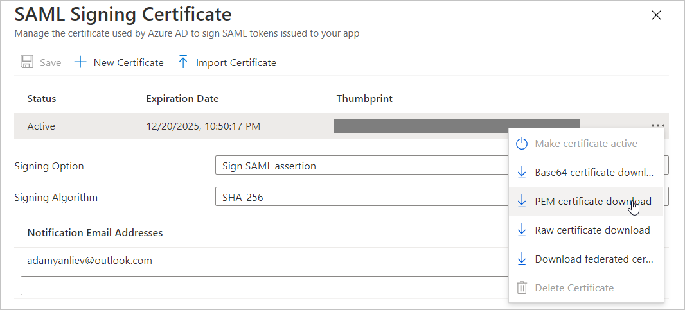
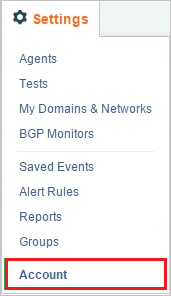

# Tutorial: Azure Active Directory integration with ThousandEyes

In this tutorial, you learn how to integrate ThousandEyes with Azure Active Directory (Azure AD).
Integrating ThousandEyes with Azure AD provides you with the following benefits:

* You can control in Azure AD who has access to ThousandEyes.
* You can enable your users to be automatically signed-in to ThousandEyes (Single Sign-On) with their Azure AD accounts.
* You can manage your accounts in one central location - the Azure portal.

If you want to know more details about SaaS app integration with Azure AD, see [What is application access and single sign-on with Azure Active Directory](https://docs.microsoft.com/azure/active-directory/active-directory-appssoaccess-whatis).
If you don't have an Azure subscription, [create a free account](https://azure.microsoft.com/free/) before you begin.

## Prerequisites

To configure Azure AD integration with ThousandEyes, you need the following items:

* An Azure AD subscription. If you don't have an Azure AD environment, you can get one-month trial [here](https://azure.microsoft.com/pricing/free-trial/)
* ThousandEyes single sign-on enabled subscription

## Scenario description

In this tutorial, you configure and test Azure AD single sign-on in a test environment.

* ThousandEyes supports **SP** initiated SSO

* ThousandEyes supports [**Automated** user provisioning](https://docs.microsoft.com/azure/active-directory/saas-apps/thousandeyes-provisioning-tutorial)

## Adding ThousandEyes from the gallery

To configure the integration of ThousandEyes into Azure AD, you need to add ThousandEyes from the gallery to your list of managed SaaS apps.

**To add ThousandEyes from the gallery, perform the following steps:**

1. In the **[Azure portal](https://portal.azure.com)**, on the left navigation panel, click **Azure Active Directory** icon.

	

2. Navigate to **Enterprise Applications** and then select the **All Applications** option.

	

3. To add new application, click **New application** button on the top of dialog.

	

4. In the search box, type **ThousandEyes**, select **ThousandEyes** from result panel then click **Add** button to add the application.

	 

## Configure and test Azure AD single sign-on

In this section, you configure and test Azure AD single sign-on with ThousandEyes based on a test user called **Britta Simon**.
For single sign-on to work, a link relationship between an Azure AD user and the related user in ThousandEyes needs to be established.

To configure and test Azure AD single sign-on with ThousandEyes, you need to complete the following building blocks:

1. **[Configure Azure AD Single Sign-On](#configure-azure-ad-single-sign-on)** - to enable your users to use this feature.
2. **[Configure ThousandEyes Single Sign-On](#configure-thousandeyes-single-sign-on)** - to configure the Single Sign-On settings on application side.
3. **[Create an Azure AD test user](#create-an-azure-ad-test-user)** - to test Azure AD single sign-on with Britta Simon.
4. **[Assign the Azure AD test user](#assign-the-azure-ad-test-user)** - to enable Britta Simon to use Azure AD single sign-on.
5. **[Create ThousandEyes test user](#create-thousandeyes-test-user)** - to have a counterpart of Britta Simon in ThousandEyes that is linked to the Azure AD representation of user.
6. **[Test single sign-on](#test-single-sign-on)** - to verify whether the configuration works.

### Configure Azure AD single sign-on

In this section, you enable Azure AD single sign-on in the Azure portal.

To configure Azure AD single sign-on with ThousandEyes, perform the following steps:

1. In the [Azure portal](https://portal.azure.com/), on the **ThousandEyes** application integration page, select **Single sign-on**.

    

2. On the **Select a Single sign-on method** dialog, select **SAML/WS-Fed** mode to enable single sign-on.

    

3. On the **Set up Single Sign-On with SAML** page, click **Edit** icon to open **Basic SAML Configuration** dialog.

	

4. On the **Basic SAML Configuration** section, perform the following steps:

    

    In the **Sign-on URL** text box, type a URL:
    `https://app.thousandeyes.com/login/sso`

5. On the **Set up Single Sign-On with SAML** page, in the **SAML Signing Certificate** section, click **Download** to download the **Certificate (Base64)** from the given options as per your requirement and save it on your computer.

	

6. On the **Set up ThousandEyes** section, copy the appropriate URL(s) as per your requirement.

	

	a. Login URL

	b. Azure AD Identifier

	c. Logout URL

### Configure ThousandEyes Single Sign-On

1. In a different web browser window, sign on to your **ThousandEyes** company site as an administrator.

2. In the menu on the top, click **Settings**.

    

3. Click **Account**

    

4. Click the **Security & Authentication** tab.

    

5. In the **Setup Single Sign-On** section, perform the following steps:

    

    a. Select **Enable Single Sign-On**.

    b. In **Login Page URL** textbox, paste **Login URL**, which you have copied from Azure portal.

    c. In **Logout Page URL** textbox, paste **Logout URL**, which you have copied from Azure portal.

    d. **Identity Provider Issuer** textbox, paste **Azure AD Identifier**, which you have copied from Azure portal.

    e. In **Verification Certificate**, click **Choose file**, and then upload the certificate you have downloaded from Azure portal.

    f. Click **Save**.

### Create an Azure AD test user 

The objective of this section is to create a test user in the Azure portal called Britta Simon.

1. In the Azure portal, in the left pane, select **Azure Active Directory**, select **Users**, and then select **All users**.

    

2. Select **New user** at the top of the screen.

    

3. In the User properties, perform the following steps.

    

    a. In the **Name** field enter **BrittaSimon**.
  
    b. In the **User name** field type brittasimon@yourcompanydomain.extension. For example, BrittaSimon@contoso.com

    c. Select **Show password** check box, and then write down the value that's displayed in the Password box.

    d. Click **Create**.

### Assign the Azure AD test user

In this section, you enable Britta Simon to use Azure single sign-on by granting access to ThousandEyes.

1. In the Azure portal, select **Enterprise Applications**, select **All applications**, then select **ThousandEyes**.

	

2. In the applications list, select **ThousandEyes**.

	

3. In the menu on the left, select **Users and groups**.

    

4. Click the **Add user** button, then select **Users and groups** in the **Add Assignment** dialog.

    

5. In the **Users and groups** dialog select **Britta Simon** in the Users list, then click the **Select** button at the bottom of the screen.

6. If you are expecting any role value in the SAML assertion then in the **Select Role** dialog select the appropriate role for the user from the list, then click the **Select** button at the bottom of the screen.

7. In the **Add Assignment** dialog click the **Assign** button.

### Create ThousandEyes test user

The objective of this section is to create a user called Britta Simon in ThousandEyes. ThousandEyes supports automatic user provisioning, which is by default enabled. You can find more details [here](thousandeyes-provisioning-tutorial.md) on how to configure automatic user provisioning.

**If you need to create user manually, perform following steps:**

1. Sign in to your ThousandEyes company site as an administrator.

2. Click **Settings**.

    

3. Click **Account**.

    

4. Click the **Accounts & Users** tab.

    

5. In the **Add Users & Accounts** section, perform the following steps:

    

    a. In **Name** textbox, type the name of user like **Britta Simon**.

    b. In **Email** textbox, type the email of user like brittasimon@contoso.com.

    b. Click **Add New User to Account**.

    > [!NOTE]
    > The Azure Active Directory account holder will get an email including a link to confirm and activate the account.

> [!NOTE]
> You can use any other ThousandEyes user account creation tools or APIs provided by ThousandEyes to provision Azure Active Directory user accounts.

### Test single sign-on 

In this section, you test your Azure AD single sign-on configuration using the Access Panel.

When you click the ThousandEyes tile in the Access Panel, you should be automatically signed in to the ThousandEyes for which you set up SSO. For more information about the Access Panel, see [Introduction to the Access Panel](https://docs.microsoft.com/azure/active-directory/active-directory-saas-access-panel-introduction).

## Additional Resources

- [List of Tutorials on How to Integrate SaaS Apps with Azure Active Directory](https://docs.microsoft.com/azure/active-directory/active-directory-saas-tutorial-list)

- [What is application access and single sign-on with Azure Active Directory?](https://docs.microsoft.com/azure/active-directory/active-directory-appssoaccess-whatis)

- [What is conditional access in Azure Active Directory?](https://docs.microsoft.com/azure/active-directory/conditional-access/overview)

- [Configure User Provisioning](https://docs.microsoft.com/azure/active-directory/saas-apps/thousandeyes-provisioning-tutorial)
