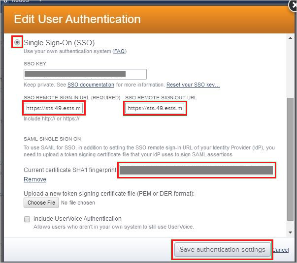
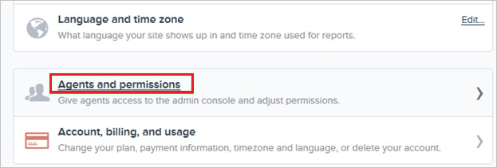
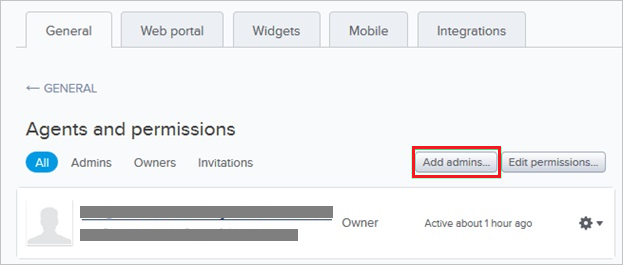
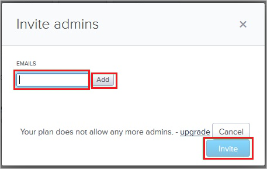

# Tutorial: Azure Active Directory integration with UserVoice

In this tutorial, you learn how to integrate UserVoice with Azure Active Directory (Azure AD).
Integrating UserVoice with Azure AD provides you with the following benefits:

* You can control in Azure AD who has access to UserVoice.
* You can enable your users to be automatically signed-in to UserVoice (Single Sign-On) with their Azure AD accounts.
* You can manage your accounts in one central location - the Azure portal.

If you want to know more details about SaaS app integration with Azure AD, see [What is application access and single sign-on with Azure Active Directory](../manage-apps/what-is-single-sign-on.md).
If you don't have an Azure subscription, [create a free account](https://azure.microsoft.com/free/) before you begin.

## Prerequisites

To configure Azure AD integration with UserVoice, you need the following items:

* An Azure AD subscription. If you don't have an Azure AD environment, you can get a [free account](https://azure.microsoft.com/free/)
* UserVoice single sign-on enabled subscription

## Scenario description

In this tutorial, you configure and test Azure AD single sign-on in a test environment.

* UserVoice supports **SP** initiated SSO

## Adding UserVoice from the gallery

To configure the integration of UserVoice into Azure AD, you need to add UserVoice from the gallery to your list of managed SaaS apps.

**To add UserVoice from the gallery, perform the following steps:**

1. In the **[Azure portal](https://portal.azure.com)**, on the left navigation panel, click **Azure Active Directory** icon.

	

2. Navigate to **Enterprise Applications** and then select the **All Applications** option.

	

3. To add new application, click **New application** button on the top of dialog.

	

4. In the search box, type **UserVoice**, select **UserVoice** from result panel then click **Add** button to add the application.

	 

## Configure and test Azure AD single sign-on

In this section, you configure and test Azure AD single sign-on with UserVoice based on a test user called **Britta Simon**.
For single sign-on to work, a link relationship between an Azure AD user and the related user in UserVoice needs to be established.

To configure and test Azure AD single sign-on with UserVoice, you need to complete the following building blocks:

1. **[Configure Azure AD Single Sign-On](#configure-azure-ad-single-sign-on)** - to enable your users to use this feature.
2. **[Configure UserVoice Single Sign-On](#configure-uservoice-single-sign-on)** - to configure the Single Sign-On settings on application side.
3. **[Create an Azure AD test user](#create-an-azure-ad-test-user)** - to test Azure AD single sign-on with Britta Simon.
4. **[Assign the Azure AD test user](#assign-the-azure-ad-test-user)** - to enable Britta Simon to use Azure AD single sign-on.
5. **[Create UserVoice test user](#create-uservoice-test-user)** - to have a counterpart of Britta Simon in UserVoice that is linked to the Azure AD representation of user.
6. **[Test single sign-on](#test-single-sign-on)** - to verify whether the configuration works.

### Configure Azure AD single sign-on

In this section, you enable Azure AD single sign-on in the Azure portal.

To configure Azure AD single sign-on with UserVoice, perform the following steps:

1. In the [Azure portal](https://portal.azure.com/), on the **UserVoice** application integration page, select **Single sign-on**.

    

2. On the **Select a Single sign-on method** dialog, select **SAML/WS-Fed** mode to enable single sign-on.

    

3. On the **Set up Single Sign-On with SAML** page, click **Edit** icon to open **Basic SAML Configuration** dialog.

	

4. On the **Basic SAML Configuration** section, perform the following steps:

    

	a. In the **Sign on URL** text box, type a URL using the following pattern:
    `https://<tenantname>.UserVoice.com`

    b. In the **Identifier (Entity ID)** text box, type a URL using the following pattern:
    `https://<tenantname>.UserVoice.com`

	> [!NOTE]
	> These values are not real. Update these values with the actual Sign on URL and Identifier. Contact [UserVoice Client support team](https://www.uservoice.com/) to get these values. You can also refer to the patterns shown in the **Basic SAML Configuration** section in the Azure portal.

5. In the **SAML Signing Certificate** section, click **Edit** button to open **SAML Signing Certificate** dialog.

	

6. In the **SAML Signing Certificate** section, copy the **Thumbprint** and save it on your computer.

    

7. On the **Set up UserVoice** section, copy the appropriate URL(s) as per your requirement.

	

	a. Login URL

	b. Azure AD Identifier

	c. Logout URL

### Configure UserVoice Single Sign-On

1. In a different web browser window, sign in to your UserVoice company site as an administrator.

2. In the toolbar on the top, click **Settings**, and then select **Web portal** from the menu.
   
    

3. On the **Web portal** tab, in the **User authentication** section, click **Edit** to open the **Edit User Authentication** dialog page.
   
    

4. On the **Edit User Authentication** dialog page, perform the following steps:
   
    
   
    a. Click **Single Sign-On (SSO)**.
 
    b. Paste the **Login URL** value, which you have copied from the Azure portal into the **SSO Remote Sign-In** textbox.

    c. Paste the **Logout URL** value, which you have copied from the Azure portal into the **SSO Remote Sign-Out textbox**.
 
    d. Paste the **Thumbprint** value, which you have copied from Azure portal  into the **Current certificate SHA1 fingerprint** textbox.
	
	e. Click **Save authentication settings**.

### Create an Azure AD test user 

The objective of this section is to create a test user in the Azure portal called Britta Simon.

1. In the Azure portal, in the left pane, select **Azure Active Directory**, select **Users**, and then select **All users**.

    

2. Select **New user** at the top of the screen.

    

3. In the User properties, perform the following steps.

    

    a. In the **Name** field enter **BrittaSimon**.
  
    b. In the **User name** field type brittasimon@yourcompanydomain.extension. For example, BrittaSimon@contoso.com

    c. Select **Show password** check box, and then write down the value that's displayed in the Password box.

    d. Click **Create**.

### Assign the Azure AD test user

In this section, you enable Britta Simon to use Azure single sign-on by granting access to UserVoice.

1. In the Azure portal, select **Enterprise Applications**, select **All applications**, then select **UserVoice**.

	

2. In the applications list, select **UserVoice**.

	

3. In the menu on the left, select **Users and groups**.

    

4. Click the **Add user** button, then select **Users and groups** in the **Add Assignment** dialog.

    

5. In the **Users and groups** dialog select **Britta Simon** in the Users list, then click the **Select** button at the bottom of the screen.

6. If you are expecting any role value in the SAML assertion then in the **Select Role** dialog select the appropriate role for the user from the list, then click the **Select** button at the bottom of the screen.

7. In the **Add Assignment** dialog click the **Assign** button.

### Create UserVoice test user

To enable Azure AD users to sign in to UserVoice, they must be provisioned into UserVoice. In the case of UserVoice, provisioning is a manual task.

### To provision a user account, perform the following steps:

1. Sign in to your **UserVoice** tenant.

2. Go to **Settings**.
   
    

3. Click **General**.

4. Click **Agents and permissions**.
   
    

5. Click **Add admins**.
   
    

6. On the **Invite admins** dialog, perform the following steps:
   
    
   
    a. In the Emails textbox, type the email address of the account you want to provision, and then click **Add**.
   
    b. Click **Invite**.

> [!NOTE]
> You can use any other UserVoice user account creation tools or APIs provided by UserVoice to provision Azure AD user accounts.

### Test single sign-on 

In this section, you test your Azure AD single sign-on configuration using the Access Panel.

When you click the UserVoice tile in the Access Panel, you should be automatically signed in to the UserVoice for which you set up SSO. For more information about the Access Panel, see [Introduction to the Access Panel](../user-help/my-apps-portal-end-user-access.md).

## Additional Resources

- [List of Tutorials on How to Integrate SaaS Apps with Azure Active Directory](./tutorial-list.md)

- [What is application access and single sign-on with Azure Active Directory?](../manage-apps/what-is-single-sign-on.md)

- [What is Conditional Access in Azure Active Directory?](../conditional-access/overview.md)