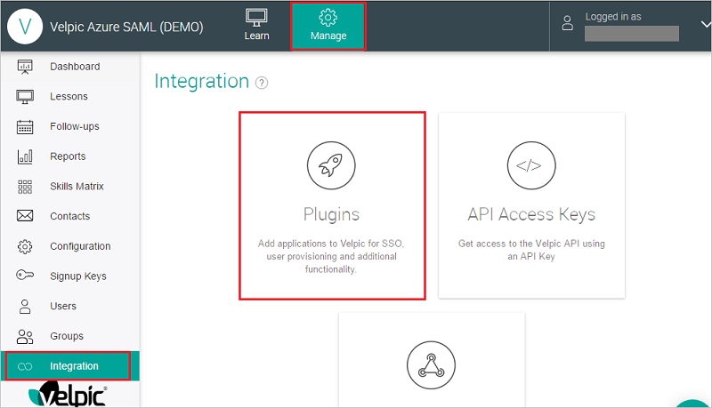
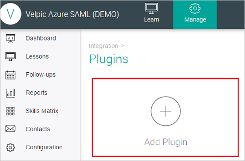
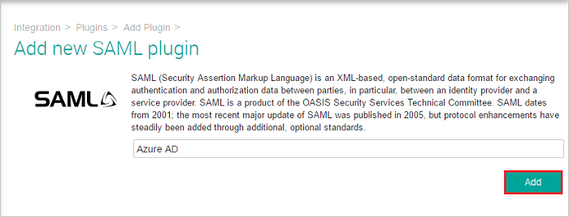
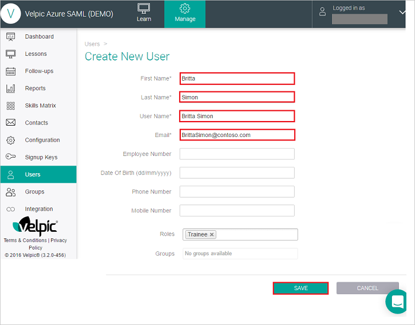
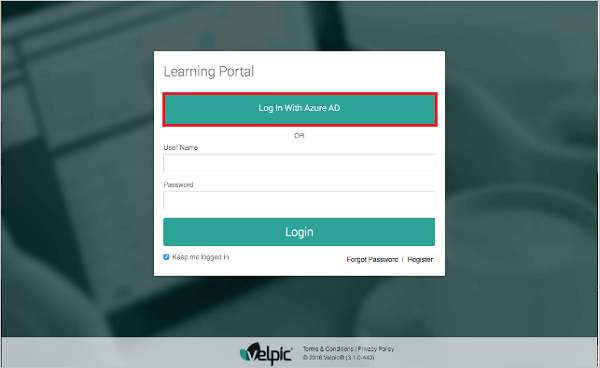

# Tutorial: Azure Active Directory integration with Velpic SAML

In this tutorial, you learn how to integrate Velpic SAML with Azure Active Directory (Azure AD).
Integrating Velpic SAML with Azure AD provides you with the following benefits:

* You can control in Azure AD who has access to Velpic SAML.
* You can enable your users to be automatically signed-in to Velpic SAML (Single Sign-On) with their Azure AD accounts.
* You can manage your accounts in one central location - the Azure portal.

If you want to know more details about SaaS app integration with Azure AD, see [What is application access and single sign-on with Azure Active Directory](https://docs.microsoft.com/azure/active-directory/active-directory-appssoaccess-whatis).
If you don't have an Azure subscription, [create a free account](https://azure.microsoft.com/free/) before you begin.

## Prerequisites

To configure Azure AD integration with Velpic SAML, you need the following items:

* An Azure AD subscription. If you don't have an Azure AD environment, you can get a [free account](https://azure.microsoft.com/free/)
* Velpic SAML single sign-on enabled subscription

## Scenario description

In this tutorial, you configure and test Azure AD single sign-on in a test environment.

* Velpic SAML supports **SP** initiated SSO

## Adding Velpic SAML from the gallery

To configure the integration of Velpic SAML into Azure AD, you need to add Velpic SAML from the gallery to your list of managed SaaS apps.

**To add Velpic SAML from the gallery, perform the following steps:**

1. In the **[Azure portal](https://portal.azure.com)**, on the left navigation panel, click **Azure Active Directory** icon.

	

2. Navigate to **Enterprise Applications** and then select the **All Applications** option.

	

3. To add new application, click **New application** button on the top of dialog.

	

4. In the search box, type **Velpic SAML**, select **Velpic SAML** from result panel then click **Add** button to add the application.

	

## Configure and test Azure AD single sign-on

In this section, you configure and test Azure AD single sign-on with Velpic SAML based on a test user called **Britta Simon**.
For single sign-on to work, a link relationship between an Azure AD user and the related user in Velpic SAML needs to be established.

To configure and test Azure AD single sign-on with Velpic SAML, you need to complete the following building blocks:

1. **[Configure Azure AD Single Sign-On](#configure-azure-ad-single-sign-on)** - to enable your users to use this feature.
2. **[Configure Velpic SAML Single Sign-On](#configure-velpic-saml-single-sign-on)** - to configure the Single Sign-On settings on application side.
3. **[Create an Azure AD test user](#create-an-azure-ad-test-user)** - to test Azure AD single sign-on with Britta Simon.
4. **[Assign the Azure AD test user](#assign-the-azure-ad-test-user)** - to enable Britta Simon to use Azure AD single sign-on.
5. **[Create Velpic SAML test user](#create-velpic-saml-test-user)** - to have a counterpart of Britta Simon in Velpic SAML that is linked to the Azure AD representation of user.
6. **[Test single sign-on](#test-single-sign-on)** - to verify whether the configuration works.

### Configure Azure AD single sign-on

In this section, you enable Azure AD single sign-on in the Azure portal.

To configure Azure AD single sign-on with Velpic SAML, perform the following steps:

1. In the [Azure portal](https://portal.azure.com/), on the **Velpic SAML** application integration page, select **Single sign-on**.

    

2. On the **Select a Single sign-on method** dialog, select **SAML/WS-Fed** mode to enable single sign-on.

    

3. On the **Set up Single Sign-On with SAML** page, click **Edit** icon to open **Basic SAML Configuration** dialog.

	

4. On the **Basic SAML Configuration** section, perform the following steps:

    

	a. In the **Sign on URL** text box, type a URL using the following pattern:
    `https://<sub-domain>.velpicsaml.net`

    b. In the **Identifier (Entity ID)** text box, type a URL using the following pattern:
    `https://auth.velpic.com/saml/v2/<entity-id>/login`

	> [!NOTE]
	> Please note that the Sign on URL will be provided by the Velpic SAML team and Identifier value will be available when you configure the SSO Plugin on Velpic SAML side. You need to copy that value from Velpic SAML application  page and paste it here.

5. On the **Set up Single Sign-On with SAML** page, in the **SAML Signing Certificate** section, click **Download** to download the **Federation Metadata XML** from the given options as per your requirement and save it on your computer.

	

6. On the **Set up Velpic SAML** section, copy the appropriate URL(s) as per your requirement.

	

	a. Login URL

	b. Azure AD Identifier

	c. Logout URL

### Configure Velpic SAML Single Sign-On

1. In a different web browser window, sign into your Velpic SAML company site as an administrator.

2. Click on **Manage** tab and go to **Integration** section where you need to click on **Plugins** button to create new plugin for Sign-In.

	

3. Click on the **‘Add plugin’** button.
	
	

4. Click on the **SAML** tile in the Add Plugin page.
	
	

5. Enter the name of the new SAML plugin and click the **‘Add’** button.

	

6. Enter the details as follows:

	

	a. In the **Name** textbox, type the name of SAML plugin.

	b. In the **Issuer URL** textbox, paste the **Azure AD Identifier** you copied from the **Configure sign-on** window of the Azure portal.

	c. In the **Provider Metadata Config** upload the Metadata XML file which you downloaded from Azure portal.

	d. You can also choose to enable SAML just in time provisioning by enabling the **‘Auto create new users’** checkbox. If a user doesn’t exist in Velpic and this flag is not enabled, the login from Azure will fail. If the flag is enabled the user will automatically be provisioned into Velpic at the time of login. 

	e. Copy the **Single sign on URL** from the text box and paste it in the Azure portal.
	
	f. Click **Save**.

### Create an Azure AD test user 

The objective of this section is to create a test user in the Azure portal called Britta Simon.

1. In the Azure portal, in the left pane, select **Azure Active Directory**, select **Users**, and then select **All users**.

    

2. Select **New user** at the top of the screen.

    

3. In the User properties, perform the following steps.

    

    a. In the **Name** field enter **BrittaSimon**.
  
    b. In the **User name** field type `brittasimon@yourcompanydomain.extension`. For example, BrittaSimon@contoso.com

    c. Select **Show password** check box, and then write down the value that's displayed in the Password box.

    d. Click **Create**.

### Assign the Azure AD test user

In this section, you enable Britta Simon to use Azure single sign-on by granting access to Velpic SAML.

1. In the Azure portal, select **Enterprise Applications**, select **All applications**, then select **Velpic SAML**.

	

2. In the applications list, select **Velpic SAML**.

	

3. In the menu on the left, select **Users and groups**.

    

4. Click the **Add user** button, then select **Users and groups** in the **Add Assignment** dialog.

    

5. In the **Users and groups** dialog select **Britta Simon** in the Users list, then click the **Select** button at the bottom of the screen.

6. If you are expecting any role value in the SAML assertion then in the **Select Role** dialog select the appropriate role for the user from the list, then click the **Select** button at the bottom of the screen.

7. In the **Add Assignment** dialog click the **Assign** button.

### Create Velpic SAML test user

This step is usually not required as the application supports just in time user provisioning. If the automatic user provisioning is not enabled then manual user creation can be done as described below.

Sign into your Velpic SAML company site as an administrator and perform following steps:
	
1. Click on Manage tab and go to Users section, then click on New button to add users.

	

2. On the **“Create New User”** dialog page, perform the following steps.

	
	
	a. In the **First Name** textbox, type the first name of Britta.

	b. In the **Last Name** textbox, type the last name of Simon.

	c. In the **User Name** textbox, type the user name of Britta Simon.

	d. In the **Email** textbox, type the email address of Brittasimon@contoso.com account.

	e. Rest of the information is optional, you can fill it if needed.
	
	f. Click **SAVE**.

### Test single sign-on 

In this section, you test your Azure AD single sign-on configuration using the Access Panel.

1. When you click the Velpic SAML tile in the Access Panel, you should get login page of Velpic SAML application. You should see the **‘Log In With Azure AD’** button on the sign in page.

	

1. Click on the **‘Log In With Azure AD’** button to log in to Velpic using your Azure AD account.

## Additional Resources

- [List of Tutorials on How to Integrate SaaS Apps with Azure Active Directory](https://docs.microsoft.com/azure/active-directory/active-directory-saas-tutorial-list)

- [What is application access and single sign-on with Azure Active Directory?](https://docs.microsoft.com/azure/active-directory/active-directory-appssoaccess-whatis)

- [What is Conditional Access in Azure Active Directory?](https://docs.microsoft.com/azure/active-directory/conditional-access/overview)

