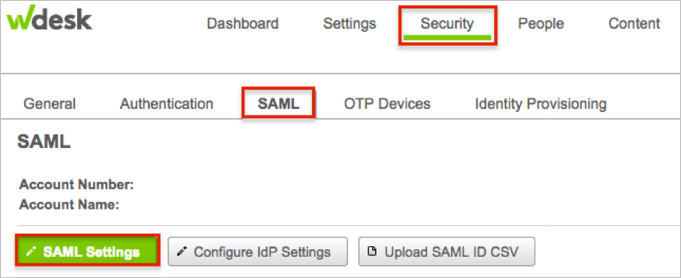
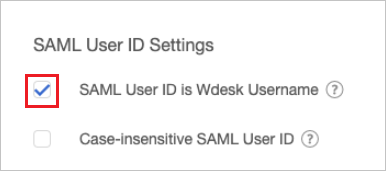
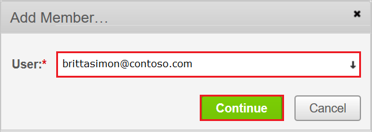
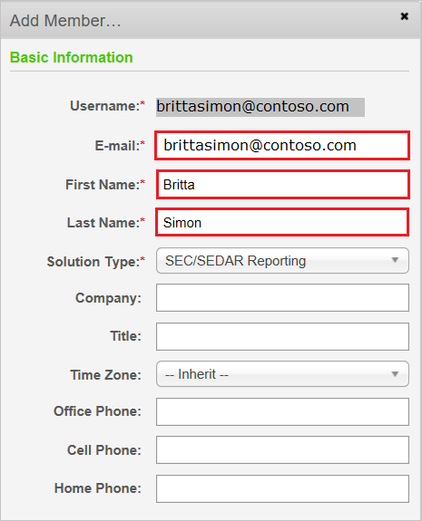

# Tutorial: Azure Active Directory single sign-on (SSO) integration with Wdesk

In this tutorial, you'll learn how to integrate Wdesk with Azure Active Directory (Azure AD). When you integrate Wdesk with Azure AD, you can:

* Control in Azure AD who has access to Wdesk.
* Enable your users to be automatically signed-in to Wdesk with their Azure AD accounts.
* Manage your accounts in one central location - the Azure portal.

## Prerequisites

To get started, you need the following items:

* An Azure AD subscription. If you don't have a subscription, you can get a [free account](https://azure.microsoft.com/free/).
* Wdesk single sign-on (SSO) enabled subscription.

## Scenario description

In this tutorial, you configure and test Azure AD single sign-on in a test environment.

* Wdesk supports **SP** and **IDP** initiated SSO.

## Add Wdesk from the gallery

To configure the integration of Wdesk into Azure AD, you need to add Wdesk from the gallery to your list of managed SaaS apps.

1. Sign in to the Azure portal using either a work or school account, or a personal Microsoft account.
1. On the left navigation pane, select the **Azure Active Directory** service.
1. Navigate to **Enterprise Applications** and then select **All Applications**.
1. To add new application, select **New application**.
1. In the **Add from the gallery** section, type **Wdesk** in the search box.
1. Select **Wdesk** from results panel and then add the app. Wait a few seconds while the app is added to your tenant.

## Configure and test Azure AD SSO for Wdesk

In this section, you configure and test Azure AD single sign-on with Wdesk based on a test user called **Britta Simon**.
For single sign-on to work, a link relationship between an Azure AD user and the related user in Wdesk needs to be established.

To configure and test Azure AD SSO with Wdesk, perform the following steps:

1. **[Configure Azure AD SSO](#configure-azure-ad-sso)** - to enable your users to use this feature.
    1. **[Create an Azure AD test user](#create-an-azure-ad-test-user)** - to test Azure AD single sign-on with B.Simon.
    1. **[Assign the Azure AD test user](#assign-the-azure-ad-test-user)** - to enable B.Simon to use Azure AD single sign-on.
1. **[Configure Wdesk SSO](#configure-wdesk-sso)** - to configure the single sign-on settings on application side.
    1. **[Create Wdesk test user](#create-wdesk-test-user)** - to have a counterpart of B.Simon in Wdesk that is linked to the Azure AD representation of user.
1. **[Test SSO](#test-sso)** - to verify whether the configuration works.

## Configure Azure AD SSO

Follow these steps to enable Azure AD SSO in the Azure portal.

1. In the Azure portal, on the **Wdesk** application integration page, find the **Manage** section and select **single sign-on**.
1. On the **Select a single sign-on method** page, select **SAML**.
1. On the **Set up single sign-on with SAML** page, click the pencil icon for **Basic SAML Configuration** to edit the settings.

   

4. On the **Basic SAML Configuration** section, if you wish to configure the application in **IDP** initiated mode, perform the following steps:

    a. In the **Identifier** text box, type a URL using the following pattern:
    `https://<subdomain>.wdesk.com/auth/saml/sp/metadata/<instancename>`

    b. In the **Reply URL** text box, type a URL using the following pattern:
    `https://<subdomain>.wdesk.com/auth/saml/sp/consumer/<instancename>`

5. Click **Set additional URLs** and perform the following step if you wish to configure the application in **SP** initiated mode:

    In the **Sign-on URL** text box, type a URL using the following pattern:
    `https://<subdomain>.wdesk.com/auth/login/saml/<instancename>`

	> [!NOTE]
	> These values are not real. Update these values with the actual Identifier, Reply URL, and Sign-On URL. You get these values from WDesk portal when you configure the SSO.

4. On the **Set up Single Sign-On with SAML** page, in the **SAML Signing Certificate** section, click **Download** to download the **Federation Metadata XML** from the given options as per your requirement and save it on your computer.

	

6. On the **Set up Wdesk** section, copy the appropriate URL(s) as per your requirement.

	

	
### Create an Azure AD test user 

In this section, you'll create a test user in the Azure portal called B.Simon.

1. From the left pane in the Azure portal, select **Azure Active Directory**, select **Users**, and then select **All users**.
1. Select **New user** at the top of the screen.
1. In the **User** properties, follow these steps:
   1. In the **Name** field, enter `B.Simon`.  
   1. In the **User name** field, enter the username@companydomain.extension. For example, `B.Simon@contoso.com`.
   1. Select the **Show password** check box, and then write down the value that's displayed in the **Password** box.
   1. Click **Create**.

### Assign the Azure AD test user

In this section, you'll enable B.Simon to use Azure single sign-on by granting access to Wdesk.

1. In the Azure portal, select **Enterprise Applications**, and then select **All applications**.
1. In the applications list, select **Wdesk**.
1. In the app's overview page, find the **Manage** section and select **Users and groups**.
1. Select **Add user**, then select **Users and groups** in the **Add Assignment** dialog.
1. In the **Users and groups** dialog, select **B.Simon** from the Users list, then click the **Select** button at the bottom of the screen.
1. If you are expecting a role to be assigned to the users, you can select it from the **Select a role** dropdown. If no role has been set up for this app, you see "Default Access" role selected.
1. In the **Add Assignment** dialog, click the **Assign** button.

## Configure Wdesk SSO

1. In a different web browser window, sign in to Wdesk as a Security Administrator.

1. In the bottom left, click **Admin** and choose **Account Admin**:
 
    

1. In Wdesk Admin, navigate to **Security**, then **SAML** > **SAML Settings**:

    

1. Under **SAML User ID Settings**, check **SAML User ID is Wdesk Username**.

    

4. Under **General Settings**, check the **Enable SAML Single Sign On**:

    

5. Under **Service Provider Details**, perform the following steps:

    

    1. Copy the **Login URL** and paste it in **Sign-on Url** textbox on Azure portal.

    1. Copy the **Metadata Url** and paste it in **Identifier** textbox on Azure portal.

    1. Copy the **Consumer url** and paste it in **Reply Url** textbox on Azure portal.

    1. Click **Save** on Azure portal to save the changes.      

1. Click **Configure IdP Settings** to open **Edit IdP Settings** dialog. Click **Choose File** to locate the **Metadata.xml** file you saved from Azure portal, then upload it.
    
    
  
1. Click **Save changes**.

    

### Create Wdesk test user

To enable Azure AD users to sign in to Wdesk, they must be provisioned into Wdesk. In Wdesk, provisioning is a manual task.

**To provision a user account, perform the following steps:**

1. Sign in to Wdesk as a Security Administrator.

2. Navigate to **Admin** > **Account Admin**.

     

3. Click **Members** under **People**.

4. Now click **Add Member** to open **Add Member** dialog box. 
   
      

5. In **User** text box, enter the username of user like b.simon@contoso.com and click **Continue** button.

    

6.  Enter the details as shown below:
  
    
 
    a. In **E-mail** text box, enter the email of user like b.simon@contoso.com.

    b. In **First Name** text box, enter the first name of user like **B**.

    c. In **Last Name** text box, enter the last name of user like **Simon**.

7. Click **Save Member** button.  

    

## Test SSO 

In this section, you test your Azure AD single sign-on configuration with following options. 

#### SP initiated:

* Click on **Test this application** in Azure portal. This will redirect to Wdesk Sign on URL where you can initiate the login flow.  

* Go to Wdesk Sign-on URL directly and initiate the login flow from there.

#### IDP initiated:

* Click on **Test this application** in Azure portal and you should be automatically signed in to the Wdesk for which you set up the SSO. 

You can also use Microsoft My Apps to test the application in any mode. When you click the Wdesk tile in the My Apps, if configured in SP mode you would be redirected to the application sign on page for initiating the login flow and if configured in IDP mode, you should be automatically signed in to the Wdesk for which you set up the SSO. For more information about the My Apps, see [Introduction to the My Apps](../user-help/my-apps-portal-end-user-access.md).

## Next steps

Once you configure Wdesk you can enforce session control, which protects exfiltration and infiltration of your organization’s sensitive data in real time. Session control extends from Conditional Access. [Learn how to enforce session control with Microsoft Cloud App Security](/cloud-app-security/proxy-deployment-any-app).