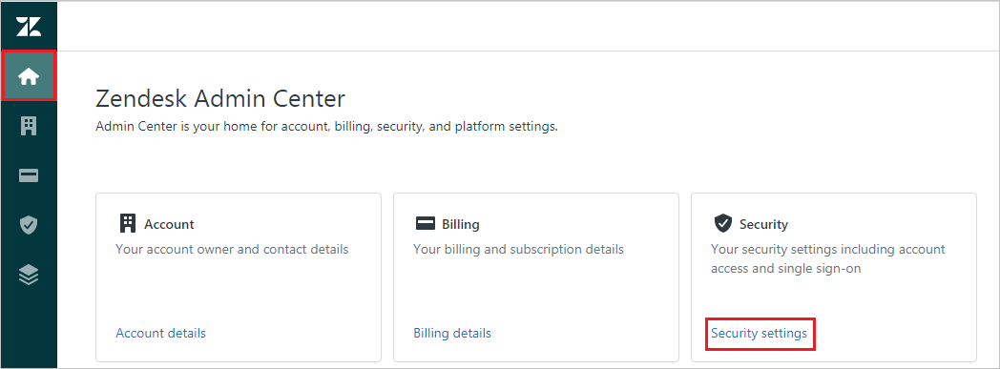
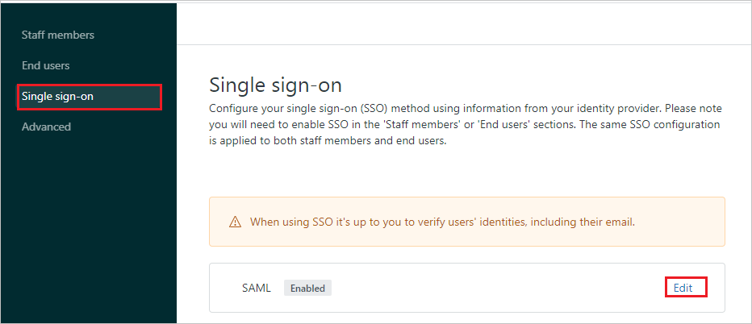
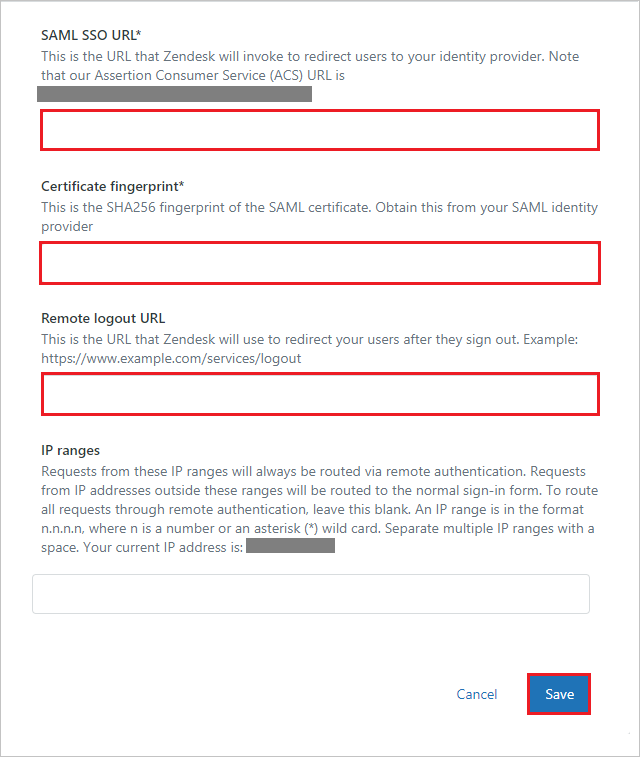

# Tutorial: Azure Active Directory single sign-on (SSO) integration with Zendesk

In this tutorial, you'll learn how to integrate Zendesk with Azure Active Directory (Azure AD). When you integrate Zendesk with Azure AD, you can:

* Control in Azure AD who has access to Zendesk.
* Enable your users to be automatically signed-in to Zendesk with their Azure AD accounts.
* Manage your accounts in one central location - the Azure portal.

To learn more about SaaS app integration with Azure AD, see [What is application access and single sign-on with Azure Active Directory](../manage-apps/what-is-single-sign-on.md).

## Prerequisites

To get started, you need the following items:

* An Azure AD subscription. If you don't have a subscription, you can get a [free account](https://azure.microsoft.com/free/).
* Zendesk single sign-on (SSO) enabled subscription.

## Scenario description

In this tutorial, you configure and test Azure AD SSO in a test environment.

* Zendesk supports **SP** initiated SSO
* Zendesk supports [**Automated** user provisioning](zendesk-provisioning-tutorial.md)
* Once you configure Zendesk you can enforce session control, which protects exfiltration and infiltration of your organization’s sensitive data in real time. Session control extends from Conditional Access. [Learn how to enforce session control with Microsoft Cloud App Security](/cloud-app-security/proxy-deployment-any-app).

## Adding Zendesk from the gallery

To configure the integration of Zendesk into Azure AD, you need to add Zendesk from the gallery to your list of managed SaaS apps.

1. Sign in to the [Azure portal](https://portal.azure.com) using either a work or school account, or a personal Microsoft account.
1. On the left navigation pane, select the **Azure Active Directory** service.
1. Navigate to **Enterprise Applications** and then select **All Applications**.
1. To add new application, select **New application**.
1. In the **Add from the gallery** section, type **Zendesk** in the search box.
1. Select **Zendesk** from results panel and then add the app. Wait a few seconds while the app is added to your tenant.

## Configure and test Azure AD SSO for Zendesk

Configure and test Azure AD SSO with Zendesk using a test user called **B.Simon**. For SSO to work, you need to establish a link relationship between an Azure AD user and the related user in Zendesk.

To configure and test Azure AD SSO with Zendesk, complete the following building blocks:

1. **[Configure Azure AD SSO](#configure-azure-ad-sso)** - to enable your users to use this feature.
    1. **[Create an Azure AD test user](#create-an-azure-ad-test-user)** - to test Azure AD single sign-on with B.Simon.
    1. **[Assign the Azure AD test user](#assign-the-azure-ad-test-user)** - to enable B.Simon to use Azure AD single sign-on.
1. **[Configure Zendesk SSO](#configure-zendesk-sso)** - to configure the single sign-on settings on application side.
    1. **[Create Zendesk test user](#create-zendesk-test-user)** - to have a counterpart of B.Simon in Zendesk that is linked to the Azure AD representation of user.
1. **[Test SSO](#test-sso)** - to verify whether the configuration works.

## Configure Azure AD SSO

Follow these steps to enable Azure AD SSO in the Azure portal.

1. In the [Azure portal](https://portal.azure.com/), on the **Zendesk** application integration page, find the **Manage** section and select **single sign-on**.
1. On the **Select a single sign-on method** page, select **SAML**.
1. On the **Set up single sign-on with SAML** page, click the edit/pen icon for **Basic SAML Configuration** to edit the settings.

   

4. On the **Basic SAML Configuration** section, perform the following steps:

	a. In the **Sign on URL** text box, type a URL using the following pattern:
    `https://<subdomain>.zendesk.com`

    b. In the **Identifier (Entity ID)** text box, type a URL using the following pattern: `https://<subdomain>.zendesk.com`

    c. In the **Reply URL** text box, type a URL using the following pattern: `https://<subdomain>.zendesk.com/access/saml`

	> [!NOTE]
	> These values are not real. Update these values with the actual Sign on URL, Identifier and Reply URL. Contact [Zendesk Client support team](https://support.zendesk.com/hc/en-us/articles/203663676-Using-SAML-for-single-sign-on-Professional-and-Enterprise) to get these values. You can also refer to the patterns shown in the **Basic SAML Configuration** section in the Azure portal.

1. Zendesk application expects the SAML assertions in a specific format. There are no mandatory SAML attributes but optionally you can manage from the **User Attributes** section on application integration page. On the **Set up Single Sign-On with SAML** page, click **Edit** button to open **User Attributes** dialog.

	

    > [!NOTE]
    > You use extension attributes to add attributes that are not in Azure AD by default. Click [User attributes that can be set in SAML](https://support.zendesk.com/hc/articles/203663676-Using-SAML-for-single-sign-on-Professional-and-Enterprise-) to get the complete list of SAML attributes that **Zendesk** accepts.

1. In the **SAML Signing Certificate** section, click **Edit** button to open **SAML Signing Certificate** dialog.

	

1. In the **SAML Signing Certificate** section, copy the **Thumbprint Value** and save it on your computer.

    

1. On the **Set up Zendesk** section, copy the appropriate URL(s) based on your requirement.

	

### Create an Azure AD test user

In this section, you'll create a test user in the Azure portal called B.Simon.

1. From the left pane in the Azure portal, select **Azure Active Directory**, select **Users**, and then select **All users**.
1. Select **New user** at the top of the screen.
1. In the **User** properties, follow these steps:
   1. In the **Name** field, enter `B.Simon`.  
   1. In the **User name** field, enter the username@companydomain.extension. For example, `B.Simon@contoso.com`.
   1. Select the **Show password** check box, and then write down the value that's displayed in the **Password** box.
   1. Click **Create**.

### Assign the Azure AD test user

In this section, you'll enable B.Simon to use Azure single sign-on by granting access to Zendesk.

1. In the Azure portal, select **Enterprise Applications**, and then select **All applications**.
1. In the applications list, select **Zendesk**.
1. In the app's overview page, find the **Manage** section and select **Users and groups**.

   

1. Select **Add user**, then select **Users and groups** in the **Add Assignment** dialog.

	

1. In the **Users and groups** dialog, select **B.Simon** from the Users list, then click the **Select** button at the bottom of the screen.
1. If you're expecting any role value in the SAML assertion, in the **Select Role** dialog, select the appropriate role for the user from the list and then click the **Select** button at the bottom of the screen.
1. In the **Add Assignment** dialog, click the **Assign** button.

## Configure Zendesk SSO

1. To automate the configuration within **Zendesk**, you need to install **My Apps Secure Sign-in browser extension** by clicking **Install the extension**.

	

1. After adding extension to the browser, click on **setup Zendesk** will direct you to the Zendesk application. From there, provide the admin credentials to sign into Zendesk. The browser extension will automatically configure the application for you and automate steps 3-6.

	

1. If you want to setup Zendesk manually, open a new web browser window and sign into your Zendesk company site as an administrator and perform the following steps:

1. In the **Zendesk Admin Center**, click on **Security settings** in the **Security** tab.

	

1. Go to the **Single sign-on** page and click on **Edit** in the **SAML**.

	

1. Perform the following steps in the **SSO** page.

	

    a. In **SAML SSO URL** textbox, paste the value of **Login URL** which you have copied from Azure portal.

    b. In **Certificate Fingerprint** textbox, paste the **Thumbprint** value of certificate which you have copied from Azure portal.

    c. In **Remote Logout URL** textbox, paste the value of **Logout URL** which you have copied from Azure portal.

    d. Click **Save**.

### Create Zendesk test user

The objective of this section is to create a user called Britta Simon in Zendesk. Zendesk supports automatic user provisioning, which is by default enabled. You can find more details [here](Zendesk-provisioning-tutorial.md) on how to configure automatic user provisioning.

## Test SSO 

In this section, you test your Azure AD single sign-on configuration using the Access Panel.

When you click the Zendesk tile in the Access Panel, you should be automatically signed in to the Zendesk for which you set up SSO. For more information about the Access Panel, see [Introduction to the Access Panel](../user-help/my-apps-portal-end-user-access.md).

## Additional resources

- [ List of Tutorials on How to Integrate SaaS Apps with Azure Active Directory ](./tutorial-list.md)

- [What is application access and single sign-on with Azure Active Directory? ](../manage-apps/what-is-single-sign-on.md)

- [What is conditional access in Azure Active Directory?](../conditional-access/overview.md)

- [Try Zendesk with Azure AD](https://aad.portal.azure.com/)

- [What is session control in Microsoft Cloud App Security?](/cloud-app-security/proxy-intro-aad)

- [How to protect Zendesk with advanced visibility and controls](/cloud-app-security/proxy-intro-aad)

- [Configure User Provisioning](zendesk-provisioning-tutorial.md)