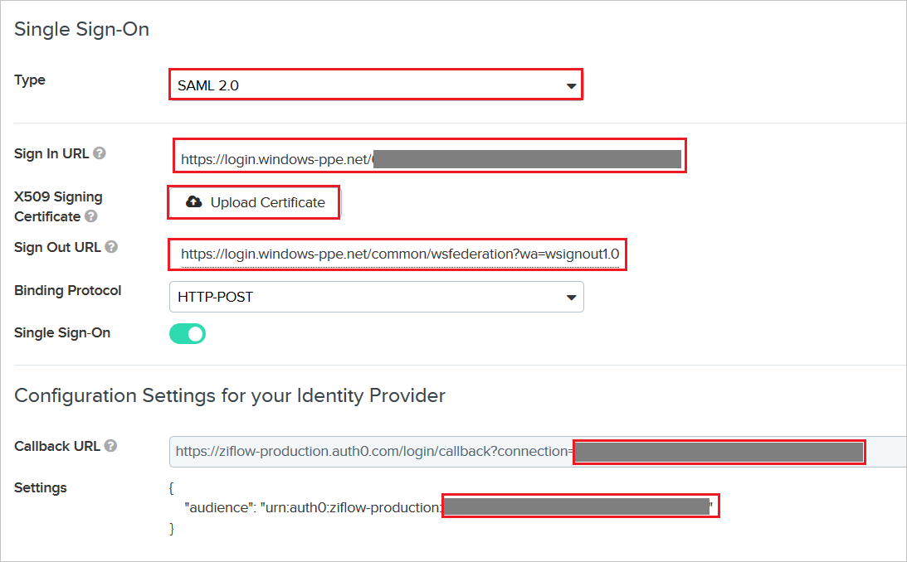
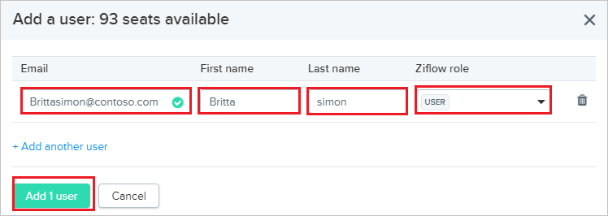

# Tutorial: Azure Active Directory integration with Ziflow

In this tutorial, you learn how to integrate Ziflow with Azure Active Directory (Azure AD).
Integrating Ziflow with Azure AD provides you with the following benefits:

* You can control in Azure AD who has access to Ziflow.
* You can enable your users to be automatically signed-in to Ziflow (Single Sign-On) with their Azure AD accounts.
* You can manage your accounts in one central location - the Azure portal.

If you want to know more details about SaaS app integration with Azure AD, see [What is application access and single sign-on with Azure Active Directory](../manage-apps/what-is-single-sign-on.md).
If you don't have an Azure subscription, [create a free account](https://azure.microsoft.com/free/) before you begin.

## Prerequisites

To configure Azure AD integration with Ziflow, you need the following items:

* An Azure AD subscription. If you don't have an Azure AD environment, you can get a [free account](https://azure.microsoft.com/free/)
* Ziflow single sign-on enabled subscription

## Scenario description

In this tutorial, you configure and test Azure AD single sign-on in a test environment.

* Ziflow supports **SP** initiated SSO

## Adding Ziflow from the gallery

To configure the integration of Ziflow into Azure AD, you need to add Ziflow from the gallery to your list of managed SaaS apps.

**To add Ziflow from the gallery, perform the following steps:**

1. In the **[Azure portal](https://portal.azure.com)**, on the left navigation panel, click **Azure Active Directory** icon.

	

2. Navigate to **Enterprise Applications** and then select the **All Applications** option.

	

3. To add new application, click **New application** button on the top of dialog.

	

4. In the search box, type **Ziflow**, select **Ziflow** from result panel then click **Add** button to add the application.

	 

## Configure and test Azure AD single sign-on

In this section, you configure and test Azure AD single sign-on with Ziflow based on a test user called **Britta Simon**.
For single sign-on to work, a link relationship between an Azure AD user and the related user in Ziflow needs to be established.

To configure and test Azure AD single sign-on with Ziflow, you need to complete the following building blocks:

1. **[Configure Azure AD Single Sign-On](#configure-azure-ad-single-sign-on)** - to enable your users to use this feature.
2. **[Configure Ziflow Single Sign-On](#configure-ziflow-single-sign-on)** - to configure the Single Sign-On settings on application side.
3. **[Create an Azure AD test user](#create-an-azure-ad-test-user)** - to test Azure AD single sign-on with Britta Simon.
4. **[Assign the Azure AD test user](#assign-the-azure-ad-test-user)** - to enable Britta Simon to use Azure AD single sign-on.
5. **[Create Ziflow test user](#create-ziflow-test-user)** - to have a counterpart of Britta Simon in Ziflow that is linked to the Azure AD representation of user.
6. **[Test single sign-on](#test-single-sign-on)** - to verify whether the configuration works.

### Configure Azure AD single sign-on

In this section, you enable Azure AD single sign-on in the Azure portal.

To configure Azure AD single sign-on with Ziflow, perform the following steps:

1. In the [Azure portal](https://portal.azure.com/), on the **Ziflow** application integration page, select **Single sign-on**.

    

2. On the **Select a Single sign-on method** dialog, select **SAML/WS-Fed** mode to enable single sign-on.

    

3. On the **Set up Single Sign-On with SAML** page, click **Edit** icon to open **Basic SAML Configuration** dialog.

	

4. On the **Basic SAML Configuration** section, perform the following steps:

    

	a. In the **Sign on URL** text box, type a URL using the following pattern:
    `https://ziflow-production.auth0.com/login/callback?connection=<UniqueID>`

    b. In the **Identifier (Entity ID)** text box, type a URL using the following pattern:
    `urn:auth0:ziflow-production:<UniqueID>`

	> [!NOTE]
	> The preceding values are not real. You will update the unique ID value in the Identifier and Sign on URL with actual value, which is explained later in the tutorial.

5. On the **Set up Single Sign-On with SAML** page, in the **SAML Signing Certificate** section, click **Download** to download the **Certificate (Base64)** from the given options as per your requirement and save it on your computer.

	

6. On the **Set up Ziflow** section, copy the appropriate URL(s) as per your requirement.

	

	a. Login URL

	b. Azure AD Identifier

	c. Logout URL

### Configure Ziflow Single Sign-On

1. In a different web browser window, sign in to Ziflow as a Security Administrator.

2. Click on Avatar in the top right corner, and then click **Manage account**.

	

3. In the top left, click **Single Sign-On**.

	

4. On the **Single Sign-On** page, perform the following steps:

	

	a. Select **Type** as **SAML2.0**.

	b. In the **Sign In URL** textbox, paste the value of **Login URL**, which you have copied from the Azure portal.

    c. Upload the base-64 encoded certificate that you have downloaded from the Azure portal, into the **X509 Signing Certificate**.

	d. In the **Sign Out URL** textbox, paste the value of **Logout URL**, which you have copied from the Azure portal.

	e. From the **Configuration Settings for your Identifier Provider** section, copy the highlighted unique ID value and append it with the Identifier and Sign on URL in the **Basic SAML Configuration** on Azure portal.

### Create an Azure AD test user 

The objective of this section is to create a test user in the Azure portal called Britta Simon.

1. In the Azure portal, in the left pane, select **Azure Active Directory**, select **Users**, and then select **All users**.

    

2. Select **New user** at the top of the screen.

    

3. In the User properties, perform the following steps.

    

    a. In the **Name** field enter **BrittaSimon**.
  
    b. In the **User name** field type brittasimon@yourcompanydomain.extension. For example, BrittaSimon@contoso.com

    c. Select **Show password** check box, and then write down the value that's displayed in the Password box.

    d. Click **Create**.

### Assign the Azure AD test user

In this section, you enable Britta Simon to use Azure single sign-on by granting access to Ziflow.

1. In the Azure portal, select **Enterprise Applications**, select **All applications**, then select **Ziflow**.

	

2. In the applications list, select **Ziflow**.

	

3. In the menu on the left, select **Users and groups**.

    

4. Click the **Add user** button, then select **Users and groups** in the **Add Assignment** dialog.

    

5. In the **Users and groups** dialog select **Britta Simon** in the Users list, then click the **Select** button at the bottom of the screen.

6. If you are expecting any role value in the SAML assertion then in the **Select Role** dialog select the appropriate role for the user from the list, then click the **Select** button at the bottom of the screen.

7. In the **Add Assignment** dialog click the **Assign** button.

### Create Ziflow test user

To enable Azure AD users to sign in to Ziflow, they must be provisioned into Ziflow. In Ziflow, provisioning is a manual task.

To provision a user account, perform the following steps:

1. Sign in to Ziflow as a Security Administrator.

2. Navigate to **People** on the top.

	

3. Click **Add** and then click **Add user**.

	

4. On the **Add a user** popup, perform the following steps:

	

	a. In **Email** text box, enter the email of user like brittasimon@contoso.com.

	b. In **First name** text box, enter the first name of user like Britta.

	c. In **Last name** text box, enter the last name of user like Simon.

	d. Select your Ziflow role.

	e. Click **Add 1 user**.

	> [!NOTE]
    > The Azure Active Directory account holder receives an email and follows a link to confirm their account before it becomes active.

### Test single sign-on 

In this section, you test your Azure AD single sign-on configuration using the Access Panel.

When you click the Ziflow tile in the Access Panel, you should be automatically signed in to the Ziflow for which you set up SSO. For more information about the Access Panel, see [Introduction to the Access Panel](../user-help/my-apps-portal-end-user-access.md).

## Additional Resources

- [List of Tutorials on How to Integrate SaaS Apps with Azure Active Directory](./tutorial-list.md)

- [What is application access and single sign-on with Azure Active Directory?](../manage-apps/what-is-single-sign-on.md)

- [What is Conditional Access in Azure Active Directory?](../conditional-access/overview.md)