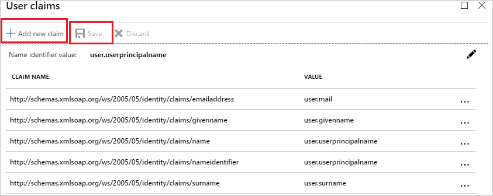
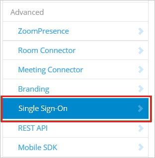
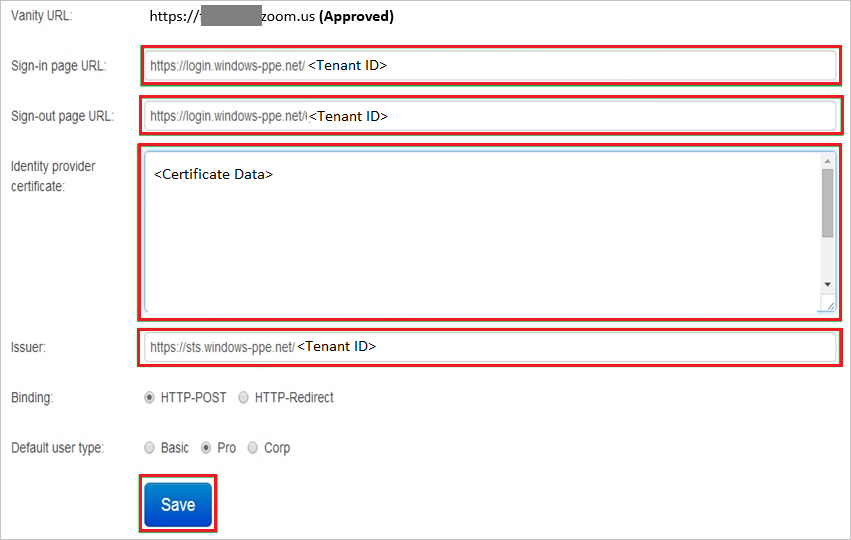
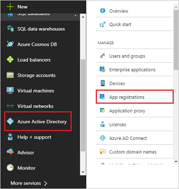
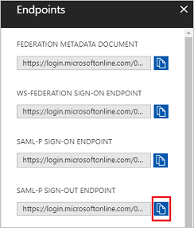
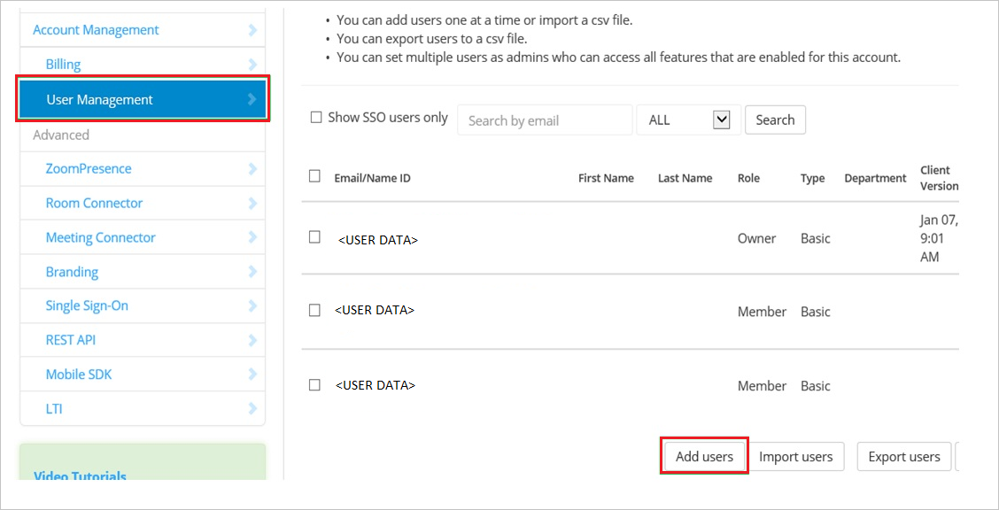
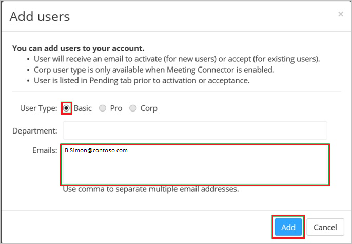

# Tutorial: Azure Active Directory integration with Zoom

In this tutorial, you learn how to integrate Zoom with Azure Active Directory (Azure AD).
Integrating Zoom with Azure AD provides you with the following benefits:

* You can control in Azure AD who has access to Zoom.
* You can enable your users to be automatically signed-in to Zoom (Single Sign-On) with their Azure AD accounts.
* You can manage your accounts in one central location - the Azure portal.

If you want to know more details about SaaS app integration with Azure AD, see [What is application access and single sign-on with Azure Active Directory](https://docs.microsoft.com/azure/active-directory/active-directory-appssoaccess-whatis).
If you don't have an Azure subscription, [create a free account](https://azure.microsoft.com/free/) before you begin.

## Prerequisites

To configure Azure AD integration with Zoom, you need the following items:

* An Azure AD subscription. If you don't have an Azure AD environment, you can get one-month trial [here](https://azure.microsoft.com/pricing/free-trial/)
* Zoom single sign-on enabled subscription

## Scenario description

In this tutorial, you configure and test Azure AD single sign-on in a test environment.

* Zoom supports **SP** initiated SSO

## Adding Zoom from the gallery

To configure the integration of Zoom into Azure AD, you need to add Zoom from the gallery to your list of managed SaaS apps.

**To add Zoom from the gallery, perform the following steps:**

1. In the **[Azure portal](https://portal.azure.com)**, on the left navigation panel, click **Azure Active Directory** icon.

	

2. Navigate to **Enterprise Applications** and then select the **All Applications** option.

	

3. To add new application, click **New application** button on the top of dialog.

	

4. In the search box, type **Zoom**, select **Zoom** from result panel then click **Add** button to add the application.

	 

## Configure and test Azure AD single sign-on

In this section, you configure and test Azure AD single sign-on with Zoom based on a test user called **Britta Simon**.
For single sign-on to work, a link relationship between an Azure AD user and the related user in Zoom needs to be established.

To configure and test Azure AD single sign-on with Zoom, you need to complete the following building blocks:

1. **[Configure Azure AD Single Sign-On](#configure-azure-ad-single-sign-on)** - to enable your users to use this feature.
2. **[Configure Zoom Single Sign-On](#configure-zoom-single-sign-on)** - to configure the Single Sign-On settings on application side.
3. **[Create an Azure AD test user](#create-an-azure-ad-test-user)** - to test Azure AD single sign-on with Britta Simon.
4. **[Assign the Azure AD test user](#assign-the-azure-ad-test-user)** - to enable Britta Simon to use Azure AD single sign-on.
5. **[Create Zoom test user](#create-zoom-test-user)** - to have a counterpart of Britta Simon in Zoom that is linked to the Azure AD representation of user.
6. **[Test single sign-on](#test-single-sign-on)** - to verify whether the configuration works.

### Configure Azure AD single sign-on

In this section, you enable Azure AD single sign-on in the Azure portal.

To configure Azure AD single sign-on with Zoom, perform the following steps:

1. In the [Azure portal](https://portal.azure.com/), on the **Zoom** application integration page, select **Single sign-on**.

    

2. On the **Select a Single sign-on method** dialog, select **SAML/WS-Fed** mode to enable single sign-on.

    

3. On the **Set up Single Sign-On with SAML** page, click **Edit** icon to open **Basic SAML Configuration** dialog.

	

4. On the **Basic SAML Configuration** section, perform the following steps:

    

	a. In the **Sign on URL** text box, type a URL using the following pattern:
    `https://<companyname>.zoom.us`

    b. In the **Identifier (Entity ID)** text box, type a URL using the following pattern:
    `<companyname>.zoom.us`

	> [!NOTE]
	> These values are not real. Update these values with the actual Sign on URL and Identifier. Contact [Zoom Client support team](https://support.zoom.us/hc/en-us) to get these values. You can also refer to the patterns shown in the **Basic SAML Configuration** section in the Azure portal.

5. Zoom application expects the SAML assertions in a specific format, which requires you to add custom attribute mappings to your SAML token attributes configuration. The following screenshot shows the list of default attributes. Click **Edit** icon to open **User Attributes** dialog.

	

6. In addition to above, Zoom application expects few more attributes to be passed back in SAML response. In the **User Claims** section on the **User Attributes** dialog, perform the following steps to add SAML token attribute as shown in the below table:
    
	| Name | Namespace  |  Source Attribute|
	| ---------------| --------------- | --------- |
	| Email address  | user.mail  | `http://schemas.xmlsoap.org/ws/2005/05/identity/claims/mail` |
	| First name  | user.givenname  | `http://schemas.xmlsoap.org/ws/2005/05/identity/claims/givenname` |
	| Last name  | user.surname  | `http://schemas.xmlsoap.org/ws/2005/05/identity/claims/surname` |
	| Phone number  | user.telephonenumber  | `http://schemas.xmlsoap.org/ws/2005/05/identity/claims/phone` |
	| Department  | user.department  | `http://schemas.xmlsoap.org/ws/2005/05/identity/claims/department` |
	| role | 	user.assignedrole |`http://schemas.xmlsoap.org/ws/2005/05/identity/claims/role` |

	> [!NOTE]
	> Please click [here](https://docs.microsoft.com/azure/role-based-access-control/role-assignments-portal) to know how to configure Role in Azure AD

	a. Click **Add new claim** to open the **Manage user claims** dialog.

	

	

	b. In the **Name** textbox, type the attribute name shown for that row.

	c. Select Source as **Attribute**.

	d. From the **Source attribute** list, type the attribute value shown for that row.

	e. Click **Ok**

	f. Click **Save**.

	> [!NOTE]
	> Zoom may expect group claim in SAML payload so if you have created any group then please contact [Zoom Client support team](https://support.zoom.us/hc/en-us) with the group information so that they can configure this group information at their end also. You also need to provide the Object ID to [Zoom Client support team](https://support.zoom.us/hc/en-us) so that they can configure at their end. Please follow the [document](https://support.zoom.us/hc/en-us/articles/115005887566) to get the Object ID.

7. On the **Set up Single Sign-On with SAML** page, in the **SAML Signing Certificate** section, click **Download** to download the **Certificate (Base64)** from the given options as per your requirement and save it on your computer.

	

8. On the **Set up Zoom** section, copy the appropriate URL(s) as per your requirement.

	

	a. Login URL

	b. Azure AD Identifier

	c. Logout URL

### Configure Zoom Single Sign-On

1. In a different web browser window, log in to your Zoom company site as an administrator.

2. Click the **Single Sign-On** tab.

    

3. Click the **Security Control** tab, and then go to the **Single Sign-On** settings.

4. In the Single Sign-On section, perform the following steps:

    

    a. In the **Sign-in page URL** textbox, paste the value of **Login URL** which you have copied from Azure portal.

    b. For **Sign-out page URL** value, you need to go to the Azure portal and click on **Azure Active Directory** on the left then navigate to **App registrations**.

	

	c. Click on **Endpoints**

	

	d. Copy the **SAML-P SIGN-OUT ENDPOINT** and paste it into **Sign-out page URL** textbox.

	

    e. Open your base-64 encoded certificate in notepad, copy the content of it into your clipboard, and then paste it to the **Identity provider certificate** textbox.

    f. In the **Issuer** textbox, paste the value of **Azure AD Identifier** which you have copied from Azure portal. 

    g. Click **Save**.

    > [!NOTE]
	> For more information, visit the zoom documentation [https://zoomus.zendesk.com/hc/articles/115005887566](https://zoomus.zendesk.com/hc/articles/115005887566)

### Create an Azure AD test user

The objective of this section is to create a test user in the Azure portal called Britta Simon.

1. In the Azure portal, in the left pane, select **Azure Active Directory**, select **Users**, and then select **All users**.

    

2. Select **New user** at the top of the screen.

    

3. In the User properties, perform the following steps.

    

    a. In the **Name** field enter **BrittaSimon**.
  
    b. In the **User name** field type **brittasimon\@yourcompanydomain.extension**  
    For example, BrittaSimon@contoso.com

    c. Select **Show password** check box, and then write down the value that's displayed in the Password box.

    d. Click **Create**.

### Assign the Azure AD test user

In this section, you enable Britta Simon to use Azure single sign-on by granting access to Zoom.

1. In the Azure portal, select **Enterprise Applications**, select **All applications**, then select **Zoom**.

	

2. In the applications list, type and select **Zoom**.

	

3. In the menu on the left, select **Users and groups**.

    

4. Click the **Add user** button, then select **Users and groups** in the **Add Assignment** dialog.

    

5. In the **Users and groups** dialog select **Britta Simon** in the Users list, then click the **Select** button at the bottom of the screen.

6. If you are expecting any role value in the SAML assertion then in the **Select Role** dialog select the appropriate role for the user from the list, then click the **Select** button at the bottom of the screen.

7. In the **Add Assignment** dialog click the **Assign** button.

### Create Zoom test user

In order to enable Azure AD users to log in to Zoom, they must be provisioned into Zoom. In the case of Zoom, provisioning is a manual task.

### To provision a user account, perform the following steps:

1. Log in to your **Zoom** company site as an administrator.

2. Click the **Account Management** tab, and then click **User Management**.

3. In the User Management section, click **Add users**.

    

4. On the **Add users** page, perform the following steps:

    

    a. As **User Type**, select **Basic**.

    b. In the **Emails** textbox, type the email address of a valid Azure AD account you want to provision.

    c. Click **Add**.

> [!NOTE]
> You can use any other Zoom user account creation tools or APIs provided by Zoom to provision Azure Active Directory user accounts.

### Test single sign-on

In this section, you test your Azure AD single sign-on configuration using the Access Panel.

When you click the Zoom tile in the Access Panel, you should be automatically signed in to the Zoom for which you set up SSO. For more information about the Access Panel, see [Introduction to the Access Panel](https://docs.microsoft.com/azure/active-directory/active-directory-saas-access-panel-introduction).

## Additional Resources

- [List of Tutorials on How to Integrate SaaS Apps with Azure Active Directory](https://docs.microsoft.com/azure/active-directory/active-directory-saas-tutorial-list)

- [What is application access and single sign-on with Azure Active Directory?](https://docs.microsoft.com/azure/active-directory/active-directory-appssoaccess-whatis)

- [What is conditional access in Azure Active Directory?](https://docs.microsoft.com/azure/active-directory/conditional-access/overview)
