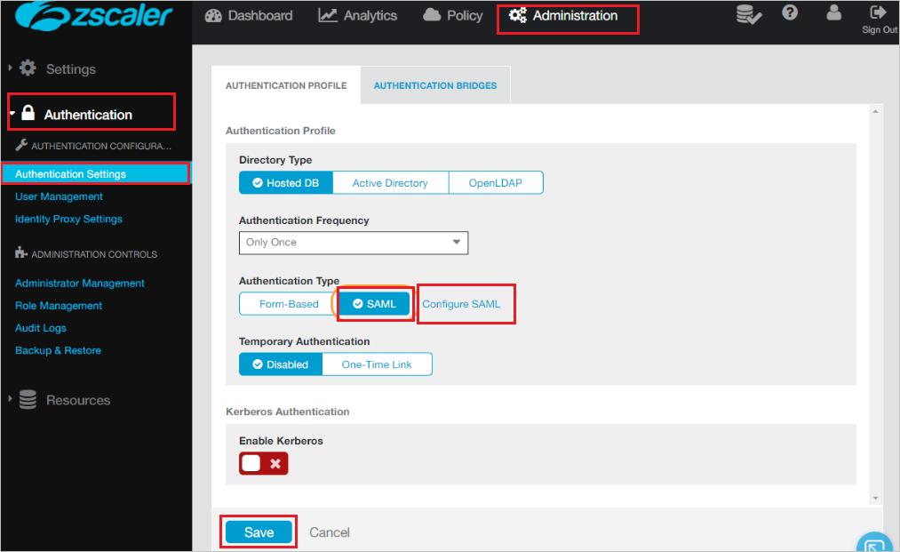
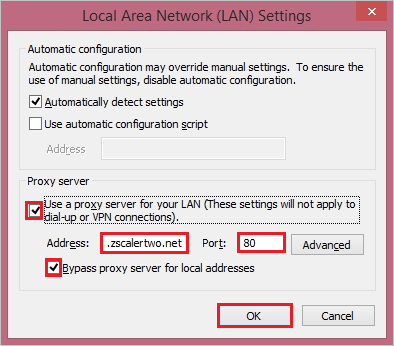
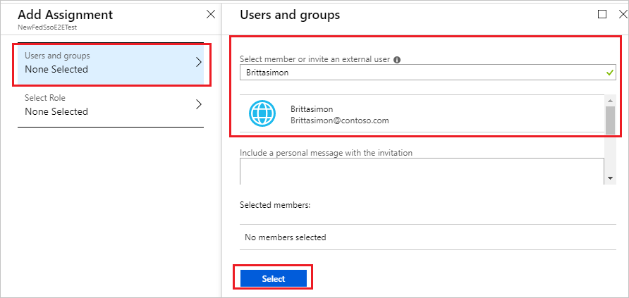
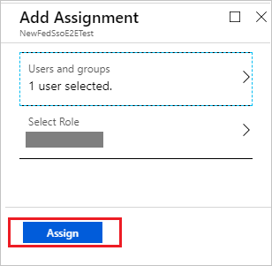

# Tutorial: Azure Active Directory integration with Zscaler One

In this tutorial, you learn how to integrate Zscaler One with Azure Active Directory (Azure AD).
Integrating Zscaler One with Azure AD provides you with the following benefits:

* You can control in Azure AD who has access to Zscaler One.
* You can enable your users to be automatically signed-in to Zscaler One (Single Sign-On) with their Azure AD accounts.
* You can manage your accounts in one central location - the Azure portal.

If you want to know more details about SaaS app integration with Azure AD, see [What is application access and single sign-on with Azure Active Directory](https://docs.microsoft.com/azure/active-directory/active-directory-appssoaccess-whatis).
If you don't have an Azure subscription, [create a free account](https://azure.microsoft.com/free/) before you begin.

## Prerequisites

To configure Azure AD integration with Zscaler One, you need the following items:

* An Azure AD subscription. If you don't have an Azure AD environment, you can get a [free account](https://azure.microsoft.com/free/)
* Zscaler One single sign-on enabled subscription

## Scenario description

In this tutorial, you configure and test Azure AD single sign-on in a test environment.

* Zscaler One supports **SP** initiated SSO

* Zscaler One supports **Just In Time** user provisioning

## Adding Zscaler One from the gallery

To configure the integration of Zscaler One into Azure AD, you need to add Zscaler One from the gallery to your list of managed SaaS apps.

**To add Zscaler One from the gallery, perform the following steps:**

1. In the **[Azure portal](https://portal.azure.com)**, on the left navigation panel, click **Azure Active Directory** icon.

	

2. Navigate to **Enterprise Applications** and then select the **All Applications** option.

	

3. To add new application, click **New application** button on the top of dialog.

	

4. In the search box, type **Zscaler One**, select **Zscaler One** from result panel then click **Add** button to add the application.

	 

## Configure and test Azure AD single sign-on

In this section, you configure and test Azure AD single sign-on with Zscaler One based on a test user called **Britta Simon**.
For single sign-on to work, a link relationship between an Azure AD user and the related user in Zscaler One needs to be established.

To configure and test Azure AD single sign-on with Zscaler One, you need to complete the following building blocks:

1. **[Configure Azure AD Single Sign-On](#configure-azure-ad-single-sign-on)** - to enable your users to use this feature.
2. **[Configure Zscaler One Single Sign-On](#configure-zscaler-one-single-sign-on)** - to configure the Single Sign-On settings on application side.
3. **[Create an Azure AD test user](#create-an-azure-ad-test-user)** - to test Azure AD single sign-on with Britta Simon.
4. **[Assign the Azure AD test user](#assign-the-azure-ad-test-user)** - to enable Britta Simon to use Azure AD single sign-on.
5. **[Create Zscaler One test user](#create-zscaler-one-test-user)** - to have a counterpart of Britta Simon in Zscaler One that is linked to the Azure AD representation of user.
6. **[Test single sign-on](#test-single-sign-on)** - to verify whether the configuration works.

### Configure Azure AD single sign-on

In this section, you enable Azure AD single sign-on in the Azure portal.

To configure Azure AD single sign-on with Zscaler One, perform the following steps:

1. In the [Azure portal](https://portal.azure.com/), on the **Zscaler One** application integration page, select **Single sign-on**.

    

2. On the **Select a Single sign-on method** dialog, select **SAML/WS-Fed** mode to enable single sign-on.

    

3. On the **Set up Single Sign-On with SAML** page, click **Edit** icon to open **Basic SAML Configuration** dialog.

	

4. On the **Basic SAML Configuration** section, perform the following steps:

    

    In the **Sign-on URL** textbox, type the URL used by your users to sign-on to your Zscaler One application.

	> [!NOTE]
	> You update the value with the actual Sign-On URL. Contact [Zscaler One Client support team](https://www.zscaler.com/company/contact) to get the value. You can also refer to the patterns shown in the **Basic SAML Configuration** section in the Azure portal.

5. Your Zscaler One application expects the SAML assertions in a specific format, which requires you to add custom attribute mappings to your SAML token attributes configuration. The following screenshot shows the list of default attributes. Click **Edit** icon to open **User Attributes** dialog.

	

6. In addition to above, Zscaler One application expects few more attributes to be passed back in SAML response. In the **User Claims** section on the **User Attributes** dialog, perform the following steps to add SAML token attribute as shown in the below table:
	
	| Name | Source Attribute |
	| ---------| ------------ |
	| memberOf 	   | user.assignedroles |

	a. Click **Add new claim** to open the **Manage user claims** dialog.

	

	

	b. In the **Name** textbox, type the attribute name shown for that row.

	c. Leave the **Namespace** blank.

	d. Select Source as **Attribute**.

	e. From the **Source attribute** list, type the attribute value shown for that row.
	
	f. Click **Save**.

	> [!NOTE]
	> Please click [here](https://docs.microsoft.com/azure/active-directory/active-directory-enterprise-app-role-management) to know how to configure Role in Azure AD

7. On the **Set up Single Sign-On with SAML** page, in the **SAML Signing Certificate** section, click **Download** to download the **Certificate (Base64)** from the given options as per your requirement and save it on your computer.

	

8. On the **Set up Zscaler One** section, copy the appropriate URL(s) as per your requirement.

	

	a. Login URL

	b. Azure AD Identifier

	c. Logout URL

### Configure Zscaler One Single Sign-On

1. To automate the configuration within Zscaler One, you need to install **My Apps Secure Sign-in browser extension** by clicking **Install the extension**.

	

2. After adding extension to the browser, click on **Setup Zscaler One** will direct you to the Zscaler One application. From there, provide the admin credentials to sign into Zscaler One. The browser extension will automatically configure the application for you and automate steps 3-6.

	

3. If you want to setup Zscaler One manually, open a new web browser window and sign into your Zscaler One company site as an administrator and perform the following steps:

4. Go to **Administration > Authentication > Authentication Settings** and perform the following steps:
   
	

	a. Under Authentication Type, choose **SAML**.

	b. Click **Configure SAML**.

5. On the **Edit SAML** window, perform the following steps: and click Save.  
   			
	
	
	a. In the **SAML Portal URL** textbox, Paste the **Login URL** which you have copied from Azure portal.

	b. In the **Login Name Attribute** textbox, enter **NameID**.

	c. Click **Upload**, to  upload the Azure SAML signing certificate that you  have downloaded from Azure portal in the **Public SSL Certificate**.

	d. Toggle the **Enable SAML Auto-Provisioning**.

	e. In the **User Display Name Attribute** textbox, enter **displayName** if you want to enable SAML auto-provisioning for displayName attributes.

	f. In the **Group Name Attribute** textbox, enter **memberOf** if you want to enable SAML auto-provisioning for memberOf attributes.

	g. In the **Department Name Attribute** Enter **department** if you want to enable SAML auto-provisioning for department attributes.

	h. Click **Save**.

6. On the **Configure User Authentication** dialog page, perform the following steps:

    

	a. Hover over the **Activation** menu near the bottom left.

    b. Click **Activate**.

## Configuring proxy settings
### To configure the proxy settings in Internet Explorer

1. Start **Internet Explorer**.

2. Select **Internet options** from the **Tools** menu for open the **Internet Options** dialog.   
  	
	 

3. Click the **Connections** tab.   
  
	 

4. Click **LAN settings** to open the **LAN Settings** dialog.

5. In the Proxy server section, perform the following steps:   
   
	

    a. Select **Use a proxy server for your LAN**.

    b. In the Address textbox, type **gateway.Zscaler One.net**.

    c. In the Port textbox, type **80**.

    d. Select **Bypass proxy server for local addresses**.

    e. Click **OK** to close the **Local Area Network (LAN) Settings** dialog.

7. Click **OK** to close the **Internet Options** dialog.

### Create an Azure AD test user 

The objective of this section is to create a test user in the Azure portal called Britta Simon.

1. In the Azure portal, in the left pane, select **Azure Active Directory**, select **Users**, and then select **All users**.

    

2. Select **New user** at the top of the screen.

    

3. In the User properties, perform the following steps.

    

    a. In the **Name** field enter **BrittaSimon**.
  
    b. In the **User name** field type brittasimon@yourcompanydomain.extension. For example, BrittaSimon@contoso.com

    c. Select **Show password** check box, and then write down the value that's displayed in the Password box.

    d. Click **Create**.

### Assign the Azure AD test user

In this section, you enable Britta Simon to use Azure single sign-on by granting access to Zscaler One.

1. In the Azure portal, select **Enterprise Applications**, select **All applications**, then select **Zscaler One**.

	

2. In the applications list, select **Zscaler One**.

	

3. In the menu on the left, select **Users and groups**.

    

4. Click the **Add user** button, then select **Users and groups** in the **Add Assignment** dialog.

    

5. In the **Users and groups** dialog, select the user like **Britta Simon** from the list, then click the **Select** button at the bottom of the screen.

	

6. From the **Select Role** dialog choose the appropriate user role in the list, then click the **Select** button at the bottom of the screen.

	

7. In the **Add Assignment** dialog select the **Assign** button.

	

### Create Zscaler One test user

In this section, a user called Britta Simon is created in Zscaler One. Zscaler One supports just-in-time user provisioning, which is enabled by default. There is no action item for you in this section. If a user doesn't already exist in Zscaler One, a new one is created after authentication.

>[!Note]
>If you need to create a user manually, contact [Zscaler One support team](https://www.zscaler.com/company/contact).

### Test single sign-on 

In this section, you test your Azure AD single sign-on configuration using the Access Panel.

When you click the Zscaler One tile in the Access Panel, you should be automatically signed in to the Zscaler One for which you set up SSO. For more information about the Access Panel, see [Introduction to the Access Panel](https://docs.microsoft.com/azure/active-directory/active-directory-saas-access-panel-introduction).

## Additional Resources

- [List of Tutorials on How to Integrate SaaS Apps with Azure Active Directory](https://docs.microsoft.com/azure/active-directory/active-directory-saas-tutorial-list)

- [What is application access and single sign-on with Azure Active Directory?](https://docs.microsoft.com/azure/active-directory/active-directory-appssoaccess-whatis)

- [What is Conditional Access in Azure Active Directory?](https://docs.microsoft.com/azure/active-directory/conditional-access/overview)

