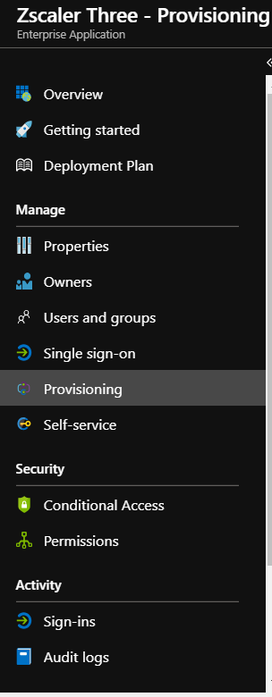
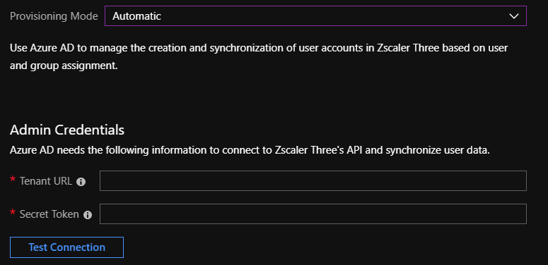
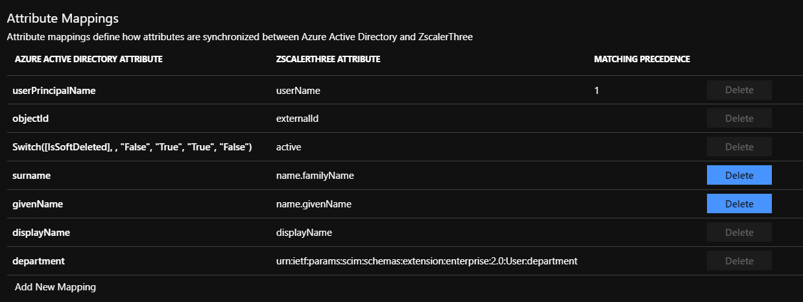
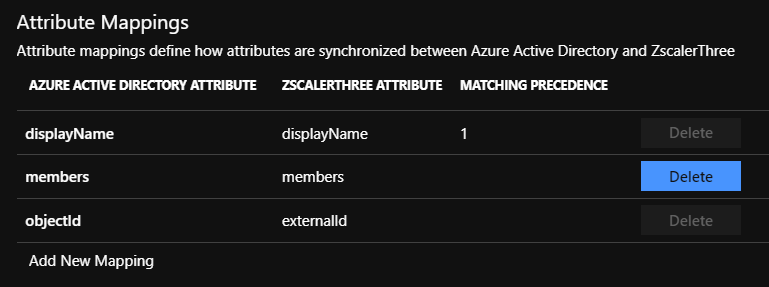

# Tutorial: Configure Zscaler Three for automatic user provisioning

In this tutorial, you'll learn how to configure Azure Active Directory (Azure AD) to automatically provision and deprovision users and/or groups to Zscaler Three.

> [!NOTE]
> This tutorial describes a connector that's built on the Azure AD user provisioning service. For important details on what this service does and how it works, and answers to frequently asked questions, see [Automate user provisioning and deprovisioning to SaaS applications with Azure Active Directory](../active-directory-saas-app-provisioning.md).

## Prerequisites

To complete the steps outlined in this tutorial, you need the following:

* An Azure AD tenant.
* A Zscaler Three tenant.
* A user account in Zscaler Three with admin permissions.

> [!NOTE]
> The Azure AD provisioning integration relies on the Zscaler ZSCloud SCIM API, which is available for Enterprise accounts.

## Adding Zscaler Three from the gallery

Before you configure Zscaler Three for automatic user provisioning with Azure AD, you need to add Zscaler Three from the Azure AD application gallery to your list of managed SaaS applications.

In the [Azure portal](https://portal.azure.com), in the left pane, select **Azure Active Directory**:

Go to **Enterprise applications** and then select **All applications**:

To add an application, select **New application** at the top of the window:

In the search box, enter **Zscaler Three**. Select **Zscaler Three** in the results and then select **Add**.

## Assign users to Zscaler Three

Azure AD users need to be assigned access to selected apps before they can use them. In the context of automatic user provisioning, only the users or groups that are assigned to an application in Azure AD are synchronized.

Before you configure and enable automatic user provisioning, you should decide which users and/or groups in Azure AD need access to Zscaler Three. After you decide that, you can assign these users and groups to Zscaler Three by following the instructions in [Assign a user or group to an enterprise app](https://docs.microsoft.com/azure/active-directory/active-directory-coreapps-assign-user-azure-portal).

### Important tips for assigning users to Zscaler Three

* We recommended that you first assign a single Azure AD user to Zscaler Three to test the automatic user provisioning configuration. You can assign more users and groups later.

* When you assign a user to Zscaler Three, you need to select any valid application-specific role (if available) in the assignment dialog box. Users with the **Default Access** role are excluded from provisioning.

## Set up automatic user provisioning

This section guides you through the steps for configuring the Azure AD provisioning service to create, update, and disable users and groups in Zscaler Three based on user and group assignments in Azure AD.

> [!TIP]
> You might also want to enable SAML-based single sign-on for Zscaler Three. If you do, follow the instructions in the [Zscaler Three single sign-on tutorial](zscaler-three-tutorial.md). Single sign-on can be configured independently of automatic user provisioning, but the two features complement each other.

1. Sign in to the [Azure portal](https://portal.azure.com) and select **Enterprise applications** > **All applications** > **Zscaler Three**:

	

2. In the applications list, select **Zscaler Three**:

	

3. Select the **Provisioning** tab:

	

4. Set the **Provisioning Mode** to **Automatic**:

	

5. In the **Admin Credentials** section, enter the **Tenant URL** and **Secret Token** of your Zscaler Three account, as described in the next step.

6. To get the **Tenant URL** and **Secret Token**, go to **Administration** > **Authentication Settings** in the Zscaler Three portal and select **SAML** under **Authentication Type**:

	

	Select **Configure SAML** to open the **Configure SAML** window:

	

	Select **Enable SCIM-Based Provisioning** and copy the **Base URL** and **Bearer Token**, and then save the settings. In the Azure portal, paste the **Base URL** into the **Tenant URL** box and the **Bearer Token** into the **Secret Token** box.

7. After you enter the values in the **Tenant URL** and **Secret Token** boxes, select **Test Connection** to make sure Azure AD can connect to Zscaler Three. If the connection fails, make sure your Zscaler Three account has admin permissions and try again.

	

8. In the **Notification Email** box, enter the email address of a person or group that should receive the provisioning error notifications. Select **Send an email notification when a failure occurs**:

	

9. Select **Save**.

10. In the **Mappings** section, select **Synchronize Azure Active Directory Users to ZscalerThree**:

	

11. Review the user attributes that are synchronized from Azure AD to Zscaler Three in the **Attribute Mappings** section. The attributes selected as **Matching** properties are used to match the user accounts in Zscaler Three for update operations. Select **Save** to commit any changes.

	

12. In the **Mappings** section, select **Synchronize Azure Active Directory Groups to ZscalerThree**:

	

13. Review the group attributes that are synchronized from Azure AD to Zscaler Three in the **Attribute Mappings** section. The attributes selected as **Matching** properties are used to match the groups in Zscaler Three for update operations. Select **Save** to commit any changes.

	

14. To configure scoping filters, refer to the instructions in the [Scoping filter tutorial](./../active-directory-saas-scoping-filters.md).

15. To enable the Azure AD provisioning service for Zscaler Three, change the **Provisioning Status** to **On** in the **Settings** section:

	

16. Define the users and/or groups that you want to provision to Zscaler Three by choosing the values you want under **Scope** in the **Settings** section:

	

17. When you're ready to provision, select **Save**:

	

This operation starts the initial synchronization of all users and groups defined under **Scope** in the **Settings** section. The initial sync takes longer than subsequent syncs, which occur about every 40 minutes, as long as the Azure AD provisioning service is running. You can monitor progress in the **Synchronization Details** section. You can also follow links to a provisioning activity report, which describes all actions performed by the Azure AD provisioning service on Zscaler Three.

For information on how to read the Azure AD provisioning logs, see [Reporting on automatic user account provisioning](../active-directory-saas-provisioning-reporting.md).

## Additional resources

* [Managing user account provisioning for enterprise apps](../manage-apps/configure-automatic-user-provisioning-portal.md)
* [What is application access and single sign-on with Azure Active Directory?](../manage-apps/what-is-single-sign-on.md)

## Next steps

* [Learn how to review logs and get reports on provisioning activity](../active-directory-saas-provisioning-reporting.md)

<!--Image references-->
[1]: ./media/zscaler-three-provisioning-tutorial/tutorial-general-01.png
[2]: ./media/zscaler-three-provisioning-tutorial/tutorial-general-02.png
[3]: ./media/zscaler-three-provisioning-tutorial/tutorial-general-03.png
