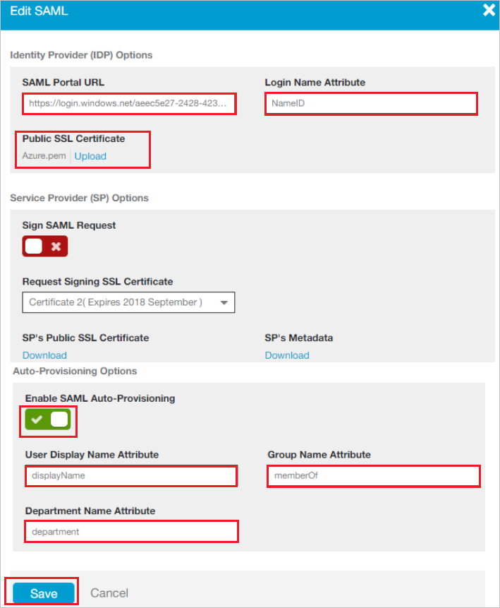
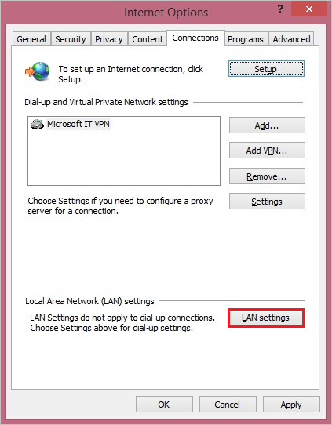

# Tutorial: Azure Active Directory single sign-on (SSO) integration with Zscaler Three

In this tutorial, you'll learn how to integrate Zscaler Three with Azure Active Directory (Azure AD). When you integrate Zscaler Three with Azure AD, you can:

* Control in Azure AD who has access to Zscaler Three.
* Enable your users to be automatically signed-in to Zscaler Three with their Azure AD accounts.
* Manage your accounts in one central location - the Azure portal.

To learn more about SaaS app integration with Azure AD, see [What is application access and single sign-on with Azure Active Directory](../manage-apps/what-is-single-sign-on.md).

## Prerequisites

To get started, you need the following items:

* An Azure AD subscription. If you don't have a subscription, you can get a [free account](https://azure.microsoft.com/free/).
* Zscaler Three single sign-on (SSO) enabled subscription.

## Scenario description

In this tutorial, you configure and test Azure AD SSO in a test environment.

* Zscaler Three supports **SP** initiated SSO

* Zscaler Three supports **Just In Time** user provisioning

> [!NOTE]
> Identifier of this application is a fixed string value so only one instance can be configured in one tenant.

## Adding Zscaler Three from the gallery

To configure the integration of Zscaler Three into Azure AD, you need to add Zscaler Three from the gallery to your list of managed SaaS apps.

1. Sign in to the [Azure portal](https://portal.azure.com) using either a work or school account, or a personal Microsoft account.
1. On the left navigation pane, select the **Azure Active Directory** service.
1. Navigate to **Enterprise Applications** and then select **All Applications**.
1. To add new application, select **New application**.
1. In the **Add from the gallery** section, type **Zscaler Three** in the search box.
1. Select **Zscaler Three** from results panel and then add the app. Wait a few seconds while the app is added to your tenant.

## Configure and test Azure AD single sign-on for Zscaler Three

Configure and test Azure AD SSO with Zscaler Three using a test user called **B.Simon**. For SSO to work, you need to establish a link relationship between an Azure AD user and the related user in Zscaler Three.

To configure and test Azure AD SSO with Zscaler Three, complete the following building blocks:

1. **[Configure Azure AD SSO](#configure-azure-ad-sso)** - to enable your users to use this feature.
    1. **[Create an Azure AD test user](#create-an-azure-ad-test-user)** - to test Azure AD single sign-on with B.Simon.
    1. **[Assign the Azure AD test user](#assign-the-azure-ad-test-user)** - to enable B.Simon to use Azure AD single sign-on.
1. **[Configure Zscaler Three SSO](#configure-zscaler-three-sso)** - to configure the single sign-on settings on application side.
    1. **[Create Zscaler Three test user](#create-zscaler-three-test-user)** - to have a counterpart of B.Simon in Zscaler Three that is linked to the Azure AD representation of user.
1. **[Test SSO](#test-sso)** - to verify whether the configuration works.

## Configure Azure AD SSO

Follow these steps to enable Azure AD SSO in the Azure portal.

1. In the [Azure portal](https://portal.azure.com/), on the **Zscaler Three** application integration page, find the **Manage** section and select **single sign-on**.
1. On the **Select a single sign-on method** page, select **SAML**.
1. On the **Set up single sign-on with SAML** page, click the edit/pen icon for **Basic SAML Configuration** to edit the settings.

   

1. On the **Basic SAML Configuration** section, enter the values for the following fields:

    In the **Sign-on URL** text box, type a URL:
    `https://login.zscalerthree.net/sfc_sso`

1. Your Zscaler Three application expects the SAML assertions in a specific format, which requires you to add custom attribute mappings to your SAML token attributes configuration. The following screenshot shows the list of default attributes.

    

6. In addition to above, Zscaler Three application expects few more attributes to be passed back in SAML response which are shown below. These attributes are also pre populated but you can review them as per your requirement.

    | Name | Source Attribute |
    | ---------| ------------ |
    | memberOf | user.assignedroles |

    > [!NOTE]
    > Please click [here](../develop/active-directory-enterprise-app-role-management.md) to know how to configure Role in Azure AD

1. On the **Set up single sign-on with SAML** page, in the **SAML Signing Certificate** section,  find **Certificate (Base64)** and select **Download** to download the certificate and save it on your computer.

    

1. On the **Set up Zscaler Three** section, copy the appropriate URL(s) based on your requirement.

    

### Create an Azure AD test user

In this section, you'll create a test user in the Azure portal called B.Simon.

1. From the left pane in the Azure portal, select **Azure Active Directory**, select **Users**, and then select **All users**.
1. Select **New user** at the top of the screen.
1. In the **User** properties, follow these steps:
   1. In the **Name** field, enter `B.Simon`.  
   1. In the **User name** field, enter the username@companydomain.extension. For example, `B.Simon@contoso.com`.
   1. Select the **Show password** check box, and then write down the value that's displayed in the **Password** box.
   1. Click **Create**.

### Assign the Azure AD test user

In this section, you'll enable B.Simon to use Azure single sign-on by granting access to Zscaler Three.

1. In the Azure portal, select **Enterprise Applications**, and then select **All applications**.
1. In the applications list, select **Zscaler Three**.
1. In the **Users and groups** dialog, select the user like **Britta Simon** from the list, then click the **Select** button at the bottom of the screen.

    

1. From the **Select Role** dialog choose the appropriate user role in the list, then click the **Select** button at the bottom of the screen.

    

1. In the **Add Assignment** dialog select the **Assign** button.

    

## Configure Zscaler Three SSO

1. To automate the configuration within Zscaler Three, you need to install **My Apps Secure Sign-in browser extension** by clicking **Install the extension**.

    

2. After adding extension to the browser, click on **Setup Zscaler Three** will direct you to the Zscaler Three application. From there, provide the admin credentials to sign into Zscaler Three. The browser extension will automatically configure the application for you and automate steps 3-6.

    

3. If you want to setup Zscaler Three manually, open a new web browser window and sign into your Zscaler Three company site as an administrator and perform the following steps:

4. Go to **Administration > Authentication > Authentication Settings** and perform the following steps:

    

    a. Under Authentication Type, choose **SAML**.

    b. Click **Configure SAML**.

5. On the **Edit SAML** window, perform the following steps: and click Save.  

    

    a. In the **SAML Portal URL** textbox, Paste the **Login URL** which you have copied from Azure portal.

    b. In the **Login Name Attribute** textbox, enter **NameID**.

    c. Click **Upload**, to  upload the Azure SAML signing certificate that you  have downloaded from Azure portal in the **Public SSL Certificate**.

    d. Toggle the **Enable SAML Auto-Provisioning**.

    e. In the **User Display Name Attribute** textbox, enter **displayName** if you want to enable SAML auto-provisioning for displayName attributes.

    f. In the **Group Name Attribute** textbox, enter **memberOf** if you want to enable SAML auto-provisioning for memberOf attributes.

    g. In the **Department Name Attribute** Enter **department** if you want to enable SAML auto-provisioning for department attributes.

    h. Click **Save**.

6. On the **Configure User Authentication** dialog page, perform the following steps:

    

    a. Hover over the **Activation** menu near the bottom left.

    b. Click **Activate**.

## Configuring proxy settings
### To configure the proxy settings in Internet Explorer

1. Start **Internet Explorer**.

2. Select **Internet options** from the **Tools** menu for open the **Internet Options** dialog.   

     

3. Click the **Connections** tab.   

     

4. Click **LAN settings** to open the **LAN Settings** dialog.

5. In the Proxy server section, perform the following steps:   

    

    a. Select **Use a proxy server for your LAN**.

    b. In the Address textbox, type **gateway.Zscaler Three.net**.

    c. In the Port textbox, type **80**.

    d. Select **Bypass proxy server for local addresses**.

    e. Click **OK** to close the **Local Area Network (LAN) Settings** dialog.

6. Click **OK** to close the **Internet Options** dialog.

### Create Zscaler Three test user

In this section, a user called B.Simon is created in Zscaler Three. Zscaler Three supports just-in-time provisioning, which is enabled by default. There is no action item for you in this section. If a user doesn't already exist in Zscaler Three, a new one is created when you attempt to access Zscaler Three.

>[!Note]
>If you need to create a user manually, contact [Zscaler Three support team](https://www.zscaler.com/company/contact).

## Test SSO 

In this section, you test your Azure AD single sign-on configuration using the Access Panel.

When you click the Zscaler Three tile in the Access Panel, you should be automatically signed in to the Zscaler Three for which you set up SSO. For more information about the Access Panel, see [Introduction to the Access Panel](../user-help/my-apps-portal-end-user-access.md).

## Additional resources

- [List of Tutorials on How to Integrate SaaS Apps with Azure Active Directory](./tutorial-list.md)

- [What is application access and single sign-on with Azure Active Directory?](../manage-apps/what-is-single-sign-on.md)

- [What is conditional access in Azure Active Directory?](../conditional-access/overview.md)

- [Try Zscaler Three with Azure AD](https://aad.portal.azure.com/)