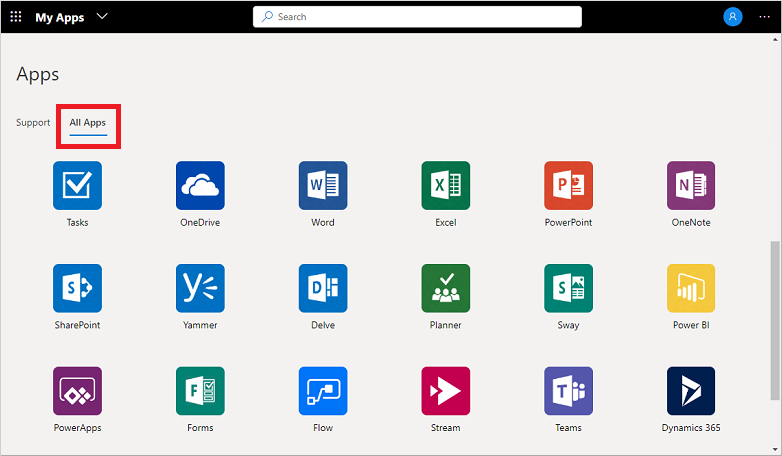
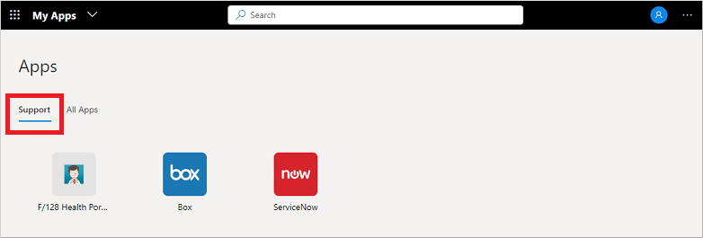

# Use collections in the My Apps portal

Collections are different app views you see in the **My Apps** portal. Apps can be grouped into collections by department function or user role, for example. If you don't see any collections or categories available, it means that your administrator hasn't set up or shared any with you. Contact your organization's Helpdesk for additional assistance or permissions to see shared collections.

[!INCLUDE [preview-notice](../../../includes/active-directory-end-user-my-apps-and-workspaces.md)]

>[!Important]
>This content is intended for **My Apps** users. If you're an administrator, you can find more information about how to set up and manage your cloud-based apps in the [Application Management Documentation](../manage-apps/access-panel-collections.md).

## Access apps using collections

The list of collections in the **My Apps** portal defaults to show one named **All Apps**, which has every app you have access to:

Any other collection you see in this list was created by your admin and shared with you. You can choose one of those collections to see a more scoped set of apps, such as *Support* in the following example:

When you select and view a collection, you only see the default applications that you have access to.

## Next steps

After you organize your apps into the various categories in the **My Apps** portal, you can:

- Review, update, or revoke permissions granted to applications. For more information, see [Edit or revoke application permissions in the My Apps portal](my-applications-portal-permissions-saved-accounts.md).

## Related articles

- [Update your profile and account info](my-account-portal-overview.md). Instructions about how to update your personal information that appears on the **My Profile** portal.

- [Manage your organizations](my-account-portal-organizations-page.md). Instructions about how to view and manage your organization-related information on the **Organizations** page of the **My Profile** portal.

- [Manage your connected devices](my-account-portal-devices-page.md). Instructions about how to manage the devices you're connected to using your work or school account, on the **Devices** page of the **My Profile** portal.