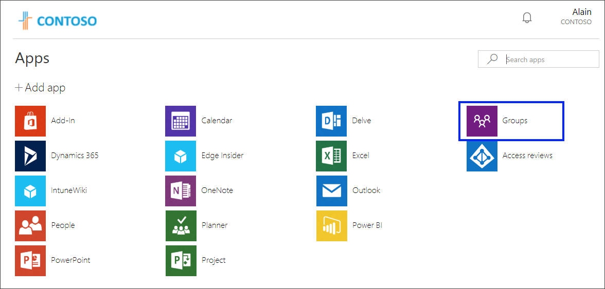
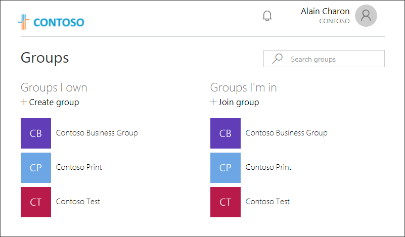
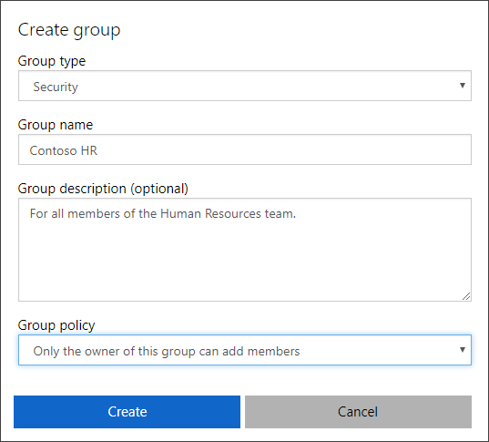
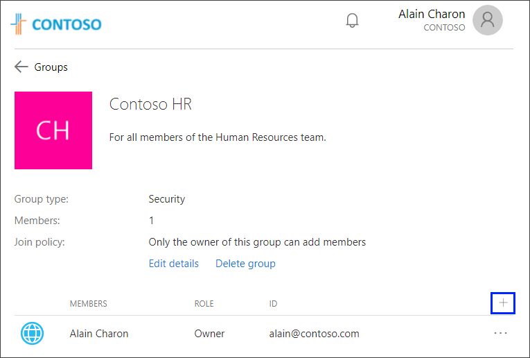
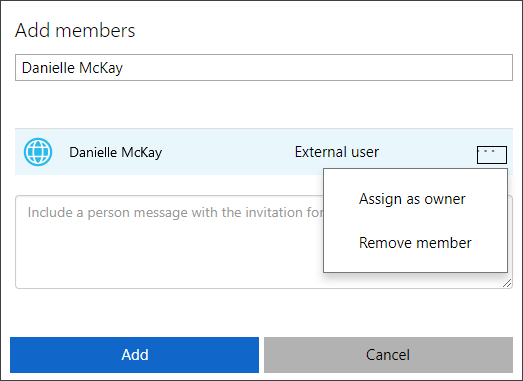
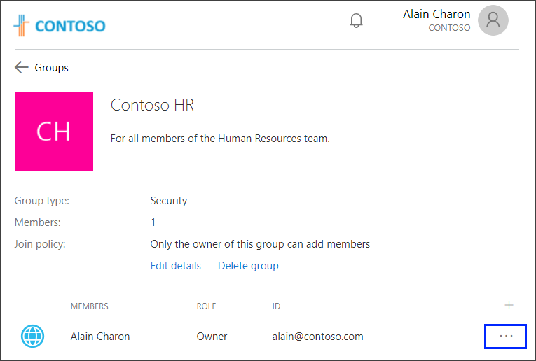
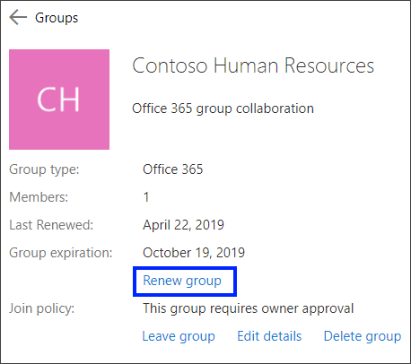
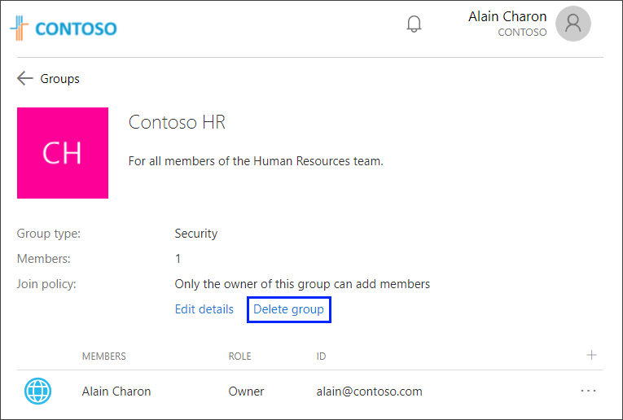
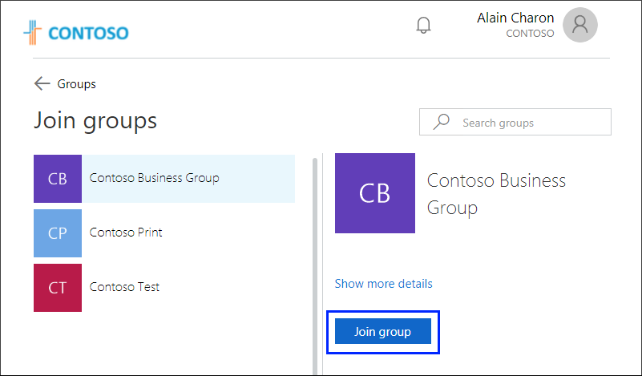

# Update your Groups info on the My Apps portal

You can use your work or school account with the web-based **My Apps** portal, to view and start many of your organization’s cloud-based apps, to update some of your profile and account information, to see your **Groups** information, and to perform **access reviews** for your apps and groups. If you don’t have access to the **My Apps** portal, you must contact your Helpdesk for permission.

[!INCLUDE [preview-notice](../../../includes/active-directory-end-user-my-apps-portal.md)]

>[!Important]
>This content is intended for users. If you're an administrator, you can find more information about how to set up and manage your cloud-based apps in the [Application Management Documentation](https://docs.microsoft.com/azure/active-directory/manage-apps).

## View your Groups information

If your administrator has given you permission to view the **Groups** tile, you can:

- **As a group member.** View details or leave any group.

- **As a group owner.** View details, create a new group, add or remove members, or delete your group.

### To view your groups information

1. Sign in to your work or school account.

2. Open your web browser and go to https://myapps.microsoft.com, or use the link provided by your organization. For example, you might be directed to a customized page for your organization, such as https://myapps.microsoft.com/contoso.com.

    The **Apps** page appears, showing all the cloud-based apps owned by your organization and available for you to use.

    

3. Select the **Groups** tile to see your group-related information.

    

4. Based on your permissions, you can use the **Groups** page to:

    - **Review the groups you own.** View information about any groups you own within your organization from the **Groups I own** area. Selecting a specific group name provides you with more details about the group, including the group type, the number of members, the join policy, and the active members list.

    - **Create a new group.** Create a new group with you as the owner from the **Groups I own** area. For specific steps, see the [Create a new group](#create-a-new-group) section of this article.

    - **Edit an existing group.** Edit the details for any of your own groups. For specific steps, see the [Edit an existing group](#edit-an-existing-group) section of this article.

    - **Add or remove members.** Add or remove members for groups that you own. For specific steps, see the [Add or remove a member](#add-or-remove-a-member) section of this article.

    - **Renew an Office 365 group.** If your organization allows it, you can renew your Office 365 groups. For specific steps, see the [Renew an Office 365 group](#renew-an-office-365-group) section of this article. 

    - **Delete a group.** Delete any groups that you own. For specific steps, see the [Delete a group](#delete-a-group) section of this article.

    - **Review the groups you're a part of.** View the names of any groups to which you're a member from the **Groups I'm in** area. Selecting a specific group name provides you with more details about the group, including the group type, the number of members, the join policy, and the active members list.

    - **Join a group.** Join an existing group, for which you're not already a member, from the **Groups I'm in** area. For specific steps, see the [Join an existing group](#join-an-existing-group).

## Create a new group

1. On the **Groups** page, select **Create a group** from the **Groups I own** area.

    The **Create group** box appears.

    

2. Enter the required information:

    - **Group type:**

        - **Security.** Used to manage member and computer access to shared resources for a group of users. For example, you can create a security group for a specific security policy. By doing it this way, you can give a set of permissions to all the members at once, instead of having to add permissions to each member individually.

        - **Office 365.** Provides collaboration opportunities by giving members access to a shared mailbox, calendar, files, SharePoint site, and more. This option also lets you give people outside of your organization access to the group.

    - **Group name.** Add a name for the group, something that you'll remember and that makes sense.

    - **Group description (optional).** Add an optional description to your group.

    - **Group policy.** Choose either to allow everyone to join the group or to only allow the owner of the group to add members.

3. Select **Create**.

    The new group is created with you as the owner and it appears in your **Groups I own** list. Because you're the owner, this group also appears in the **Groups I'm in** list.

## Edit an existing group

After you create a group, you can edit its details, including updating any of the existing information.

1. Select the group you want to edit from the **Groups** page, and then select **Edit details** on the *&lt;group_name&gt;* page.

    The **Edit details** box appears and you can update the information you added when you initially created the group.

2. Make all of your changes, and then select **Update**.

## Add or remove a member

You can add or remove members for any groups that you own.

1. Select the group you want to add members to, and then select **+** on the *&lt;group_name&gt;* page.

    

2. Search for the member you want to add, from the **Add members** box, and then select **Add**.

    

    An invitation is sent to the new member, to get started accessing the organization's apps.

3. If you added a member by mistake, or if a member has left your organization, you can remove the member by selecting **Remove member** next to the member's name on the *&lt;group_name&gt;* page.

    

## Renew an Office 365 group

If your organization allows it, you can renew an Office 365 group, extending your expiration date.

1. Select the Office 365 group you want to renew, and then select **Renew group**.

    

2. Click **OK** to close the confirmation message.

    After you refresh the page, you'll see your updated **Last Renewed** and **Group expiration** dates.

## Delete a group

You can delete any of your own groups at any time. However, if you delete a group by mistake you'll have to create it and add members again.

1. Select the group you want to permanently delete, and then select **Delete group** on the *&lt;group_name&gt;* page.

    

2. Select **Yes** on the confirmation message.

    The group is permanently deleted.

## Join an existing group

You can join or leave an already existing group from the **Groups** page.

1. On the **Groups** page, select **Join group** from the **Groups I'm in** area.

    The **Join groups** page appears.

    

2. On the **Join groups** page, select the name of the group you want to join, view the associated group details, and then if the group is available, select **Join group**.

    If the group requires the group owner to approve membership, you'll be asked to enter a business justification for why you need to join the group, and then select **Request**. If the group doesn't require approval, you're immediately added as a member and the group appears in your **Groups I'm in** list.

3. If you joined a group by mistake or if you no longer need to be part of it, you can select the group name from the **Join groups** page, and then select **Leave group**.

    

## Next steps

- [Access and use apps on the My Apps portal](my-apps-portal-end-user-access.md).

- [Change your profile information](my-apps-portal-end-user-update-profile.md).

- [Perform your own access reviews](my-apps-portal-end-user-access-reviews.md).
