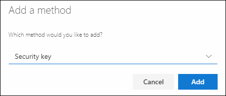
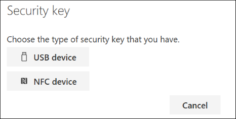
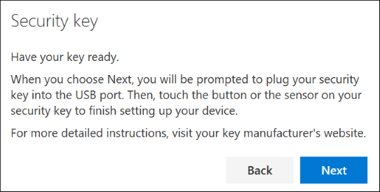
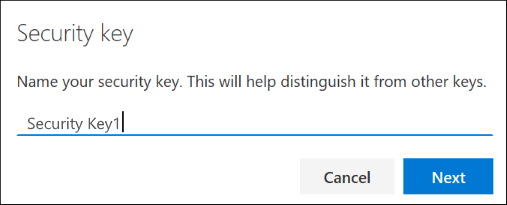
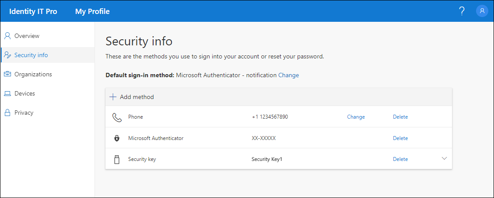

# Set up security info to use a security key (Preview)

You can use security keys as a passwordless sign-in method within your organization. A security key is a physical device that's used with a unique PIN to sign-in to your work or school account. Because security keys require you to have the physical device and something only you know, it's considered a stronger authentication method than a username and password.

[!INCLUDE [preview-notice](../../../includes/active-directory-end-user-preview-notice-security-key.md)]

>[!Important]
>This content is intended for users. If you're an administrator, you can find more information about how to set up and manage your Azure Active Directory (Azure AD) environment in the [Azure Active Directory Documentation](https://docs.microsoft.com/azure/active-directory).

## What is a security key?

We currently support several designs and providers of security keys using the [Fast Identity Online (FIDO)](https://fidoalliance.org/fido2/) (FIDO2) passwordless authentication protocols. These keys allow you to sign in to your work or school account to access your organization's cloud-based resources when on a supported device and web browser.

Your administrator or your organization will provide you with a security key if they require it for your work or school account. There are different types of security keys you can use, for example a USB key that you plug in to your device or an NFC key that you tap on an NFC reader. You can find out more information about your security key, including what type it is, from the manufacturer's documentation.

> [!Note]
> If you're unable to use a FIDO2 security key, there are other passwordless authentication methods you can use such as the Microsoft Authenticator app or Windows Hello. For more information about the Microsoft Authenticator app, see [What is the Microsoft Authenticator app?](user-help-auth-app-overview.md). For more information about Windows Hello, see [Windows Hello overview](https://www.microsoft.com/windows/windows-hello).

## Before you begin

Before you are able to register your security key, the following must be true:

- Your administrator has turned on this feature for use within your organization.

- You're on a device running the Windows 10 May 2019 Update and using a supported browser.

- You have a physical security key approved by your administrator or your organization. Your security key must be both FIDO2 and Microsoft-compliant. If you have any questions about your security key and whether it's compatible, contact your organization's help desk.

## Register your security key

You must create your security key and give it a unique PIN before you can sign in to your work or school account using the key. You may have up to 10 keys registered with your account. 

1. Go to the **My Profile** page at https://myprofile.microsoft.com and sign in if you haven't already done so.

2. Select **Security Info**, select **Add method**, and then select **Security key** from the **Add a method** drop-down list.

    

3. Select **Add**, and then select the type of security key you have, either **USB device** or **NFC device**.

    

    > [!Note]
    > If you aren't sure which type of security key you have, refer to the manufacturer's documentation. If you aren't sure about the manufacturer, contact your organization's help desk for assistance.

4. Have your security key physically available and then in the **Security key** box, select **Next**.

    

    A new box appears to help walk you through setting up your new sign-in method.

5. In the **Setting up your new sign-in method** box, select **Next**, and then:

    - If your security key is a USB device, insert your security key into the USB port of your device.

    - If your security key is an NFC device, tap your security key to your reader.

6. Type your unique security key PIN into the **Windows security** box, and then select **OK**.

    You'll return to the **Setting up your new sign-in method** box.

7. Select **Next**.

8. Return to the **Security info** page, type a name you'll recognize later for your new security key, and then select **Next**.

    

    Your security key is registered and ready for you to use for sign in to your work or school account.

9. Select **Done** to close the **Security key** box.

    The **Security info** page is updated with your security key information.

    

## Delete a security key from your security info

If you misplace or no longer want to use a security key, you can delete the key from your security info. While this stops the security key from being used with your work or school account, the security key continues to store your data and credential information. To delete your data and credential information from the security key itself, you must follow the instructions in the [Reset a Microsoft-compatible security key](#reset-your-security-key) section of this article.

1. Select the **Delete** link from the security key to remove.

2. Select **Ok** from the **Delete security key** box.

    Your security key is deleted and you'll no longer be able to use it to sign in to your work or school account.

>[!Important]
>If you delete a security key by mistake, you can register it again using the instructions in the [How to register your security key](#register-your-security-key) section of this article.

## Manage your security key settings from Windows Settings

You can manage your security key settings from the **Windows Settings** app, including resetting your security key and creating a new security key PIN.

### Reset your security key

If you want to delete all the account information stored on your physical security key, you must return the key back to its factory defaults. Resetting your security key deletes everything from the key, allowing you to start over.

>[!IMPORTANT]
>Resetting your security key deletes everything from the key, resetting it to factory defaults.
>
> **All data and credentials will be cleared.**

#### To reset your security key

1. Open the Windows Settings app, select **Accounts**, select **Sign-in options**, select **Security Key**, and then select **Manage**.

2. Insert your security key into the USB port or tap your NFC reader to verify your identity.

3. Follow the on-screen instructions, based on your specific security key manufacturer. If your key manufacturer isn't listed in the on-screen instructions, refer to the manufacturer's site for more information.

4. Select **Close** to close the **Manage** screen.

### Create a new security key PIN

You can create a new security key PIN for your security key.

#### To create a new security key PIN

1. Open the Windows Settings app, select **Accounts**, select **Sign-in options**, select **Security Key**, and then select **Manage**.

2. Insert your security key into the USB port or tap your NFC reader to verify your identity.
3. Select **Add** from the **Security Key PIN** area, type and confirm your new security key PIN, and then select **OK**.

     The security key is updated with the new security key PIN for use with your work or school account. If you decide to change your PIN again, you can select the **Change** button.
4. Select **Close** to close the **Manage** screen.

## Additional security info methods

In order to register a security key, you must have at least one additional security verification method registered. See the [Overview section](security-info-add-update-methods-overview.md) for more information. 

## Next steps

- For more information about passwordless authentication methods, read the [Microsoft’s Azure AD begins public preview of FIDO2 security keys, enabling passwordless logins](https://www.onmsft.com/news/microsofts-azure-ad-begins-public-preview-of-fido2-security-keys-enabling-passwordless-logins) blog, or read the [What is the Microsoft Authenticator app?](user-help-auth-app-overview.md) and [Windows Hello overview](https://www.microsoft.com/windows/windows-hello) articles.

- For more detailed info about [Microsoft-compliant security keys](https://docs.microsoft.com/windows/security/identity-protection/hello-for-business/microsoft-compatible-security-key).

- Reset your password if you've lost or forgotten it, from the [Password reset portal](https://passwordreset.microsoftonline.com/) or follow the steps in the [Reset your work or school password](user-help-reset-password.md) article.

- Get troubleshooting tips and help for sign-in problems in the [Can't sign in to your Microsoft account](https://support.microsoft.com/help/12429/microsoft-account-sign-in-cant) article.
