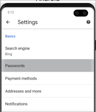
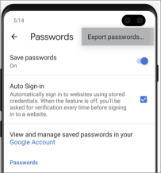
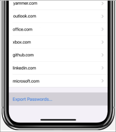
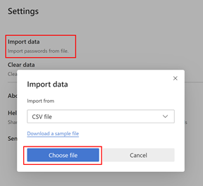
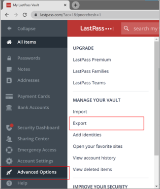
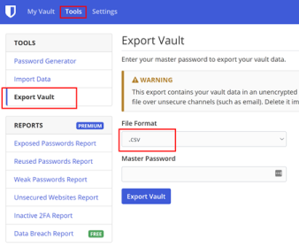
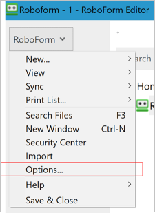
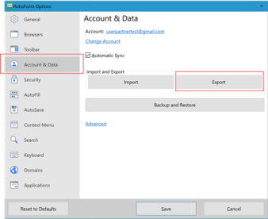
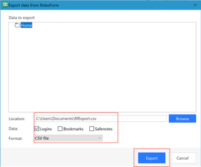

# Import passwords into the Microsoft Authenticator app

Microsoft Authenticator supports importing passwords from Google Chrome, Firefox, LastPass, Bitwarden, and Roboform. If Microsoft doesn’t currently support your existing password manager, you can [manually enter sign-in credentials into our template CSV](https://go.microsoft.com/fwlink/?linkid=2134938). To import your existing passwords and manage them in the Authenticator app, just export your passwords from your existing password manager into our comma-separated values (CSV) format. Then, import the exported CSV to Authenticator in our Chrome browser extension or directly into the Authenticator app (Android and iOS).

## Import from Google Chrome or Android Smart Lock

You can import your passwords from Google Chrome or Android Smart Lock to Authenticator on either your smartphone or your desktop computer. You can:

- [Import from Chrome on Android and iOS](#import-from-chrome-on-android-and-ios)
- [Import from Chrome desktop browser](#import-from-chrome-desktop-browser)

### Import from Chrome on Android and iOS

Google Chrome users on Android and Apple phones can import their passwords directly from their phone with few simple steps.

1. Install Authenticator app on your phone and open the **Passwords** tab.

1. Sign in to Google Chrome on your phone.

1. Tap the  at the top right for Android phones or at bottom right for iOS devices, and then tap **Settings.**

   Platform | Link
   ---------- | --------
   Android | 
   iOS | 

1. In **Settings**, open **Passwords**.

   Platform | Link
   ---------- | --------
   Android | 
   iOS | 

1. On Android devices, tap the  at the top right for Android phones, or at bottom right for iOS devices, and then tap **Export passwords**.

   Platform | Link
   ---------- | --------
   Android | 
   iOS | 

   You must provide a PIN, fingerprint, or facial recognition. Confirm your identity and tap **Export passwords** again to start exporting.

1. After the passwords are exported, Chrome prompts you to choose which app you're importing into. Select **Authenticator** to start importing passwords.You’ll be informed about import status when it’s complete.

   Platform | Link
   ---------- | --------
   Android | 
   iOS | 

### Import from Chrome desktop browser

Before you begin, you must install and sign in to the [Microsoft Autofill extension](https://chrome.google.com/webstore/detail/microsoft-autofill/fiedbfgcleddlbcmgdigjgdfcggjcion) on your Chrome browser.

1. Open [Google Password Manager](https://passwords.google.com) in any browser. If you haven’t already, sign in to your Google account.

1. Select the gear icon  to open to Password settings page.

1. Select **Export**, then on the next page select **Export** again to start exporting your passwords. Provide your Google password when prompted to confirm your identity. You’ll be informed about import status when it’s complete.

   

1. Open the Autofill Chrome Extension and select **Settings**.

   

1. Select **Import data** to open a dialog. Then, select **Choose File** to locate and import the CSV file.

   

## Import from Firefox

Firefox allows exporting of passwords from the desktop browser only, so ensure that you have access to the Firefox desktop browser before importing passwords from Firefox.

1. Sign in to the latest version of Firefox on your desktop and select the  menu from the top right of screen.

1. Select **Logins and Passwords**.

   

1. From the Firefox Lockwise page, select the  menu, select **Export Logins**, and then confirm your intent by selecting **Export**. You are prompted to identify yourself by entering your PIN, device password or by scanning your fingerprints. Once successfully identified, Firefox exports your passwords in CSV format to the selected location.

   

1. You can import your passwords into Authenticator from a desktop browser or on iOS or Android phones. To import to the Authenticator app on your phone:

      1. Transfer the exported CSV file on your Android or iOS phone using a preferred and safe way, and then download it. Next, share the CSV file with Authenticator app to start the import.

         Platform | Link
         ---------- | --------
         Android | 
         iOS | 

      1. After successfully importing your password to Authenticator, delete the CSV file from your desktop or mobile phone.

## Import from LastPass

LastPass supports export passwords from a desktop browser only, so ensure you have access to a desktop browser before starting to import passwords.

1. Sign in to [the LastPass web site](https://lastpass.com) and select **Advanced Options**, and then select **Export**.

   

1. Identify yourself when prompted by providing your master password. After that, you’ll see the exported passwords on the webpage.

1. Copy the contents of the webpage.

1. Open Notepad (or your favorite text editor) and paste the copied content.

1. Save this notepad file by selecting **File** &gt; **Save as**. Provide a name that ends with “.csv” (such as LastPass.csv) at a safe location in your desktop.

   

1. You can import your passwords into Authenticator in a desktop browser or on iOS or Android phones. To import to the Authenticator app on your phone:

      1. Transfer the exported CSV file on your smartphone using a preferred and safe way, and then download it. Then share the CSV file with Authenticator app to start the import.

         Platform | Link
         ---------- | --------
         Android | 
         iOS | 

      1. After successfully importing your password to Authenticator, delete the CSV file from your desktop or mobile phone.

## Import from Bitwarden

Bitwarden supports export passwords from a desktop browser only, so ensure you have access to a desktop browser before starting to import passwords.

1. Sign in into https://vault.bitwarden.com/ and select **Tools** &gt; **Export vault**. Choose the file format as CSV, provide your master password, and then select **Export vault** to start exporting.

   

1. You can import your passwords into Authenticator in a desktop browser or on iOS or Android phones. To import to the Authenticator app on your phone:

      1. Transfer the exported CSV file on your smartphone using a preferred and safe way, and then download it. Then share the CSV file with Authenticator app to start the import.

         Platform | Link
         ---------- | --------
         Android | 
         iOS | 

      1. After successfully importing your password to Authenticator, delete the CSV file from your desktop or mobile phone.

## Import from Roboform

Roboform allows exporting of passwords from its desktop app only, so ensure you have access to the Roboform app on a desktop before starting the import.

1. Start RoboForm from your desktop client and log in to your account.

1. Select **Options** from the **Roboform** menu.

   

1. Select **Account & Data** &gt; **Export**.

   

1. Choose a safe location to save your exported file. Select **Logins** as the **Data** type and select the CSV file as the format, and then select **Export**.

   

1. Confirm your intent and the CSV file is then exported to the selected location.

   

1. You can import your passwords into Authenticator in a desktop browser or on iOS or Android phones. To import to the Authenticator app on your phone:

      1. Transfer the exported CSV file on your smartphone using a preferred and safe way, and then download it. Then share the CSV file with Authenticator app to start the import.

         Platform | Link
         ---------- | --------
         Android | 
         iOS | 

      1. After successfully importing your password to Authenticator, delete the CSV file from your desktop or mobile phone.

## Import by creating a CSV

If steps to import passwords from your password manager aren't listed in this article, you can create a CSV that you can use to import your passwords into Authenticator. Microsoft recommends that you follow these steps on a desktop for ease of formatting.

1. On your desktop, [download and open our import template](https://go.microsoft.com/fwlink/?linkid=2134938). If you are an Apple iPhone, Safari, and Keychain user, you can now skip to step 4.

1. Export your passwords from your existing password manager in a nonencrypted CSV file.

1. Copy the relevant columns from your exported CSV to the template CSV and then save.

1. If you don’t have an exported CSV, you can copy each login from your existing password manager to the template CSV. Don’t remove or change the header row. When you finish, verify the integrity of your data before you begin the next step.

1. You can import your passwords into Authenticator in a desktop browser or on iOS or Android phones. To import to the Authenticator app on your phone:

      1. Transfer the exported CSV file on your smartphone using a preferred and safe way, and then download it. Then share the CSV file with Authenticator app to start the import.

         Platform | Link
         ---------- | --------
         Android | 
         iOS | 

      1. After successfully importing your password to Authenticator, delete the CSV file from your desktop or mobile phone.

## Troubleshooting steps

The most common cause of failed imports is incorrect formatting in the CSV file. You can try the following steps to troubleshoot the issue.

- Check this article to see if if we already support importing passwords from your current password manager. If we do, you may want to retry the import by following the steps mentioned for your respective provider.

- If we don’t currently support importing the format of your password manager, you could retry by [creating your CSV file manually](#import-by-creating-a-csv).

- You can verify the integrity of CSV data with following suggestions:

  - First row must contain a header with three columns: **url**, **username**, and **password**.

  - Each row must contain a value under **url** and **passwords** columns.

- You can recreate the CSV by pasting your content in the [CSV template file](https://go.microsoft.com/fwlink/?linkid=2134938).

- If nothing else works, please report your issue using the **Send Feedback** link from Authenticator app settings.
