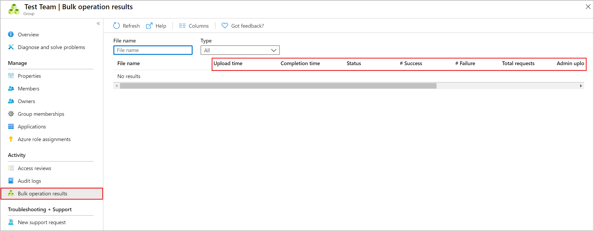

# Bulk remove group members in Azure Active Directory

Using Azure Active Directory (Azure AD) portal, you can remove a large number of members from a group by using a comma-separated values (CSV) file to bulk remove group members.

## To bulk remove group members

1. Sign in to [the Azure portal](https://portal.azure.com) with a User administrator account in the organization. Group owners can also bulk remove members of groups they own.
1. In Azure AD, select **Groups** > **All groups**.
1. Open the group from which you're removing members and then select **Members**.
1. On the **Members** page, select **Remove members**.
1. On the **Bulk remove group members** page, select **Download** to get the CSV file template with required group member properties.

   

1. Open the CSV file and add a line for each group member you want to remove from the group (required values are Member object ID or User principal name). Then save the file.

   

1. On the **Bulk remove group members** page, under **Upload your csv file**, browse to the file. When you select the file, validation of the CSV file starts.
1. When the file contents are validated, the bulk import page displays **File uploaded successfully**. If there are errors, you must fix them before you can submit the job.
1. When your file passes validation, select **Submit** to start the Azure bulk operation that removes the group members from the group.
1. When the removal operation completes, you'll see a notification that the bulk operation succeeded.

## Check removal status

You can see the status of all of your pending bulk requests in the **Bulk operation results** page.

For details about each line item within the bulk operation, select the values under the **# Success**, **# Failure**, or **Total Requests** columns. If failures occurred, the reasons for failure will be listed.

## Bulk removal service limits

Each bulk activity to remove a list of group members from can run for up to one hour. This enables removal of a list of at least 40,000 members.

## Next steps

- [Bulk import group members](groups-bulk-import-members.md)
- [Download members of a group](groups-bulk-download-members.md)
- [Download a list of all groups](groups-bulk-download.md)
