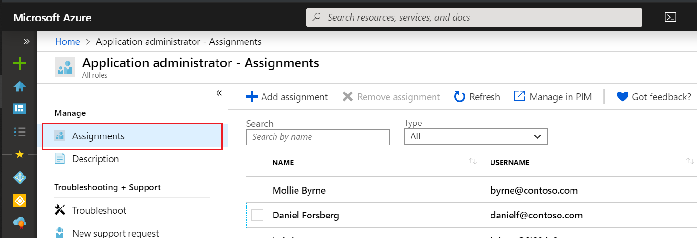
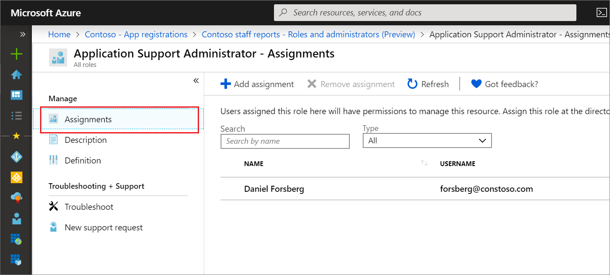

# View custom role assignments in Azure Active Directory

This article describes how to view custom roles you have assigned in Azure Active Directory (Azure AD). In Azure Active Directory (Azure AD), roles can be assigned at directory level or with a scope of a single application. Role assignments at the directory scope are added to the list of single application role assignments, but role assignments at the single application scope aren't added to the list of directory level assignments.

## View the assignments of a role with directory scope using the Azure AD portal

1. Sign in to the [Azure AD admin center](https://aad.portal.azure.com) with Privileged role administrator or Global administrator permissions in the Azure AD organization.
1. Select **Azure Active Directory**, select **Roles and administrators**, and then select a role to open it and view its properties.
1. Select **Assignments** to view the assignments for the role.

    

## View the assignments of a role with directory scope using Azure AD PowerShell

You can automate how you assign Azure AD admin roles to users using Azure PowerShell. This article uses the [Azure Active Directory PowerShell Version 2](https://docs.microsoft.com/powershell/module/azuread/?view=azureadps-2.0#directory_roles) module.

### Prepare PowerShell

First, you must [download the Azure AD preview PowerShell module](https://www.powershellgallery.com/packages/AzureAD/).

To install the Azure AD PowerShell module, use the following commands:

``` PowerShell
install-module azureadpreview
import-module azureadpreview
```

To verify that the module is ready to use, use the following command:

``` PowerShell
get-module azuread
  ModuleType Version      Name                         ExportedCommands
  ---------- ---------    ----                         ----------------
  Binary     2.0.0.115    azuread                      {Add-AzureADAdministrati...}
```

### View the assignments of a role

Example of viewing the assignments of a role.

``` PowerShell
# Fetch list of all directory roles with object ID
Get-AzureADDirectoryRole

# Fetch a specific directory role by ID
$role = Get-AzureADDirectoryRole -ObjectId "5b3fe201-fa8b-4144-b6f1-875829ff7543"

# Fetch role membership for a role
Get-AzureADDirectoryRoleMember -ObjectId $role.ObjectId | Get-AzureADUser
```

## View the assignments of a role with directory scope using Microsoft Graph API

HTTP request to get a role assignment for a given role definition.

GET

``` HTTP
https://graph.windows.net/<tenantDomain-or-tenantId>/roleAssignments?api-version=1.61-internal&$filter=roleDefinitionId eq ‘<object-id-or-template-id-of-role-definition>’
```

Response

``` HTTP
HTTP/1.1 200 OK
{
    "id":"CtRxNqwabEKgwaOCHr2CGJIiSDKQoTVJrLE9etXyrY0-1"
    "principalId":"ab2e1023-bddc-4038-9ac1-ad4843e7e539",
    "roleDefinitionId":"3671d40a-1aac-426c-a0c1-a3821ebd8218",
    "resourceScopes":["/"]
}
```

## View the assignments of a role with single-application scope using the Azure AD portal (preview)

1. Sign in to the [Azure AD admin center](https://aad.portal.azure.com) with Privileged role administrator or Global administrator permissions in the Azure AD organization.
1. Select Azure Active Directory, select **App registrations**, and then select the app registration to view its properties. You might have to select **All applications** to see the complete list of app registrations in your Azure AD organization.

    

1. Select **Roles and administrators**, and then select a role to view its properties.

    

1. Select **Assignments** to view the assignments for the role.

    

## Next steps

* Feel free to share with us on the [Azure AD administrative roles forum](https://feedback.azure.com/forums/169401-azure-active-directory?category_id=166032).
* For more about roles and Administrator role assignment, see [Assign administrator roles](directory-assign-admin-roles.md).
* For default user permissions, see a [comparison of default guest and member user permissions](../fundamentals/users-default-permissions.md).
