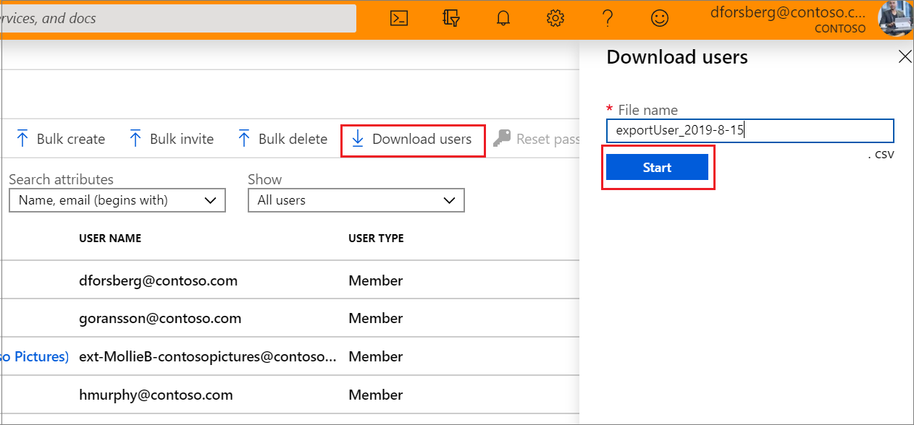

---

title: Download a list of users (preview) in the Azure Active Directory portal | Microsoft Docs
description: Download user records in bulk in the Azure admin center in Azure Active Directory. 
services: active-directory 
author: curtand
ms.author: curtand
manager: mtillman
ms.date: 07/15/2019
ms.topic: conceptual
ms.service: active-directory
ms.subservice: users-groups-roles
ms.workload: identity
ms.custom: it-pro
ms.reviewer: jeffsta
ms.collection: M365-identity-device-management
---

# Download a list of users (preview) in Azure Active Directory portal

Azure Active Directory (Azure AD) supports bulk user import (create) operations.

## Required permissions

To download the list of users from the Azure AD admin center, you must be signed in with a user assigned to one or more organization-level administrator roles in Azure AD. Guest inviter and application developer are not considered administrator roles.

## To download a list of users

1. [Sign in to your Azure AD organization](https://aad.portal.azure.com) with a User administrator account in the organization.
1. In Azure AD, select **Users** > **Download users**.
1. On the **Download users** page, select **Start** to receive a CSV file listing user profile properties. If there are errors, you can download and view the results file on the Bulk operation results page. The file contains the reason for each error.

   

## Check status

You can see the status of your pending bulk requests in the **Bulk operation results (preview)** page.

   

## Bulk download service limits

Each bulk activity to create a list of users can run for up to one hour. This enables creation and download of a list of at least 500,000 users.

## Next steps

- [Bulk add users](users-bulk-add.md)
- [Bulk delete users](users-bulk-delete.md)
- [Bulk restore users](users-bulk-restore.md)
