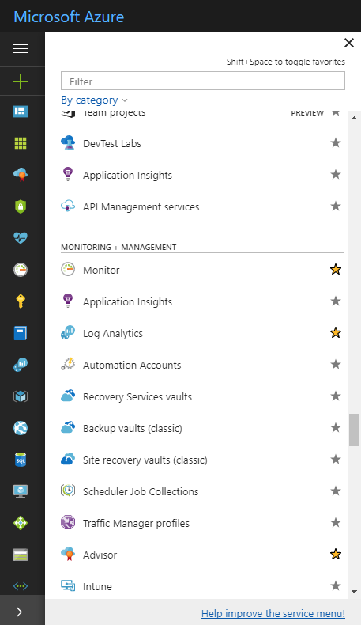
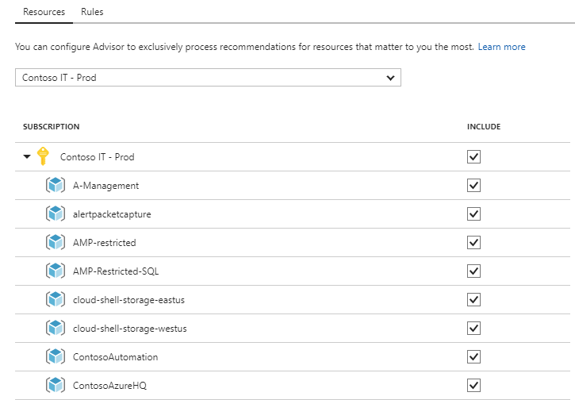
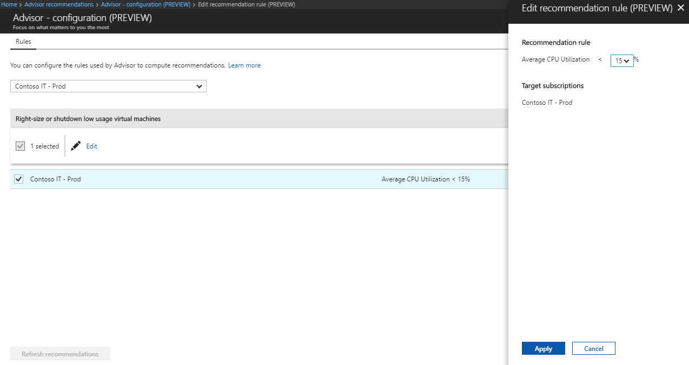

# Get started with Azure Advisor

Learn how to access Advisor through the Azure portal, get recommendations, and implement recommendations.

> [!NOTE]
> Azure Advisor automatically runs in the background to find newly created resources. It can take up to 24 hours to provide recommendations on those resources.

## Get recommendations

1. Sign in to the [Azure portal](https://portal.azure.com).

1. In the left pane, click **Advisor**.  If you do not see Advisor in the left pane, click **All services**.  In the service menu pane, under **Monitoring and Management**, click **Advisor**. The Advisor dashboard is displayed.

    

1. The Advisor dashboard will display a summary of your recommendations for all selected subscriptions.  You can choose the subscriptions that you want recommendations to be displayed for using the subscription filter dropdown.

1. To get recommendations for a specific category, click one of the tabs: **High Availability**, **Security**, **Performance**, or **Cost**. 

   

## Get recommendation details and implement a solution

You can select a recommendation in Advisor to view additional details – such as the recommendation actions and impacted resources – and to implement the solution to the recommendation.  

1. Sign in to the [Azure portal](https://portal.azure.com), and then open [Advisor](https://aka.ms/azureadvisordashboard).

1. Select a recommendation category to display the list of recommendations within that category, or select the **All** tab to view all your recommendations.

1. Click a recommendation that you want to review in detail.

1. Review the information about the recommendation and the resources that the recommendation applies to.

1. Click on the **Recommended Action** to implement the recommendation.

## Filter recommendations

You can filter recommendations to drill down to what is most important to you.  You can filter by subscription, resource type, or recommendation status.  

1. Sign in to the [Azure portal](https://portal.azure.com), and then open [Advisor](https://aka.ms/azureadvisordashboard).

1. Use the dropdowns on the Advisor dashboard to filter by subscription, resource type, or recommendation status.

    

## Postpone or dismiss recommendations

1. Sign in to the [Azure portal](https://portal.azure.com), and then open [Advisor](https://aka.ms/azureadvisordashboard).

1. Navigate to the recommendation you want to postpone or dismiss.

1. Click the recommendation.

1. Click **Postpone**. 

1. Specify a postpone time period, or select **Never** to dismiss the recommendation.

## Exclude subscriptions or resource groups

You may have resource groups or subscriptions for which you do not want to receive Advisor recommendations – such as ‘test’ resources.  You can configure Advisor to only generate recommendations for specific subscriptions and resource groups.

> [!NOTE]
> To include or exclude a subscription or resource group from Advisor, you must be a subscription Owner.  If you do not have the required permissions for a subscription or resource group, the option to include or exclude it is disabled in the user interface.

1. Sign in to the [Azure portal](https://portal.azure.com), and then open [Advisor](https://aka.ms/azureadvisordashboard).

1. Click **Configure** in the action bar.

1. Uncheck any subscriptions or resource groups you do not want to receive Advisor recommendations for.

    

1. Click the **Apply** button.

## Configure low usage VM recommendation

This procedure configures the average CPU utilization rule for the low usage virtual machine recommendation.

Advisor monitors your virtual machine usage for 7 days and then identifies low-utilization virtual machines. Virtual machines are considered low-utilization if their CPU utilization is 5% or less and their network utilization is less than 2% or if the current workload can be accommodated by a smaller virtual machine size.

If you would like to be more aggressive at identifying low usage virtual machines, you can adjust the average CPU utilization rule on a per subscription basis.  The CPU utilization rule can be set to 5%, 10%, 15%, or 20%.

> [!NOTE]
> To adjust the average CPU utilization rule for identifying low usage virtual machines, you must be a subscription *Owner*.  If you do not have the required permissions for a subscription or resource group, the option to include or exclude it will be disabled in the user interface. 

1. Sign in to the [Azure portal](https://portal.azure.com), and then open [Advisor](https://aka.ms/azureadvisordashboard).

1. Click **Configure** in the action bar.

1. Click the **Rules** tab.

1. Select the subscriptions you’d like to adjust the average CPU utilization rule for, and then click **Edit**.

1. Select the desired average CPU utilization value, and click **Apply**.

1. Click **Refresh recommendations** to update your existing recommendations to use the new average CPU utilization rule. 

   

## Download recommendations

Advisor enables you to download a summary of your recommendations.  You can download your recommendations as a PDF file or a CSV file.  Downloading your recommendations enables you to easily share with your colleagues or perform your own analysis on top of the recommendation data.

1. Sign in to the [Azure portal](https://portal.azure.com), and then open [Advisor](https://aka.ms/azureadvisordashboard).

1. Click **Download as CSV** or **Download as PDF** on the action bar.

The download option respects any filters you have applied to the Advisor dashboard.  If you select the download option while viewing a specific recommendation category or recommendation, the downloaded summary only includes information for that category or recommendation. 

## Next steps

To learn more about Advisor, see:

- [Introduction to Azure Advisor](advisor-overview.md)
- [Advisor High Availability recommendations](advisor-high-availability-recommendations.md)
- [Advisor Security recommendations](advisor-security-recommendations.md)
- [Advisor Performance recommendations](advisor-performance-recommendations.md)
- [Advisor Cost recommendations](advisor-performance-recommendations.md)
