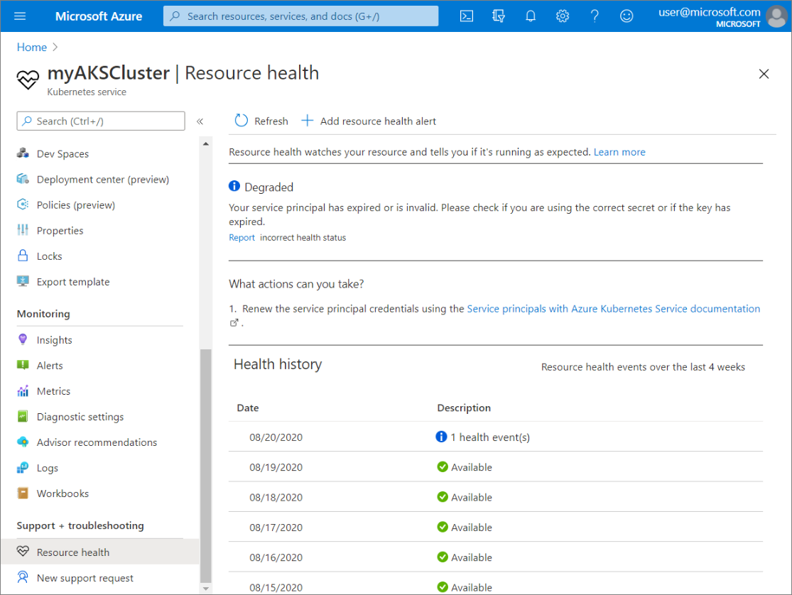

# Check for Resource Health events impacting your AKS cluster (Preview)

When running your container workloads on AKS, you want to ensure you can troubleshoot and fix problems as soon as they arise to minimize the impact on the availability of your workloads. [Azure Resource Health](https://docs.microsoft.com/azure/service-health/resource-health-overview) gives you visibility into various health events that may cause your AKS cluster to be unavailable.

[!INCLUDE [preview features callout](./includes/preview/preview-callout.md)]

## Open Resource Health

### To access Resource Health for your AKS cluster:

- Navigate to your AKS cluster in the [Azure portal](https://portal.azure.com).
- Select **Resource Health** in the left navigation.

### To access Resource Health for all clusters on your subscription:

- Search for **Service Health** in the [Azure portal](https://portal.azure.com) and navigate to it.
- Select **Resource health** in the left navigation.
- Select your subscription and set the resource type to Azure Kubernetes Service (AKS).

## Check the health status

Azure Resource Health helps you diagnose and get support for service problems that affect your Azure resources. Resource Health reports on the current and past health of your resources and helps you determine if the problem is caused by a user-initiated action or a platform event.

Resource Health receives signals for your managed cluster to determine the cluster's health state. It examines the health state of your AKS cluster and reports actions required for each health signal. These signals range from auto-resolving issues, planned updates, unplanned health events, and unavailability caused by user-initiated actions. These signals are classified using the Azure Resource Health’s health status: *Available*, *Unavailable*, *Unknown*, and *Degraded*.

- **Available**: When there are no known issues affecting your cluster’s health, Resource Health reports your cluster as *Available*.

- **Unavailable**: When there is a platform or non-platform event affecting your cluster's health, Resource Health reports your cluster as *Unavailable*.

- **Unknown**: When there is a temporary connection loss to your cluster's health metrics, Resource Health reports your cluster as *Unknown*.

- **Degraded**: When there is a health issue requiring your action, Resource Health reports your cluster as *Degraded*.

For additional details on what each health status indicates, visit [Resource Health overview](https://docs.microsoft.com/azure/service-health/resource-health-overview#health-status).

### View historical data

You can also view the past 30 days of historical Resource Health information in the **Health history** section.

## Next steps

Run checks on your cluster to further troubleshoot cluster issues by using [AKS Diagnostics](https://docs.microsoft.com/azure/aks/concepts-diagnostics).
