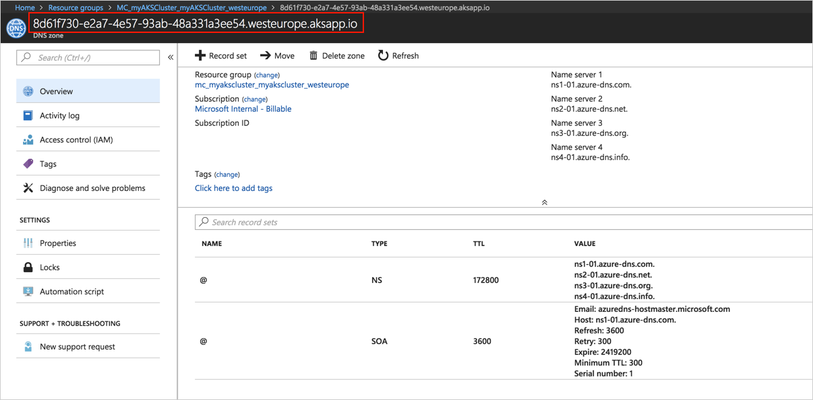
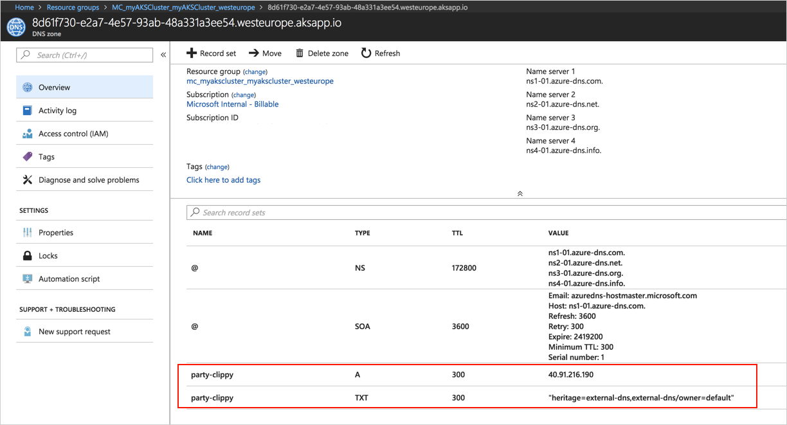

# HTTP application routing

The HTTP application routing solution makes it easy to access applications that are deployed to your Azure Kubernetes Service (AKS) cluster. When the solution's enabled, it configures an Ingress controller in your AKS cluster. As applications are deployed, the solution also creates publicly accessible DNS names for application endpoints.

When the add-on is enabled, it creates a DNS Zone in your subscription. For more information about DNS cost, see [DNS pricing][dns-pricing].

> [!CAUTION]
> The HTTP application routing add-on is designed to let you quickly create an ingress controller and access your applications. This add-on is not recommended for production use. For production-ready ingress deployments that include multiple replicas and TLS support, see [Create an HTTPS ingress controller](https://docs.microsoft.com/azure/aks/ingress-tls).

## HTTP routing solution overview

The add-on deploys two components: a [Kubernetes Ingress controller][ingress] and an [External-DNS][external-dns] controller.

- **Ingress controller**: The Ingress controller is exposed to the internet by using a Kubernetes service of type LoadBalancer. The Ingress controller watches and implements [Kubernetes Ingress resources][ingress-resource], which creates routes to application endpoints.
- **External-DNS controller**: Watches for Kubernetes Ingress resources and creates DNS A records in the cluster-specific DNS zone.

## Deploy HTTP routing: CLI

The HTTP application routing add-on can be enabled with the Azure CLI when deploying an AKS cluster. To do so, use the [az aks create][az-aks-create] command with the `--enable-addons` argument.

```azurecli
az aks create --resource-group myResourceGroup --name myAKSCluster --enable-addons http_application_routing
```

> [!TIP]
> If you want to enable multiple add-ons, provide them as a comma-separated list. For example, to enable HTTP application routing and monitoring, use the format `--enable-addons http_application_routing,monitoring`.

You can also enable HTTP routing on an existing AKS cluster using the [az aks enable-addons][az-aks-enable-addons] command. To enable HTTP routing on an existing cluster, add the `--addons` parameter and specify *http_application_routing* as shown in the following example:

```azurecli
az aks enable-addons --resource-group myResourceGroup --name myAKSCluster --addons http_application_routing
```

After the cluster is deployed or updated, use the [az aks show][az-aks-show] command to retrieve the DNS zone name. This name is needed to deploy applications to the AKS cluster.

```azurecli
$ az aks show --resource-group myResourceGroup --name myAKSCluster --query addonProfiles.httpApplicationRouting.config.HTTPApplicationRoutingZoneName -o table

Result
-----------------------------------------------------
9f9c1fe7-21a1-416d-99cd-3543bb92e4c3.eastus.aksapp.io
```

## Deploy HTTP routing: Portal

The HTTP application routing add-on can be enabled through the Azure portal when deploying an AKS cluster.


After the cluster is deployed, browse to the auto-created AKS resource group and select the DNS zone. Take note of the DNS zone name. This name is needed to deploy applications to the AKS cluster.



## Use HTTP routing

The HTTP application routing solution may only be triggered on Ingress resources that are annotated as follows:

```yaml
annotations:
  kubernetes.io/ingress.class: addon-http-application-routing
```

Create a file named **samples-http-application-routing.yaml** and copy in the following YAML. On line 43, update `<CLUSTER_SPECIFIC_DNS_ZONE>` with the DNS zone name collected in the previous step of this article.


```yaml
apiVersion: extensions/v1beta1
kind: Deployment
metadata:
  name: party-clippy
spec:
  template:
    metadata:
      labels:
        app: party-clippy
    spec:
      containers:
      - image: r.j3ss.co/party-clippy
        name: party-clippy
        resources:
          requests:
            cpu: 100m
            memory: 128Mi
          limits:
            cpu: 250m
            memory: 256Mi
        tty: true
        command: ["party-clippy"]
        ports:
        - containerPort: 8080
---
apiVersion: v1
kind: Service
metadata:
  name: party-clippy
spec:
  ports:
  - port: 80
    protocol: TCP
    targetPort: 8080
  selector:
    app: party-clippy
  type: ClusterIP
---
apiVersion: extensions/v1beta1
kind: Ingress
metadata:
  name: party-clippy
  annotations:
    kubernetes.io/ingress.class: addon-http-application-routing
spec:
  rules:
  - host: party-clippy.<CLUSTER_SPECIFIC_DNS_ZONE>
    http:
      paths:
      - backend:
          serviceName: party-clippy
          servicePort: 80
        path: /
```

Use the [kubectl apply][kubectl-apply] command to create the resources.

```bash
$ kubectl apply -f samples-http-application-routing.yaml

deployment "party-clippy" created
service "party-clippy" created
ingress "party-clippy" created
```

Use cURL or a browser to navigate to the hostname specified in the host section of the samples-http-application-routing.yaml file. The application can take up to one minute before it's available via the internet.

```bash
$ curl party-clippy.471756a6-e744-4aa0-aa01-89c4d162a7a7.canadaeast.aksapp.io

 _________________________________
/ It looks like you're building a \
\ microservice.                   /
 ---------------------------------
 \
  \
     __
    /  \
    |  |
    @  @
    |  |
    || |/
    || ||
    |\_/|
    \___/

```

## Remove HTTP routing

The HTTP routing solution can be removed using the Azure CLI. To do so run the following command, substituting your AKS cluster and resource group name.

```azurecli
az aks disable-addons --addons http_application_routing --name myAKSCluster --resource-group myResourceGroup --no-wait
```

When the HTTP application routing add-on is disabled, some Kubernetes resources may remain in the cluster. These resources include *configMaps* and *secrets*, and are created in the *kube-system* namespace. To maintain a clean cluster, you may want to remove these resources.

Look for *addon-http-application-routing* resources using the following [kubectl get][kubectl-get] commands:

```console
kubectl get deployments --namespace kube-system
kubectl get services --namespace kube-system
kubectl get configmaps --namespace kube-system
kubectl get secrets --namespace kube-system
```

The following example output shows configMaps that should be deleted:

```
$ kubectl get configmaps --namespace kube-system

NAMESPACE     NAME                                                       DATA   AGE
kube-system   addon-http-application-routing-nginx-configuration         0      9m7s
kube-system   addon-http-application-routing-tcp-services                0      9m7s
kube-system   addon-http-application-routing-udp-services                0      9m7s
```

To delete resources, use the [kubectl delete][kubectl-delete] command. Specify the resource type, resource name, and namespace. The following example deletes one of the previous configmaps:

```console
kubectl delete configmaps addon-http-application-routing-nginx-configuration --namespace kube-system
```

Repeat the previous `kubectl delete` step for all *addon-http-application-routing* resources that remained in your cluster.

## Troubleshoot

Use the [kubectl logs][kubectl-logs] command to view the application logs for the External-DNS application. The logs should confirm that an A and TXT DNS record were created successfully.

```
$ kubectl logs -f deploy/addon-http-application-routing-external-dns -n kube-system

time="2018-04-26T20:36:19Z" level=info msg="Updating A record named 'party-clippy' to '52.242.28.189' for Azure DNS zone '471756a6-e744-4aa0-aa01-89c4d162a7a7.canadaeast.aksapp.io'."
time="2018-04-26T20:36:21Z" level=info msg="Updating TXT record named 'party-clippy' to '"heritage=external-dns,external-dns/owner=default"' for Azure DNS zone '471756a6-e744-4aa0-aa01-89c4d162a7a7.canadaeast.aksapp.io'."
```

These records can also be seen on the DNS zone resource in the Azure portal.



Use the [kubectl logs][kubectl-logs] command to view the application logs for the Nginx Ingress controller. The logs should confirm the `CREATE` of an Ingress resource and the reload of the controller. All HTTP activity is logged.

```bash
$ kubectl logs -f deploy/addon-http-application-routing-nginx-ingress-controller -n kube-system

-------------------------------------------------------------------------------
NGINX Ingress controller
  Release:    0.13.0
  Build:      git-4bc943a
  Repository: https://github.com/kubernetes/ingress-nginx
-------------------------------------------------------------------------------

I0426 20:30:12.212936       9 flags.go:162] Watching for ingress class: addon-http-application-routing
W0426 20:30:12.213041       9 flags.go:165] only Ingress with class "addon-http-application-routing" will be processed by this ingress controller
W0426 20:30:12.213505       9 client_config.go:533] Neither --kubeconfig nor --master was specified.  Using the inClusterConfig.  This might not work.
I0426 20:30:12.213752       9 main.go:181] Creating API client for https://10.0.0.1:443
I0426 20:30:12.287928       9 main.go:225] Running in Kubernetes Cluster version v1.8 (v1.8.11) - git (clean) commit 1df6a8381669a6c753f79cb31ca2e3d57ee7c8a3 - platform linux/amd64
I0426 20:30:12.290988       9 main.go:84] validated kube-system/addon-http-application-routing-default-http-backend as the default backend
I0426 20:30:12.294314       9 main.go:105] service kube-system/addon-http-application-routing-nginx-ingress validated as source of Ingress status
I0426 20:30:12.426443       9 stat_collector.go:77] starting new nginx stats collector for Ingress controller running in namespace  (class addon-http-application-routing)
I0426 20:30:12.426509       9 stat_collector.go:78] collector extracting information from port 18080
I0426 20:30:12.448779       9 nginx.go:281] starting Ingress controller
I0426 20:30:12.463585       9 event.go:218] Event(v1.ObjectReference{Kind:"ConfigMap", Namespace:"kube-system", Name:"addon-http-application-routing-nginx-configuration", UID:"2588536c-4990-11e8-a5e1-0a58ac1f0ef2", APIVersion:"v1", ResourceVersion:"559", FieldPath:""}): type: 'Normal' reason: 'CREATE' ConfigMap kube-system/addon-http-application-routing-nginx-configuration
I0426 20:30:12.466945       9 event.go:218] Event(v1.ObjectReference{Kind:"ConfigMap", Namespace:"kube-system", Name:"addon-http-application-routing-tcp-services", UID:"258ca065-4990-11e8-a5e1-0a58ac1f0ef2", APIVersion:"v1", ResourceVersion:"561", FieldPath:""}): type: 'Normal' reason: 'CREATE' ConfigMap kube-system/addon-http-application-routing-tcp-services
I0426 20:30:12.467053       9 event.go:218] Event(v1.ObjectReference{Kind:"ConfigMap", Namespace:"kube-system", Name:"addon-http-application-routing-udp-services", UID:"259023bc-4990-11e8-a5e1-0a58ac1f0ef2", APIVersion:"v1", ResourceVersion:"562", FieldPath:""}): type: 'Normal' reason: 'CREATE' ConfigMap kube-system/addon-http-application-routing-udp-services
I0426 20:30:13.649195       9 nginx.go:302] starting NGINX process...
I0426 20:30:13.649347       9 leaderelection.go:175] attempting to acquire leader lease  kube-system/ingress-controller-leader-addon-http-application-routing...
I0426 20:30:13.649776       9 controller.go:170] backend reload required
I0426 20:30:13.649800       9 stat_collector.go:34] changing prometheus collector from  to default
I0426 20:30:13.662191       9 leaderelection.go:184] successfully acquired lease kube-system/ingress-controller-leader-addon-http-application-routing
I0426 20:30:13.662292       9 status.go:196] new leader elected: addon-http-application-routing-nginx-ingress-controller-5cxntd6
I0426 20:30:13.763362       9 controller.go:179] ingress backend successfully reloaded...
I0426 21:51:55.249327       9 event.go:218] Event(v1.ObjectReference{Kind:"Ingress", Namespace:"default", Name:"party-clippy", UID:"092c9599-499c-11e8-a5e1-0a58ac1f0ef2", APIVersion:"extensions", ResourceVersion:"7346", FieldPath:""}): type: 'Normal' reason: 'CREATE' Ingress default/party-clippy
W0426 21:51:57.908771       9 controller.go:775] service default/party-clippy does not have any active endpoints
I0426 21:51:57.908951       9 controller.go:170] backend reload required
I0426 21:51:58.042932       9 controller.go:179] ingress backend successfully reloaded...
167.220.24.46 - [167.220.24.46] - - [26/Apr/2018:21:53:20 +0000] "GET / HTTP/1.1" 200 234 "" "Mozilla/5.0 (compatible; MSIE 9.0; Windows NT 6.1; Trident/5.0)" 197 0.001 [default-party-clippy-80] 10.244.0.13:8080 234 0.004 200
```

## Clean up

Remove the associated Kubernetes objects created in this article.

```bash
$ kubectl delete -f samples-http-application-routing.yaml

deployment "party-clippy" deleted
service "party-clippy" deleted
ingress "party-clippy" deleted
```

## Next steps

For information on how to install an HTTPS-secured Ingress controller in AKS, see [HTTPS Ingress on Azure Kubernetes Service (AKS)][ingress-https].

<!-- LINKS - internal -->
[az-aks-create]: /cli/azure/aks?view=azure-cli-latest#az-aks-create
[az-aks-show]: /cli/azure/aks?view=azure-cli-latest#az-aks-show
[ingress-https]: ./ingress-tls.md
[az-aks-enable-addons]: /cli/azure/aks#az-aks-enable-addons


<!-- LINKS - external -->
[dns-pricing]: https://azure.microsoft.com/pricing/details/dns/
[external-dns]: https://github.com/kubernetes-incubator/external-dns
[kubectl-apply]: https://kubernetes.io/docs/reference/generated/kubectl/kubectl-commands#apply
[kubectl-get]: https://kubernetes.io/docs/reference/generated/kubectl/kubectl-commands#get
[kubectl-delete]: https://kubernetes.io/docs/reference/generated/kubectl/kubectl-commands#delete
[kubectl-logs]: https://kubernetes.io/docs/reference/generated/kubectl/kubectl-commands#logs
[ingress]: https://kubernetes.io/docs/concepts/services-networking/ingress/
[ingress-resource]: https://kubernetes.io/docs/concepts/services-networking/ingress/#the-ingress-resource
