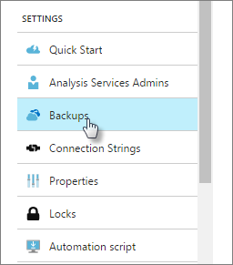
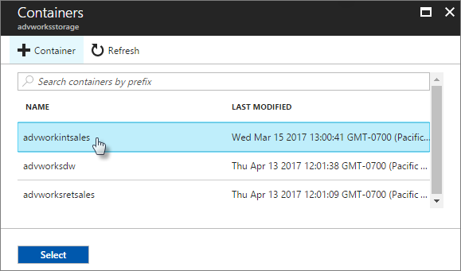

# Analysis Services database backup and restore

Backing up tabular model databases in Azure Analysis Services is much the same as for on-premises Analysis Services. The primary difference is where you store your backup files. Backup files must be saved to a container in an [Azure storage account](../storage/common/storage-account-create.md). You can use a storage account and container you already have, or they can be created when configuring storage settings for your server.

> [!NOTE]
> Creating a storage account can result in a new billable service. To learn more, see [Azure Storage Pricing](https://azure.microsoft.com/pricing/details/storage/blobs/).
> 
> 

> [!NOTE]
> If the storage account is in a different region, configure storage account firewall settings to allow access from **Selected networks**. In Firewall **Address range**, specify the IP address range for the region the Analysis Services server is in. Configuring storage account firewall settings to allow access from All networks is supported, however choosing Selected networks and specifying an IP address range is preferred. To learn more, see [Network connectivity FAQ](analysis-services-network-faq.md#backup-and-restore).

Backups are saved with an .abf extension. For in-memory tabular models, both model data and metadata are stored. For DirectQuery tabular models, only model metadata is stored. Backups can be compressed and encrypted, depending on the options you choose.

## Configure storage settings
Before backing up, you need to configure storage settings for your server.

### To configure storage settings
1.  In Azure portal > **Settings**, click **Backup**.

    

2.  Click **Enabled**, then click **Storage Settings**.

    

3. Select your storage account or create a new one.

4. Select a container or create a new one.

    

5. Save your backup settings.

    

## Backup

### To backup by using SSMS

1. In SSMS, right-click a database > **Back Up**.

2. In **Backup Database** > **Backup file**, click **Browse**.

3. In the **Save file as** dialog, verify the folder path, and then type a name for the backup file. 

4. In the **Backup Database** dialog, select options.

    **Allow file overwrite** - Select this option to overwrite backup files of the same name. If this option is not selected, the file you are saving cannot have the same name as a file that already exists in the same location.

    **Apply compression** - Select this option to compress the backup file. Compressed backup files save disk space, but require slightly higher CPU utilization. 

    **Encrypt backup file** - Select this option to encrypt the backup file. This option requires a user-supplied password to secure the backup file. The password prevents reading of the backup data any other means than a restore operation. If you choose to encrypt backups, store the password in a safe location.

5. Click **OK** to create and save the backup file.

### PowerShell
Use [Backup-ASDatabase](/powershell/module/sqlserver/backup-asdatabase) cmdlet.

## Restore
When restoring, your backup file must be in the storage account you've configured for your server. If you need to move a backup file from an on-premises location to your storage account, use [Microsoft Azure Storage Explorer](../vs-azure-tools-storage-manage-with-storage-explorer.md) or the [AzCopy](../storage/common/storage-use-azcopy-v10.md) command-line utility. 

> [!NOTE]
> If you're restoring from an on-premises server, you must remove all the domain users from the model's roles and add them back to the roles as Azure Active Directory users.
> 
> 

### To restore by using SSMS

1. In SSMS, right-click a database > **Restore**.

2. In the **Backup Database** dialog, in **Backup file**, click **Browse**.

3. In the **Locate Database Files** dialog, select the file you want to restore.

4. In **Restore database**, select the database.

5. Specify options. Security options must match the backup options you used when backing up.

### PowerShell

Use [Restore-ASDatabase](/powershell/module/sqlserver/restore-asdatabase) cmdlet.

## Related information

[Azure storage accounts](../storage/common/storage-account-create.md)  
[High availability](analysis-services-bcdr.md)      
[Analysis Services network connectivity FAQ](analysis-services-network-faq.md)