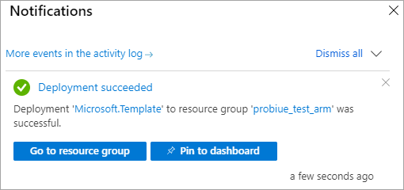

---
title: Quickstart - Create an Azure Analysis Services server resource by using Azure Resource Manager template
description: Quickstart showing how to an Azure Analysis Services server resource by using an Azure Resource Manager template.
author: minewiskan
ms.author: owend
tags: azure-resource-manager
ms.service: azure-analysis-services
ms.topic: quickstart
ms.date: 04/14/2020
ms.custom: subject-armqs, references_regions 

#Customer intent: As a BI developer who is new to Azure, I want to use Azure Analysis Services to store and manage my organizations data models.

---

# Quickstart: Create a server - ARM template

This quickstart describes how to create an Analysis Services server resource in your Azure subscription by using an Azure Resource Manager template (ARM template).

[!INCLUDE [About Azure Resource Manager](../../includes/resource-manager-quickstart-introduction.md)]

If your environment meets the prerequisites and you're familiar with using ARM templates, select the **Deploy to Azure** button. The template will open in the Azure portal.

[](https://portal.azure.com/#create/Microsoft.Template/uri/https%3A%2F%2Fraw.githubusercontent.com%2FAzure%2Fazure-quickstart-templates%2Fmaster%2F101-analysis-services-create%2Fazuredeploy.json)

## Prerequisites

* **Azure subscription**: Visit [Azure Free Trial](https://azure.microsoft.com/offers/ms-azr-0044p/) to create an account.
* **Azure Active Directory**: Your subscription must be associated with an Azure Active Directory tenant. And, you need to be signed in to Azure with an account in that Azure Active Directory. To learn more, see [Authentication and user permissions](analysis-services-manage-users.md).

## Review the template

The template used in this quickstart is from [Azure Quickstart Templates](https://azure.microsoft.com/resources/templates/101-analysis-services-create/).

:::code language="json" source="~/quickstart-templates/101-analysis-services-create/azuredeploy.json" range="1-79" highlight="63-78":::

A single [Microsoft.AnalysisServices/servers](/azure/templates/microsoft.analysisservices/servers) resource with a firewall rule is defined in the template.

## Deploy the template

1. Select the following Deploy to Azure link to sign in to Azure and open a template. The template is used to create an Analysis Services server resource and specify required and optional properties.

   [](https://portal.azure.com/#create/Microsoft.Template/uri/https%3A%2F%2Fraw.githubusercontent.com%2FAzure%2Fazure-quickstart-templates%2Fmaster%2F101-analysis-services-create%2Fazuredeploy.json)

2. Select or enter the following values.

    Unless specified otherwise, use default values.

    * **Subscription**: Select an Azure subscription.
    * **Resource group**: Click **Create new**, and then enter a unique name for the new resource group.
    * **Location**: Select a default location for resources created in the resource group.
    * **Server Name**: Enter a name for the server resource. 
    * **Location**: Ignore for Analysis Services. Location is specified in Server Location.
    * **Server location**: Enter the location of the Analysis Services server. This is often the same region as the default Location specified for the Resource Group, but not required. For example **North Central US**. For supported regions, see [Analysis Services availability by region](analysis-services-overview.md#availability-by-region).
    * **Sku Name**: Enter the sku name for the Analysis Services server to create. Choose from: B1, B2, D1, S0, S1, S2, S3, S4, S8v2, S9v2. Sku availability depends on region. S0 or D1 is recommended for evaluation and testing.
    * **Capacity**: Enter the total number of query replica scale-out instances. Scale-out of more than one instance is supported in select regions only.
    * **Firewall Settings**: Enter inbound firewall rules to define for the server. If not specified, firewall is disabled.
    * **Backup Blob Container Uri**: Enter the SAS URI to a private Azure Blob Storage container with read, write and list permissions. Required only if you intend to use [Backup/restore](analysis-services-backup.md).
    * **I agree to the terms and conditions state above**: Select.

3. Select **Purchase**. After the server has been deployed successfully, you get a notification:

   

## Validate the deployment

Use the Azure portal or Azure PowerShell to verify the resource group and server resource was created.

### PowerShell

```azurepowershell-interactive
$resourceGroupName = Read-Host -Prompt "Enter the Resource Group name"
(Get-AzResource -ResourceType "Microsoft.AnalysisServices/servers" -ResourceGroupName $resourceGroupName).Name
 Write-Host "Press [ENTER] to continue..."
```

---

## Clean up resources

When no longer needed, use the Azure portal, Azure CLI, or Azure PowerShell to delete the resource group and the server resource.

# [CLI](#tab/CLI)

```azurecli-interactive
echo "Enter the Resource Group name:" &&
read resourceGroupName &&
az group delete --name $resourceGroupName &&
echo "Press [ENTER] to continue ..."
```

# [PowerShell](#tab/PowerShell)

```azurepowershell-interactive
$resourceGroupName = Read-Host -Prompt "Enter the Resource Group name"
Remove-AzResourceGroup -Name $resourceGroupName
Write-Host "Press [ENTER] to continue..."
```

---

## Next steps

In this quickstart, you used an ARM template to create a new resource group and an Azure Analysis Services server resource. After you've created a server resource by using the template, consider the following:

- [Quickstart: Create a server - PowerShell](analysis-services-create-powershell.md)
- [Add a sample model from the portal](analysis-services-create-sample-model.md)
- [Configure server administrator and user roles](tutorials/analysis-services-tutorial-roles.md)
