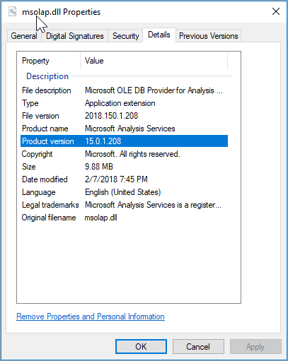

# Client libraries for connecting to Analysis Services

Client libraries are necessary for client applications and tools to connect to Analysis Services servers. Microsoft client applications like Power BI Desktop, Excel, SQL Server Management Studio (SSMS), and Analysis Services projects extension for Visual Studio install all three client libraries and update them along with regular application updates. In some cases, you may need to install newer versions of the client libraries. Custom client applications also require client libraries are installed.

## Download the latest client libraries (Windows Installer)  

|Download  |Product version  | 
|---------|---------|
|[MSOLAP (amd64)](https://go.microsoft.com/fwlink/?linkid=829576)    |    15.1.29.25    |
|[MSOLAP (x86)](https://go.microsoft.com/fwlink/?linkid=829575)     |     15.1.29.25       |
|[AMO](https://go.microsoft.com/fwlink/?linkid=829578)     |   18.4.8.0    |
|[ADOMD](https://go.microsoft.com/fwlink/?linkid=829577)     |    18.4.8.0     |

## AMO and ADOMD (NuGet packages)

Analysis Services Management Objects (AMO) and ADOMD client libraries are available as installable packages from [NuGet.org](https://www.nuget.org/). It's recommended you migrate to NuGet references instead of using Windows Installer. 

|Package  | Product version  | 
|---------|---------|
|[AMO](https://www.nuget.org/packages/Microsoft.AnalysisServices.retail.amd64/)    |    18.4.8.0     |
|[ADOMD](https://www.nuget.org/packages/Microsoft.AnalysisServices.AdomdClient.retail.amd64/)     |   18.4.8.0      |

NuGet package assemblies AssemblyVersion follow semantic versioning: MAJOR.MINOR.PATCH. NuGet references load the expected version even if there is a different version in the GAC (resulting from MSI install). PATCH is incremented for each release. AMO and ADOMD versions are kept in-sync.

## Understanding client libraries

Analysis Services utilize three client libraries, also known as data providers. ADOMD.NET and Analysis Services Management Objects (AMO) are managed client libraries. The Analysis Services OLE DB Provider (MSOLAP DLL) is a native client library. Typically, all three are installed at the same time. **Azure Analysis Services requires the latest versions of all three libraries**. 

Microsoft client applications like Power BI Desktop and Excel install all three client libraries and update them when new versions are available. Depending on the version or frequency of updates, some client libraries may not be the latest versions required by Azure Analysis Services. The same applies to custom applications or other interfaces such as AsCmd, TOM, ADOMD.NET. These applications require manually or programmatically installing the libraries. The client libraries for manual installation are included in SQL Server feature packs as distributable packages. However, these client libraries are tied to the SQL Server version and may not be the latest.  

Client libraries for client connections are different from data providers required to connect from an Azure Analysis Services server to a data source. To learn more about data source connections, see [Data source connections](analysis-services-datasource.md).

## Client library types

### Analysis Services OLE DB Provider (MSOLAP) 

 Analysis Services OLE DB Provider (MSOLAP) is the native client library for Analysis Services database connections. It's used indirectly by both ADOMD.NET and AMO, delegating connection requests to the data provider. You can also call the OLE DB Provider directly from application code.  
  
 The Analysis Services OLE DB Provider is installed automatically by most tools and client applications used to access Analysis Services databases. It must be installed on computers used to access Analysis Services data.  
  
 OLE DB providers are often specified in connection strings. An Analysis Services connection string uses a different nomenclature to refer to the OLE DB Provider: MSOLAP.\<version>.dll.

### AMO  

 AMO is a managed client library used for server administration and data definition. It's installed and used by tools and client applications. For example, SQL Server Management Studio (SSMS) uses AMO to connect to Analysis Services. A connection using AMO is typically minimal, consisting of `"data source=\<servername>"`. After a connection is established, you use the API to work with database collections and major objects. Both Visual Studio and SSMS use AMO to connect to an Analysis Services instance.  

  
### ADOMD

 ADOMD.NET is a managed data client library used for querying Analysis Services data. It's installed and used by tools and client applications. 
  
 When connecting to a database, the connection string properties for all three libraries are similar. Almost any connection string you define for ADOMD.NET by using  [Microsoft.AnalysisServices.AdomdClient.AdomdConnection.ConnectionString](/dotnet/api/microsoft.analysisservices.adomdclient.adomdconnection.connectionstring#Microsoft_AnalysisServices_AdomdClient_AdomdConnection_ConnectionString) also works for AMO and the Analysis Services OLE DB Provider (MSOLAP). To learn more, see [Connection string properties &#40;Analysis Services&#41;](https://docs.microsoft.com/analysis-services/instances/connection-string-properties-analysis-services).  

  
##   How to determine client library version   
  
### OLEDDB (MSOLAP)  
  
1.  Go to `C:\Program Files\Microsoft Analysis Services\AS OLEDB\`. If you have more than one folder, choose the higher number.
  
2.  Right-click **msolap.dll** > **Properties** > **Details**. If the filename is msolap140.dll, it's older than latest version and should be upgraded.
    
    
    
  
### AMO

1. Go to `C:\Windows\Microsoft.NET\assembly\GAC_MSIL\Microsoft.AnalysisServices\`. If you have more than one folder, choose the higher number.
2. Right-click **Microsoft.AnalysisServices** > **Properties** > **Details**.  

### ADOMD

1. Go to `C:\Windows\Microsoft.NET\assembly\GAC_MSIL\Microsoft.AnalysisServices.AdomdClient\`. If you have more than one folder, choose the higher number.
2. Right-click **Microsoft.AnalysisServices.AdomdClient** > **Properties** > **Details**.  

## Next steps
[Connect with Excel](analysis-services-connect-excel.md)    
[Connect with Power BI](analysis-services-connect-pbi.md)
