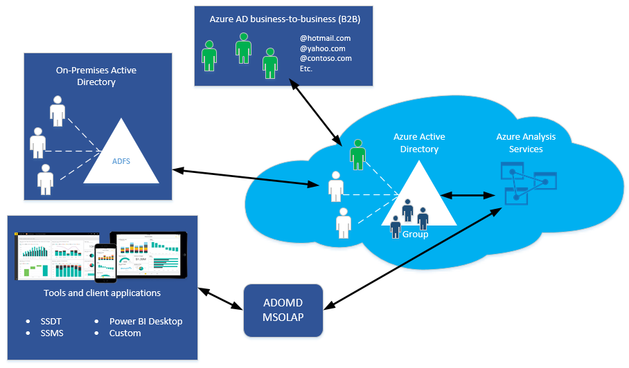
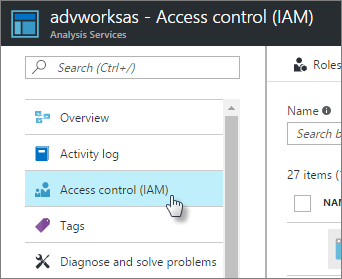

# Authentication and user permissions

Azure Analysis Services uses Azure Active Directory (Azure AD) for identity management and user authentication. Any user creating, managing, or connecting to an Azure Analysis Services server must have a valid user identity in an [Azure AD tenant](../active-directory/fundamentals/active-directory-administer.md) in the same subscription.

Azure Analysis Services supports [Azure AD B2B collaboration](../active-directory/active-directory-b2b-what-is-azure-ad-b2b.md). With B2B, users from outside an organization can be invited as guest users in an Azure AD directory. Guests can be from another Azure AD tenant directory or any valid email address. Once invited and the user accepts the invitation sent by email from Azure, the user identity is added to the tenant directory. Those identities can be added to security groups or as members of a server administrator or database role.

## Authentication

All client applications and tools use one or more of the Analysis Services [client libraries](analysis-services-data-providers.md) (AMO, MSOLAP, ADOMD) to connect to a server. 

All three client libraries support both Azure AD interactive flow, and non-interactive authentication methods. The two non-interactive methods, Active Directory Password and Active Directory Integrated Authentication methods can be used in applications utilizing AMOMD and MSOLAP. These two methods never result in pop-up dialog boxes.

Client applications like Excel and Power BI Desktop, and tools like SSMS and SSDT install the latest versions of the libraries when updated to the latest release. Power BI Desktop, SSMS, and SSDT are updated monthly. Excel is [updated with Office 365](https://support.office.com/article/When-do-I-get-the-newest-features-in-Office-2016-for-Office-365-da36192c-58b9-4bc9-8d51-bb6eed468516). Office 365 updates are less frequent, and some organizations use the deferred channel, meaning updates are deferred up to three months.

Depending on the client application or tool you use, the type of authentication and how you sign in may be different. Each application may support different features for connecting to cloud services like Azure Analysis Services.

Power BI Desktop, SSDT, and SSMS support Active Directory Universal Authentication, an interactive method that also supports Azure Multi-Factor Authentication (MFA). Azure MFA helps safeguard access to data and applications while providing a simple sign-in process. It delivers strong authentication with several verification options (phone call, text message, smart cards with pin, or mobile app notification). Interactive MFA with Azure AD can result in a pop-up dialog box for validation. **Universal Authentication is recommended**.

If signing in to Azure by using a Windows account, and Universal Authentication is not selected or available (Excel), [Active Directory Federation Services (AD FS)](../active-directory/hybrid/how-to-connect-fed-azure-adfs.md) is required. With Federation, Azure AD and Office 365 users are authenticated using on-premises credentials and can access Azure resources.

### SQL Server Management Studio (SSMS)

Azure Analysis Services servers support connections from [SSMS V17.1](https://docs.microsoft.com/sql/ssms/download-sql-server-management-studio-ssms) and higher by using Windows Authentication, Active Directory Password Authentication, and Active Directory Universal Authentication. In general, it's recommended you use Active Directory Universal Authentication because:

*  Supports interactive and non-interactive authentication methods.

*  Supports Azure B2B guest users invited into the Azure AS tenant. When connecting to a server, guest users must select Active Directory Universal Authentication when connecting to the server.

*  Supports Multi-Factor Authentication (MFA). Azure MFA helps safeguard access to data and applications with a range of verification options: phone call, text message, smart cards with pin, or mobile app notification. Interactive MFA with Azure AD can result in a pop-up dialog box for validation.

### SQL Server Data Tools (SSDT)

SSDT connects to Azure Analysis Services by using Active Directory Universal Authentication with MFA support. Users are prompted to sign in to Azure on the first deployment. Users must sign in to Azure with an account with server administrator permissions on the server they are deploying to. When signing in to Azure the first time, a token is assigned. SSDT caches the token in-memory for future reconnects.

### Power BI Desktop

Power BI Desktop connects to Azure Analysis Services using Active Directory Universal Authentication with MFA support. Users are prompted to sign in to Azure on the first connection. Users must sign in to Azure with an account that is included in a server administrator or database role.

### Excel

Excel users can connect to a server by using a Windows account, an organization ID (email address), or an external email address. External email identities must exist in the Azure AD as a guest user.

## User permissions

**Server administrators** are specific to an Azure Analysis Services server instance. They connect with tools like Azure portal, SSMS, and SSDT to perform tasks like adding databases and managing user roles. By default, the user that creates the server is automatically added as an Analysis Services server administrator. Other administrators can be added by using Azure portal or SSMS. Server administrators must have an account in the Azure AD tenant in the same subscription. To learn more, see [Manage server administrators](analysis-services-server-admins.md). 

**Database users** connect to model databases by using client applications like Excel or Power BI. Users must be added to database roles. Database roles define administrator, process, or read permissions for a database. It's important to understand database users in a role with administrator permissions is different than server administrators. However, by default, server administrators are also database administrators. To learn more, see [Manage database roles and users](analysis-services-database-users.md).

**Azure resource owners**. Resource owners manage resources for an Azure subscription. Resource owners can add Azure AD user identities to Owner or Contributor Roles within a subscription by using **Access control** in Azure portal, or with Azure Resource Manager templates. 

Roles at this level apply to users or accounts that need to perform tasks that can be completed in the portal or by using Azure Resource Manager templates. To learn more, see [Role-Based Access Control](../role-based-access-control/overview.md). 

## Database roles

 Roles defined for a tabular model are database roles. That is, the roles contain members consisting of Azure AD users and security groups that have specific permissions that define the action those members can take on a model database. A database role is created as a separate object in the database, and applies only to the database in which that role is created.   
  
 By default, when you create a new tabular model project, the model project does not have any roles. Roles can be defined by using the Role Manager dialog box in SSDT. When roles are defined during model project design, they are applied only to the model workspace database. When the model is deployed, the same roles are applied to the deployed model. After a model has been deployed, server and database administrators can manage roles and members by using SSMS. To learn more, see [Manage database roles and users](analysis-services-database-users.md).
  
## Next steps

[Manage access to resources with Azure Active Directory groups](../active-directory/fundamentals/active-directory-manage-groups.md)   
[Manage database roles and users](analysis-services-database-users.md)  
[Manage server administrators](analysis-services-server-admins.md)  
[Role-Based Access Control](../role-based-access-control/overview.md)  