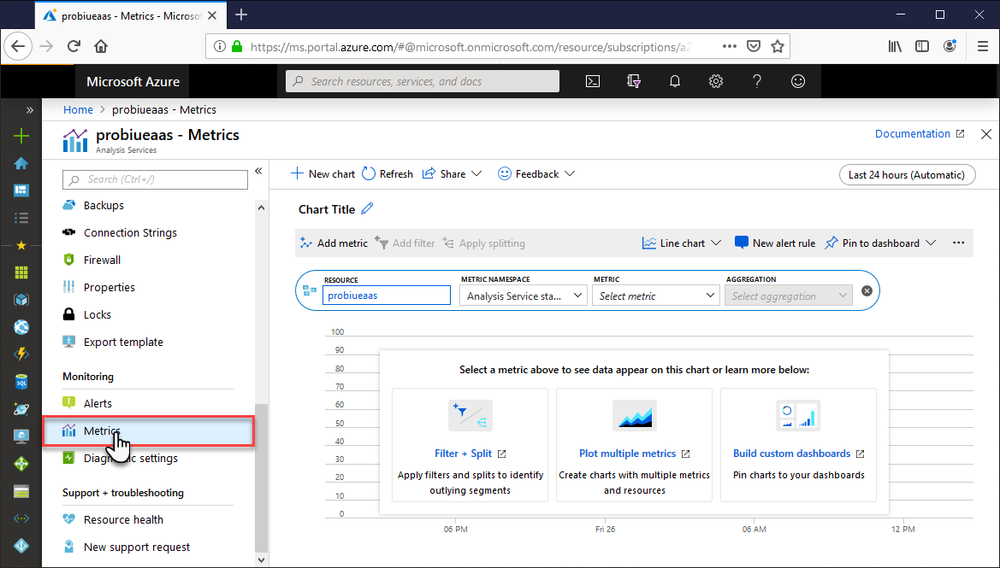
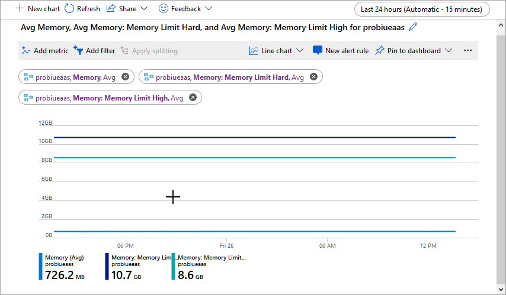

# Monitor server metrics

Analysis Services provides metrics to help you monitor the performance and health of your servers. For example, monitor memory and CPU usage, number of client connections, and query resource consumption. Analysis Services uses the same monitoring framework as most other Azure services. To learn more, see [Metrics in Microsoft Azure](../monitoring-and-diagnostics/insights-how-to-customize-monitoring.md).

To perform more in-depth diagnostics, track performance, and identify trends across multiple service resources in a resource group or subscription, use [Azure Monitor](https://azure.microsoft.com/services/monitor/). Azure Monitor (service) may result in a billable service.

## To monitor metrics for an Analysis Services server

1. In Azure portal, select **Metrics**.

    

2. In **Available metrics**, select the metrics to include in your chart. 

    

## Server metrics

Use this table to determine which metrics are best for your monitoring scenario. Only metrics of the same unit can be shown on the same chart.

|Metric|Metric Display Name|Unit|Aggregation Type|Description|
|---|---|---|---|---|
|CommandPoolJobQueueLength|Command Pool Job Queue Length|Count|Average|Number of jobs in the queue of the command thread pool.|
|CurrentConnections|Connection: Current connections|Count|Average|Current number of client connections established.|
|CurrentUserSessions|Current User Sessions|Count|Average|Current number of user sessions established.|
|mashup_engine_memory_metric|M Engine Memory|Bytes|Average|Memory usage by mashup engine processes|
|mashup_engine_qpu_metric|M Engine QPU|Count|Average|QPU usage by mashup engine processes|
|memory_metric|Memory|Bytes|Average|Memory. Range 0-25 GB for S1, 0-50 GB for S2 and 0-100 GB for S4|
|memory_thrashing_metric|Memory Thrashing|Percent|Average|Average memory thrashing.|
|CleanerCurrentPrice|Memory: Cleaner Current Price|Count|Average|Current price of memory, $/byte/time, normalized to 1000.|
|CleanerMemoryNonshrinkable|Memory: Cleaner Memory nonshrinkable|Bytes|Average|Amount of memory, in bytes, not subject to purging by the background cleaner.|
|CleanerMemoryShrinkable|Memory: Cleaner Memory shrinkable|Bytes|Average|Amount of memory, in bytes, subject to purging by the background cleaner.|
|MemoryLimitHard|Memory: Memory Limit Hard|Bytes|Average|Hard memory limit, from configuration file.|
|MemoryLimitHigh|Memory: Memory Limit High|Bytes|Average|High memory limit, from configuration file.|
|MemoryLimitLow|Memory: Memory Limit Low|Bytes|Average|Low memory limit, from configuration file.|
|MemoryLimitVertiPaq|Memory: Memory Limit VertiPaq|Bytes|Average|In-memory limit, from configuration file.|
|MemoryUsage|Memory: Memory Usage|Bytes|Average|Memory usage of the server process as used in calculating cleaner memory price. Equal to counter Process\PrivateBytes plus the size of memory-mapped data, ignoring any memory, which was mapped or allocated by the in-memory analytics engine (VertiPaq) in excess of the engine Memory Limit.|
|Quota|Memory: Quota|Bytes|Average|Current memory quota, in bytes. Memory quota is also known as a memory grant or memory reservation.|
|QuotaBlocked|Memory: Quota Blocked|Count|Average|Current number of quota requests that are blocked until other memory quotas are freed.|
|VertiPaqNonpaged|Memory: VertiPaq Nonpaged|Bytes|Average|Bytes of memory locked in the working set for use by the in-memory engine.|
|VertiPaqPaged|Memory: VertiPaq Paged|Bytes|Average|Bytes of paged memory in use for in-memory data.|
|ProcessingPoolJobQueueLength|Processing Pool Job Queue Length|Count|Average|Number of non-I/O jobs in the queue of the processing thread pool.|
|RowsConvertedPerSec|Processing: Rows converted per sec|CountPerSecond|Average|Rate of rows converted during processing.|
|RowsReadPerSec|Processing: Rows read per sec|CountPerSecond|Average|Rate of rows read from all relational databases.|
|RowsWrittenPerSec|Processing: Rows written per sec|CountPerSecond|Average|Rate of rows written during processing.|
|qpu_metric|QPU|Count|Average|QPU. Range 0-100 for S1, 0-200 for S2 and 0-400 for S4|
|QueryPoolBusyThreads|Query Pool Busy Threads|Count|Average|Number of busy threads in the query thread pool.|
|SuccessfullConnectionsPerSec|Successful Connections Per Sec|CountPerSecond|Average|Rate of successful connection completions.|
|CommandPoolBusyThreads|Threads: Command pool busy threads|Count|Average|Number of busy threads in the command thread pool.|
|CommandPoolIdleThreads|Threads: Command pool idle threads|Count|Average|Number of idle threads in the command thread pool.|
|LongParsingBusyThreads|Threads: Long parsing busy threads|Count|Average|Number of busy threads in the long parsing thread pool.|
|LongParsingIdleThreads|Threads: Long parsing idle threads|Count|Average|Number of idle threads in the long parsing thread pool.|
|LongParsingJobQueueLength|Threads: Long parsing job queue length|Count|Average|Number of jobs in the queue of the long parsing thread pool.|
|ProcessingPoolIOJobQueueLength|Threads: Processing pool I/O job queue length|Count|Average|Number of I/O jobs in the queue of the processing thread pool.|
|ProcessingPoolBusyIOJobThreads|Threads: Processing pool busy I/O job threads|Count|Average|Number of threads running I/O jobs in the processing thread pool.|
|ProcessingPoolBusyNonIOThreads|Threads: Processing pool busy non-I/O threads|Count|Average|Number of threads running non-I/O jobs in the processing thread pool.|
|ProcessingPoolIdleIOJobThreads|Threads: Processing pool idle I/O job threads|Count|Average|Number of idle threads for I/O jobs in the processing thread pool.|
|ProcessingPoolIdleNonIOThreads|Threads: Processing pool idle non-I/O threads|Count|Average|Number of idle threads in the processing thread pool dedicated to non-I/O jobs.|
|QueryPoolIdleThreads|Threads: Query pool idle threads|Count|Average|Number of idle threads for I/O jobs in the processing thread pool.|
|QueryPoolJobQueueLength|Threads: Query pool job queue length|Count|Average|Number of jobs in the queue of the query thread pool.|
|ShortParsingBusyThreads|Threads: Short parsing busy threads|Count|Average|Number of busy threads in the short parsing thread pool.|
|ShortParsingIdleThreads|Threads: Short parsing idle threads|Count|Average|Number of idle threads in the short parsing thread pool.|
|ShortParsingJobQueueLength|Threads: Short parsing job queue length|Count|Average|Number of jobs in the queue of the short parsing thread pool.|
|TotalConnectionFailures|Total Connection Failures|Count|Average|Total failed connection attempts.|
|TotalConnectionRequests|Total Connection Requests|Count|Average|Total connection requests. |

## Next steps
[Monitoring in Microsoft Azure](../monitoring-and-diagnostics/monitoring-overview.md)   
[Metrics in Microsoft Azure](../monitoring-and-diagnostics/insights-how-to-customize-monitoring.md)   
[Metrics in Azure Monitor REST API](/rest/api/monitor/metrics)
